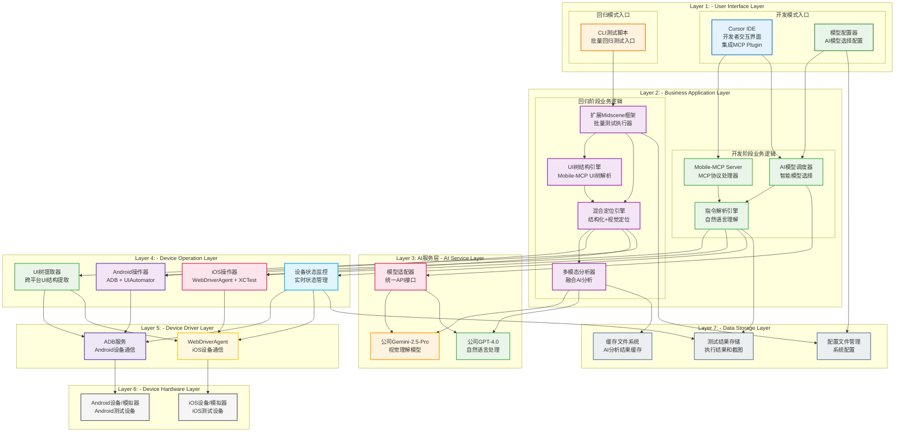
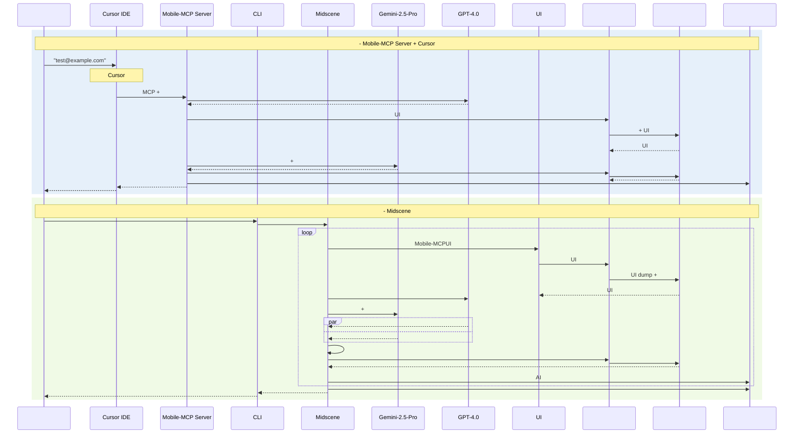
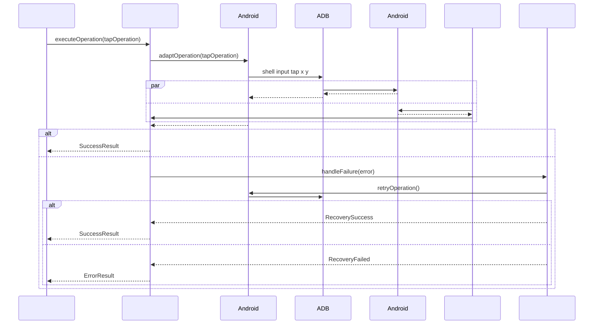
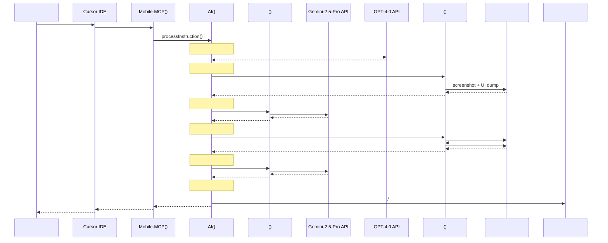
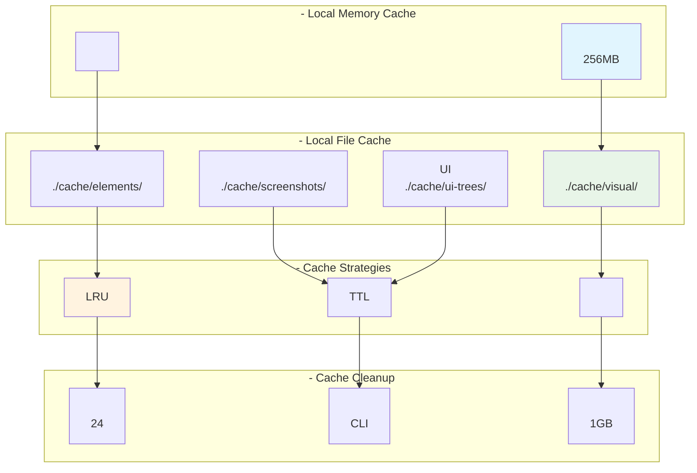
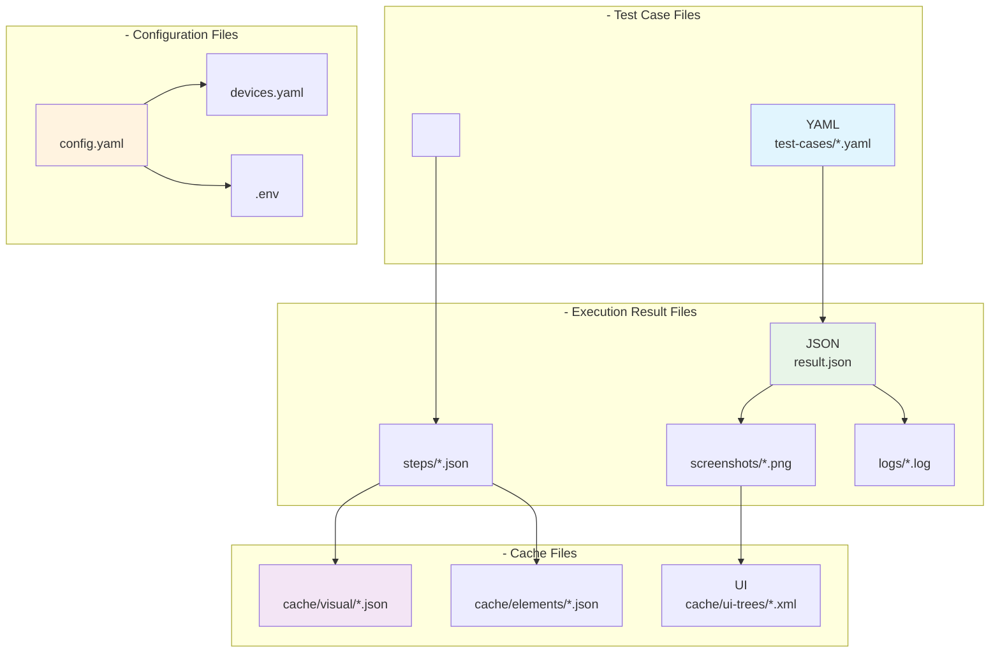

# AI+UI

## 
- ****: v1.0
- ****: 2025112
- ****: 
- ****: 

---

## 1. Overview

### 1.1 Background
UISDKIDXPath

#### 1.1.1 Status Quo of Current Technique

##### 1.1.1.1 The current state of the art of the program

UIAppium

****:
- **Android**: UIAutomator2XPath/ID
- **iOS**: XCUITestAccessibility
- ****: AndroidiOS
- ****: View IDClass NameXPath

****:
```
→ → → → 
```

##### 1.1.1.2 Current technology industry realization scheme

****:

| | | | |
|---------|----------|----------|------------|
| | Appium, Selenium | | 70% |
| | Airtest, SikuliX | | 15% |
| AI | Testim, Mabl | | 10% |
| | BrowserStack, Sauce Labs | + | 5% |

#### 1.1.2 Shortcoming of Current Technique

****:

1. ****
- View IDUI
- 
- XPath

```mermaid
graph TD
A[UI] --> B[]
B --> C[View ID]
B --> D[XPath]
B --> E[Class Name]
C --> F[UI]
D --> G[]
E --> H[]
```

****

| | | | |
|---------|---------|---------|---------|
| | | | |
| | | | |
| | | | |
| | | | |
| SDK | | | |

2. ****
- UI
- 
- 

3. **SDK**
- SDK
- 
- 

4. ****
- 
- 
- 

#### 1.1.3 Optimization

**AI+UI**:
- ****: 
- ****: AI
- ****: +
- ****: UI

### 1.2 References

- [Midscene.js Official Documentation](https://midscenejs.com/)
- [Mobile-MCP GitHub Repository](https://github.com/mobile-next/mobile-mcp)
- [Gemini-2.5-Pro API Documentation](https://ai.google.dev/docs)
- [GPT-4.0 API Reference](https://platform.openai.com/docs)
- [Appium Documentation](https://appium.io/docs)

---

## 2. Outline Design

### 2.1 Overall Design

#### 2.1.1 系统总体架构 (层级化双模式AI自动化测试架构)



##### **层级化架构设计说明**

**架构层级职责分工**:

| 层级 | 名称 | 核心职责 | 主要组件 | 颜色标识 |
|------|------|----------|----------|----------|
| **Layer 1** | 用户交互层 | 用户入口，模式选择 | Cursor IDE、CLI脚本、模型配置器 | 蓝色系 |
| **Layer 2** | 业务应用层 | 核心业务逻辑处理 | Mobile-MCP Server、扩展Midscene框架 | 绿/紫色系 |
| **Layer 3** | AI服务层 | AI模型调用和管理 | 公司Gemini-2.5-Pro、GPT-4.0、模型适配器 | 橙色系 |
| **Layer 4** | 设备操作层 | 跨平台设备操作抽象 | Android/iOS操作器、状态监控、UI树提取 | 紫色系 |
| **Layer 5** | 设备驱动层 | 底层设备驱动服务 | ADB服务、WebDriverAgent | 深色系 |
| **Layer 6** | 设备硬件层 | 物理/虚拟设备 | Android/iOS设备、模拟器 | 灰色系 |
| **Layer 7** | 数据存储层 | 数据持久化和缓存 | 测试结果、配置文件、缓存系统 | 蓝灰色系 |

**层级化设计优势**:

1. **职责清晰**: 每一层都有明确的职责边界，避免功能耦合
2. **数据流向清晰**: 自顶向下的数据流，层间交互规范化
3. **易于维护**: 层级独立，单层修改不影响其他层
4. **可扩展性强**: 可以在任何层级扩展功能，不破坏整体架构
5. **视觉分明**: 不同颜色标识不同层级，一目了然

**数据流向说明**:

```mermaid
graph LR
A[] --> B[] --> C[AI] --> D[] --> E[] --> F[] --> G[]

style A fill:#e3f2fd
style B fill:#e8f5e8 
style C fill:#fff3e0
style D fill:#f3e5f5
style E fill:#ede7f6
style F fill:#f5f5f5
style G fill:#eceff1
```

** **:

| | | |
|---------|-------------|-------------|
| **** | Cursor IDE → | CLI |
| **** | Mobile-MCP Server → AI → | Midscene → UI → → |
| **AI** | Cursor | Gemini+GPT |
| **** | + | + UI |
| **** | | + |

** **:

### ****:
```
Layer 1: 
↓
Layer 2: 
↓
Layer 3: AI 
↓ 
Layer 4: 
↓
Layer 5: 
↓
Layer 6: 
↓
Layer 7: 
```

### ****:
```
() ()
Cursor IDE → CLI
Mobile-MCP Server → Midscene
→ 
→ 
```

### ****:

1. ****: 
2. ****: 
3. ****: 
4. ****: 
5. ****: 

### ****:

#### ****:

| | | |
|-------|-----------|-----------|
| **** | | **7** |
| **** | | **** |
| **** | | **** |
| **** | | **** |
| **** | | **** |

#### ****:

****:
- **Layer 1**: WebAPI
- **Layer 2**: 
- **Layer 3**: AI (ClaudeLLaMA)
- **Layer 4**: (Web)

****:
- 
- 
- 

#### 2.1.2 

****:
- ****: Mobile-MCP Server + Cursor
- ****: MidsceneAI
- ****: AI
- ****: 

---

### ** (Mobile-MCP Server + Cursor)**

##### **Cursor IDE**

**Cursor IDE - **
- ****: 
- ****: 
- ****:
```typescript
// Cursor
// : "test@example.compassword123"
// MCP PluginMobile-MCP Server
```

**MCP Plugin - MCP**
- ****: CursorMobile-MCP Server
- ****: 
- 
- 
- 
- ****:
```json
{
"mcp_server": {
"url": "ws://localhost:3000/mcp",
"timeout": 30000,
"retry_policy": {
"max_attempts": 3,
"backoff_ms": 1000
}
}
}
```

** - CursorAI**
- ****: **CursorAI**
- ****: 
- → Gemini-2.5-Pro → GPT-4.0
- 
- A/B
- **Cursor**:
```yaml
# Cursor
ai_automation:
default_visual_model: "company-gemini-2.5-pro"
default_text_model: "company-gpt-4.0"
task_routing:
screenshot_analysis: "gemini-2.5-pro"
instruction_parsing: "gpt-4.0"
element_location: "hybrid" # 
cost_optimization: true
experimental_mode: false
```

##### **Mobile-MCP Server**

**MCP - Cursor**
- ****: CursorMCP
- ****: MCP → → → 
- ****:
```typescript
export class MCPProtocolHandler {
async handleTestRequest(request: MCPTestRequest): Promise<MCPResponse> {
// 1. MCP
this.validateMCPRequest(request);

// 2. 
const instruction = request.params.instruction;
const context = request.params.context;

// 3. AI
const aiResult = await this.aiScheduler.processInstruction(
instruction, 
context,
request.modelPreferences // Cursor
);

// 4. 
const deviceResult = await this.deviceCoordinator.executeActions(aiResult.actions);

return this.formatMCPResponse(deviceResult);
}
}
```

**AI - CursorAI**
- ****: **CursorAI**
- ****:
```typescript
export class AIModelScheduler {
async processInstruction(
instruction: string, 
context: TestContext,
modelPreferences: ModelPreferences // Cursor
): Promise<AIProcessResult> {

// 1. 
const taskType = await this.analyzeTaskType(instruction);

// 2. Cursor
let selectedModel: AIModel;
if (taskType.requiresVision) {
selectedModel = modelPreferences.visualModel || this.defaultGeminiModel;
} else if (taskType.requiresNLP) {
selectedModel = modelPreferences.textModel || this.defaultGPTModel;
} else {
// 
return await this.hybridProcessing(instruction, context, modelPreferences);
}

// 3. 
return await this.callAIModel(selectedModel, instruction, context);
}
}
```

---

### ** (Midscene)**

##### **Midscene**

**UI - Mobile-MCPUI**
- ****: **Mobile-MCPUIMidscene**
- ****: 
- Android/iOSUI
- 
- UI
- ****:
```typescript
// UIMobile-MCP
export interface ExtendedUITree {
// Mobile-MCP
platform: 'android' | 'ios';
timestamp: number;
screen_bounds: Rectangle;
orientation: 'portrait' | 'landscape';

// 
semantic_context: {
screen_type?: 'login' | 'home' | 'list' | 'form' | 'dialog';
primary_actions?: string[];
key_elements?: string[];
};

// 
root: ExtendedUINode;
}

export interface ExtendedUINode {
// Mobile-MCP
id?: string;
className: string;
text?: string;
contentDescription?: string;
bounds: Rectangle;
visible: boolean;
enabled: boolean;
clickable: boolean;
focusable: boolean;

// Midscene
visual_signature?: string; // 
ai_confidence?: number; // AI
semantic_labels?: string[]; // 

// 
children: ExtendedUINode[];
}

export class UITreeEngine {
async extractUITree(deviceId: string, platform: 'android' | 'ios'): Promise<ExtendedUITree> {
// 1. UI
const rawUIData = platform === 'android' 
? await this.getAndroidUIAutomatorDump(deviceId)
: await this.getIOSXCTestDump(deviceId);

// 2. Mobile-MCP
const unifiedTree = await this.convertToUnifiedFormat(rawUIData, platform);

// 3. 
const enhancedTree = await this.addSemanticContext(unifiedTree);

return enhancedTree;
}
}
```

** - +**
- ****: Mobile-MCPMidscene
- ****:
1. **** - UI
2. **** - AI
3. **** - 
- ****:
```typescript
export class HybridLocationEngine {
async locateElement(
instruction: string, 
uiTree: ExtendedUITree, 
screenshot: Buffer
): Promise<ElementLocation> {

// 1. (Mobile-MCP)
const structuralResults = await this.structuralLocate(instruction, uiTree);

// 2. (Midscene)
const visualResults = await this.visualLocate(instruction, screenshot);

// 3. 
return this.hybridDecision(structuralResults, visualResults, {
structural_weight: 0.7, // 
visual_weight: 0.3, // 
confidence_threshold: 0.8 // 
});
}

private async structuralLocate(instruction: string, uiTree: ExtendedUITree): Promise<StructuralLocationResult[]> {
// UI
// ID
return this.findElementsByStructure(instruction, uiTree);
}

private async visualLocate(instruction: string, screenshot: Buffer): Promise<VisualLocationResult[]> {
// AI
// Gemini-2.5-Pro
return await this.geminiVisionAPI.locateElement(instruction, screenshot);
}
}
```

** - AI**
- ****: **Gemini-2.5-ProGPT-4.0AI**
- ****:
```typescript
export class MultimodalAnalyzer {
constructor(
private companyGeminiAPI: CompanyGeminiAPI, // Gemini-2.5-Pro
private companyGPTAPI: CompanyGPTAPI // GPT-4.0
) {}

async analyzeTestScenario(
instruction: string,
uiTree: ExtendedUITree,
screenshot: Buffer,
context: TestContext
): Promise<MultimodalAnalysisResult> {

// 1. GPT-4.0
const instructionAnalysis = await this.companyGPTAPI.analyzeInstruction({
instruction,
context: {
screen_type: uiTree.semantic_context.screen_type,
available_elements: this.extractElementSummary(uiTree)
}
});

// 2. Gemini-2.5-Pro
const visualAnalysis = await this.companyGeminiAPI.analyzeScreenshot({
image: screenshot,
ui_structure: uiTree,
task_context: instructionAnalysis.planned_actions
});

// 3. 
return this.fuseAnalysisResults(instructionAnalysis, visualAnalysis);
}
}
```

** - **
- ****: 
- ****:
```typescript
export class AutomatedTestExecutor {
async executeBatchTests(
testSuiteConfig: TestSuiteConfig,
devices: DevicePool[]
): Promise<BatchExecutionResult> {

// 1. 
const testCases = await this.loadTestCases(testSuiteConfig.testCasePatterns);

// 2. 
const deviceGroups = this.allocateDevicesToTests(testCases, devices);

// 3. 
const executionPromises = deviceGroups.map(async (group) => {
return await this.executeTestGroup(group.tests, group.device);
});

// 4. 
const results = await Promise.allSettled(executionPromises);

return this.aggregateResults(results);
}
}
```

##### ** ()**

**ADB - Android**
- ****: Android Debug BridgeAndroid
- ****: ****Android
- ****:
```bash
# 
adb devices
adb connect 192.168.1.100:5555

# UI
adb shell input tap 500 1000
adb shell input text "hello world"
adb shell input swipe 100 1000 100 500

# UI
adb shell uiautomator dump
adb shell screencap -p /sdcard/screen.png
```

**WebDriverAgent - iOS**
- ****: iOSWebDriver
- ****: **iOS**XCTest
- ****:
```javascript
// iOS
await driver.tap(500, 1000);
await driver.setValue('textField', 'hello world');
await driver.swipe(100, 1000, 100, 500);

// 
const source = await driver.getPageSource();
const screenshot = await driver.getScreenshot();
```

##### ****

** - **
- ****: 
- ****: `./test-results/`, `./screenshots/`, `./logs/`
- ****: JSON()PNG()MP4()TXT()

** - YAML/JSON**
- ****: AI API
- ****:
```yaml
# config.yaml
ai_apis:
gemini:
api_key: ${GEMINI_API_KEY}
model: "gemini-2.5-pro"
openai:
api_key: ${OPENAI_API_KEY}
model: "gpt-4.0"

devices:
android:
- device_id: "emulator-5554"
type: "emulator"
ios:
- device_id: "auto"
type: "simulator"

test_config:
timeout: 30000
retry_count: 3
screenshot_on_failure: true
```

### ****

| | | | | | |
|------|----------|----------|----------|----------|----------|
| **** | | Mobile-MCP Server + Cursor | | | Mobile-MCP Server |
| **** | | Midscene + CLI | /CI | | |

### ****



### ****

#### ** (Mobile-MCP Server + Cursor)**

****:
- **Cursor** - 
- **** - 
- **** - CursorAI
- **** - 
- **** - 

****:
- **MCP** - 
- **** - 
- **** - Mobile-MCP Server

#### ** (Midscene)**

****:
- **** - 
- **UI** - Mobile-MCPUI
- **** - + 
- **** - AI
- **AI** - Gemini-2.5-ProGPT-4.0

****:
- **Midscene** - 
- **** - Mobile-MCPUI
- **AI** - AI
- **** - Android/iOS

#### ****

****:
- **** - 
- **AI** - AI
- **UI** - Mobile-MCPUI
- **** - 

****:
- **** - 
- **** - Cursor
- **** - 
- **** - AI

#### ****

| | Appium | AI |
|---------|-----------|---------------|
| **** | IDE/ | Cursor |
| **** | ID/XPath | UI + |
| **AI** | AI | (Gemini+GPT) |
| **** | () | (AI) |
| **** | () | () |
| **** | | |
| **** | | |
| **** | | |

#### ****

1. **** - 
2. **AI** - GeminiGPT 
3. **** - Mobile-MCPMidscene
4. **** - Cursor
5. **** - AIUI

#### 2.1.3 

##### ** (Mobile-MCP Server + Cursor)**

| | | | |
|------|----------|----------|----------|
| **Cursor IDE** | Node.js | MCP Plugin | Mobile-MCP Server |
| **Mobile-MCP Server** | Cursor IDE | MCPAI | |
| **AI** | API | Gemini-2.5-ProGPT-4.0 | Mobile-MCP Server |
| **** | Mobile-MCP Server | Android/iOSUI | |

##### ** (Midscene)**

| | | | |
|------|----------|----------|----------|
| **CLI** | | | Midscene |
| **Midscene** | CLI | UI | |
| **AI** | API | Gemini-2.5-ProGPT-4.0 | Midscene |
| **** | Midscene | Android/iOSUI | |

##### ****

| | | | |
|------|----------|----------|----------|
| **** | / | | |
| **** | | ADBWebDriverAgent | |
| **** | | | |
| **AI** | API | | / |

##### ****

**Midscene**:
```typescript
// 
interface MidsceneExtensionDependencies {
// Mobile-MCP UI
uiTreeParser: {
mobileMCPCompatibility: "^1.0.0";
androidUIAutomator: "^2.0.0";
iosXCTest: "^15.0.0";
};

// AIAPI
companyAIModels: {
geminiAPI: CompanyGeminiAPI;
gptAPI: CompanyGPTAPI;
modelAdapter: UnifiedModelAdapter;
};

// 
hybridLocation: {
structuralLocation: MobileMCPLocationEngine;
visualLocation: MidsceneVisualEngine;
confidenceFusion: HybridDecisionEngine;
};
}
```

**MCP**:
```typescript 
// MCP
interface MCPProtocolDependencies {
core: {
"@modelcontextprotocol/sdk": "^1.0.0";
"ws": "^8.0.0"; // WebSocket
"jsonrpc-lite": "^2.0.0"; // JSON-RPC
};

cursor: {
"cursor-mcp-plugin": "^1.0.0";
"cursor-ai-models-config": "^1.0.0";
};

server: {
"mobile-mcp-server": "^1.0.0";
"device-operation-coordinator": "^1.0.0";
};
}
```

**AI**:
```typescript
// AI
interface CompanyAIIntegration {
authentication: {
apiGateway: string;
authToken: string;
rateLimiting: RateLimitConfig;
};

models: {
gemini: {
endpoint: "https://company-ai-gateway.internal/gemini-2.5-pro";
capabilities: ["vision", "multimodal"];
maxTokens: 4096;
};
gpt: {
endpoint: "https://company-ai-gateway.internal/gpt-4.0"; 
capabilities: ["text", "reasoning"];
maxTokens: 8192;
};
};

fallback: {
enableFallback: true;
fallbackOrder: ["primary", "secondary", "external"];
};
}
```

****:
```typescript
// 
interface UnifiedDeviceDrivers {
android: {
adb: "android-debug-bridge@^1.0.0";
uiautomator: "appium-uiautomator2@^2.0.0";
deviceManager: AndroidDeviceManager;
};

ios: {
webDriverAgent: "appium-webdriveragent@^4.0.0"; 
xctest: "ios-xctest-framework@^15.0.0";
deviceManager: IOSDeviceManager;
};

unified: {
devicePool: UnifiedDevicePool;
operationAdapter: CrossPlatformAdapter;
stateMonitor: DeviceStateMonitor;
};
}
```

#### 2.1.4 

```mermaid
graph LR
subgraph ""
A[]
B[]
C[]
end

subgraph ""
D[]
E[]
F[]
G[]
end

subgraph ""
H[]
I[]
J[]
end

subgraph ""
K[]
L[]
M[]
N[]
end

A --> D
B --> E
C --> F
D --> G
E --> G
F --> G
G --> H
H --> I
I --> J
J --> K
I --> L
J --> M
G --> N

style A fill:#e1f5fe
style K fill:#e8f5e8
style M fill:#ffebee
style N fill:#fff3e0
```

### 2.2 Optimization Design

#### 

```mermaid
graph TD
A[Appium] --> B[]
B --> C[Appium Server]
C --> D[WebDriver]
D --> E[]
E --> F[]

style A fill:#ffcccb
style B fill:#ffcccb
style C fill:#ffcccb
```

****:
- 
- 
- UI
- 

#### 

```mermaid
graph TD
A[AI+UI] --> B[]
B --> C[AI]
C --> D[]
D --> E{}
E --> F[]
E --> G[]
F --> H[]
G --> H
H --> I[]

style A fill:#90EE90
style B fill:#90EE90
style C fill:#90EE90
style D fill:#90EE90
style E fill:#FFD700
```

****:
- 
- UI
- 
- 

---

## 3. Detailed Design

### 3.1 Project Structure Design

#### 

```
ai-ui-automation/
packages/
core/ # 
ai-engine/ # AI
multimodal/ # 
device-abstract/ # 
integrations/ # 
cursor-mcp/ # Cursor + Mobile-MCP
midscene/ # Midscene
ci-cd/ # CI/CD
models/ # 
gemini-vision/ # Gemini
gpt-nlp/ # GPT
model-proxy/ # 
devices/ # 
android/ # Android
ios/ # iOS
common/ # 
apps/
test-orchestrator/ # 
result-analyzer/ # 
device-manager/ # 
configs/
models.yml # 
devices.yml # 
environments.yml # 
docs/
api/ # API
tutorials/ # 
examples/ # 
```

### 3.2 Core Component(s) Design

#### 3.2.1 Description of Core Component(s)

**AI (AI Decision Engine)**:
- ****: 
- ****: 
- ****: 

** (Multimodal Understanding Layer)**:
- ****: 
- ****: 
- ****: AI

** (Device Operation Abstract Layer)**:
- ****: 
- ****: 
- ****: Android/iOS

#### 3.2.2 Interface Design

##### AI

```typescript
interface IAIDecisionEngine {
/**
* 
* @param instruction 
* @param context 
* @returns 
*/
executeInstruction(
instruction: string, 
context: ExecutionContext
): Promise<ExecutionResult>;

/**
* 
* @param scenario 
* @returns 
*/
planExecution(scenario: TestScenario): Promise<ExecutionPlan>;

/**
* 
* @param expected 
* @param actual 
* @returns 
*/
verifyResult(expected: string, actual: ScreenState): Promise<VerificationResult>;
}

// 
const aiEngine = new AIDecisionEngine({
geminiApiKey: process.env.GEMINI_API_KEY,
gptApiKey: process.env.GPT_API_KEY
});

const result = await aiEngine.executeInstruction(
"password123", 
{ deviceId: "emulator-5554", timeout: 30000 }
);
```

##### 

```typescript
interface IMultimodalUnderstanding {
/**
* 
* @param screenshot 
* @param structuredData UI
* @param instruction 
* @returns 
*/
analyzeScreen(
screenshot: Buffer,
structuredData: UITree,
instruction: string
): Promise<AnalysisResult>;

/**
* 
* @param description 
* @param screenData 
* @returns 
*/
locateElement(
description: string,
screenData: ScreenData
): Promise<ElementLocation>;
}

// 
const understanding = new MultimodalUnderstanding();
const location = await understanding.locateElement(
"",
{ screenshot: buffer, uiTree: tree }
);
```

##### 

```typescript
interface IDeviceOperations {
/**
* 
* @param deviceId ID
* @returns 
*/
connect(deviceId: string): Promise<ConnectionResult>;

/**
* 
* @param x 
* @param y 
* @returns 
*/
tap(x: number, y: number): Promise<OperationResult>;

/**
* 
* @param text 
* @returns 
*/
typeText(text: string): Promise<OperationResult>;

/**
* 
* @returns 
*/
screenshot(): Promise<Buffer>;

/**
* UI
* @returns UI
*/
getUITree(): Promise<UITree>;
}
```

#### 3.2.3 Component (Internal) Design

##### 3.2.3.1 AI

```mermaid
graph TB
subgraph ""
A[] --> B[]
B --> C[]
C --> D[]
end

subgraph ""
D --> E[]
E --> F[]
F --> G[]
G --> H[]
end

subgraph ""
I[]
J[]
K[]
L[]
M[]
end

subgraph ""
H --> N[]
N --> O[]
O --> P[]
end

I --> E
I --> F
I --> G
J --> E
J --> F
K --> G
K --> H
L --> E
L --> F
M --> C
M --> E

style E fill:#ff9999
style F fill:#99ccff
style G fill:#99ff99
style H fill:#ffcc99
```

****:

```typescript
// AI
class AIDecisionEngine {
private instructionProcessor: InstructionProcessor;
private taskPlanner: TaskPlanner;
private strategySelector: StrategySelector;
private executionCoordinator: ExecutionCoordinator;
private resultVerifier: ResultVerifier;
private contextManager: ContextManager;
private knowledgeBase: KnowledgeBase;

constructor(config: AIEngineConfig) {
this.initializeComponents(config);
this.setupEventHandlers();
this.loadKnowledgeBase();
}

async processInstruction(instruction: string, context: ExecutionContext): Promise<ExecutionResult> {
// 1. 
const processedInstruction = await this.instructionProcessor.process(instruction);
const semanticResult = await this.instructionProcessor.analyze(processedInstruction);
const intent = await this.instructionProcessor.recognizeIntent(semanticResult);

// 2. 
const executionPlan = await this.taskPlanner.createPlan(intent, context);

// 3. 
const strategy = await this.strategySelector.selectOptimalStrategy(executionPlan);

// 4. 
const executionResult = await this.executionCoordinator.coordinate(strategy);

// 5. 
const verificationResult = await this.resultVerifier.verify(executionResult, intent);

return this.formatResult(verificationResult);
}
}
```

##### 3.2.3.2 

```mermaid
graph TB
subgraph ""
A[] --> E[]
B[UI] --> F[]
C[] --> G[]
D[] --> H[]
end

subgraph ""
E --> I[]
F --> J[]
G --> K[]
H --> L[]
end

subgraph ""
I --> M[]
J --> M
K --> M
L --> M
M --> N[]
N --> O[]
end

subgraph ""
O --> P[]
O --> Q[]
O --> R[]
P --> S[]
Q --> T[]
R --> U[]
end

style M fill:#ff6b6b
style N fill:#4ecdc4
style O fill:#45b7d1
```

****:

```typescript
class MultimodalFusionEngine {
private visionModel: VisionModel;
private structuralAnalyzer: StructuralAnalyzer;
private attentionMechanism: AttentionMechanism;
private confidenceEvaluator: ConfidenceEvaluator;

async fuseMultimodalData(
screenshot: Buffer,
uiTree: UITree,
instruction: string,
context: AnalysisContext
): Promise<FusionResult> {
// 
const [visualFeatures, structuralFeatures, semanticFeatures] = await Promise.all([
this.extractVisualFeatures(screenshot),
this.extractStructuralFeatures(uiTree),
this.extractSemanticFeatures(instruction)
]);

// 
const attentionWeights = await this.attentionMechanism.computeWeights({
visual: visualFeatures,
structural: structuralFeatures,
semantic: semanticFeatures,
context: context
});

// 
const fusedFeatures = this.weightedFeatureFusion(
visualFeatures,
structuralFeatures,
semanticFeatures,
attentionWeights
);

// 
const predictions = await this.generatePredictions(fusedFeatures);

// 
const confidence = await this.confidenceEvaluator.evaluate(predictions, context);

return {
predictions,
confidence,
attentionWeights,
debugInfo: this.generateDebugInfo(fusedFeatures, predictions)
};
}
}
```

##### 3.2.3.3 

```mermaid
graph TB
subgraph ""
A[] --> B[Android]
A --> C[iOS]
A --> D[]
end

subgraph ""
B --> E[ADB]
C --> F[WebDriverAgent]
D --> G[]
end

subgraph ""
E --> H[Android]
F --> I[iOS]
G --> J[]
end

subgraph ""
H --> K[]
I --> K
J --> L[]
K --> M[]
L --> N[]
end

subgraph ""
M --> O[]
N --> P[]
O --> Q[]
P --> R[]
end

style H fill:#ffa500
style I fill:#32cd32
style K fill:#ff69b4
style O fill:#dc143c
```

****:



##### 3.2.3.4 ()



##### 3.2.3.5 

```mermaid
graph TB
subgraph " - Developer Workstation"
subgraph "IDE"
Cursor[Cursor IDE<br/>with MCP Plugin]
end

subgraph "AI+UI"
CLI[AI-UI-Test CLI<br/>]
MCPClient[Mobile-MCP Client<br/>MCP]
end

subgraph ""
Config[config.yaml<br/>]
APIKeys[.env<br/>API]
TestCases[test-cases/<br/>]
end

subgraph ""
Results[test-results/<br/>]
Screenshots[screenshots/<br/>]
Logs[logs/<br/>]
Cache[cache/<br/>]
end
end

subgraph " - Device Environment"
subgraph "Android"
AndroidDevice[Android]
AndroidEmulator[Android]
ADB[ADB]
end

subgraph "iOS"
iOSDevice[iOS]
iOSSimulator[iOS] 
WDA[WebDriverAgent]
end
end

subgraph " - External Cloud Services"
GeminiAPI[Google Gemini-2.5-Pro API<br/>]
GPTAPI[OpenAI GPT-4.0 API<br/>]
end

subgraph " - Local System Dependencies"
Node[Node.js Runtime]
Python[Python Runtime] 
AndroidSDK[Android SDK]
Xcode[Xcode/iOS SDK]
end

%% 
Cursor --> MCPClient
CLI --> MCPClient
MCPClient --> Config
MCPClient --> APIKeys

MCPClient --> GeminiAPI
MCPClient --> GPTAPI

MCPClient --> ADB
MCPClient --> WDA

ADB --> AndroidDevice
ADB --> AndroidEmulator
WDA --> iOSDevice
WDA --> iOSSimulator

MCPClient --> Results
MCPClient --> Screenshots
MCPClient --> Logs
MCPClient --> Cache

CLI --> TestCases

%% 
MCPClient --> Node
CLI --> Python
ADB --> AndroidSDK
WDA --> Xcode

style Cursor fill:#e1f5fe
style CLI fill:#fff3e0 
style GeminiAPI fill:#FFA500
style GPTAPI fill:#32CD32
style AndroidDevice fill:#90EE90
style iOSDevice fill:#FFB6C1
```

##### 3.2.3.6 



****:

```yaml
# config.yaml - 
cache:
memory:
max_size: "256MB"
ttl: "5m"
eviction: "LRU"

filesystem:
base_path: "./cache"
max_size: "1GB"
cleanup_interval: "24h"

strategies:
visual_analysis:
path: "./cache/visual"
key_pattern: "visual_{md5_hash}"
ttl: "24h"
enabled: true

element_location:
path: "./cache/elements"
key_pattern: "element_{app}_{page_hash}"
ttl: "1h"
enabled: true

ui_tree:
path: "./cache/ui-trees"
key_pattern: "tree_{device}_{timestamp}"
ttl: "30m"
enabled: true

screenshots:
path: "./cache/screenshots"
key_pattern: "screen_{device}_{hash}"
ttl: "1h"
enabled: true

# CLI
# ai-ui-test cache clean --type=all
# ai-ui-test cache clean --type=visual --older-than=1d
# ai-ui-test cache status
```

### 3.3 (Local Storage)

#### 3.3.1 

##### 3.3.1.1 

```
./ai-ui-test/ # 
config/ # 
config.yaml # 
devices.yaml # 
.env # API
test-cases/ # 
login/ # 
login-success.yaml # 
login-failure.yaml
checkout/
checkout-flow.yaml
test-results/ # 
2024-11-02/ # 
14-30-15_login-success/ # _
result.json # JSON
steps/ # 
step-001.json
step-002.json
screenshots/ # 
step-001-before.png
step-001-after.png
final-state.png
logs/ # 
execution.log
summary.json # 
cache/ # 
visual/ # 
elements/ # 
ui-trees/ # UI
logs/ # 
system.log
error.log
```

##### 3.3.1.2 



##### 3.3.1.3 

**** (`test-cases/login/login-success.yaml`):

```yaml
# 
name: ""
description: ""
version: "1.0"
created_at: "2024-11-02T10:00:00Z"
tags: ["login", "authentication", "critical"]

metadata:
app_package: "com.example.app"
target_platform: "both" # android, ios, both
complexity_level: "simple"
estimated_duration: 30000 # 

steps:
- step_order: 1
instruction: ""
expected_state: ""
timeout: 10000
retry_count: 2
ai_hints:
contextual_info: ""
success_indicators: ["", ""]

- step_order: 2 
instruction: " test@example.com"
expected_state: ""
timeout: 5000
retry_count: 1

- step_order: 3
instruction: " password123"
expected_state: ""
timeout: 5000
retry_count: 1

- step_order: 4
instruction: "" 
expected_state: ""
timeout: 15000
retry_count: 2
ai_hints:
success_indicators: ["", "", ""]

expected_result: ""
```

**** (`test-results/2024-11-02/14-30-15_login-success/result.json`):

```json
{
"execution_id": "exec_20241102_143015_001",
"test_case": {
"name": "", 
"file_path": "test-cases/login/login-success.yaml"
},
"device": {
"id": "emulator-5554",
"platform": "android",
"os_version": "13.0",
"model": "Pixel 7"
},
"status": "success",
"started_at": "2024-11-02T14:30:15Z",
"completed_at": "2024-11-02T14:30:45Z",
"total_duration_ms": 30000,
"performance_metrics": {
"total_ai_calls": 8,
"avg_response_time_ms": 1200,
"cache_hit_rate": 0.75,
"element_location_accuracy": 0.95
},
"steps": [
{
"step_order": 1,
"status": "success",
"duration_ms": 3000,
"confidence_score": 0.98,
"ai_strategy": "hybrid",
"screenshot_before": "screenshots/step-001-before.png",
"screenshot_after": "screenshots/step-001-after.png",
"executed_at": "2024-11-02T14:30:18Z"
}
],
"ai_analysis": {
"difficulty_score": 0.3,
"success_factors": ["UI", "", ""],
"improvement_suggestions": []
}
}
```

**** (`config/devices.yaml`):

```yaml
# 
android:
- device_id: "emulator-5554"
type: "emulator"
display_name: "Android"
capabilities:
- "screenshot"
- "ui_dump" 
- "text_input"
- "gestures"
adb_config:
host: "localhost"
port: 5037

- device_id: "RF8M802CXXX"
type: "physical" 
display_name: "Samsung Galaxy S21"
capabilities:
- "screenshot"
- "ui_dump"
- "text_input"
- "gestures"
- "biometric"

ios:
- device_id: "auto"
type: "simulator"
display_name: "iPhone 15 Pro"
capabilities:
- "screenshot"
- "ui_dump"
- "text_input" 
- "gestures"
wda_config:
port: 8100
bundle_id: "com.facebook.WebDriverAgentRunner.xctrunner"
```

#### 3.3.2 

```mermaid
graph TB
subgraph ""
User[]
UserPref[]
UserSession[]
end

subgraph ""
TestSuite[]
TestCase[]
TestStep[]
TestTemplate[]
end

subgraph ""
ExecutionPlan[]
ExecutionResult[]
StepResult[]
PerformanceData[]
end

subgraph ""
DevicePool[]
Device[]
DeviceState[]
DeviceMetrics[]
end

subgraph "AI"
ModelConfig[]
TrainingData[]
AIDecision[AI]
KnowledgeBase[]
end

subgraph ""
Screenshot[]
VideoRecord[]
LogFile[]
ReportFile[]
end

User --> TestCase
User --> ExecutionPlan
TestCase --> TestStep
TestStep --> StepResult
ExecutionPlan --> ExecutionResult
ExecutionResult --> StepResult
ExecutionResult --> Screenshot
Device --> ExecutionResult
AIDecision --> StepResult
KnowledgeBase --> AIDecision

style User fill:#e1f5fe
style TestCase fill:#e8f5e8
style ExecutionResult fill:#fff3e0
style Device fill:#f3e5f5
style AIDecision fill:#ffebee
```

#### 3.3.2 Data Storage

##### 3.3.2.1 

```mermaid
graph TB
subgraph ""
App1[1]
App2[2] 
App3[3]
end

subgraph ""
DAO[]
ConnPool[]
TxnMgr[]
end

subgraph ""
PGMaster[(PostgreSQL)]
PGSlave1[(PostgreSQL1)]
PGSlave2[(PostgreSQL2)]
end

subgraph ""
RedisCluster[Redis]
subgraph "Redis"
R1[(Redis1)]
R2[(Redis2)]
R3[(Redis3)]
end
end

subgraph ""
MinIOCluster[MinIO]
subgraph ""
Screenshots[screenshots]
Videos[videos]
Logs[logs]
Reports[reports]
end
end

subgraph ""
InfluxDB[(InfluxDB)]
subgraph ""
Metrics[]
Events[]
Traces[]
end
end

subgraph ""
Elasticsearch[(Elasticsearch)]
subgraph ""
TestCaseIndex[]
LogIndex[]
MetricsIndex[]
end
end

App1 --> DAO
App2 --> DAO
App3 --> DAO

DAO --> ConnPool
DAO --> TxnMgr

ConnPool --> PGMaster
ConnPool --> PGSlave1
ConnPool --> PGSlave2

DAO --> RedisCluster
RedisCluster --> R1
RedisCluster --> R2
RedisCluster --> R3

DAO --> MinIOCluster
MinIOCluster --> Screenshots
MinIOCluster --> Videos
MinIOCluster --> Logs
MinIOCluster --> Reports

DAO --> InfluxDB
InfluxDB --> Metrics
InfluxDB --> Events
InfluxDB --> Traces

DAO --> Elasticsearch
Elasticsearch --> TestCaseIndex
Elasticsearch --> LogIndex
Elasticsearch --> MetricsIndex

%% 
PGMaster -.->|| PGSlave1
PGMaster -.->|| PGSlave2

style PGMaster fill:#ff9999
style RedisCluster fill:#99ccff
style MinIOCluster fill:#99ff99
style InfluxDB fill:#ffcc99
style Elasticsearch fill:#ff99cc
```

##### 3.3.2.2 

****:

```mermaid
graph TB
subgraph ""
DB1[ai_ui_test_shard_1]
DB2[ai_ui_test_shard_2]
DB3[ai_ui_test_shard_3]
DB4[ai_ui_test_shard_4]
end

subgraph ""
TestCaseRouter[<br/>user_id]
ExecutionRouter[<br/>]
DeviceRouter[<br/>platform]
end

subgraph ""
subgraph "DB1"
TC1[test_cases_202501]
ER1[execution_results_202501]
SR1[step_results_202501]
end

subgraph "DB2" 
TC2[test_cases_202502]
ER2[execution_results_202502]
SR2[step_results_202502]
end
end

TestCaseRouter --> DB1
TestCaseRouter --> DB2
ExecutionRouter --> DB3
ExecutionRouter --> DB4
DeviceRouter --> DB1
DeviceRouter --> DB2

DB1 --> TC1
DB1 --> ER1
DB1 --> SR1

DB2 --> TC2
DB2 --> ER2
DB2 --> SR2

style TestCaseRouter fill:#e1f5fe
style ExecutionRouter fill:#e8f5e8
style DeviceRouter fill:#fff3e0
```

****:

```typescript
interface IDataStorage {
// 
saveTestCase(testCase: TestCase): Promise<void>;
getTestCase(id: string): Promise<TestCase>;
listTestCases(filter: TestCaseFilter): Promise<TestCase[]>;

// 
saveExecutionResult(result: ExecutionResult): Promise<void>;
getExecutionResult(id: string): Promise<ExecutionResult>;
listExecutionResults(filter: ExecutionFilter): Promise<ExecutionResult[]>;

// 
saveDeviceInfo(device: DeviceInfo): Promise<void>;
getDeviceInfo(deviceId: string): Promise<DeviceInfo>;
listAvailableDevices(): Promise<DeviceInfo[]>;
}
```

****:
- ****: PostgreSQL ()
- ****: Redis ()
- ****: MinIO/S3 ()

#### 3.3.3 Data Cache

****:

```typescript
interface ICacheManager {
// 
cacheScreenAnalysis(key: string, result: AnalysisResult, ttl: number): Promise<void>;
getScreenAnalysis(key: string): Promise<AnalysisResult | null>;

// 
cacheElementLocation(key: string, location: ElementLocation, ttl: number): Promise<void>;
getElementLocation(key: string): Promise<ElementLocation | null>;

// 
cacheDeviceState(deviceId: string, state: DeviceState, ttl: number): Promise<void>;
getDeviceState(deviceId: string): Promise<DeviceState | null>;
}
```

****:
1. **L1** (): 
2. **L2** (Redis): 
3. **L3** (): 

#### 3.3.4 Data Backward and Forward Compatibility

****:

```typescript
interface IDataMigration {
/**
* 
* @param fromVersion 
* @param toVersion 
* @returns 
*/
migrate(fromVersion: string, toVersion: string): Promise<MigrationResult>;

/**
* 
* @param data 
* @param schema 
* @returns 
*/
checkCompatibility(data: any, schema: Schema): Promise<CompatibilityResult>;
}
```

****:
- ****: 
- ****: 
- ****: 

### 3.4 Error Handling

#### 3.4.1 Edge Case(s)

** (Network Exceptions)**:
```typescript
class NetworkErrorHandler {
async handleNetworkError(error: NetworkError): Promise<RecoveryAction> {
if (error.type === 'timeout') {
return { action: 'retry', delay: 5000, maxRetries: 3 };
}
if (error.type === 'connection_refused') {
return { action: 'fallback', target: 'local_model' };
}
return { action: 'fail', reason: 'unrecoverable_network_error' };
}
}
```

** (Concurrent Requests)**:
```typescript
class ConcurrencyController {
private requestQueue = new Map<string, Promise<any>>();

async handleConcurrentRequest<T>(key: string, request: () => Promise<T>): Promise<T> {
if (this.requestQueue.has(key)) {
return await this.requestQueue.get(key);
}

const promise = request();
this.requestQueue.set(key, promise);

try {
return await promise;
} finally {
this.requestQueue.delete(key);
}
}
}
```

** (Insufficient Storage)**:
```typescript
class StorageManager {
async checkStorageSpace(): Promise<StorageStatus> {
const available = await this.getAvailableSpace();
if (available < this.minRequiredSpace) {
await this.cleanup();
return { status: 'warning', available };
}
return { status: 'ok', available };
}
}
```

** (Lack of Permissions)**:
```typescript
class PermissionManager {
async requestPermissions(permissions: Permission[]): Promise<PermissionResult[]> {
const results: PermissionResult[] = [];
for (const permission of permissions) {
try {
const granted = await this.checkPermission(permission);
results.push({ permission, granted });
} catch (error) {
results.push({ permission, granted: false, error: error.message });
}
}
return results;
}
}
```

** (Overwrite Installation)**:
```typescript
class InstallationManager {
async handleOverwriteInstall(appPath: string): Promise<InstallResult> {
const existing = await this.checkExistingApp(appPath);
if (existing.installed) {
await this.uninstallApp(existing.packageName);
await this.waitForUninstall(existing.packageName);
}
return await this.installApp(appPath);
}
}
```

#### 3.4.2 Exception Catching

****:

```typescript
class GlobalExceptionHandler {
private handlers = new Map<string, ExceptionHandler>();

registerHandler(type: string, handler: ExceptionHandler): void {
this.handlers.set(type, handler);
}

async handleException(error: Error): Promise<HandleResult> {
const errorType = this.classifyError(error);
const handler = this.handlers.get(errorType);

if (handler) {
return await handler.handle(error);
}

// 
return {
action: 'log_and_fail',
message: error.message,
stack: error.stack
};
}

private classifyError(error: Error): string {
if (error instanceof NetworkError) return 'network';
if (error instanceof DeviceError) return 'device';
if (error instanceof AIModelError) return 'ai_model';
return 'unknown';
}
}
```

### 3.5 Security

****:

```typescript
interface ISecurityManager {
// API
encryptApiKeys(keys: ApiKeys): Promise<EncryptedKeys>;
decryptApiKeys(encrypted: EncryptedKeys): Promise<ApiKeys>;

// 
validateAccess(token: string, resource: string): Promise<boolean>;
generateToken(userId: string, permissions: Permission[]): Promise<string>;

// 
sanitizeTestData(data: TestData): Promise<SanitizedData>;
maskSensitiveInfo(content: string): string;
}
```

****:
- **API**: AES-256
- ****: JWTAPI
- ****: 
- ****: HTTPS/TLS

### 3.6 Monitoring

#### 3.6.1 

```mermaid
graph TB
subgraph ""
AppMetrics[]
SysMetrics[]
BizMetrics[]
LogCollector[]
TraceCollector[]
end

subgraph ""
Filebeat[Filebeat]
Prometheus[Prometheus]
Jaeger[Jaeger]
Fluentd[Fluentd]
end

subgraph ""
InfluxDB[(InfluxDB<br/>)]
Elasticsearch[(Elasticsearch<br/>)]
JaegerStorage[(Jaeger)]
end

subgraph ""
StreamProcessor[]
Aggregator[]
AlertEngine[]
MLAnalyzer[ML]
end

subgraph ""
Grafana[Grafana]
Kibana[Kibana]
JaegerUI[Jaeger]
CustomDashboard[]
end

subgraph ""
AlertManager[]
EmailNotifier[]
SlackNotifier[Slack]
WebhookNotifier[Webhook]
SMSNotifier[]
end

AppMetrics --> Prometheus
SysMetrics --> Prometheus 
BizMetrics --> Prometheus
LogCollector --> Filebeat
TraceCollector --> Jaeger

Filebeat --> Fluentd
Prometheus --> InfluxDB
Jaeger --> JaegerStorage
Fluentd --> Elasticsearch

InfluxDB --> StreamProcessor
Elasticsearch --> Aggregator
JaegerStorage --> AlertEngine

StreamProcessor --> MLAnalyzer
Aggregator --> MLAnalyzer
AlertEngine --> AlertManager
MLAnalyzer --> AlertManager

InfluxDB --> Grafana
Elasticsearch --> Kibana
JaegerStorage --> JaegerUI
MLAnalyzer --> CustomDashboard

AlertManager --> EmailNotifier
AlertManager --> SlackNotifier
AlertManager --> WebhookNotifier
AlertManager --> SMSNotifier

style InfluxDB fill:#ff6b6b
style Elasticsearch fill:#4ecdc4
style Grafana fill:#45b7d1
style AlertManager fill:#96ceb4
```

#### 3.6.2 

```mermaid
graph TB
subgraph ""
SysMetrics[]
SysMetrics --> CPU[CPU]
SysMetrics --> Memory[] 
SysMetrics --> Disk[I/O]
SysMetrics --> Network[]
SysMetrics --> LoadAvg[]
end

subgraph ""
AppMetrics[]
AppMetrics --> ReqRate[]
AppMetrics --> RespTime[]
AppMetrics --> ErrorRate[]
AppMetrics --> Throughput[]
AppMetrics --> ActiveConn[]
end

subgraph ""
BizMetrics[]
BizMetrics --> TestSuccessRate[]
BizMetrics --> AvgExecTime[]
BizMetrics --> DeviceUtilization[]
BizMetrics --> AIModelAccuracy[AI]
BizMetrics --> CacheHitRate[]
end

subgraph "AI"
AIMetrics[AI]
AIMetrics --> ModelLatency[]
AIMetrics --> ElementLocateAccuracy[]
AIMetrics --> InstructionParseSuccess[]
AIMetrics --> ConfidenceScore[]
AIMetrics --> APICallCount[API]
end

subgraph "" 
DeviceMetrics[]
DeviceMetrics --> DeviceHealth[]
DeviceMetrics --> ConnectSuccess[]
DeviceMetrics --> OperationLatency[]
DeviceMetrics --> DeviceError[]
DeviceMetrics --> BatteryLevel[]
end

style SysMetrics fill:#ff9999
style AppMetrics fill:#99ccff
style BizMetrics fill:#99ff99
style AIMetrics fill:#ffcc99
style DeviceMetrics fill:#ff99cc
```

#### 3.6.3 

```mermaid
graph TB
subgraph ""
MainDashboard[]

subgraph ""
SystemOverview[]
ClusterHealth[]
ResourceUsage[]
ServiceStatus[]
end

subgraph ""
BusinessMetrics[]
TestExecutionTrend[]
DeviceUtilChart[]
AIPerformanceChart[AI]
end

subgraph ""
AlertDashboard[]
ErrorTrendChart[]
AnomalyDetection[]
SLAMonitoring[SLA]
end

subgraph ""
DetailedAnalysis[]
PerformanceHeatmap[]
UserBehaviorAnalysis[]
CostAnalysis[]
end
end

MainDashboard --> SystemOverview
MainDashboard --> BusinessMetrics
MainDashboard --> AlertDashboard
MainDashboard --> DetailedAnalysis

SystemOverview --> ClusterHealth
SystemOverview --> ResourceUsage
SystemOverview --> ServiceStatus

BusinessMetrics --> TestExecutionTrend
BusinessMetrics --> DeviceUtilChart
BusinessMetrics --> AIPerformanceChart

AlertDashboard --> ErrorTrendChart
AlertDashboard --> AnomalyDetection
AlertDashboard --> SLAMonitoring

DetailedAnalysis --> PerformanceHeatmap
DetailedAnalysis --> UserBehaviorAnalysis
DetailedAnalysis --> CostAnalysis

style MainDashboard fill:#e1f5fe
style SystemOverview fill:#e8f5e8
style BusinessMetrics fill:#fff3e0
style AlertDashboard fill:#ffebee
style DetailedAnalysis fill:#f3e5f5
```

****:

```typescript
interface IMonitoringService {
// 
recordSystemMetrics(metrics: SystemMetrics): void;
recordApplicationMetrics(metrics: ApplicationMetrics): void;
recordResourceUtilization(resource: ResourceUtilization): void;

// 
recordTestExecution(result: TestExecutionMetrics): void;
recordDeviceStatus(deviceId: string, status: DeviceStatus): void;
recordAIModelPerformance(metrics: AIModelMetrics): void;

// 
recordCustomMetric(name: string, value: number, tags: Tags): void;
incrementCounter(name: string, tags?: Tags): void;
recordHistogram(name: string, value: number, tags?: Tags): void;
recordGauge(name: string, value: number, tags?: Tags): void;
}

interface SystemMetrics {
timestamp: number;
cpu_usage: number;
memory_usage: number;
disk_io: DiskIOMetrics;
network_io: NetworkIOMetrics;
load_average: number[];
}

interface ApplicationMetrics {
timestamp: number;
request_rate: number;
response_time: ResponseTimeMetrics;
error_rate: number;
active_connections: number;
thread_pool_usage: number;
}

interface TestExecutionMetrics {
test_case_id: string;
execution_time: number;
success_rate: number;
element_location_accuracy: number;
ai_model_confidence: number;
device_performance: DevicePerformanceMetrics;
}

interface AIModelMetrics {
model_name: string;
inference_latency: number;
accuracy_score: number;
confidence_distribution: number[];
api_call_count: number;
token_usage: number;
}
```

#### 3.6.4 

```mermaid
graph TB
subgraph ""
MetricsSource[]
LogSource[]
TraceSource[]
end

subgraph ""
RuleEngine[]
ThresholdRules[]
TrendRules[]
AnomalyRules[]
MLRules[]
end

subgraph ""
AlertProcessor[]
Deduplicator[]
Aggregator[]
Enricher[]
end

subgraph ""
SeverityClassifier[]
P0[P0 - ]
P1[P1 - ]
P2[P2 - ]
P3[P3 - ]
end

subgraph ""
NotificationRouter[]
ImmediateChannel[<br/>/]
HighChannel[<br/>/Slack]
NormalChannel[<br/>]
LowChannel[<br/>/]
end

subgraph ""
SuppressionEngine[]
MaintenanceWindow[]
DependencyMap[]
FloodControl[]
end

MetricsSource --> RuleEngine
LogSource --> RuleEngine
TraceSource --> RuleEngine

RuleEngine --> ThresholdRules
RuleEngine --> TrendRules 
RuleEngine --> AnomalyRules
RuleEngine --> MLRules

ThresholdRules --> AlertProcessor
TrendRules --> AlertProcessor
AnomalyRules --> AlertProcessor
MLRules --> AlertProcessor

AlertProcessor --> Deduplicator
Deduplicator --> Aggregator
Aggregator --> Enricher

Enricher --> SeverityClassifier

SeverityClassifier --> P0
SeverityClassifier --> P1
SeverityClassifier --> P2
SeverityClassifier --> P3

P0 --> NotificationRouter
P1 --> NotificationRouter
P2 --> NotificationRouter
P3 --> NotificationRouter

NotificationRouter --> ImmediateChannel
NotificationRouter --> HighChannel
NotificationRouter --> NormalChannel
NotificationRouter --> LowChannel

AlertProcessor --> SuppressionEngine
SuppressionEngine --> MaintenanceWindow
SuppressionEngine --> DependencyMap
SuppressionEngine --> FloodControl

style P0 fill:#ff4757
style P1 fill:#ff6b81
style P2 fill:#ffa502
style P3 fill:#2ed573
```

****:

```yaml
alerts:
# 
- name: high_cpu_usage
condition: cpu_usage > 80
duration: 5m
severity: P2
message: "CPU: {{$value}}%"

- name: memory_exhaustion
condition: memory_usage > 90
duration: 2m
severity: P1
message: ": {{$value}}%"

# 
- name: test_success_rate_low
condition: test_success_rate < 85
duration: 10m
severity: P1
message: ": {{$value}}%"

- name: ai_model_latency_high
condition: ai_model_latency > 10000
duration: 3m
severity: P2
message: "AI: {{$value}}ms"

# 
- name: device_offline
condition: device_status == "offline"
duration: 1m
severity: P1
message: ": {{$labels.device_id}}"

- name: device_error_rate_high
condition: device_error_rate > 10
duration: 5m
severity: P2
message: ": {{$value}}%"

notification_routing:
# P0 - 
- severity: P0
channels:
- phone
- sms
- slack_emergency

# P1 - 
- severity: P1
channels:
- email
- slack_alerts
- wechat_work

# P2 - 
- severity: P2
channels:
- email
- slack_general

# P3 - 
- severity: P3
channels:
- email_daily_summary
```

#### 3.6.5 

```mermaid
sequenceDiagram
participant User as 
participant Gateway as API
participant AIService as AI
participant ModelAPI as API
participant DeviceService as 
participant Database as 

Note over User, Database: 

User->>+Gateway: HTTP [TraceID: abc123]
Gateway->>+AIService: [SpanID: span-1]

AIService->>+ModelAPI: Gemini API [SpanID: span-2]
ModelAPI-->>-AIService: [: 2.3s]

AIService->>+DeviceService: [SpanID: span-3]
DeviceService->>+Database: [SpanID: span-4]
Database-->>-DeviceService: [: 50ms]
DeviceService-->>-AIService: [: 1.2s]

AIService-->>-Gateway: [: 3.8s]
Gateway-->>-User: [: 4.1s]

Note over User, Database: 
rect rgb(255, 200, 200)
Note right of ModelAPI: API<br/>56%
end

rect rgb(200, 255, 200) 
Note right of DeviceService: <br/>29%
end

rect rgb(200, 200, 255)
Note right of Database: <br/>1.2%
end
```

****:

```typescript
interface TracingConfig {
service_name: string;
jaeger_endpoint: string;
sampling_rate: number;
max_tag_value_length: number;

// 
auto_instrumentation: {
http_requests: boolean;
database_queries: boolean;
redis_operations: boolean;
ai_model_calls: boolean;
};

// 
default_tags: {
environment: string;
version: string;
datacenter: string;
};
}

// 
class AIServiceWithTracing {
async processInstruction(instruction: string, context: ExecutionContext): Promise<ExecutionResult> {
const span = tracer.startSpan('ai.process_instruction');
span.setTag('instruction.length', instruction.length);
span.setTag('context.device_id', context.deviceId);

try {
// Span - 
const parseSpan = tracer.startSpan('ai.parse_instruction', { childOf: span });
const parsedInstruction = await this.parseInstruction(instruction);
parseSpan.finish();

// Span - 
const modelSpan = tracer.startSpan('ai.model_call', { childOf: span });
modelSpan.setTag('model.name', 'gemini-2.5-pro');
const modelResult = await this.callModel(parsedInstruction);
modelSpan.setTag('model.tokens_used', modelResult.tokensUsed);
modelSpan.finish();

// Span - 
const deviceSpan = tracer.startSpan('device.execute_operation', { childOf: span });
const result = await this.executeOnDevice(modelResult, context);
deviceSpan.setTag('device.operation_type', result.operationType);
deviceSpan.finish();

span.setTag('result.status', 'success');
return result;

} catch (error) {
span.setTag('error', true);
span.setTag('error.message', error.message);
throw error;

} finally {
span.finish();
}
}
}
```

****:
- ****: CPUI/O
- ****: 
- ****: AI 
- **AI**: API
- ****: 
- ****: API

### 3.7 Compatibility

| Compatibility | Answer |
|---------------|--------|
| Multi-version compatibility is involved | YES |
| Added/Changed public components (UI components or function functions) | YES |
| Change of build script | YES |
| Added/Changed AppRL, JsBridge, Deeplink, etc. | NO |
| Change of CI pipeline | YES |
| Introduced/Changed third-party libraries | YES |

****:
- ****: Android 7.0+, iOS 12.0+
- ****: AI
- ****: AI
- **AppRL/JsBridge**: 
- **CI**: AIAPI
- ****: Gemini SDK, OpenAI SDK, 

### 3.8 Tracking

#### 3.8.1 Performance Tracking

****:

```typescript
interface PerformanceMetrics {
// 
instructionParseTime: number; // 
aiModelInferenceTime: number; // AI
elementLocationTime: number; // 
operationExecutionTime: number; // 
totalExecutionTime: number; // 

// 
elementLocationSuccessRate: number; // 
operationSuccessRate: number; // 
testCasePassRate: number; // 

// 
memoryUsage: number; // 
cpuUsage: number; // CPU
networkBandwidth: number; // 
apiCallCount: number; // API
}
```

#### 3.8.2 Proactive Reporting

****:

```typescript
interface ProactiveReporting {
// 
reportCriticalError(error: CriticalError): void;

// 
reportPerformanceAnomaly(metrics: AnomalyMetrics): void;

// 
reportBusinessMetrics(metrics: BusinessMetrics): void;
}

// 
const reportingConfig = {
criticalErrors: {
key: 'ai_ui_automation.critical_error',
conditions: ['ai_model_failure', 'device_disconnect', 'data_corruption']
},
performanceAnomalies: {
key: 'ai_ui_automation.performance_anomaly',
thresholds: {
executionTimeout: 60000,
successRateBelow: 0.8,
memoryUsageAbove: 0.9
}
},
businessMetrics: {
key: 'ai_ui_automation.business_metrics',
frequency: 'hourly',
metrics: ['test_execution_count', 'success_rate', 'avg_execution_time']
}
};
```

---

## 4. Test

### 4.1 Test Case(s)

#### 4.1.1 

```mermaid
graph TB
subgraph ""
TestRunner[]
TestOrchestrator[] 
TestReporter[]
TestScheduler[]
end

subgraph ""
UnitTests[]
IntegrationTests[]
E2ETests[]
PerformanceTests[]
AITests[AI]
end

subgraph ""
TestDataManager[]
MockDataProvider[]
TestEnvironmentManager[]
FixtureManager[]
end

subgraph ""
LocalExecutor[]
CloudExecutor[]
ParallelExecutor[]
DevicePoolManager[]
end

subgraph ""
AssertionEngine[]
VisualValidator[]
PerformanceValidator[]
AIAccuracyValidator[AI]
end

TestRunner --> UnitTests
TestRunner --> IntegrationTests
TestRunner --> E2ETests
TestRunner --> PerformanceTests
TestRunner --> AITests

TestOrchestrator --> TestDataManager
TestOrchestrator --> MockDataProvider
TestOrchestrator --> TestEnvironmentManager
TestOrchestrator --> FixtureManager

TestScheduler --> LocalExecutor
TestScheduler --> CloudExecutor
TestScheduler --> ParallelExecutor
TestScheduler --> DevicePoolManager

TestReporter --> AssertionEngine
TestReporter --> VisualValidator
TestReporter --> PerformanceValidator
TestReporter --> AIAccuracyValidator

style TestRunner fill:#e1f5fe
style TestDataManager fill:#e8f5e8
style ParallelExecutor fill:#fff3e0
style AIAccuracyValidator fill:#ffebee
```

#### 4.1.2 

```mermaid
mindmap
root)AI+UI(

AI

UI

Cursor
MCP

CI/CD

API
UI

CPU

```

#### 4.1.3 

| | ID | | | | |
|---------|--------|----------|--------|----------|------------|
| **** | TC001 | | P0 | | 100% |
| | TC002 | UI | P0 | | 100% |
| | TC003 | | P1 | | 100% |
| | TC004 | | P1 | | 100% |
| **AI** | TC101 | | P0 | | 100% |
| | TC102 | | P0 | | 100% |
| | TC103 | | P1 | | 100% |
| | TC104 | AI | P1 | | 100% |
| **** | TC201 | | P0 | | 100% |
| | TC202 | | P1 | | 100% |
| | TC203 | | P2 | | 100% |
| | TC204 | | P1 | | 100% |
| **** | TC301 | Cursor MCP | P0 | | 100% |
| | TC302 | CI/CD | P0 | | 100% |
| | TC303 | | P1 | | 100% |
| | TC304 | API | P1 | | 90% |

#### 4.1.4 AI

****:

```typescript
interface AILanguageTestCase {
testId: string;
instruction: string;
expectedParsing: ParsedInstruction;
complexity: 'simple' | 'medium' | 'complex';
context?: string;
}

const aiLanguageTestCases: AILanguageTestCase[] = [
{
testId: "NLP001",
instruction: "",
expectedParsing: {
action: "tap",
target: { type: "button", text: "" },
modifiers: []
},
complexity: "simple"
},
{
testId: "NLP002", 
instruction: "",
expectedParsing: {
actions: [
{ action: "scroll", direction: "down", target: "bottom" },
{ action: "tap", target: { type: "button", text: "" } }
]
},
complexity: "medium"
},
{
testId: "NLP003",
instruction: "'AI'''",
expectedParsing: {
actions: [
{ action: "input", target: { type: "search_box" }, value: "AI" },
{ action: "wait", condition: "search_results_visible" },
{ action: "tap", target: { type: "search_result", position: 1, contains: "" } }
]
},
complexity: "complex",
context: ""
}
];
```

****:

```typescript
interface VisualRecognitionTestCase {
testId: string;
screenshot: string;
expectedElements: ElementExpectation[];
scenario: string;
difficultyLevel: number; // 1-10
}

const visualTestCases: VisualRecognitionTestCase[] = [
{
testId: "VIS001",
screenshot: "login_screen_standard.png",
expectedElements: [
{ type: "button", text: "", bounds: [100, 200, 200, 250] },
{ type: "input", placeholder: "", bounds: [50, 100, 250, 140] },
{ type: "input", placeholder: "", bounds: [50, 150, 250, 190] }
],
scenario: "",
difficultyLevel: 3
},
{
testId: "VIS002",
screenshot: "complex_list_with_dynamic_content.png", 
expectedElements: [
{ type: "list_item", count: ">=5", pattern: ".*.*" },
{ type: "button", text: "", position: "bottom" }
],
scenario: "",
difficultyLevel: 7
}
];
```

#### 4.1.5 

```mermaid
graph TB
subgraph ""
SingleUser[]
ConcurrentUsers[] 
StressTest[]
EnduranceTest[]
end

subgraph ""
ResponseTime[]
Throughput[]
ResourceUsage[]
ErrorRate[]
end

subgraph ""
BaselineMetrics[]
PerformanceThresholds[]
SLATargets[SLA]
RegressionDetection[]
end

SingleUser --> ResponseTime
ConcurrentUsers --> Throughput
StressTest --> ResourceUsage
EnduranceTest --> ErrorRate

ResponseTime --> BaselineMetrics
Throughput --> PerformanceThresholds
ResourceUsage --> SLATargets
ErrorRate --> RegressionDetection

style SingleUser fill:#e1f5fe
style ConcurrentUsers fill:#e8f5e8
style StressTest fill:#fff3e0
style EnduranceTest fill:#ffebee
```

****:

```yaml
performance_tests:
single_user:
test_duration: "10m"
ramp_up_time: "1m"
target_rps: 10
success_criteria:
avg_response_time: "<5s"
p95_response_time: "<8s"
error_rate: "<1%"

concurrent_users:
max_concurrent_users: 50
ramp_up_time: "5m"
test_duration: "30m"
success_criteria:
avg_response_time: "<10s"
p95_response_time: "<15s"
throughput: ">5rps"
error_rate: "<2%"

stress_test:
max_load: "200% normal capacity"
ramp_up_time: "10m"
sustain_time: "20m"
ramp_down_time: "5m"
success_criteria:
system_stability: "maintained"
graceful_degradation: "enabled"
recovery_time: "<5m"

endurance_test:
test_duration: "24h"
constant_load: "80% max capacity"
success_criteria:
memory_leak: "none"
performance_degradation: "<10%"
error_rate_increase: "<0.5%"

monitoring_intervals:
metrics_collection: "10s"
health_check: "30s"
alert_evaluation: "1m"
report_generation: "5m"
```

#### 4.1.6 

| | | | | |
|---------|----------|----------|------------|------------|
| **Android** | 7.0 - 14.0 | Pixel, Samsung, Huawei, Xiaomi | 95% | |
| **iOS** | 12.0 - 17.0 | iPhone 8+ iPad Pro, iPad Air | 90% | |
| **** | | Android Emulator, iOS Simulator | 100% | |
| **** | Chrome, Safari, Firefox | WebView | 85% | |

#### 4.1.7 AI

```typescript
interface AIAccuracyMetrics {
elementLocationAccuracy: {
precision: number; // 
recall: number; // 
f1Score: number; // F1
};

instructionUnderstanding: {
parseSuccessRate: number; // 
intentAccuracy: number; // 
contextComprehension: number; // 
};

operationExecution: {
firstAttemptSuccess: number; // 
overallSuccessRate: number; // 
averageRetryCount: number; // 
};

adaptability: {
uiChangeAdaptation: number; // UI
crossPlatformConsistency: number; // 
edgeCaseHandling: number; // 
};
}

// AI
const accuracyTestConfig = {
testDatasets: {
standard_ui_elements: {
size: 1000,
source: "manually_annotated",
platforms: ["android", "ios"]
},
complex_scenarios: {
size: 500,
source: "real_world_apps", 
difficulty: "high"
},
edge_cases: {
size: 200,
source: "synthetic_generation",
focus: "boundary_conditions"
}
},

evaluation_criteria: {
accuracy_threshold: 0.85,
precision_threshold: 0.80,
recall_threshold: 0.75,
f1_score_threshold: 0.77
},

reporting: {
frequency: "daily",
trend_analysis: true,
regression_detection: true,
improvement_suggestions: true
}
};
```

### 4.2 Test Path(s)

#### 4.2.1 

```mermaid
graph TB
subgraph ""
DevTrigger[]
CITrigger[CI/CD]
ScheduledTrigger[]
ManualTrigger[]
end

subgraph ""
LocalEnv[]
DevEnv[] 
StagingEnv[]
ProdEnv[]
end

subgraph ""
LocalDevice[]
CloudDevice[]
EmulatorFarm[]
PhysicalDeviceFarm[]
end

subgraph ""
JestRunner[Jest]
PlaywrightRunner[Playwright]
CustomRunner[AI]
PerformanceRunner[]
end

subgraph ""
ConsoleOutput[]
FileReport[]
DatabaseStorage[]
DashboardDisplay[]
end

DevTrigger --> LocalEnv
CITrigger --> DevEnv
ScheduledTrigger --> StagingEnv
ManualTrigger --> ProdEnv

LocalEnv --> LocalDevice
DevEnv --> CloudDevice
StagingEnv --> EmulatorFarm
ProdEnv --> PhysicalDeviceFarm

LocalDevice --> JestRunner
CloudDevice --> PlaywrightRunner
EmulatorFarm --> CustomRunner
PhysicalDeviceFarm --> PerformanceRunner

JestRunner --> ConsoleOutput
PlaywrightRunner --> FileReport
CustomRunner --> DatabaseStorage
PerformanceRunner --> DashboardDisplay

style DevTrigger fill:#e1f5fe
style LocalEnv fill:#e8f5e8
style LocalDevice fill:#fff3e0
style CustomRunner fill:#ffebee
```

#### 4.2.2 

****:

```typescript
// 1. Cursor IDE
interface CursorDebugPath {
entry_point: string;
mcp_connection: MCPConnectionConfig;
device_selection: DeviceSelector;
real_time_execution: boolean;
debug_mode: boolean;
}

const cursorDebugConfig: CursorDebugPath = {
entry_point: "cursor://ai-ui-automation/debug",
mcp_connection: {
server_endpoint: "localhost:8080",
authentication: "bearer_token",
timeout: 30000
},
device_selection: {
platform: "auto_detect",
prefer_emulator: true,
fallback_to_cloud: false
},
real_time_execution: true,
debug_mode: true
};

// 2. Web
interface WebConsoleDebugPath {
base_url: string;
authentication: AuthConfig;
features: ConsoleFeature[];
}

const webConsoleConfig: WebConsoleDebugPath = {
base_url: "https://ai-ui-automation.dev.company.com",
authentication: {
type: "oauth2",
provider: "company_sso"
},
features: [
"device_management",
"test_execution", 
"real_time_monitoring",
"result_visualization"
]
};

// 3. API
interface APIDebugPath {
base_endpoint: string;
authentication: APIAuth;
available_endpoints: APIEndpoint[];
}

const apiDebugConfig: APIDebugPath = {
base_endpoint: "https://api.ai-ui-automation.dev.company.com/v1",
authentication: {
type: "api_key",
header: "X-API-Key"
},
available_endpoints: [
{ path: "/test/execute", method: "POST" },
{ path: "/device/list", method: "GET" },
{ path: "/results/{id}", method: "GET" }
]
};
```

#### 4.2.3 

```mermaid
graph LR
subgraph ""
CodeCommit[]
PRCreate[PR]
CodeReview[]
end

subgraph ""
Build[]
UnitTest[]
Integration[]
AITest[AI]
end

subgraph ""
Deploy[]
E2ETest[]
PerformanceTest[]
SecurityTest[]
end

subgraph ""
StagingDeploy[]
RegressionTest[]
UserAcceptance[]
ProductionDeploy[]
end

CodeCommit --> Build
PRCreate --> UnitTest
CodeReview --> Integration

Build --> Deploy
UnitTest --> Deploy
Integration --> AITest

Deploy --> E2ETest
AITest --> PerformanceTest
E2ETest --> SecurityTest

PerformanceTest --> StagingDeploy
SecurityTest --> RegressionTest
StagingDeploy --> UserAcceptance
RegressionTest --> ProductionDeploy

style CodeCommit fill:#e1f5fe
style Build fill:#e8f5e8
style Deploy fill:#fff3e0
style ProductionDeploy fill:#ffebee
```

#### 4.2.4 

```mermaid
graph TB
subgraph ""
TestCases[]
MockData[]
RealData[]
SyntheticData[]
end

subgraph ""
DataValidator[]
DataTransformer[]
DataEnricher[]
DataMasker[]
end

subgraph ""
TestRunner[]
AIEngine[AI]
DeviceController[]
ResultCollector[]
end

subgraph ""
ResultValidator[]
ReportGenerator[]
MetricsCalculator[]
TrendAnalyzer[]
end

TestCases --> DataValidator
MockData --> DataTransformer
RealData --> DataEnricher
SyntheticData --> DataMasker

DataValidator --> TestRunner
DataTransformer --> AIEngine
DataEnricher --> DeviceController
DataMasker --> ResultCollector

TestRunner --> ResultValidator
AIEngine --> ReportGenerator
DeviceController --> MetricsCalculator
ResultCollector --> TrendAnalyzer

style TestCases fill:#e1f5fe
style DataValidator fill:#e8f5e8
style TestRunner fill:#fff3e0
style ResultValidator fill:#ffebee
```

****:

```yaml
test_paths:
development:
triggers:
- git_commit
- file_save
- manual_execution
environments:
- local_machine
- development_server
devices:
- local_emulator
- developer_device
execution_mode: "fast_feedback"

continuous_integration:
triggers:
- pull_request
- merge_to_main
- scheduled_build
environments:
- ci_server
- test_environment
devices:
- emulator_farm
- cloud_devices
execution_mode: "comprehensive"

staging_validation:
triggers:
- deployment_complete
- manual_validation
- scheduled_regression
environments:
- staging_environment
- pre_production
devices:
- physical_device_lab
- production_like_setup
execution_mode: "production_ready"

production_monitoring:
triggers:
- production_deployment
- health_check_failure
- user_reported_issue
environments:
- production_environment
devices:
- production_devices
- monitoring_agents
execution_mode: "minimal_impact"

path_routing:
by_feature:
ai_model_changes: ["ai_capability_tests", "accuracy_validation"]
ui_framework_updates: ["visual_regression_tests", "compatibility_tests"]
performance_optimization: ["performance_tests", "load_tests"]
security_updates: ["security_tests", "penetration_tests"]

by_priority:
P0_critical: ["smoke_tests", "core_functionality"]
P1_important: ["regression_tests", "integration_tests"] 
P2_normal: ["full_test_suite", "exploratory_tests"]
P3_optional: ["performance_benchmarks", "compatibility_matrix"]
```

### 4.3 Self Testing Feedback

#### 4.3.1 

```mermaid
graph TB
subgraph ""
ExecutionMonitor[]
PerformanceCollector[]
ErrorTracker[]
UserBehaviorTracker[]
end

subgraph ""
TrendAnalyzer[]
AnomalyDetector[]
AccuracyCalculator[]
PerformanceAnalyzer[]
end

subgraph ""
MLOptimizer[]
RecommendationEngine[]
PredictiveAnalytics[]
AutoTuner[]
end

subgraph ""
ModelUpdater[]
ConfigurationAdjuster[]
AlertGenerator[]
ReportGenerator[]
end

subgraph ""
LearningLoop[]
QualityImprovement[]
PerformanceOptimization[]
UserExperienceEnhancer[]
end

ExecutionMonitor --> TrendAnalyzer
PerformanceCollector --> PerformanceAnalyzer
ErrorTracker --> AnomalyDetector
UserBehaviorTracker --> AccuracyCalculator

TrendAnalyzer --> MLOptimizer
AnomalyDetector --> RecommendationEngine
AccuracyCalculator --> PredictiveAnalytics
PerformanceAnalyzer --> AutoTuner

MLOptimizer --> ModelUpdater
RecommendationEngine --> ConfigurationAdjuster
PredictiveAnalytics --> AlertGenerator
AutoTuner --> ReportGenerator

ModelUpdater --> LearningLoop
ConfigurationAdjuster --> QualityImprovement
AlertGenerator --> PerformanceOptimization
ReportGenerator --> UserExperienceEnhancer

style ExecutionMonitor fill:#e1f5fe
style TrendAnalyzer fill:#e8f5e8
style MLOptimizer fill:#fff3e0
style ModelUpdater fill:#ffebee
style LearningLoop fill:#f3e5f5
```

#### 4.3.2 

```typescript
interface ComprehensiveSelfTestFeedback {
// 
executionResults: {
successRate: number; // 
averageExecutionTime: number; // 
errorDistribution: ErrorStats; // 
testCoverageMetrics: CoverageMetrics; // 
regressionDetection: RegressionInfo[]; // 
};

// AI
aiPerformance: {
elementLocationAccuracy: AccuracyMetrics; // 
instructionUnderstanding: UnderstandingMetrics; // 
adaptabilityScore: AdaptabilityMetrics; // 
modelConfidenceDistribution: ConfidenceDistribution; // 
crossPlatformConsistency: ConsistencyMetrics; // 
};

// 
systemPerformance: {
resourceUtilization: ResourceMetrics; // 
responseTimeDistribution: ResponseTimeMetrics; // 
throughputMetrics: ThroughputMetrics; // 
scalabilityMetrics: ScalabilityMetrics; // 
reliabilityMetrics: ReliabilityMetrics; // 
};

// 
userExperience: {
operationSmoothness: number; // 
responsePerception: number; // 
errorRecoveryExperience: number; // 
learningCurveMetrics: LearningMetrics; // 
};

// 
improvements: {
priorityIssues: PrioritizedIssue[]; // 
optimizationSuggestions: OptimizationSuggestion[]; // 
trainingDataNeeds: TrainingDataRequirement[]; // 
configurationRecommendations: ConfigRecommendation[]; // 
architectureImprovements: ArchitectureImprovement[]; // 
};
}

// 
interface ErrorStats {
totalErrors: number;
errorsByCategory: {
ai_model_errors: number;
device_connection_errors: number;
network_errors: number;
timeout_errors: number;
element_not_found_errors: number;
};
errorTrends: TrendData[];
topErrorMessages: ErrorMessage[];
errorRecoverySuccess: number;
}

// AI
interface AccuracyMetrics {
precision: number;
recall: number;
f1Score: number;
accuracyByComplexity: {
simple: number;
medium: number;
complex: number;
};
accuracyByPlatform: {
android: number;
ios: number;
};
accuracyTrends: TrendData[];
}
```

#### 4.3.3 

```mermaid
graph TB
subgraph ""
RealTimeDashboard[]

subgraph ""
LiveExecutionStatus[]
ActiveTestsCounter[]
QueueStatus[]
DeviceUtilization[]
end

subgraph "AI"
AIAccuracyGauge[AI]
ModelLatencyChart[]
ConfidenceHeatmap[]
AdaptabilityTrend[]
end

subgraph ""
SystemHealthIndicator[]
ResourceUsageChart[]
ErrorRateAlert[]
PerformanceBaseline[]
end

subgraph ""
RecommendationPanel[]
PriorityActionItems[]
OptimizationOpportunities[]
PredictiveInsights[]
end
end

RealTimeDashboard --> LiveExecutionStatus
RealTimeDashboard --> AIAccuracyGauge
RealTimeDashboard --> SystemHealthIndicator
RealTimeDashboard --> RecommendationPanel

LiveExecutionStatus --> ActiveTestsCounter
LiveExecutionStatus --> QueueStatus
LiveExecutionStatus --> DeviceUtilization

AIAccuracyGauge --> ModelLatencyChart
AIAccuracyGauge --> ConfidenceHeatmap
AIAccuracyGauge --> AdaptabilityTrend

SystemHealthIndicator --> ResourceUsageChart
SystemHealthIndicator --> ErrorRateAlert
SystemHealthIndicator --> PerformanceBaseline

RecommendationPanel --> PriorityActionItems
RecommendationPanel --> OptimizationOpportunities
RecommendationPanel --> PredictiveInsights

style RealTimeDashboard fill:#e1f5fe
style LiveExecutionStatus fill:#e8f5e8
style AIAccuracyGauge fill:#fff3e0
style SystemHealthIndicator fill:#ffebee
style RecommendationPanel fill:#f3e5f5
```

#### 4.3.4 

```mermaid
sequenceDiagram
participant TestExecution as 
participant DataCollector as 
participant AnalysisEngine as 
participant MLOptimizer as ML
participant ConfigManager as 
participant AlertSystem as 
participant UserDashboard as 

TestExecution->>DataCollector: 
DataCollector->>AnalysisEngine: 

Note over AnalysisEngine: 
AnalysisEngine->>AnalysisEngine: 
AnalysisEngine->>AnalysisEngine: 
AnalysisEngine->>AnalysisEngine: 

AnalysisEngine->>MLOptimizer: 

alt 
MLOptimizer->>ConfigManager: 
ConfigManager->>TestExecution: 
MLOptimizer->>AlertSystem: 
AlertSystem->>UserDashboard: 
else 
MLOptimizer->>UserDashboard: 
end

Note over MLOptimizer: 
MLOptimizer->>MLOptimizer: 
MLOptimizer->>MLOptimizer: 

UserDashboard->>ConfigManager: 
ConfigManager->>TestExecution: 

rect rgb(200, 255, 200)
Note over TestExecution, UserDashboard: 
end
```

#### 4.3.5 

```typescript
interface KeyMetricsMonitoring {
// 
functionalMetrics: {
testPassRate: {
target: 0.95, // 95%
warning: 0.90, // 90%
critical: 0.85 // 85%
};
elementLocationSuccess: {
target: 0.90, // 90%
warning: 0.85, // 85%
critical: 0.80 // 80%
};
aiInstructionAccuracy: {
target: 0.88, // 88%
warning: 0.83, // 83%
critical: 0.78 // 78%
};
};

// 
performanceMetrics: {
averageResponseTime: {
target: 5000, // 5
warning: 8000, // 8
critical: 12000 // 12
};
apiCallSuccessRate: {
target: 0.99, // 99%
warning: 0.97, // 97%
critical: 0.95 // 95%
};
throughput: {
target: 10, // 10 RPS
warning: 7, // 7 RPS
critical: 5 // 5 RPS
};
};

// 
stabilityMetrics: {
uptimePercentage: {
target: 0.999, // 99.9%
warning: 0.995, // 99.5%
critical: 0.99 // 99%
};
memoryLeakDetection: {
target: 0.01, // 1%
warning: 0.05, // 5%
critical: 0.10 // 10%
};
errorRecoveryTime: {
target: 30, // 30
warning: 60, // 60
critical: 120 // 120
};
};
}

// 
const autoOptimizationConfig = {
// 
enableAutoOptimization: true,

// 
optimizationStrategies: {
model_tuning: {
enabled: true,
frequency: "daily",
conditions: ["accuracy_below_threshold", "high_error_rate"]
},
cache_optimization: {
enabled: true,
frequency: "hourly",
conditions: ["low_hit_rate", "high_latency"]
},
resource_scaling: {
enabled: true,
frequency: "real_time",
conditions: ["high_load", "queue_backlog"]
}
},

// 
feedbackLoop: {
collection_interval: "1m", // 
analysis_interval: "5m", // 
optimization_interval: "1h", // 
reporting_interval: "24h" // 
}
};
```

#### 4.3.6 

****:

1. ****: 
2. ****: AI
3. ****: 
4. ****: 
5. ****: 
6. ****: 

****:
- ****: 30%+
- ****: AI15%+
- ****: 99.9%+
- ****: 8.5/10+
- ****: 40%+

---

****

> AI+UI
