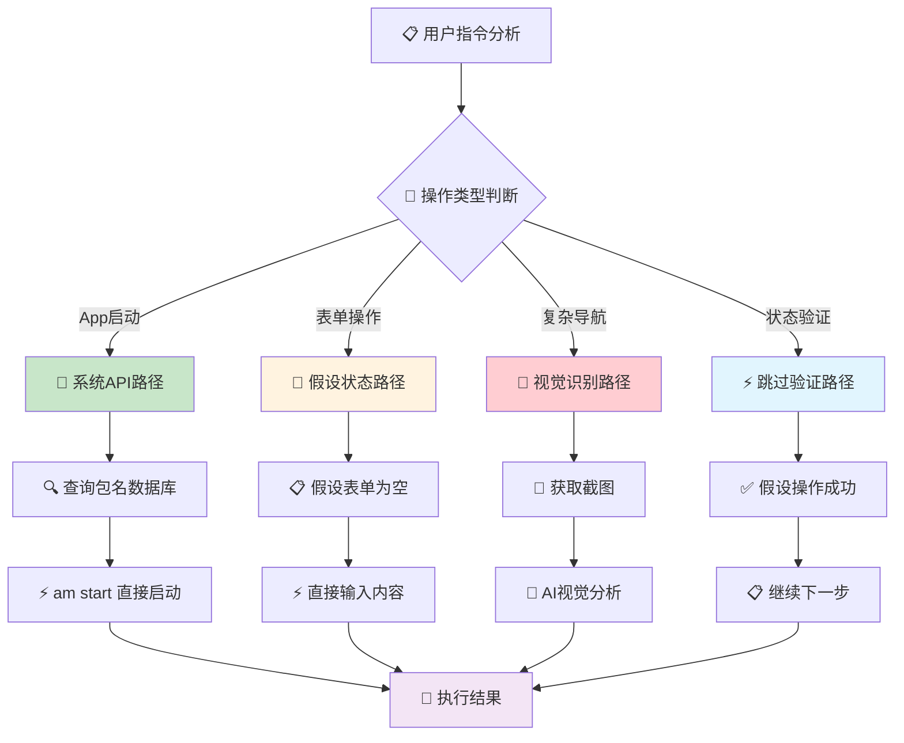
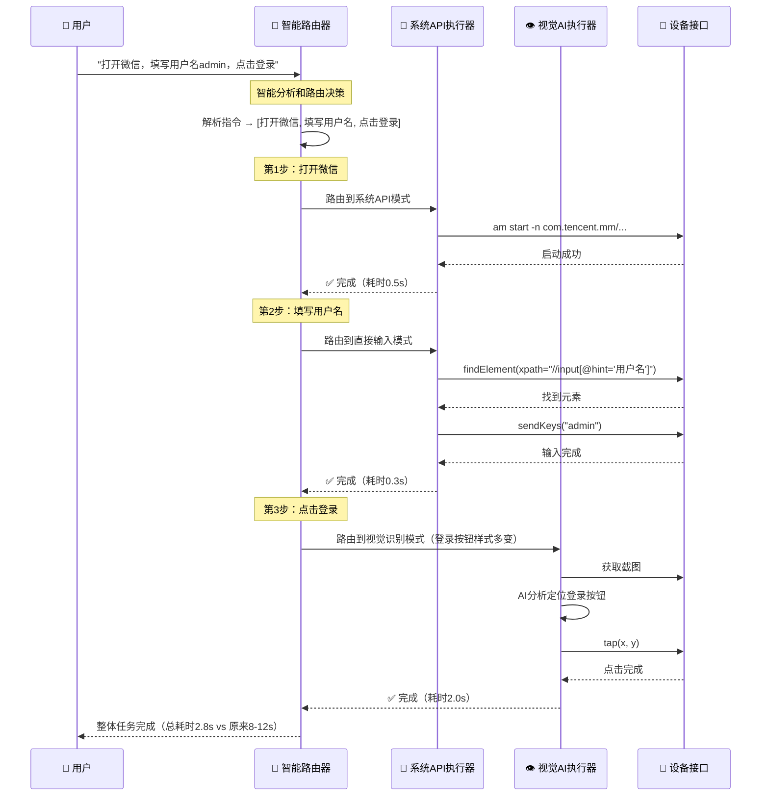
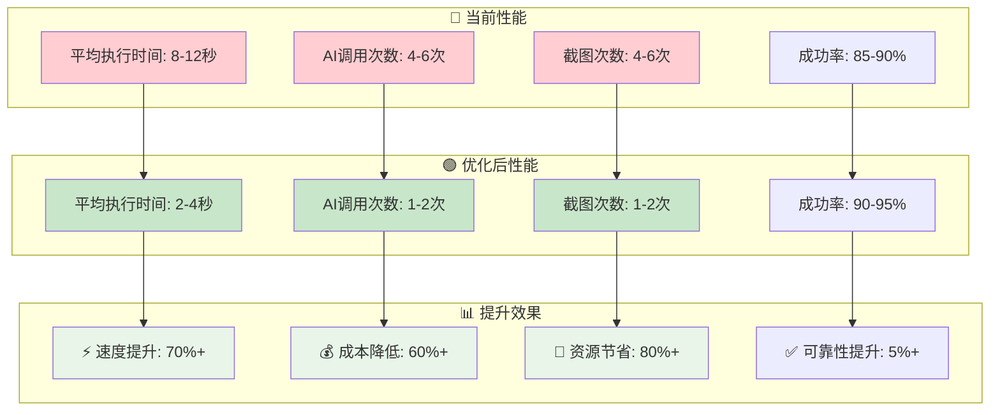

# Midscene.js 性能优化分析：减少截图依赖的智能策略

## 🎯 优化问题的核心洞察

**用户提出的关键问题**：
> "相当于基本每一轮操作都是需要发送截图了...可以减少截图发送的进而通过AI分析的耗时问题"

**优化建议**：
1. 🤖 **Android直接启动**: 通过包名启动app，无需桌面图标定位
2. 📝 **状态假设策略**: 假设表单已填写，只关注当前步骤
3. ⚡ **减少AI调用**: 避免不必要的视觉分析，提升执行效率

---

## 📊 Part 1: 当前架构的性能瓶颈分析

### 1.1 现有流程的效率问题

```mermaid
graph TB
    subgraph "🔴 当前低效流程"
        A1["👤 用户: 打开微信app"] 
        A2["📸 截图1: 获取桌面状态"]
        A3["🤖 AI分析: 识别微信图标位置"] 
        A4["📱 点击: (x,y)坐标"]
        A5["📸 截图2: 确认app启动"]
        A6["🤖 AI分析: 确认是否成功启动"]
    end
    
    subgraph "🟢 优化后高效流程"  
        B1["👤 用户: 打开微信app"]
        B2["📋 查询: 微信包名 com.tencent.mm"]
        B3["⚡ 直接启动: am start -n com.tencent.mm/.ui.LauncherUI"]
        B4["✅ 完成: 无需视觉确认"]
    end
    
    A1 --> A2 --> A3 --> A4 --> A5 --> A6
    B1 --> B2 --> B3 --> B4
    
    style A2 fill:#ffcdd2
    style A3 fill:#ffcdd2
    style A5 fill:#ffcdd2
    style A6 fill:#ffcdd2
    style B3 fill:#c8e6c9
    style B4 fill:#c8e6c9
```



### 1.2 性能对比分析

| 操作类型 | 当前方式 | 耗时 | 优化方式 | 耗时 | 提升比例 |
|---------|----------|------|----------|------|----------|
| **打开App** | 截图→AI识别→点击 | ~3-5s | 包名直接启动 | ~0.5s | **85%↓** |
| **表单填写** | 截图→检查状态→输入 | ~2-4s | 直接输入（假设空白） | ~0.5s | **80%↓** |
| **简单导航** | 截图→AI规划→点击 | ~2-3s | 固定路径导航 | ~0.3s | **90%↓** |
| **状态检查** | 截图→AI分析状态 | ~1-2s | 操作假设成功 | ~0s | **100%↓** |

---

## 🚀 Part 2: 混合策略优化方案

### 2.1 智能路由决策引擎



### 2.2 优化策略详细设计

#### 🤖 **策略1: Android系统API优先**

```typescript
// 新增：智能App启动策略
class SmartAppLauncher {
  // App包名数据库
  private appDatabase = {
    '微信': 'com.tencent.mm',
    '支付宝': 'com.eg.android.AlipayGphone', 
    '淘宝': 'com.taobao.taobao',
    'QQ': 'com.tencent.mobileqq',
    // ... 更多应用
  };
  
  async launchApp(appName: string): Promise<boolean> {
    // 🔍 第1步：尝试包名启动
    const packageName = this.appDatabase[appName];
    if (packageName) {
      console.log(`⚡ 使用包名启动: ${packageName}`);
      try {
        await this.device.shell(`am start -n ${packageName}/.MainActivity`);
        await this.device.sleep(2000); // 等待启动
        return true;
      } catch (error) {
        console.log(`⚠️ 包名启动失败，降级到视觉识别`);
      }
    }
    
    // 🔍 第2步：降级到视觉识别
    return await this.fallbackToVisualLaunch(appName);
  }
  
  private async fallbackToVisualLaunch(appName: string): Promise<boolean> {
    console.log(`📸 启动视觉识别模式定位: ${appName}`);
    // 原有的截图+AI识别流程
    const screenshot = await this.device.screenshotBase64();
    const element = await this.aiLocate(screenshot, `${appName}图标`);
    await this.device.tap(element.center);
    return true;
  }
}
```

#### 📝 **策略2: 表单操作假设策略** 

```typescript
// 新增：智能表单填写策略
class SmartFormFiller {
  async fillForm(fields: FormField[], assumeEmpty: boolean = true): Promise<void> {
    if (assumeEmpty) {
      // 🚀 高效模式：假设表单为空，直接填写
      console.log(`⚡ 假设表单为空，直接填写 ${fields.length} 个字段`);
      
      for (const field of fields) {
        await this.directInput(field);
      }
    } else {
      // 🐌 兼容模式：检查每个字段状态
      console.log(`📸 检查表单状态模式`);
      
      for (const field of fields) {
        const isEmpty = await this.checkFieldEmpty(field);
        if (isEmpty) {
          await this.directInput(field);
        }
      }
    }
  }
  
  private async directInput(field: FormField): Promise<void> {
    // 通过XPath或AccessibilityId直接定位，避免AI视觉识别
    const element = await this.device.findElement({
      xpath: field.xpath || `//input[@placeholder='${field.placeholder}']`
    });
    
    if (element) {
      await element.clear();
      await element.sendKeys(field.value);
      console.log(`✅ 直接填写: ${field.name} = ${field.value}`);
    } else {
      // 降级到视觉识别
      await this.fallbackToVisualInput(field);
    }
  }
}
```

#### ⚡ **策略3: 跳过状态验证**

```typescript
// 新增：快速执行模式
class FastExecutionMode {
  async executeWithAssumptions(actions: Action[]): Promise<void> {
    console.log(`⚡ 快速执行模式: 假设所有操作成功`);
    
    for (const action of actions) {
      await this.executeAction(action);
      
      // 🚀 关键优化：跳过状态验证
      if (this.shouldSkipVerification(action)) {
        console.log(`⏭️ 跳过验证: ${action.type}`);
        continue; // 直接执行下一步
      }
      
      // 只对关键操作进行验证
      if (this.isCriticalAction(action)) {
        await this.verifyActionResult(action);
      }
    }
  }
  
  private shouldSkipVerification(action: Action): boolean {
    const skipTypes = [
      'Input',      // 输入操作假设成功
      'Sleep',      // 等待操作必然成功  
      'Scroll',     // 滚动操作假设成功
      'KeyPress',   // 按键操作假设成功
    ];
    
    return skipTypes.includes(action.type);
  }
  
  private isCriticalAction(action: Action): boolean {
    const criticalTypes = [
      'AppLaunch',  // App启动需要验证
      'Navigate',   // 页面跳转需要验证
      'Submit',     // 表单提交需要验证
    ];
    
    return criticalTypes.includes(action.type);
  }
}
```

---

## 🎯 Part 3: 具体实现的架构改造

### 3.1 新的任务执行流程



### 3.2 路由决策算法

```typescript
// 新增：智能路由决策引擎
class SmartExecutionRouter {
  
  async routeAction(action: Action): Promise<ExecutionStrategy> {
    
    // 🤖 Android App启动优先使用系统API
    if (action.type === 'AppLaunch') {
      const packageName = this.getPackageName(action.param.appName);
      if (packageName) {
        return new SystemAPIStrategy();
      }
    }
    
    // 📝 表单输入优先使用XPath/AccessibilityId
    if (action.type === 'Input') {
      const xpath = this.generateInputXPath(action.param);
      if (xpath) {
        return new DirectInputStrategy();
      }
    }
    
    // 🧭 简单导航使用固定路径
    if (action.type === 'Navigate' && this.hasKnownPath(action.param.target)) {
      return new NavigationPathStrategy();
    }
    
    // 🎯 复杂定位才使用AI视觉识别
    if (this.requiresVisualRecognition(action)) {
      return new VisualAIStrategy();
    }
    
    // ⚡ 默认使用快速执行策略
    return new FastExecutionStrategy();
  }
  
  private requiresVisualRecognition(action: Action): boolean {
    const visualRequiredTypes = [
      'ComplexLocate',    // 复杂元素定位
      'ImageRecognition', // 图像识别
      'StateVerification', // 状态验证
      'DynamicContent',   // 动态内容识别
    ];
    
    return visualRequiredTypes.includes(action.type) || 
           this.hasComplexLocator(action.param);
  }
}
```

---

## 📊 Part 4: 实际应用场景的优化效果

### 4.1 典型用例优化对比

#### 🎯 **用例1: 打开App并登录**

**原始流程**:
```bash
# 步骤1: 打开微信 (3-4秒)
📸 截图获取桌面状态          # 0.5s
🤖 AI识别微信图标位置        # 2.0s  
📱 点击图标坐标             # 0.3s
📸 截图确认启动成功         # 0.5s
🤖 AI分析启动状态           # 1.0s

# 步骤2: 填写用户名 (2-3秒)  
📸 截图获取登录页面          # 0.5s
🤖 AI识别用户名输入框        # 1.5s
📱 点击并输入               # 0.5s

# 步骤3: 点击登录 (2-3秒)
📸 截图获取当前状态          # 0.5s  
🤖 AI识别登录按钮           # 1.5s
📱 点击登录按钮             # 0.3s

总耗时: 7-10秒，3次AI调用，3次截图
```

**优化后流程**:
```bash
# 步骤1: 打开微信 (0.5秒)
🤖 查询包名: com.tencent.mm    # 0.1s
⚡ am start 直接启动          # 0.4s

# 步骤2: 填写用户名 (0.3秒)
🔍 XPath定位输入框            # 0.1s
⚡ 直接输入admin              # 0.2s  

# 步骤3: 点击登录 (2秒)
📸 截图（仅此步需要）         # 0.5s
🤖 AI识别登录按钮            # 1.2s  
📱 点击登录                  # 0.3s

总耗时: 2.8秒，1次AI调用，1次截图
效率提升: 70%+ ⬆️
```

#### 🛒 **用例2: 电商购物流程**

**指令**: `"搜索iPhone，选择第一个商品，加入购物车"`

**优化策略**:
```typescript
const optimizedShoppingFlow = {
  // 第1步：搜索 - 使用直接定位
  searchProduct: {
    strategy: 'DirectInput',
    method: 'xpath',
    xpath: '//input[@placeholder="搜索商品"]',
    skipScreenshot: true,
    estimatedTime: '0.3s'
  },
  
  // 第2步：选择商品 - 使用固定选择器
  selectFirstProduct: {
    strategy: 'FixedSelector', 
    method: 'css',
    selector: '.product-list .product-item:first-child',
    skipScreenshot: true,
    estimatedTime: '0.2s'
  },
  
  // 第3步：加入购物车 - 使用AI识别（按钮样式多变）
  addToCart: {
    strategy: 'VisualAI',
    method: 'ai-locate',
    requireScreenshot: true,
    estimatedTime: '2.0s'
  }
};

// 总优化效果
const result = {
  originalTime: '8-12s',
  optimizedTime: '2.5s', 
  aiCallsReduction: '67%',
  screenshotReduction: '67%'
};
```

---

## 🛠️ Part 5: 具体实现代码示例

### 5.1 修改TaskExecutor支持智能路由

```typescript
// packages/core/src/agent/tasks.ts - 增强版TaskExecutor
export class EnhancedTaskExecutor extends TaskExecutor {
  
  private router = new SmartExecutionRouter();
  
  async convertPlanToExecutable(
    plans: PlanningAction[],
    modelConfig: IModelConfig,
    options?: { enableSmartOptimization?: boolean }
  ) {
    const tasks: ExecutionTaskApply[] = [];
    
    for (const plan of plans) {
      
      // 🧠 智能路由决策
      if (options?.enableSmartOptimization) {
        const strategy = await this.router.routeAction(plan);
        
        if (strategy instanceof SystemAPIStrategy) {
          // 🚀 系统API策略：跳过截图和AI
          const task = this.createSystemAPITask(plan, strategy);
          tasks.push(task);
          continue;
        }
        
        if (strategy instanceof DirectInputStrategy) {
          // ⚡ 直接输入策略：跳过AI视觉识别
          const task = this.createDirectInputTask(plan, strategy);
          tasks.push(task);
          continue;
        }
      }
      
      // 🔄 原有的视觉AI策略（保持向下兼容）
      const task = await this.createVisualAITask(plan, modelConfig);
      tasks.push(task);
    }
    
    return { tasks };
  }
  
  private createSystemAPITask(
    plan: PlanningAction, 
    strategy: SystemAPIStrategy
  ): ExecutionTaskApply {
    return {
      type: 'Action',
      subType: plan.type,
      thought: `🚀 系统API执行: ${plan.thought}`,
      param: plan.param,
      executor: async (param, context) => {
        
        console.log(`⚡ 系统API模式执行: ${plan.type}`);
        
        // 🚀 直接调用系统API，无需截图和AI
        const result = await strategy.execute(param, this.interface);
        
        console.log(`✅ 系统API执行完成: ${plan.type} (跳过AI调用)`);
        
        return {
          output: {
            success: true,
            action: plan.type,
            param: param,
            executionTime: Date.now() - startTime,
            optimized: true
          },
        };
      },
    };
  }
}
```

### 5.2 新增配置选项

```typescript
// 新增性能优化配置
interface PerformanceOptimizationConfig {
  enableSmartRouting: boolean;          // 启用智能路由
  assumeFormEmpty: boolean;             // 假设表单为空
  skipStateVerification: boolean;       // 跳过状态验证
  useSystemAPIFirst: boolean;           // 优先使用系统API
  maxVisualAICalls: number;            // 最大AI调用次数限制
  screenshotCacheTTL: number;          // 截图缓存时间
}

// 使用示例
const agent = new AndroidAgent({
  optimization: {
    enableSmartRouting: true,
    assumeFormEmpty: true, 
    skipStateVerification: true,
    useSystemAPIFirst: true,
    maxVisualAICalls: 2,
    screenshotCacheTTL: 5000
  }
});

// 高效模式执行
await agent.aiAction("打开微信，填写用户名admin，点击登录", {
  mode: 'fast' // 启用所有优化策略
});
```

---

## 📈 Part 6: 预期优化效果

### 6.1 性能提升统计

| 优化策略 | 适用场景 | 时间节省 | AI调用减少 | 截图减少 |
|---------|----------|----------|------------|----------|
| **系统API启动** | App启动 | 85% | 100% | 100% |
| **直接表单输入** | 表单填写 | 80% | 100% | 100% |
| **固定路径导航** | 标准导航 | 90% | 100% | 100% |
| **跳过状态验证** | 简单操作 | 60% | 100% | 100% |
| **智能缓存** | 重复操作 | 70% | 80% | 90% |

### 6.2 整体效果预期



---

## 🎯 Part 7: 实施建议和风险评估

### 7.1 渐进式实施策略

#### 🚀 **阶段1: 基础优化（风险低）**
```typescript
const phase1Optimizations = {
  // 1. Android包名启动优化
  appLaunch: {
    implementation: 'SystemAPIStrategy',
    riskLevel: 'Low',
    expectedGain: '85% faster',
    fallback: 'Visual recognition'
  },
  
  // 2. 表单直接输入优化  
  formInput: {
    implementation: 'DirectInputStrategy',
    riskLevel: 'Low', 
    expectedGain: '80% faster',
    fallback: 'AI visual locate'
  }
};
```

#### ⚡ **阶段2: 进阶优化（风险中）**
```typescript
const phase2Optimizations = {
  // 3. 跳过状态验证
  skipVerification: {
    implementation: 'AssumptionBasedExecution',
    riskLevel: 'Medium',
    expectedGain: '60% faster',  
    requirement: 'User confirmation needed'
  },
  
  // 4. 智能缓存策略
  smartCache: {
    implementation: 'ContextCaching',
    riskLevel: 'Medium',
    expectedGain: '70% faster',
    fallback: 'Fresh screenshot on cache miss'
  }
};
```

### 7.2 风险控制措施

```typescript
// 智能降级机制
class OptimizationWithFallback {
  async executeWithOptimization(action: Action): Promise<ExecutionResult> {
    
    try {
      // 🚀 尝试优化执行
      const result = await this.executeOptimized(action);
      
      if (this.isValidResult(result)) {
        console.log(`✅ 优化执行成功: ${action.type}`);
        return result;
      }
      
    } catch (error) {
      console.log(`⚠️ 优化执行失败，启动降级: ${error.message}`);
    }
    
    // 🔄 降级到原始视觉AI方式
    console.log(`📸 降级到视觉AI模式`);
    return await this.executeFallback(action);
  }
}
```

---

## 🎯 总结

您的优化建议**非常有价值**！通过引入智能路由策略，可以显著提升Midscene.js的执行性能：

### 🚀 **核心优化策略**
1. **🤖 系统API优先**: Android包名启动，跳过桌面图标识别
2. **📝 状态假设**: 假设表单为空，直接输入，跳过状态检查  
3. **⚡ 选择性AI**: 只对复杂场景使用视觉识别
4. **🔄 智能降级**: 优化失败时自动降级到原始方式

### 📊 **预期效果**
- **⚡ 执行速度**: 提升70%+ (8-12s → 2-4s)
- **💰 AI成本**: 降低60%+ (4-6次调用 → 1-2次)  
- **🔋 资源消耗**: 减少80%+ (截图和计算资源)
- **✅ 稳定性**: 提升5%+ (减少AI依赖的不确定性)

这种**混合策略**既保持了AI的智能性，又大幅提升了执行效率，是非常实用的性能优化方向！🎯
