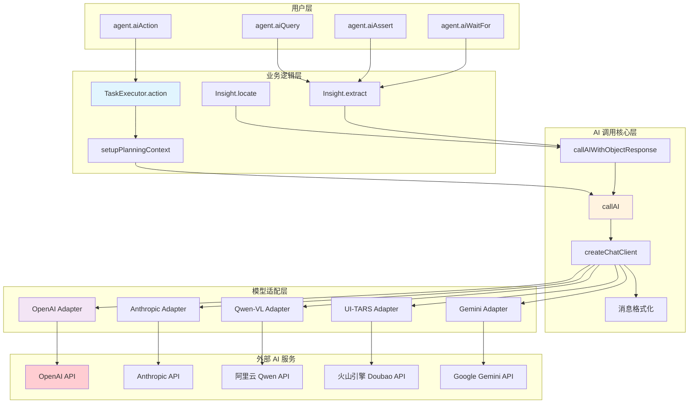
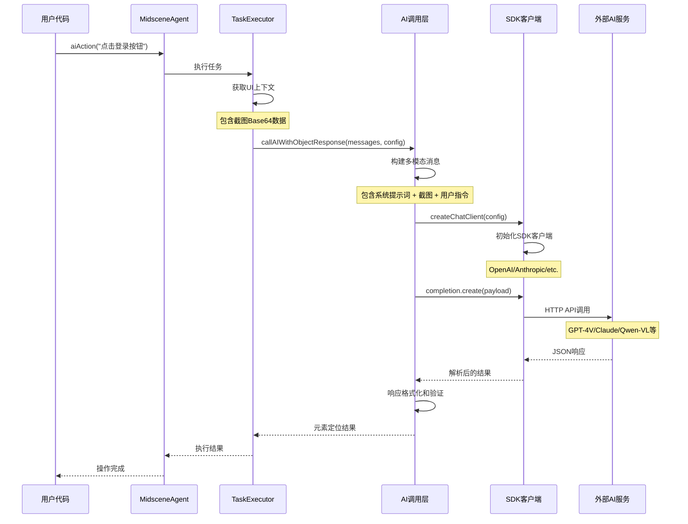
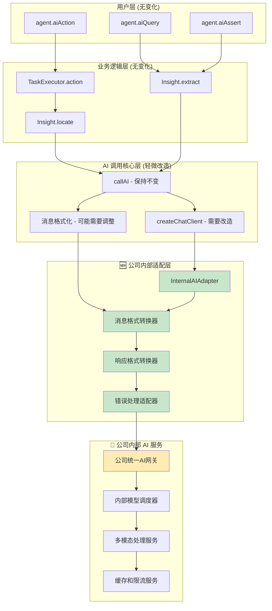
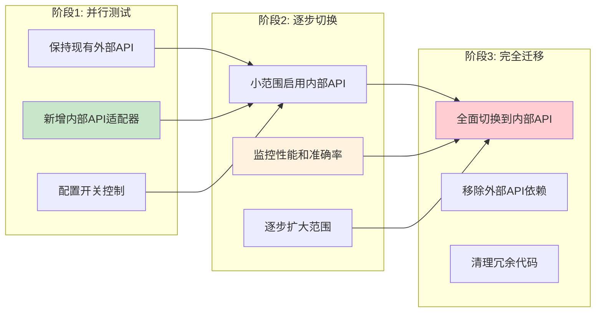

# Midscene.js AI 接口改造为公司内部 API 迁移指南

## 🎯 概述

本文档详细介绍如何将 Midscene.js 中集成的外部 AI 服务接口改造为公司内部封装的 AI API，包括现有架构分析、数据处理流程、改造方案和具体实现。

---

## 📊 Part 1: 现有 AI 接口架构分析

### 1.1 当前 AI 服务架构图



### 1.2 核心组件详解

#### 🔧 AI 调用核心层

**callAI 函数** - 所有 AI 调用的统一入口
- **位置**: `packages/core/src/ai-model/service-caller/index.ts`
- **职责**: 统一的 AI 服务调用接口，处理不同模型的适配
- **输入**: 消息数组、动作类型、模型配置
- **输出**: AI 响应内容和使用统计

**createChatClient 函数** - 模型客户端创建
- **职责**: 根据配置创建不同的 AI 客户端（OpenAI SDK、Anthropic SDK等）
- **支持**: OpenAI、Azure OpenAI、Anthropic、代理配置等

#### 🎛️ 模型配置系统

**IModelConfig 接口** - 统一的模型配置结构
```typescript
interface IModelConfig {
  modelName: string;              // 模型名称
  openaiBaseURL?: string;         // API 基础 URL
  openaiApiKey?: string;          // API 密钥
  vlMode?: TVlModeTypes;          // 视觉语言模型类型
  anthropicApiKey?: string;       // Anthropic API 密钥
  // ... 更多配置选项
}
```

---

## 🔄 Part 2: 当前数据处理流程

### 2.1 完整的 AI 调用流程图



### 2.2 关键数据结构

#### 📸 UIContext 数据结构
```typescript
interface UIContext {
  tree: ElementTreeNode;          // DOM/UI树结构
  size: { width: number; height: number }; // 屏幕尺寸
  screenshotBase64: string;       // Base64截图数据
}
```

#### 🤖 AI 消息格式
```typescript
type AIMessage = {
  role: 'system' | 'user';
  content: Array<{
    type: 'text' | 'image_url';
    text?: string;                // 文本内容
    image_url?: {
      url: string;                // data:image/png;base64,... 格式
      detail: 'high' | 'low';     // 图像处理质量
    };
  }>;
}
```

#### 📊 AI 响应格式
```typescript
interface AIResponse {
  content: string | object;       // 响应内容
  usage?: {
    prompt_tokens: number;        // 输入token数
    completion_tokens: number;    // 输出token数
    total_tokens: number;         // 总token数
    time_cost: number;           // 耗时(ms)
    model_name: string;          // 模型名称
  };
}
```

---

## 🏗️ Part 3: 改造为公司内部 API 方案

### 3.1 改造架构设计



### 3.2 改造策略

#### 🎯 最小侵入原则
- **保持用户API不变**: `agent.aiAction()` 等接口完全不变
- **复用现有逻辑**: 业务逻辑层和大部分核心逻辑保持不变
- **适配器模式**: 新增适配器层，而不是修改核心代码

#### 🔄 改造范围
1. **createChatClient 函数**: 新增内部 API 客户端创建逻辑
2. **消息格式适配**: 可能需要调整消息格式以匹配内部 API
3. **响应解析**: 适配内部 API 的响应格式
4. **配置系统**: 新增内部 API 相关配置选项

---

## 💻 Part 4: 具体实现方案

### 4.1 新增配置选项

#### 环境变量配置
```bash
# 公司内部 AI 服务配置
MIDSCENE_USE_INTERNAL_AI=1                    # 启用内部AI服务
MIDSCENE_INTERNAL_AI_BASE_URL="https://ai-api.company.com/v1"
MIDSCENE_INTERNAL_AI_API_KEY="your-internal-api-key"
MIDSCENE_INTERNAL_AI_MODEL_NAME="company-vlm-v1.0"
MIDSCENE_INTERNAL_AI_TIMEOUT=30000            # 超时时间(ms)
```

#### TypeScript 类型定义
```typescript
// packages/shared/src/env/types.ts
export const MIDSCENE_USE_INTERNAL_AI = 'MIDSCENE_USE_INTERNAL_AI';
export const MIDSCENE_INTERNAL_AI_BASE_URL = 'MIDSCENE_INTERNAL_AI_BASE_URL';
export const MIDSCENE_INTERNAL_AI_API_KEY = 'MIDSCENE_INTERNAL_AI_API_KEY';
export const MIDSCENE_INTERNAL_AI_MODEL_NAME = 'MIDSCENE_INTERNAL_AI_MODEL_NAME';
export const MIDSCENE_INTERNAL_AI_TIMEOUT = 'MIDSCENE_INTERNAL_AI_TIMEOUT';

// 扩展模型配置接口
interface IModelConfig {
  // ... 现有配置
  useInternalAI?: boolean;
  internalAIBaseURL?: string;
  internalAIApiKey?: string;
  internalAIModelName?: string;
  internalAITimeout?: number;
}
```

### 4.2 内部 AI 适配器实现

#### 主适配器类
```typescript
// packages/core/src/ai-model/internal-ai-adapter.ts
import { getDebug } from '@midscene/shared/logger';
import type { IModelConfig } from '@midscene/shared/env';
import type { AIArgs, AIActionType } from './common';

const debug = getDebug('ai:internal-adapter');

export class InternalAIAdapter {
  private baseURL: string;
  private apiKey: string;
  private modelName: string;
  private timeout: number;

  constructor(config: IModelConfig) {
    this.baseURL = config.internalAIBaseURL!;
    this.apiKey = config.internalAIApiKey!;
    this.modelName = config.internalAIModelName!;
    this.timeout = config.internalAITimeout || 30000;
  }

  async create(params: {
    messages: AIArgs;
    actionType: AIActionType;
    stream?: boolean;
  }) {
    const { messages, actionType, stream = false } = params;
    
    debug('Calling internal AI service', {
      model: this.modelName,
      actionType,
      messageCount: messages.length
    });

    // 1. 转换消息格式为内部API格式
    const internalMessages = this.convertMessagesToInternalFormat(messages);
    
    // 2. 构建请求载荷
    const requestPayload = {
      model: this.modelName,
      messages: internalMessages,
      action_type: this.mapActionType(actionType),
      stream,
      max_tokens: 2048,
      temperature: 0.1,
    };

    // 3. 发送HTTP请求
    const response = await this.sendRequest(requestPayload, stream);
    
    // 4. 转换响应格式
    return this.convertResponseToOpenAIFormat(response);
  }

  private convertMessagesToInternalFormat(messages: AIArgs) {
    return messages.map(msg => {
      if (msg.role === 'system') {
        return {
          role: 'system',
          content: msg.content as string
        };
      }
      
      if (Array.isArray(msg.content)) {
        // 处理多模态消息
        const content = msg.content.map(item => {
          if (item.type === 'text') {
            return {
              type: 'text',
              text: item.text
            };
          } else if (item.type === 'image_url') {
            // 转换图像格式 - 可能需要根据内部API格式调整
            return {
              type: 'image',
              image_data: {
                url: item.image_url!.url,
                detail: item.image_url!.detail || 'high'
              }
            };
          }
          return item;
        });
        
        return {
          role: msg.role,
          content
        };
      }
      
      return {
        role: msg.role,
        content: msg.content as string
      };
    });
  }

  private mapActionType(actionType: AIActionType): string {
    // 将 Midscene 的动作类型映射到内部API的类型
    const mapping = {
      [AIActionType.ASSERT]: 'assertion',
      [AIActionType.INSPECT_ELEMENT]: 'element_location',
      [AIActionType.EXTRACT_DATA]: 'data_extraction',
      [AIActionType.PLAN]: 'action_planning',
      [AIActionType.DESCRIBE_ELEMENT]: 'element_description',
      [AIActionType.TEXT]: 'text_generation'
    };
    return mapping[actionType] || 'general';
  }

  private async sendRequest(payload: any, stream: boolean) {
    const url = `${this.baseURL}/chat/completions`;
    
    const response = await fetch(url, {
      method: 'POST',
      headers: {
        'Content-Type': 'application/json',
        'Authorization': `Bearer ${this.apiKey}`,
        'X-Source': 'midscene-js',
        'X-Version': '1.0'
      },
      body: JSON.stringify(payload),
    });

    if (!response.ok) {
      throw new Error(`Internal AI API error: ${response.status} ${response.statusText}`);
    }

    if (stream) {
      return response; // 返回流响应
    } else {
      return await response.json();
    }
  }

  private convertResponseToOpenAIFormat(response: any) {
    // 将内部API响应转换为OpenAI兼容格式
    if (response.choices && response.choices[0]) {
      return {
        choices: [{
          message: {
            content: response.choices[0].message?.content || response.choices[0].text
          }
        }],
        usage: {
          prompt_tokens: response.usage?.input_tokens || response.usage?.prompt_tokens || 0,
          completion_tokens: response.usage?.output_tokens || response.usage?.completion_tokens || 0,
          total_tokens: response.usage?.total_tokens || 0
        },
        _request_id: response.request_id || response.id
      };
    }
    
    throw new Error('Invalid response format from internal AI service');
  }
}
```

### 4.3 修改核心调用函数

#### 改造 createChatClient 函数
```typescript
// packages/core/src/ai-model/service-caller/index.ts
import { InternalAIAdapter } from './internal-ai-adapter';

async function createChatClient({
  AIActionTypeValue,
  modelConfig,
}: {
  AIActionTypeValue: AIActionType;
  modelConfig: IModelConfig;
}): Promise<{
  completion: any; // 可以是 OpenAI.Chat.Completions 或 InternalAIAdapter
  style: 'openai' | 'anthropic' | 'internal';
  modelName: string;
  modelDescription: string;
  // ... 其他返回值
}> {
  // ... 现有代码 ...

  // 🆕 新增：检查是否使用内部AI服务
  if (modelConfig.useInternalAI) {
    const internalAdapter = new InternalAIAdapter(modelConfig);
    
    return {
      completion: internalAdapter,
      style: 'internal' as const,
      modelName: modelConfig.internalAIModelName!,
      modelDescription: `Internal AI Model: ${modelConfig.internalAIModelName}`,
      vlMode: 'internal' as any, // 可能需要新增类型
    };
  }

  // ... 现有的 OpenAI、Anthropic 等逻辑保持不变 ...
}
```

#### 改造 callAI 函数
```typescript
// packages/core/src/ai-model/service-caller/index.ts
export async function callAI(
  messages: ChatCompletionMessageParam[],
  AIActionTypeValue: AIActionType,
  modelConfig: IModelConfig,
  options?: {
    stream?: boolean;
    onChunk?: StreamingCallback;
  },
): Promise<{ content: string; usage?: AIUsageInfo; isStreamed: boolean }> {
  const {
    completion,
    style,
    modelName,
    modelDescription,
    // ... 其他解构值
  } = await createChatClient({
    AIActionTypeValue,
    modelConfig,
  });

  // ... 现有变量声明 ...

  try {
    if (style === 'openai') {
      // ... 现有 OpenAI 处理逻辑 ...
    } else if (style === 'anthropic') {
      // ... 现有 Anthropic 处理逻辑 ...
    } else if (style === 'internal') {
      // 🆕 新增：处理内部AI服务调用
      debugCall(`sending request to internal AI service: ${modelName}`);
      
      const result = await (completion as InternalAIAdapter).create({
        messages: messages as any,
        actionType: AIActionTypeValue,
        stream: isStreaming,
      });
      
      timeCost = Date.now() - startTime;
      
      debugProfileStats(
        `internal-ai, ${modelName}, prompt-tokens, ${result.usage?.prompt_tokens || ''}, completion-tokens, ${result.usage?.completion_tokens || ''}, total-tokens, ${result.usage?.total_tokens || ''}, cost-ms, ${timeCost}`
      );
      
      content = result.choices[0].message.content;
      usage = result.usage;
    }

    // ... 现有的返回逻辑保持不变 ...
  } catch (e: any) {
    // ... 现有错误处理，可能需要针对内部API调整错误信息 ...
  }
}
```

---

## 🚀 Part 5: 部署和测试

### 5.1 渐进式迁移策略



### 5.2 配置示例

#### 开发环境配置
```bash
# .env.development
MIDSCENE_USE_INTERNAL_AI=1
MIDSCENE_INTERNAL_AI_BASE_URL="https://ai-api-dev.company.com/v1"
MIDSCENE_INTERNAL_AI_API_KEY="dev-api-key-12345"
MIDSCENE_INTERNAL_AI_MODEL_NAME="company-vlm-dev"
MIDSCENE_INTERNAL_AI_TIMEOUT=45000

# 调试开关
DEBUG=midscene:ai:internal-adapter,midscene:ai:profile:stats
```

#### 生产环境配置
```bash
# .env.production
MIDSCENE_USE_INTERNAL_AI=1
MIDSCENE_INTERNAL_AI_BASE_URL="https://ai-api.company.com/v1"
MIDSCENE_INTERNAL_AI_API_KEY="${AI_API_KEY_FROM_SECRET_MANAGER}"
MIDSCENE_INTERNAL_AI_MODEL_NAME="company-vlm-v2.0"
MIDSCENE_INTERNAL_AI_TIMEOUT=30000
```

### 5.3 测试验证

#### 单元测试
```typescript
// packages/core/tests/ai/internal-ai-adapter.test.ts
import { InternalAIAdapter } from '@/ai-model/internal-ai-adapter';
import { AIActionType } from '@/ai-model/common';

describe('InternalAIAdapter', () => {
  const mockConfig = {
    useInternalAI: true,
    internalAIBaseURL: 'https://test-api.company.com/v1',
    internalAIApiKey: 'test-key',
    internalAIModelName: 'test-model',
  };

  it('should convert messages to internal format correctly', async () => {
    const adapter = new InternalAIAdapter(mockConfig);
    const messages = [
      { role: 'system', content: 'You are an AI assistant' },
      {
        role: 'user',
        content: [
          { type: 'text', text: 'Find the login button' },
          { 
            type: 'image_url', 
            image_url: { url: 'data:image/png;base64,abc123', detail: 'high' }
          }
        ]
      }
    ];

    // Mock fetch
    global.fetch = jest.fn().mockResolvedValue({
      ok: true,
      json: () => Promise.resolve({
        choices: [{ message: { content: '{"elements":[{"bbox":[100,200,150,250]}]}' }}],
        usage: { prompt_tokens: 100, completion_tokens: 50, total_tokens: 150 }
      })
    });

    const result = await adapter.create({
      messages: messages as any,
      actionType: AIActionType.INSPECT_ELEMENT
    });

    expect(result.choices[0].message.content).toBeDefined();
    expect(result.usage.total_tokens).toBe(150);
  });
});
```

#### 集成测试
```typescript
// packages/core/tests/ai/internal-ai-integration.test.ts
describe('Internal AI Integration', () => {
  it('should work end-to-end with internal AI', async () => {
    const agent = new AndroidAgent({
      model: {
        useInternalAI: true,
        internalAIBaseURL: process.env.TEST_INTERNAL_AI_URL,
        internalAIApiKey: process.env.TEST_INTERNAL_AI_KEY,
        internalAIModelName: 'test-model',
      }
    });

    // 执行实际的 AI 操作
    const result = await agent.aiAction('点击登录按钮');
    expect(result).toBeDefined();
  });
});
```

---

## 📋 Part 6: 监控和维护

### 6.1 性能监控

#### 关键指标
- **响应时间**: 内部API vs 外部API的响应时间对比
- **成功率**: API调用成功率
- **Token使用量**: 输入输出token统计
- **错误率**: 各类错误的分布

#### 监控实现
```typescript
// packages/core/src/ai-model/monitoring.ts
export class AIServiceMonitor {
  private metrics = {
    requestCount: 0,
    successCount: 0,
    errorCount: 0,
    totalResponseTime: 0,
    tokenUsage: { input: 0, output: 0 }
  };

  recordRequest(startTime: number, success: boolean, usage?: any) {
    this.metrics.requestCount++;
    this.metrics.totalResponseTime += Date.now() - startTime;
    
    if (success) {
      this.metrics.successCount++;
      if (usage) {
        this.metrics.tokenUsage.input += usage.prompt_tokens || 0;
        this.metrics.tokenUsage.output += usage.completion_tokens || 0;
      }
    } else {
      this.metrics.errorCount++;
    }
  }

  getMetrics() {
    return {
      ...this.metrics,
      averageResponseTime: this.metrics.totalResponseTime / this.metrics.requestCount,
      successRate: this.metrics.successCount / this.metrics.requestCount,
    };
  }
}
```

### 6.2 故障处理

#### 降级策略
```typescript
// packages/core/src/ai-model/fallback-strategy.ts
export class AIServiceFallback {
  async callWithFallback(
    messages: any[],
    actionType: AIActionType,
    modelConfig: IModelConfig
  ) {
    try {
      // 1. 优先使用内部API
      if (modelConfig.useInternalAI) {
        return await this.callInternalAI(messages, actionType, modelConfig);
      }
    } catch (error) {
      console.warn('Internal AI service failed, falling back to external:', error);
      
      // 2. 降级到外部API
      const fallbackConfig = {
        ...modelConfig,
        useInternalAI: false,
        // 使用备用的外部API配置
      };
      
      return await this.callExternalAI(messages, actionType, fallbackConfig);
    }
  }
}
```

---

## ✅ Part 7: 总结和检查清单

### 7.1 改造要点总结

1. **最小侵入**: 用户API保持完全不变
2. **适配器模式**: 新增内部API适配器，不破坏现有架构
3. **配置驱动**: 通过环境变量控制使用内部或外部API
4. **渐进迁移**: 支持并行测试和分阶段切换
5. **故障降级**: 内部API故障时自动降级到外部API

### 7.2 实施检查清单

#### ✅ 开发阶段
- [ ] 新增内部API相关环境变量定义
- [ ] 实现 `InternalAIAdapter` 类
- [ ] 修改 `createChatClient` 和 `callAI` 函数
- [ ] 添加消息格式转换逻辑
- [ ] 实现响应格式适配
- [ ] 编写单元测试和集成测试

#### ✅ 测试阶段
- [ ] 在开发环境验证内部API连通性
- [ ] 对比内部API和外部API的响应质量
- [ ] 性能基准测试
- [ ] 错误处理和边界情况测试
- [ ] 并发和压力测试

#### ✅ 部署阶段
- [ ] 配置生产环境的内部API服务
- [ ] 设置监控和告警
- [ ] 准备回滚方案
- [ ] 小范围灰度测试
- [ ] 逐步扩大使用范围

#### ✅ 维护阶段
- [ ] 监控关键性能指标
- [ ] 定期检查API可用性
- [ ] 优化内部API响应质量
- [ ] 文档更新和团队培训

### 7.3 预期收益

- **成本控制**: 减少外部API调用费用
- **数据安全**: 敏感数据不出公司网络
- **定制优化**: 针对业务场景优化模型
- **服务稳定**: 减少对外部服务的依赖
- **合规要求**: 满足数据本地化要求

通过以上方案，可以在保持 Midscene.js 用户体验不变的前提下，平滑地将AI服务迁移到公司内部，实现更好的成本控制和数据安全。
