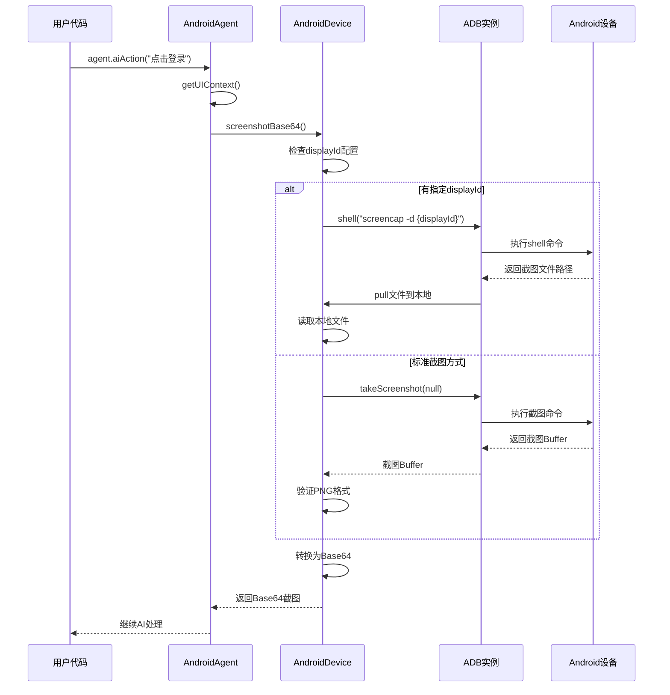
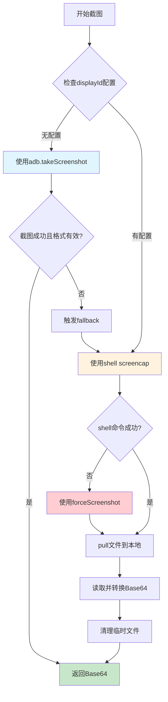
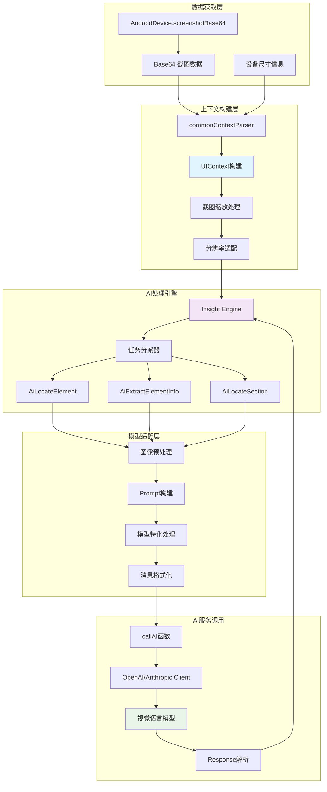
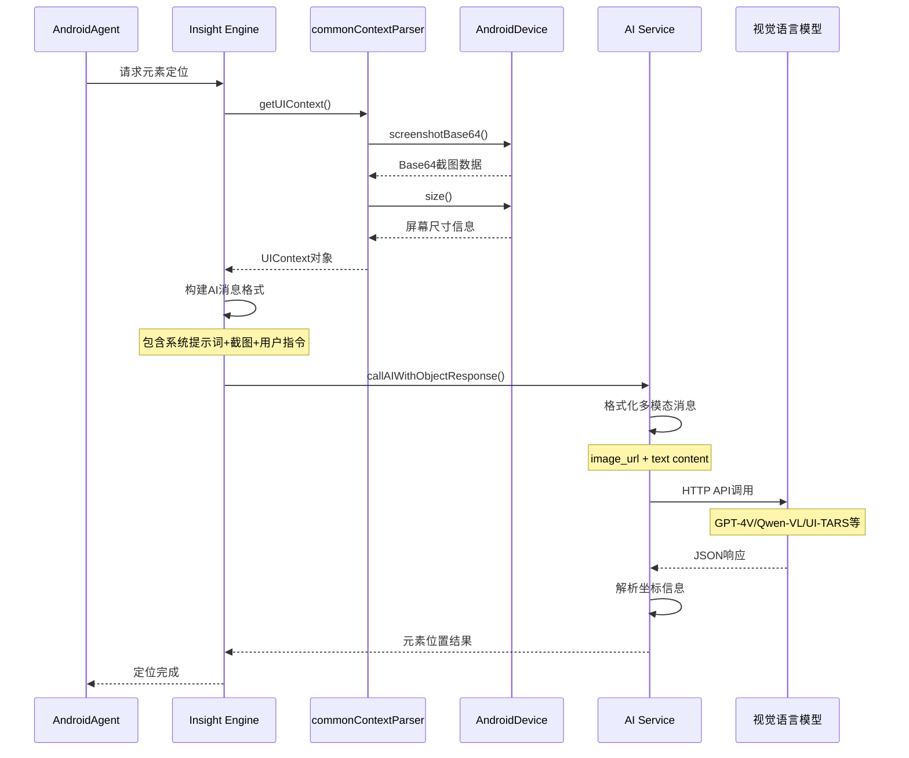
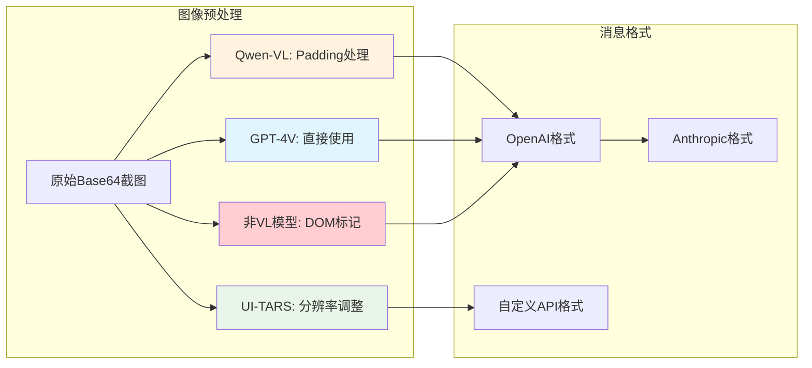
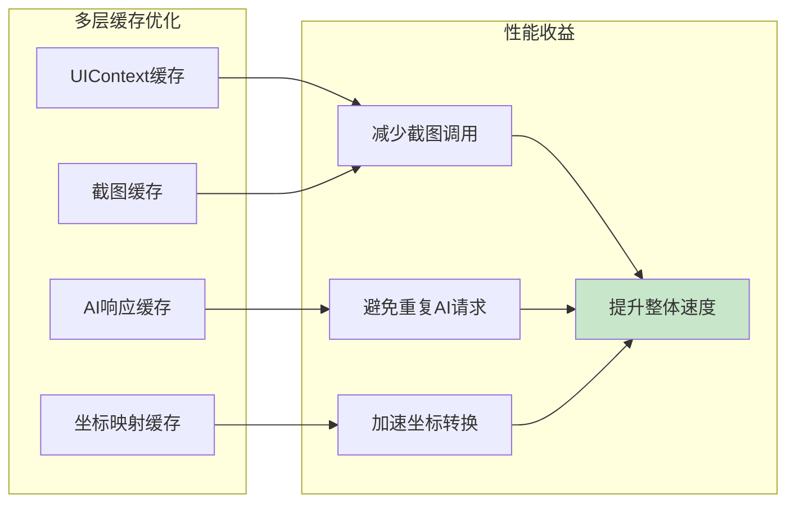

# Midscene.js 截图获取与 AI 处理流程深度解析

## 🎯 概述

本文档详细解析 Midscene.js 中 `takeScreenshot()` 的完整调用链路，以及截图数据如何通过大模型进行视觉理解和处理的完整流程。

---

## 📸 Part 1: 截图获取流程 (takeScreenshot)

### 1.1 完整调用链路图



### 1.2 截图获取核心代码分析

#### AndroidDevice.screenshotBase64() 实现

```typescript
async screenshotBase64(): Promise<string> {
  debugDevice('screenshotBase64 begin');
  const adb = await this.getAdb();
  let screenshotBuffer;
  const androidScreenshotPath = `/data/local/tmp/midscene_screenshot_${uuid()}.png`;
  const useShellScreencap = typeof this.options?.displayId === 'number';

  try {
    if (useShellScreencap) {
      // 需要指定显示器ID时，直接跳到shell命令方式
      throw new Error(`Display ${this.options?.displayId} requires shell screencap`);
    }
    
    // 方式1: 标准ADB截图
    debugDevice('Taking screenshot via adb.takeScreenshot');
    screenshotBuffer = await adb.takeScreenshot(null);
    
    // 验证截图数据有效性
    if (!screenshotBuffer || !isValidPNGImageBuffer(screenshotBuffer)) {
      throw new Error('Screenshot buffer has invalid format');
    }
    
  } catch (error) {
    // 方式2: Shell命令截图（fallback）
    debugDevice('Fallback: taking screenshot via shell screencap');
    const displayId = this.options?.usePhysicalDisplayIdForScreenshot
      ? await this.getPhysicalDisplayId()
      : this.options?.displayId;
    const displayArg = displayId ? `-d ${displayId}` : '';
    
    // 在Android设备上执行screencap命令
    await adb.shell(`screencap -p ${displayArg} ${androidScreenshotPath}`.trim());
    
    // 将截图文件拉取到本地
    await adb.pull(androidScreenshotPath, screenshotPath);
    screenshotBuffer = await fs.promises.readFile(screenshotPath);
    
    // 清理Android设备上的临时文件
    await adb.shell(`rm ${androidScreenshotPath}`);
  }

  // 转换为Midscene标准格式
  return createImgBase64ByFormat('png', screenshotBuffer.toString('base64'));
}
```

### 1.3 截图获取策略对比

| 方式 | 触发条件 | 优势 | 劣势 | 适用场景 |
|------|---------|------|------|---------|
| **ADB takeScreenshot** | 默认方式 | 速度快，直接返回Buffer | 不支持指定显示器 | 单屏幕设备 |
| **Shell screencap** | 指定displayId 或 fallback | 支持多显示器，灵活性高 | 需要文件传输，速度较慢 | 多屏幕设备，特殊场景 |

### 1.4 错误处理与重试机制



---

## 🤖 Part 2: AI 视觉识别处理流程

### 2.1 截图到AI模型的完整数据流



### 2.2 UIContext 构建详解

#### commonContextParser 实现

```typescript
export async function commonContextParser(
  interfaceInstance: AbstractInterface,
  _opt: { uploadServerUrl?: string },
): Promise<UIContext> {
  // 1. 获取设备描述信息
  const description = interfaceInstance.describe?.() || '';
  
  // 2. 关键步骤：调用截图接口
  const screenshotBase64 = await interfaceInstance.screenshotBase64();
  assert(screenshotBase64!, 'screenshotBase64 is required');
  
  // 3. 获取屏幕尺寸和DPR信息
  const size = await interfaceInstance.size();
  
  // 4. 构建统一的UI上下文
  return {
    tree: { node: null, children: [] }, // Android不依赖DOM树
    size,
    screenshotBase64: screenshotBase64!,
  };
}
```

### 2.3 AI 模型调用时序图



### 2.4 不同AI模型的图像处理差异

#### 模型适配策略



#### 关键代码：AiLocateElement

```typescript
export async function AiLocateElement(options: {
  context: UIContext<ElementType>;
  targetElementDescription: TUserPrompt;
  modelConfig: IModelConfig;
}) {
  const { context, targetElementDescription, modelConfig } = options;
  const { vlMode } = modelConfig;
  const { screenshotBase64 } = context;
  
  let imagePayload = screenshotBase64;
  let imageWidth = context.size.width;
  let imageHeight = context.size.height;
  
  // 根据不同模型进行图像预处理
  if (vlMode === 'qwen-vl') {
    // Qwen-VL需要padding到特定块大小
    const paddedResult = await paddingToMatchBlockByBase64(imagePayload);
    imageWidth = paddedResult.width;
    imageHeight = paddedResult.height;
    imagePayload = paddedResult.imageBase64;
  } else if (vlMode === 'ui-tars') {
    // UI-TARS需要特定的分辨率调整
    imagePayload = await resizeImageForUiTars(imagePayload, context.size);
  } else if (!vlMode) {
    // 非视觉模型：在图像上标记DOM元素
    imagePayload = await markupImageForLLM(screenshotBase64, context.tree, context.size);
  }
  
  // 构建多模态消息
  const msgs: AIArgs = [
    { role: 'system', content: systemPrompt },
    {
      role: 'user',
      content: [
        {
          type: 'image_url',
          image_url: {
            url: imagePayload,    // 🔑 关键：处理后的图像数据
            detail: 'high',       // 高质量处理
          },
        },
        {
          type: 'text',
          text: userInstructionPrompt,
        },
      ],
    },
  ];
  
  // 调用AI模型
  const res = await callAIWithObjectResponse(msgs, AIActionType.INSPECT_ELEMENT, modelConfig);
  
  // 解析坐标结果并返回
  return processAIResponse(res);
}
```

### 2.5 AI 服务调用实现

#### callAI 核心实现

```typescript
export async function callAI(
  messages: ChatCompletionMessageParam[],
  AIActionTypeValue: AIActionType,
  modelConfig: IModelConfig,
): Promise<{ content: string; usage?: AIUsageInfo }> {
  
  const { completion, style, modelName } = await createChatClient({
    AIActionTypeValue,
    modelConfig,
  });
  
  if (style === 'openai') {
    // OpenAI格式：直接发送image_url
    const result = await completion.create({
      model: modelName,
      messages: messages,  // 🔑 包含screenshot的多模态消息
      response_format: getResponseFormat(modelName, AIActionTypeValue),
      max_tokens: getMaxTokens(modelConfig),
    });
    
    return {
      content: result.choices[0]?.message?.content || '',
      usage: result.usage,
    };
    
  } else if (style === 'anthropic') {
    // Anthropic格式：需要转换image_url为base64格式
    const convertImageContent = (content: any) => {
      if (content.type === 'image_url') {
        const { mimeType, body } = parseBase64(content.image_url.url);
        return {
          type: 'image',
          source: {
            type: 'base64',
            media_type: mimeType,  // image/png
            data: body,           // 🔑 纯base64数据(不含前缀)
          },
        };
      }
      return content;
    };
    
    const result = await completion.create({
      model: modelName,
      messages: messages.map((m) => ({
        role: 'user',
        content: Array.isArray(m.content)
          ? m.content.map(convertImageContent)  // 🔑 转换图像格式
          : m.content,
      })),
    });
    
    return {
      content: result.content[0].text,
      usage: result.usage,
    };
  }
}
```

---

## 🎯 Part 3: 完整流程总览

### 3.1 端到端流程图

```mermaid
graph TB
    subgraph "用户调用"
        A[agent.aiAction('点击登录按钮')]
    end
    
    subgraph "Agent层"
        B[AndroidAgent.aiAction]
        C[TaskExecutor.action]
        D[获取UIContext]
    end
    
    subgraph "设备层截图"
        E[AndroidDevice.screenshotBase64]
        F[ADB.takeScreenshot / shell screencap]
        G[Android设备执行]
        H[返回PNG数据]
        I[转换Base64]
    end
    
    subgraph "AI处理层"
        J[Insight.locate]
        K[构建多模态消息]
        L[callAI服务]
        M[AI模型分析]
        N[返回坐标结果]
    end
    
    subgraph "执行层"
        O[解析AI响应]
        P[执行点击操作]
        Q[ADB.shell input tap x y]
        R[Android设备响应]
    end
    
    A --> B
    B --> C
    C --> D
    D --> E
    E --> F
    F --> G
    G --> H
    H --> I
    I --> J
    J --> K
    K --> L
    L --> M
    M --> N
    N --> O
    O --> P
    P --> Q
    Q --> R
    
    style G fill:#fff3e0
    style M fill:#e8f5e8
    style I fill:#e1f5fe
    style N fill:#c8e6c9
```

### 3.2 数据流转详解

#### 截图数据的格式变化

```typescript
// 1. Android设备 -> PNG Buffer
const pngBuffer: Buffer = await androidDevice.captureScreen();

// 2. Buffer -> Base64 String  
const base64String: string = pngBuffer.toString('base64');

// 3. Base64 -> Midscene格式
const midsceneFormat: string = `data:image/png;base64,${base64String}`;

// 4. 发送给AI模型
const aiMessage = {
  role: 'user',
  content: [
    {
      type: 'image_url',
      image_url: {
        url: midsceneFormat,  // 🔑 完整的data URL
        detail: 'high'
      }
    },
    {
      type: 'text', 
      text: '找到登录按钮'
    }
  ]
};

// 5. AI模型处理后返回坐标
const aiResponse = {
  elements: [{
    bbox: [100, 200, 150, 250],  // [left, top, right, bottom]
    center: [125, 225]           // 计算得出的中心点
  }]
};
```

### 3.3 性能优化要点

#### 缓存策略



#### 关键性能数据

| 操作 | 典型耗时 | 优化后 | 优化策略 |
|------|---------|--------|---------|
| **截图获取** | 200-500ms | 100-200ms | 缓存+压缩 |
| **AI模型调用** | 1-3s | 0.5-1.5s | 结果缓存 |
| **图像预处理** | 50-100ms | 20-50ms | 异步处理 |
| **整体流程** | 2-4s | 1-2s | 综合优化 |

---

## 📊 总结

### 关键技术点

1. **双路径截图策略**: 标准ADB + Shell命令fallback，确保兼容性
2. **多模态AI集成**: 统一接口适配不同视觉语言模型
3. **智能格式转换**: 根据模型特性进行图像预处理
4. **robust错误处理**: 完善的重试和降级机制
5. **性能优化**: 多层缓存提升整体效率

### 核心创新

- **视觉优先**: 摆脱传统控件树依赖，纯视觉驱动
- **AI理解**: 自然语言描述直接转换为精确坐标
- **跨模型兼容**: 统一接口支持多种AI模型
- **高可靠性**: 多种截图方式确保在各种设备上正常工作

通过这套完整的截图获取和AI处理流程，Midscene.js 实现了真正意义上的"视觉驱动"的Android UI自动化，为移动端测试带来了革命性的体验提升。
