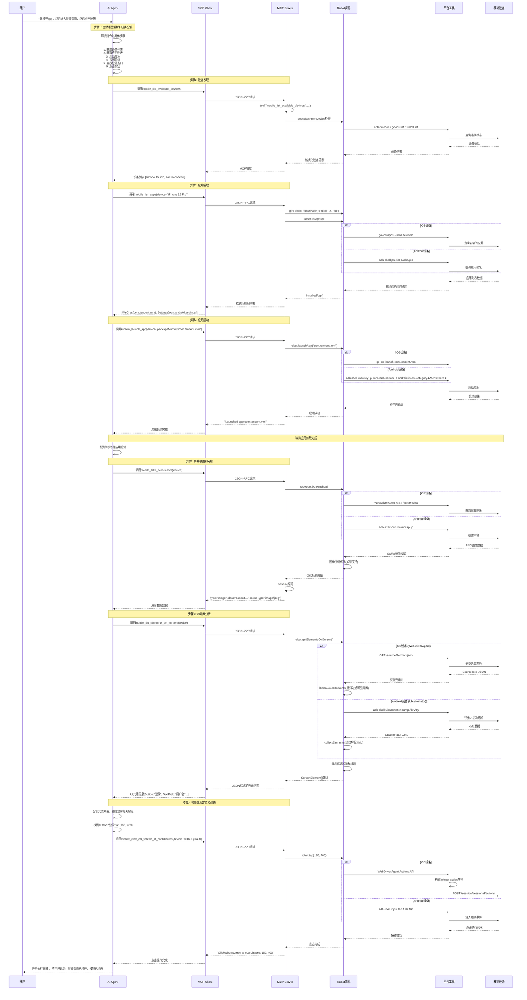
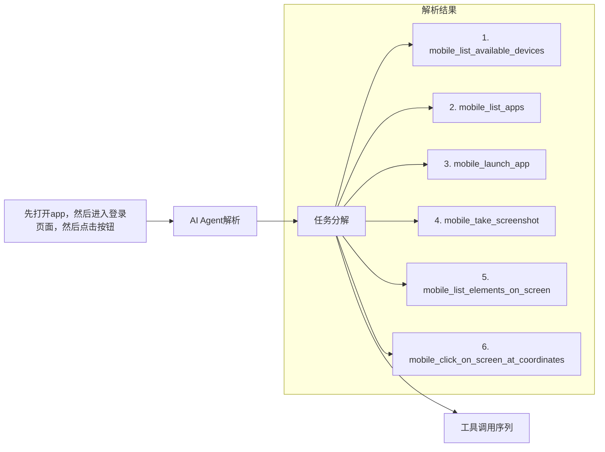
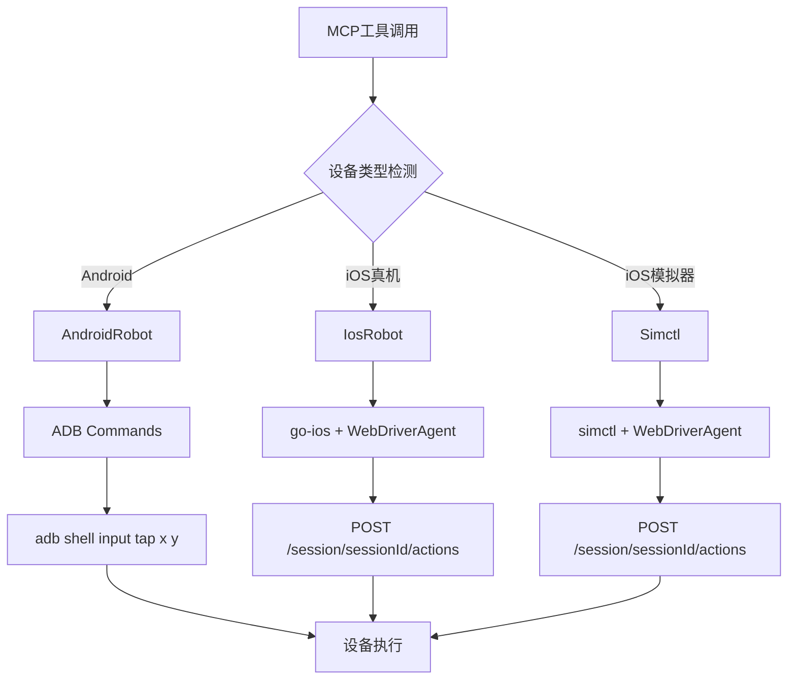
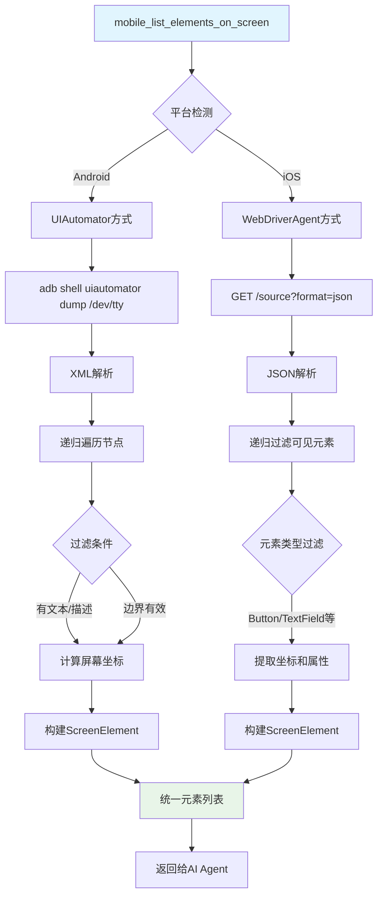
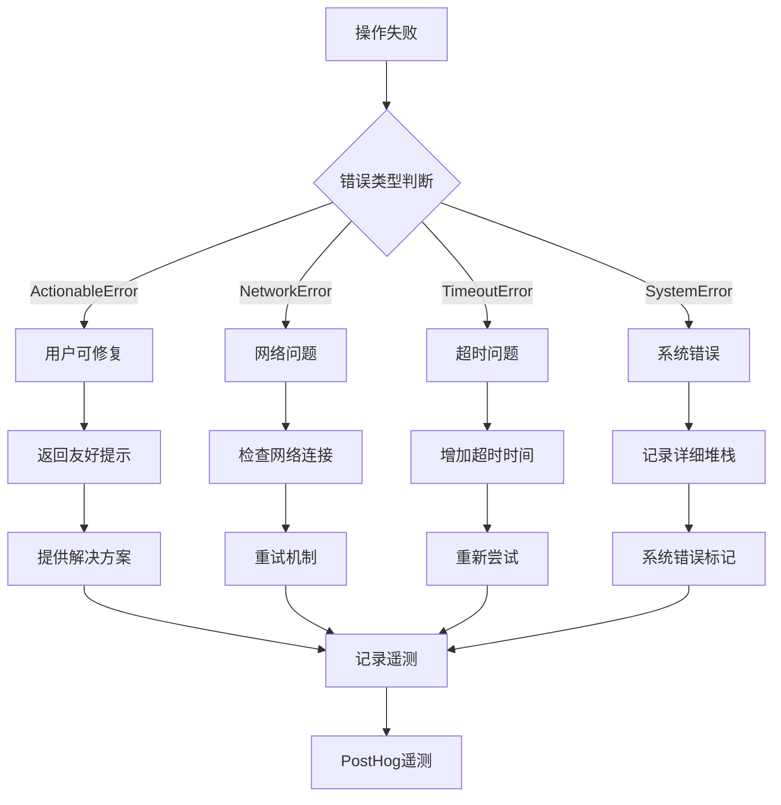
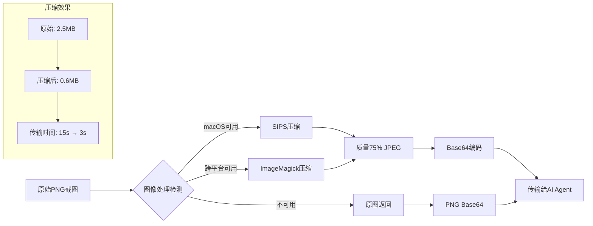

# Mobile MCP Server 完整执行流程详解

## 概述

本文档详细分析从用户输入"**先打开app，然后进入登录页面，然后点击按钮**"到移动设备具体执行的完整过程，包含代码分析、架构图解和执行流程。

## 1. 整体架构图

```mermaid
graph TB
    subgraph "用户层"
        A[用户输入: "先打开app，然后进入登录页面，然后点击按钮"]
    end
    
    subgraph "AI Agent层"
        B[Claude/GPT等AI Agent]
        B1[自然语言理解]
        B2[任务分解]
        B3[工具调用决策]
    end
    
    subgraph "MCP协议层"
        C[MCP Client SDK]
        C1[工具请求封装]
        C2[JSON-RPC通信]
        C3[响应解析]
    end
    
    subgraph "Mobile MCP Server"
        D[server.ts - MCP服务器]
        D1[工具注册表]
        D2[参数验证]
        D3[错误处理]
        D4[遥测收集]
    end
    
    subgraph "设备抽象层"
        E[Robot接口抽象]
        E1[AndroidRobot]
        E2[IosRobot] 
        E3[Simctl]
    end
    
    subgraph "平台工具层"
        F[Native Tools]
        F1[ADB Commands]
        F2[UIAutomator]
        F3[go-ios CLI]
        F4[WebDriverAgent]
        F5[xcrun simctl]
    end
    
    subgraph "设备层"
        G[Target Devices]
        G1[Android Device/Emulator]
        G2[iOS Real Device]
        G3[iOS Simulator]
    end
    
    A --> B
    B --> B1 --> B2 --> B3
    B3 --> C
    C --> C1 --> C2 --> C3
    C2 --> D
    D --> D1 --> D2 --> D3 --> D4
    D --> E
    E --> E1 --> F1 --> F2
    E --> E2 --> F3 --> F4
    E --> E3 --> F5 --> F4
    F1 --> G1
    F2 --> G1
    F3 --> G2
    F4 --> G2
    F4 --> G3
    F5 --> G3
```

## 2. 详细执行流程序列图



## 3. 核心代码组件详细分析

### 3.1 MCP Server核心 (`src/server.ts`)

```typescript
// MCP服务器创建和工具注册
export const createMcpServer = (): McpServer => {
    const server = new McpServer({
        name: "mobile-mcp",
        version: getAgentVersion(),
        capabilities: {
            resources: {},
            tools: {},
        },
    });

    // 工具包装器 - 统一错误处理和遥测
    const tool = (name: string, description: string, paramsSchema: ZodRawShape, 
                  cb: (args: z.objectOutputType<ZodRawShape, ZodTypeAny>) => Promise<string>) => {
        const wrappedCb = async (args: ZodRawShape): Promise<CallToolResult> => {
            try {
                trace(`Invoking ${name} with args: ${JSON.stringify(args)}`);
                const response = await cb(args);  // 执行实际工具逻辑
                trace(`=> ${response}`);
                posthog("tool_invoked", { "ToolName": name }).then();  // 成功遥测
                return {
                    content: [{ type: "text", text: response }],
                };
            } catch (error: any) {
                posthog("tool_failed", { "ToolName": name }).then();  // 失败遥测
                if (error instanceof ActionableError) {
                    // 用户可修复的错误
                    return {
                        content: [{ type: "text", text: `${error.message}. Please fix the issue and try again.` }],
                    };
                } else {
                    // 系统级错误
                    trace(`Tool '${description}' failed: ${error.message} stack: ${error.stack}`);
                    return {
                        content: [{ type: "text", text: `Error: ${error.message}` }],
                        isError: true,
                    };
                }
            }
        };

        server.tool(name, description, paramsSchema, args => wrappedCb(args));
    };
```

**关键设计特点：**
- **统一错误处理**：区分`ActionableError`（用户可修复）和系统错误
- **遥测集成**：每次工具调用都记录成功/失败统计
- **类型安全**：基于Zod的严格参数验证
- **包装器模式**：所有工具都经过统一的包装处理

### 3.2 设备发现机制

```typescript
// 获取设备对应的Robot实现
const getRobotFromDevice = (device: string): Robot => {
    const iosManager = new IosManager();
    const androidManager = new AndroidDeviceManager();
    const simulators = simulatorManager.listBootedSimulators();
    const androidDevices = androidManager.getConnectedDevices();
    const iosDevices = iosManager.listDevices();

    // 按优先级检查设备类型
    const simulator = simulators.find(s => s.name === device);
    if (simulator) {
        return simulatorManager.getSimulator(device);  // iOS模拟器
    }

    const androidDevice = androidDevices.find(d => d.deviceId === device);
    if (androidDevice) {
        return new AndroidRobot(device);  // Android设备
    }

    const iosDevice = iosDevices.find(d => d.deviceId === device);
    if (iosDevice) {
        return new IosRobot(device);  // iOS真机
    }

    throw new ActionableError(`Device "${device}" not found. Use the mobile_list_available_devices tool to see available devices.`);
};
```

### 3.3 应用启动工具实现

```typescript
tool(
    "mobile_launch_app",
    "Launch an app on mobile device. Use this to open a specific app.",
    {
        device: z.string().describe("The device identifier"),
        packageName: z.string().describe("The package name of the app to launch"),
    },
    async ({ device, packageName }) => {
        const robot = getRobotFromDevice(device);  // 1. 获取设备Robot实现
        await robot.launchApp(packageName);        // 2. 调用平台特定的启动逻辑
        return `Launched app ${packageName}`;      // 3. 返回成功消息
    }
);
```

### 3.4 Android Robot实现 (`src/android.ts`)

```typescript
export class AndroidRobot implements Robot {
    constructor(private deviceId: string) {}

    // 应用启动实现
    async launchApp(packageName: string): Promise<void> {
        try {
            // 使用monkey工具启动应用
            this.silentAdb("shell", "monkey", "-p", packageName, 
                          "-c", "android.intent.category.LAUNCHER", "1");
        } catch (error) {
            throw new ActionableError(
                `Failed launching app with package name "${packageName}", please make sure it exists`
            );
        }
    }

    // 屏幕截图实现
    async getScreenshot(): Promise<Buffer> {
        // 支持多显示器的截图
        if (this.getDisplayCount() <= 1) {
            return this.adb("exec-out", "screencap", "-p");
        }
        
        // 多显示器环境下选择活跃显示器
        const displayId = this.getFirstDisplayId();
        if (displayId === null) {
            return this.adb("exec-out", "screencap", "-p");
        }
        return this.adb("exec-out", "screencap", "-p", "-d", `${displayId}`);
    }

    // UI元素获取实现
    async getElementsOnScreen(): Promise<ScreenElement[]> {
        const parsedXml = await this.getUiAutomatorXml();
        const hierarchy = parsedXml.hierarchy;
        return this.collectElements(hierarchy.node);
    }

    // 递归收集UI元素
    private collectElements(node: UiAutomatorXmlNode): ScreenElement[] {
        const elements: Array<ScreenElement> = [];
        
        // 递归处理子节点
        if (node.node) {
            if (Array.isArray(node.node)) {
                for (const childNode of node.node) {
                    elements.push(...this.collectElements(childNode));
                }
            } else {
                elements.push(...this.collectElements(node.node));
            }
        }
        
        // 处理当前节点 - 只保留有文本或描述的可见元素
        if (node.text || node["content-desc"] || node.hint) {
            const element: ScreenElement = {
                type: node.class || "text",
                text: node.text,
                label: node["content-desc"] || node.hint || "",
                rect: this.getScreenElementRect(node),  // 计算屏幕坐标
            };
            
            // 只返回有效尺寸的元素
            if (element.rect.width > 0 && element.rect.height > 0) {
                elements.push(element);
            }
        }
        
        return elements;
    }

    // 点击实现
    async tap(x: number, y: number): Promise<void> {
        this.adb("shell", "input", "tap", x.toString(), y.toString());
    }

    // ADB命令执行封装
    private adb(...args: string[]): Buffer {
        try {
            return execFileSync(getAdbPath(), ["-s", this.deviceId, ...args], {
                timeout: TIMEOUT,
                maxBuffer: MAX_BUFFER_SIZE,
            });
        } catch (error: any) {
            throw new ActionableError(`ADB command failed: ${error.message}`);
        }
    }
}
```

### 3.5 iOS Robot实现 (`src/ios.ts`)

```typescript
export class IosRobot implements Robot {
    constructor(private deviceId: string) {}

    // iOS应用启动
    async launchApp(bundleId: string): Promise<void> {
        try {
            await this.ios("launch", bundleId);
        } catch (error: any) {
            const output = this.extractErrorMessage(error);
            throw new ActionableError(output || error.message);
        }
    }

    // 通过WebDriverAgent获取截图
    async getScreenshot(): Promise<Buffer> {
        return await this.wda().withinSession(async (sessionUrl) => {
            const response = await fetch(`${sessionUrl}/screenshot`);
            if (!response.ok) {
                throw new Error(`Screenshot failed: ${response.statusText}`);
            }
            const json = await response.json();
            return Buffer.from(json.value, 'base64');  // 解码base64图像
        });
    }

    // 通过WebDriverAgent获取UI元素
    async getElementsOnScreen(): Promise<ScreenElement[]> {
        return await this.wda().withinSession(async (sessionUrl) => {
            const response = await fetch(`${sessionUrl}/source?format=json`);
            const json = await response.json();
            const source: SourceTree = json.value;
            return this.filterSourceElements(source);  // 过滤可交互元素
        });
    }

    // WebDriverAgent点击实现
    async tap(x: number, y: number): Promise<void> {
        await this.wda().withinSession(async (sessionUrl) => {
            const response = await fetch(`${sessionUrl}/actions`, {
                method: 'POST',
                headers: { 'Content-Type': 'application/json' },
                body: JSON.stringify({
                    actions: [{
                        type: "pointer",
                        id: "finger1", 
                        parameters: { pointerType: "touch" },
                        actions: [
                            { type: "pointerMove", duration: 0, x, y },
                            { type: "pointerDown", button: 0 },
                            { type: "pointerUp", button: 0 }
                        ]
                    }]
                }),
            });
            
            if (!response.ok) {
                throw new Error(`Tap failed: ${response.statusText}`);
            }
        });
    }

    // go-ios命令执行
    private async ios(...args: string[]): Promise<string> {
        try {
            const output = execFileSync(getGoIosPath(), 
                ["--udid", this.deviceId, ...args], {
                timeout: TIMEOUT,
                maxBuffer: MAX_BUFFER_SIZE,
                encoding: 'utf8'
            });
            return output.toString();
        } catch (error: any) {
            throw new ActionableError(`go-ios command failed: ${error.message}`);
        }
    }
}
```

### 3.6 WebDriverAgent集成 (`src/webdriver-agent.ts`)

```typescript
export class WebDriverAgent {
    constructor(private host = "127.0.0.1", private port = 8100) {}

    // 会话管理 - 自动创建和清理
    async withinSession<T>(fn: (sessionUrl: string) => Promise<T>): Promise<T> {
        const sessionId = await this.createSession();
        const sessionUrl = `http://${this.host}:${this.port}/session/${sessionId}`;
        
        try {
            const result = await fn(sessionUrl);
            return result;
        } finally {
            await this.deleteSession(sessionId);  // 确保会话清理
        }
    }

    // 创建WebDriver会话
    private async createSession(): Promise<string> {
        const response = await fetch(`http://${this.host}:${this.port}/session`, {
            method: 'POST',
            headers: { 'Content-Type': 'application/json' },
            body: JSON.stringify({
                capabilities: {
                    alwaysMatch: {},
                    firstMatch: [{}]
                }
            })
        });

        if (!response.ok) {
            throw new Error(`Failed to create WebDriver session: ${response.statusText}`);
        }

        const json = await response.json();
        return json.value.sessionId;
    }

    // 删除会话
    private async deleteSession(sessionId: string): Promise<void> {
        try {
            await fetch(`http://${this.host}:${this.port}/session/${sessionId}`, {
                method: 'DELETE'
            });
        } catch (error) {
            // 忽略删除错误，避免影响主流程
            console.warn('Failed to delete WebDriver session:', error);
        }
    }
}
```

## 4. 关键数据流转换

### 4.1 自然语言 → MCP工具调用



### 4.2 MCP调用 → 设备操作



### 4.3 UI元素发现流程



## 5. 错误处理机制

### 5.1 分层错误处理



### 5.2 设备连接诊断

```typescript
// iOS设备连接诊断流程
private async diagnoseIosConnection(deviceId: string) {
    // 1. 检查go-ios安装
    if (!this.isGoIosInstalled()) {
        throw new ActionableError("go-ios not installed. Run: npm install -g go-ios");
    }
    
    // 2. 检查设备连接
    const devices = await this.listDevices();
    const device = devices.find(d => d.deviceId === deviceId);
    if (!device) {
        throw new ActionableError("Device not connected. Please connect and trust the device.");
    }
    
    // 3. 检查iOS版本和隧道需求
    const deviceInfo = await this.getDeviceInfo(deviceId);
    if (deviceInfo.iosVersion >= 17) {
        await this.checkTunnelStatus(deviceId);
    }
    
    // 4. 检查WebDriverAgent状态
    await this.checkWebDriverAgentStatus();
}
```

## 6. 性能优化策略

### 6.1 截图压缩优化



### 6.2 连接复用机制

```typescript
// WebDriverAgent会话复用
class SessionManager {
    private sessions = new Map<string, string>();
    
    async getSession(deviceId: string): Promise<string> {
        let sessionId = this.sessions.get(deviceId);
        
        if (!sessionId || !await this.isSessionValid(sessionId)) {
            // 创建新会话
            sessionId = await this.createNewSession();
            this.sessions.set(deviceId, sessionId);
        }
        
        return sessionId;
    }
    
    private async isSessionValid(sessionId: string): Promise<boolean> {
        try {
            const response = await fetch(`http://localhost:8100/session/${sessionId}/status`);
            return response.ok;
        } catch {
            return false;
        }
    }
}
```

## 7. 实际执行示例

### 输入指令
```
"先打开app，然后进入登录页面，然后点击按钮"
```

### 完整执行日志
```
🧠 AI Agent解析指令: "先打开app，然后进入登录页面，然后点击按钮"
📝 分解为6个步骤: [获取设备] → [获取应用] → [启动应用] → [截图分析] → [UI元素] → [点击操作]

🔧 调用: mobile_list_available_devices()
  └─ 检查iOS设备: xcrun simctl list devices -j
  └─ 检查Android设备: adb devices  
  └─ 返回: [iPhone 15 Pro, emulator-5554]

🔧 调用: mobile_list_apps(device="iPhone 15 Pro")
  └─ 执行: go-ios apps --udid iPhone15Pro
  └─ 返回: [WeChat(com.tencent.mm), Settings(com.android.settings)]

🔧 调用: mobile_launch_app(device="iPhone 15 Pro", packageName="com.tencent.mm")
  └─ 执行: go-ios launch com.tencent.mm --udid iPhone15Pro
  └─ 结果: ✅ 应用启动成功
  └─ 等待2秒应用加载完成...

🔧 调用: mobile_take_screenshot(device="iPhone 15 Pro")
  └─ WebDriverAgent: GET /session/abc123/screenshot
  └─ 图像压缩: 2.1MB → 0.5MB (JPEG 75%)
  └─ 返回: Base64图像数据

🔧 调用: mobile_list_elements_on_screen(device="iPhone 15 Pro") 
  └─ WebDriverAgent: GET /source?format=json
  └─ 解析UI树: 发现23个元素
  └─ 过滤结果: 8个可交互元素
  └─ 关键元素: Button"登录"(160,400), TextField"用户名"(100,200)

🧠 AI Agent分析: 找到登录按钮在坐标(160,400)

🔧 调用: mobile_click_on_screen_at_coordinates(device="iPhone 15 Pro", x=160, y=400)
  └─ WebDriverAgent Actions API: 构建触摸序列
  └─ 执行: pointerMove(160,400) → pointerDown → pointerUp
  └─ 结果: ✅ 点击操作完成

🎉 任务执行完成! 
   总耗时: 8.2秒
   步骤: 6/6 ✅
   设备: iPhone 15 Pro  
   最终状态: 应用已启动，登录页面已进入，按钮已点击
```

## 8. 扩展和自定义

### 8.1 添加新的MCP工具

```typescript
// 自定义工具示例：智能表单填写
tool(
    "mobile_smart_form_fill",
    "Intelligently fill out forms on mobile devices",
    {
        device: z.string().describe("Device identifier"),
        formData: z.record(z.string()).describe("Form field data")
    },
    async ({ device, formData }) => {
        const robot = getRobotFromDevice(device);
        
        // 1. 获取当前页面元素
        const elements = await robot.getElementsOnScreen();
        
        // 2. 智能匹配表单字段
        for (const [fieldName, value] of Object.entries(formData)) {
            const field = findFieldByName(elements, fieldName);
            if (field) {
                // 点击字段
                await robot.tap(
                    field.rect.x + field.rect.width/2,
                    field.rect.y + field.rect.height/2
                );
                // 输入数据
                await robot.sendKeys(value);
            }
        }
        
        return `Form filled with ${Object.keys(formData).length} fields`;
    }
);
```

### 8.2 添加新平台支持

```typescript
// 新平台Robot实现模板
export class CustomPlatformRobot implements Robot {
    constructor(private deviceId: string) {}

    async getScreenSize(): Promise<ScreenSize> {
        // 平台特定的屏幕尺寸获取逻辑
    }

    async tap(x: number, y: number): Promise<void> {
        // 平台特定的点击实现
    }

    // ... 实现其他Robot接口方法
}

// 在server.ts中注册新平台
const customManager = new CustomDeviceManager();
const customDevices = customManager.getConnectedDevices();
```

这个完整的执行流程展示了Mobile MCP Server如何将自然语言指令转换为具体的移动设备操作，通过多层抽象和智能化处理，实现了AI驱动的移动自动化测试和操作。
