# Midscene.js Android 自动化技术架构深度分析

## 📋 目录
- [项目概述](#项目概述)
- [整体架构](#整体架构)
- [Android 实现机制](#android-实现机制)
- [AI 视觉理解流程](#ai-视觉理解流程)
- [核心组件详解](#核心组件详解)
- [工作流程分析](#工作流程分析)
- [技术优势](#技术优势)
- [性能优化](#性能优化)
- [总结](#总结)

## 项目概述

Midscene.js 是一个**视觉驱动的 AI 操作器**，专为 Web、Android、iOS 自动化测试而设计。其核心创新在于：

- 🖥️ **Visual-First**: 通过屏幕截图而非 DOM/控件树进行界面理解
- 🤖 **AI-Powered**: 集成视觉语言模型进行智能元素识别和操作规划
- 🌐 **Cross-Platform**: 提供统一 API 适配多平台
- 📝 **Natural Language**: 支持自然语言描述的自动化脚本

## 整体架构

### 系统架构图

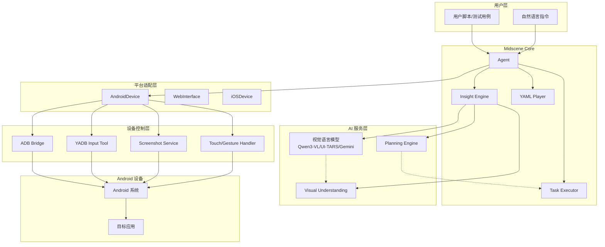

### 核心设计理念

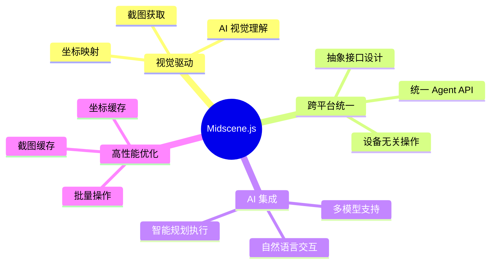

## Android 实现机制

### Android 技术栈图

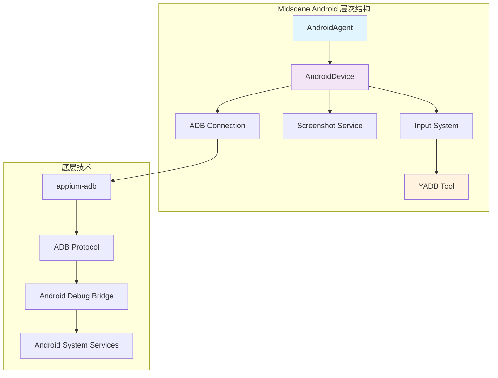

### 关键实现细节

#### 1. ADB 连接管理

```typescript
// 连接架构
interface ADBConnectionFlow {
  deviceDiscovery: "通过 getConnectedDevices() 发现设备";
  connectionInit: "创建 ADB 实例，支持本地/远程连接";
  proxyCreation: "创建 ADB 代理，管理连接生命周期";
  errorHandling: "连接失败重试和错误恢复";
}
```

#### 2. 屏幕截图机制

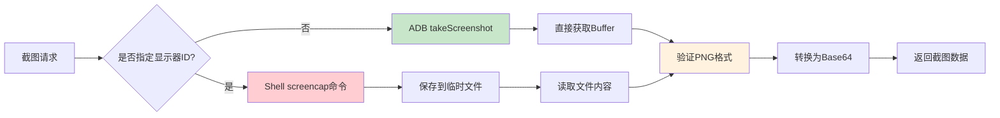

#### 3. YADB 输入优化

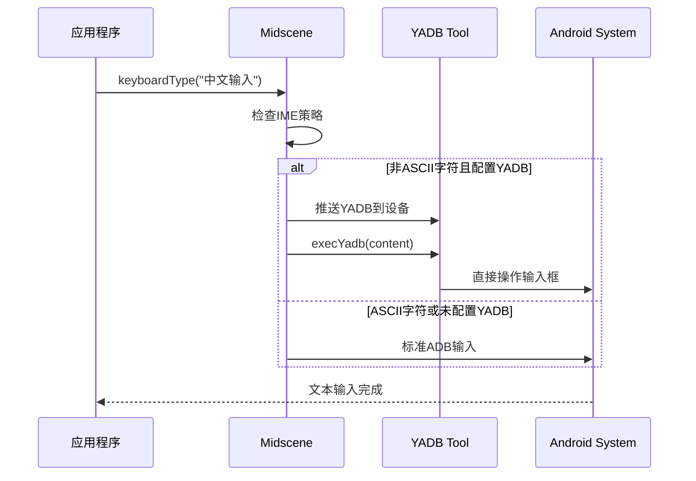

## AI 视觉理解流程

### AI 处理架构

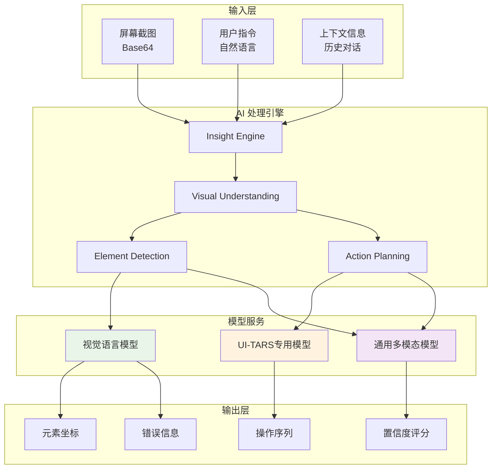

### 深度思考机制

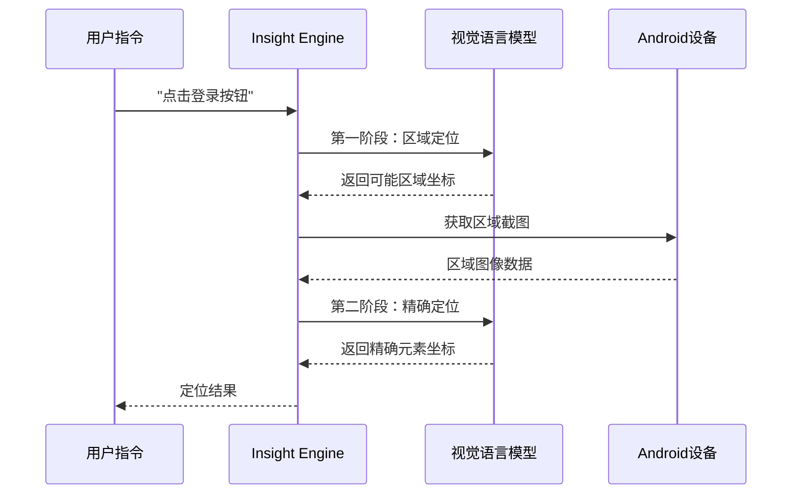

## 核心组件详解

### AndroidDevice 组件架构

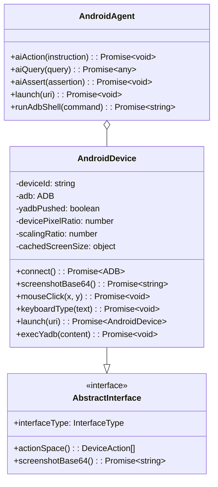

### 动作空间定义

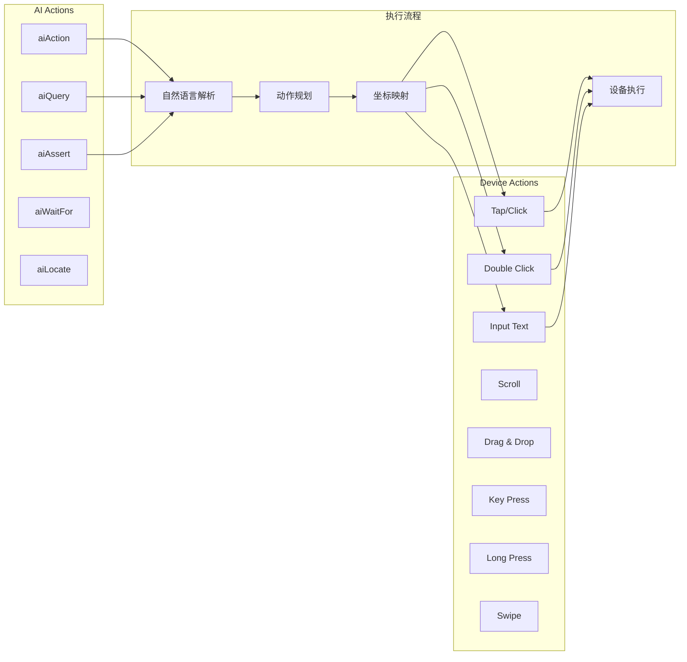

## 工作流程分析

### 完整执行流程

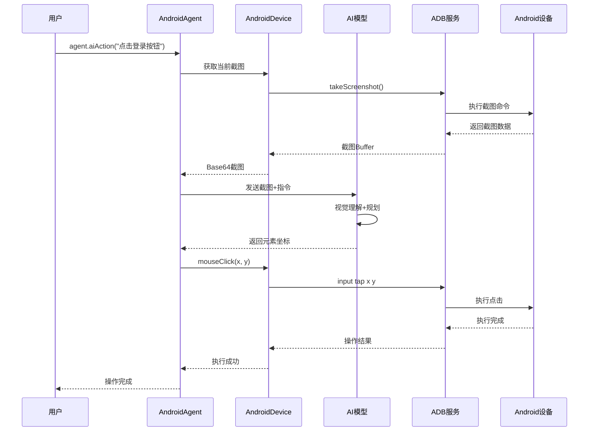

### 错误处理流程

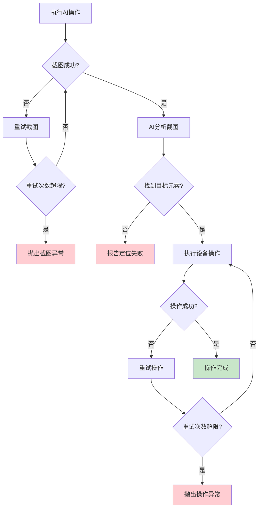

## 技术优势

### 对比传统UI自动化

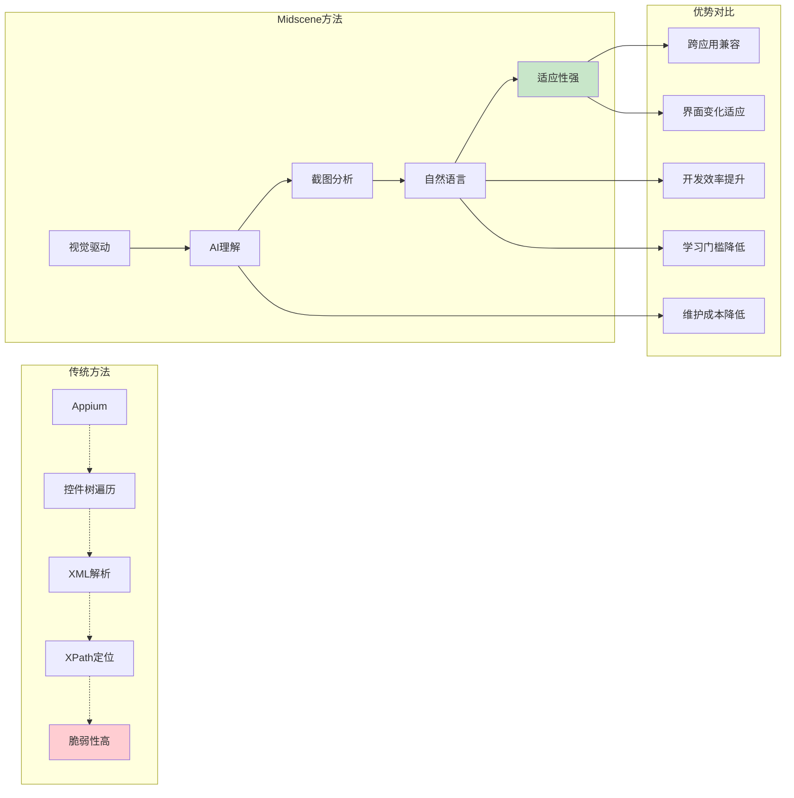

### 性能优化策略

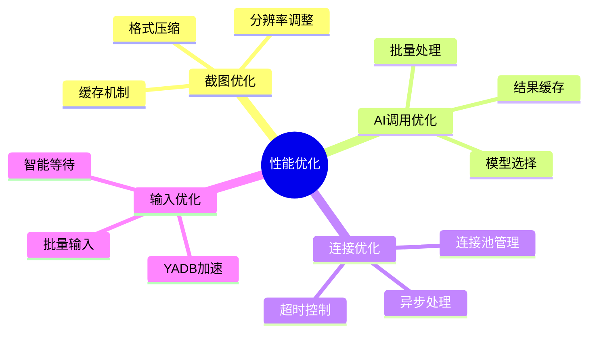

## 性能优化

### 缓存机制

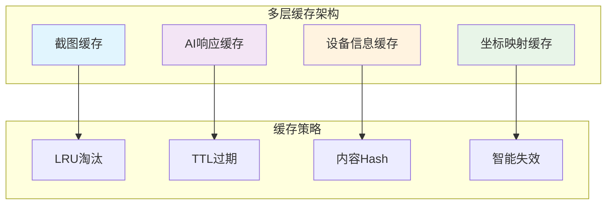

### YADB性能提升

| 输入方式 | 性能对比 | 适用场景 |
|---------|---------|---------|
| 标准ADB input | 基准速度 | 英文、数字 |
| YADB (中文) | **3-5x faster** | 中文、特殊字符 |
| YADB (批量) | **10x faster** | 大段文本输入 |

## 支持的AI模型

### 模型对比

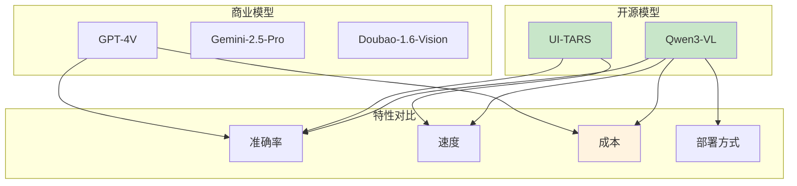

## 实际应用案例

### 电商应用测试示例

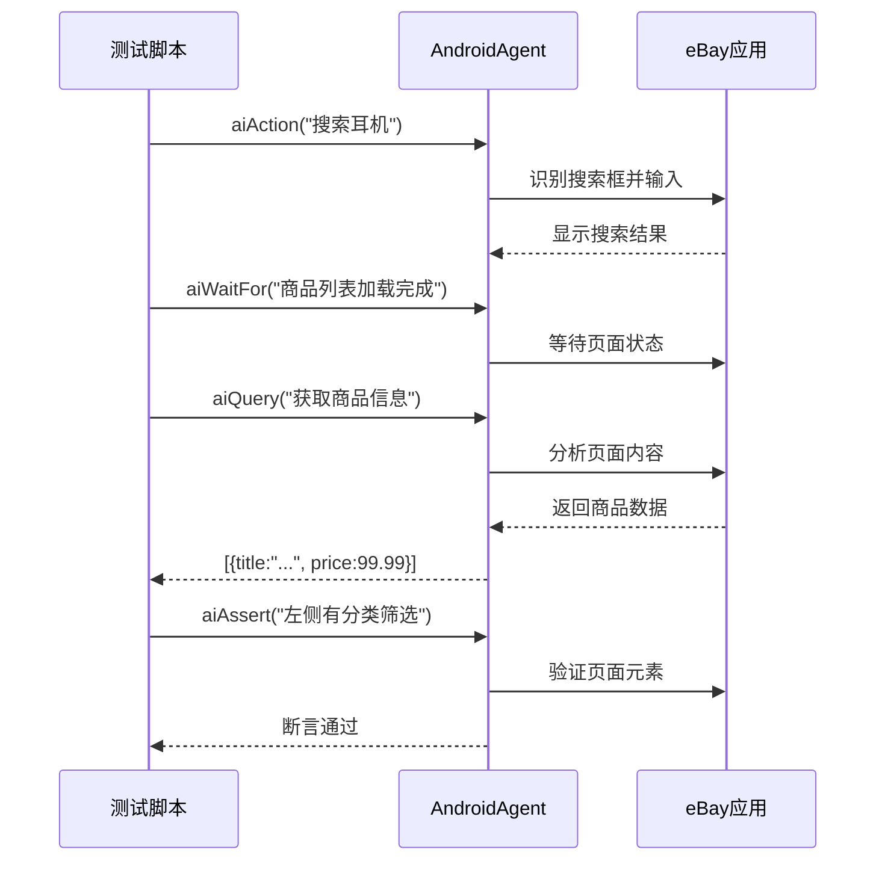

### 复杂场景处理

```javascript
// 多步骤自动化示例
await agent.aiAction('打开天气应用');
await agent.aiAction('点击左上角加号，进入搜索页面，搜索"杭州"');
await agent.aiAction('如果屏幕上有一天没有雨，点击安卓系统"主页"按钮返回主屏幕');
await agent.aiAction('打开地图应用，搜索"西湖"，点击搜索按钮');
await agent.aiAction('点击"路线"按钮，进入路线规划页面');
await agent.aiAction('点击"开始"按钮开始导航');
```

## 总结

### 核心创新点

1. **视觉优先**：摆脱了传统基于控件树的限制
2. **AI集成**：自然语言交互，降低自动化门槛
3. **跨平台统一**：一套API适配多个平台
4. **性能优化**：YADB等工具提升执行效率
5. **智能适应**：AI理解能力应对界面变化

### 技术影响

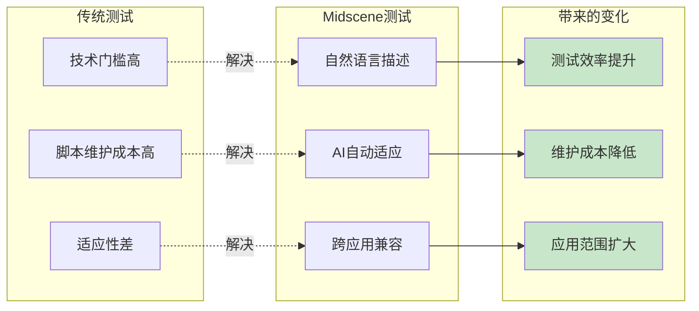

Midscene.js 代表了UI自动化测试的一个重要发展方向，通过AI和视觉技术的结合，为自动化测试带来了新的可能性。其在Android平台上的实现充分展现了这种新范式的优势和潜力。

---

*本文档基于 Midscene.js v0.30.6 源码分析编写*
