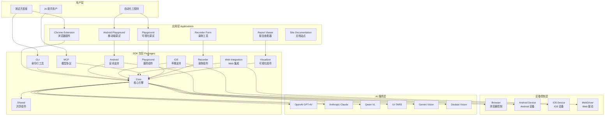
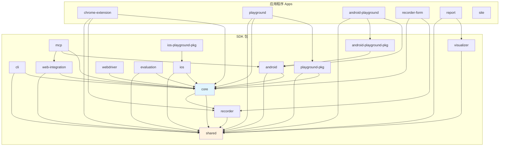
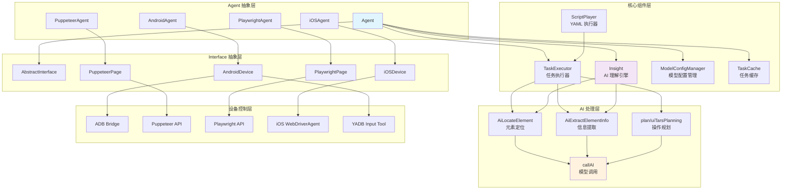
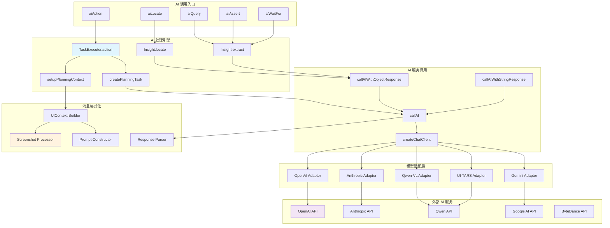
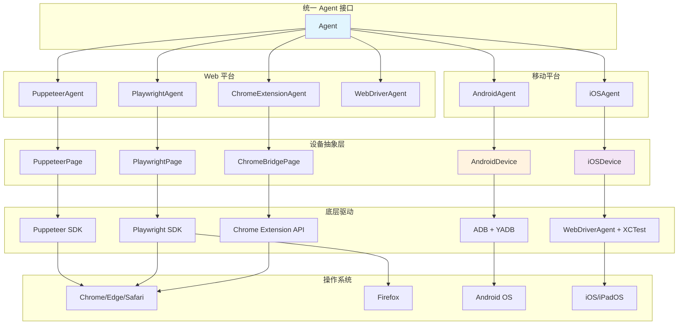
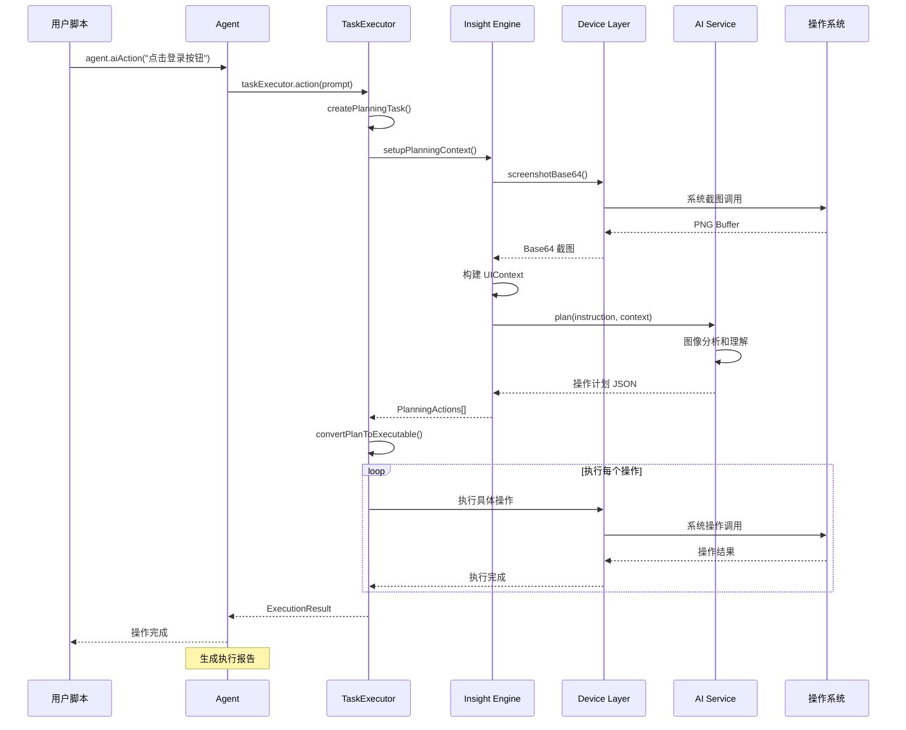
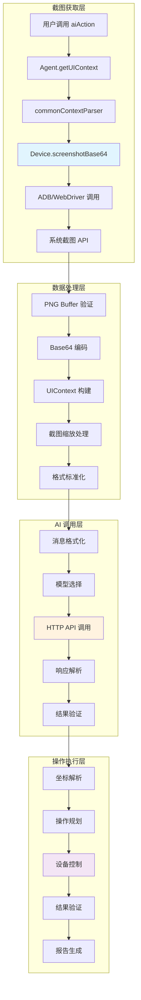
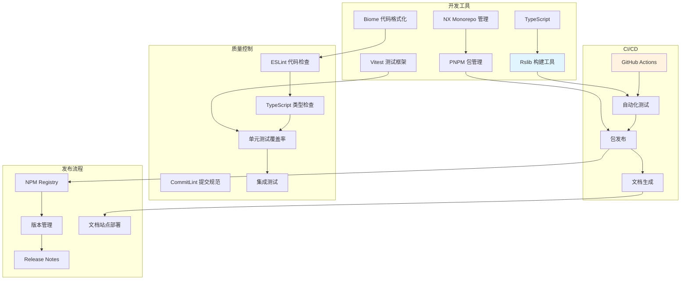

# Midscene.js 完整项目架构分析

## 🏗️ 项目整体架构概览

## 📦 包结构与依赖关系

### 核心包依赖图

## 🔧 核心技术架构

### Agent 架构层次

### AI 模型集成架构

## 🖥️ 平台支持架构

### 多平台设备控制

## 🔄 完整数据流架构

### 端到端执行流程

### 截图与AI处理详细流程

## 🏢 开发工具链架构

### 构建和开发环境

## 🌐 生态系统架构

### 外部集成和扩展

```mermaid
graph TB
    subgraph "Midscene 核心"
        MC[Midscene Core]
    end
    
    subgraph "官方扩展"
        E1[Chrome Extension]
        E2[Playground UI]
        E3[MCP Protocol]
        E4[CLI Tools]
    end
    
    subgraph "社区扩展"
        CE1[midscene-ios<br/>社区iOS支持]
        CE2[Midscene-Python<br/>Python SDK]  
        CE3[midscene-java<br/>Java SDK]
        CE4[其他语言绑定]
    end
    
    subgraph "外部工具集成"
        I1[Jest/Vitest]
        I2[Cypress]
        I3[Selenium]
        I4[CI/CD 系统]
        I5[IDE 插件]
    end
    
    subgraph "AI 服务生态"
        AI1[OpenAI]
        AI2[Anthropic]
        AI3[开源模型]
        AI4[企业私有模型]
    end
    
    subgraph "用户应用场景"
        U1[Web 自动化测试]
        U2[移动端测试]
        U3[RPA 业务流程]
        U4[AI 助手工具]
        U5[回归测试]
    end
    
    MC --> E1
    MC --> E2
    MC --> E3
    MC --> E4
    
    MC --> CE1
    MC --> CE2
    MC --> CE3
    MC --> CE4
    
    MC --> I1
    MC --> I2
    MC --> I3
    MC --> I4
    MC --> I5
    
    MC --> AI1
    MC --> AI2
    MC --> AI3
    MC --> AI4
    
    MC --> U1
    MC --> U2
    MC --> U3
    MC --> U4
    MC --> U5
    
    style MC fill:#e1f5fe
    style AI1 fill:#fff3e0
    style U1 fill:#f3e5f5
```

## 📊 技术栈总结

### 核心技术选型

| 层次 | 技术栈 | 说明 |
|------|--------|------|
| **语言** | TypeScript | 全栈类型安全 |
| **构建** | Rslib | 现代化构建工具 |
| **包管理** | PNPM + Monorepo | 高效依赖管理 |
| **测试** | Vitest | 快速单元测试 |
| **AI 调用** | OpenAI SDK, Anthropic SDK | 多模型支持 |
| **设备控制** | ADB, WebDriver, Puppeteer | 跨平台设备操作 |
| **服务端** | Express, Socket.IO | 轻量级服务支持 |
| **协议** | MCP, HTTP, WebSocket | 标准协议集成 |

### 关键设计模式

| 模式 | 应用场景 | 实现位置 |
|------|---------|---------|
| **抽象工厂** | 多平台 Agent 创建 | `Agent<T>` |
| **策略模式** | 不同 AI 模型适配 | `callAI()` |
| **观察者模式** | 任务执行监听 | `TaskExecutor` |
| **适配器模式** | 设备控制统一 | `AbstractInterface` |
| **建造者模式** | UIContext 构建 | `commonContextParser` |
| **单例模式** | 配置管理 | `ModelConfigManager` |

## 🎯 架构优势总结

### 核心优势

1. **📱 跨平台统一**: 一套 API 适配 Web/Android/iOS
2. **🤖 AI 原生**: 深度集成多种视觉语言模型
3. **🔧 模块化**: 清晰的分层和组件化设计
4. **⚡ 高性能**: 多层缓存和优化策略
5. **🛠️ 可扩展**: 插件化架构支持自定义扩展
6. **🎨 开发友好**: 完整的工具链和调试支持

### 技术创新点

- **视觉优先**: 摆脱传统 DOM/控件树依赖
- **自然语言**: 用户友好的操作描述方式  
- **智能缓存**: 多层缓存提升执行效率
- **实时调试**: 可视化 Playground 调试环境
- **标准协议**: MCP 协议支持 AI 助手集成

这个架构展现了 **Midscene.js 作为下一代 AI 驱动自动化测试框架的完整技术蓝图**，从底层设备控制到上层 AI 集成，形成了一个功能完整、技术先进的自动化测试生态系统。
