# AI+UI自动化测试技术设计文档

## 版本信息
- **文档版本**: v1.0
- **创建日期**: 2025年11月2日
- **作者**: 系统架构组
- **审核**: 待定

---

## 1. Overview

### 1.1 Background
随着移动应用的快速迭代和复杂度提升，传统的UI自动化测试方案面临越来越多的挑战。在SDK集成、多版本适配、快速迭代的环境下，传统基于元素ID和XPath的自动化测试维护成本居高不下，测试脚本的稳定性和可维护性成为瓶颈。

#### 1.1.1 Status Quo of Current Technique

##### 1.1.1.1 The current state of the art of the program

当前移动应用UI自动化测试主要采用基于Appium框架的传统方案：

**技术栈现状**:
- **Android**: 基于UIAutomator2驱动，通过XPath/ID定位元素
- **iOS**: 基于XCUITest驱动，依赖Accessibility标识符
- **跨平台**: 维护Android和iOS双套测试脚本
- **元素定位**: 完全依赖View ID、Class Name、XPath等固定属性

**当前测试流程**:
```
需求分析 → 页面结构分析 → 编写定位脚本 → 调试执行 → 维护更新
```

##### 1.1.1.2 Current technology industry realization scheme

**业界主流方案对比**:

| 方案类型 | 代表产品 | 技术特点 | 市场占有率 |
|---------|----------|----------|------------|
| 传统脚本化 | Appium, Selenium | 基于元素属性定位 | 70% |
| 视觉识别 | Airtest, SikuliX | 基于图像模板匹配 | 15% |
| AI增强 | Testim, Mabl | 机器学习辅助定位 | 10% |
| 云端服务 | BrowserStack, Sauce Labs | 设备云+传统脚本 | 5% |

#### 1.1.2 Shortcoming of Current Technique

**核心痛点分析**:

1. **元素定位脆弱性**
   - 依赖固定View ID，UI改版后大量脚本失效
   - 动态生成元素难以稳定定位
   - XPath路径冗长且易变化
     
```mermaid
graph TD
    A[传统UI测试] --> B[依赖固定属性]
    B --> C[View ID]
    B --> D[XPath]
    B --> E[Class Name]
    C --> F[UI改版影响]
    D --> G[动态元素定位困难]
    E --> H[维护成本高]
```

**传统问题点**：

| 问题类型 | 影响程度 | 维护成本 | 发生频率 |
|---------|---------|---------|---------|
| 元素定位失效 | 高 | 高 | 经常 |
| 脚本维护困难 | 高 | 高 | 经常 |
| 新功能适配 | 中 | 高 | 经常 |
| 跨平台兼容 | 中 | 中 | 偶尔 |
| SDK集成测试 | 高 | 高 | 偶尔 |

2. **维护成本居高不下**
   - 每次UI更新需要修改测试脚本
   - 新功能开发需要同步编写测试代码
   - 跨平台兼容性差，需要维护双套脚本

3. **SDK集成测试困难**
   - SDK内部页面结构对宿主应用不透明
   - 无法获取第三方组件的精确定位信息
   - 跨应用交互测试复杂度高

4. **测试覆盖率受限**
   - 复杂交互场景编写困难
   - 异常处理分支测试不充分
   - 回归测试执行效率低
  

#### 1.1.3 Optimization

**AI+UI自动化创新方案**:
- **语义理解**: 使用自然语言描述替代技术属性定位
- **视觉智能**: 多模态AI模型理解屏幕内容
- **混合策略**: 结构化数据+视觉识别相结合
- **自适应执行**: 智能适应UI变更和异常情况

### 1.2 References

- [Midscene.js Official Documentation](https://midscenejs.com/)
- [Mobile-MCP GitHub Repository](https://github.com/mobile-next/mobile-mcp)
- [Gemini-2.5-Pro API Documentation](https://ai.google.dev/docs)
- [GPT-4.0 API Reference](https://platform.openai.com/docs)
- [Appium Documentation](https://appium.io/docs)

---

## 2. Outline Design

### 2.1 Overall Design

#### 2.1.1 系统总体架构 (层级化双模式AI自动化测试架构)

```mermaid
graph TB
    %% ===== 第1层：用户交互层 =====
    subgraph "Layer 1: 用户交互层 - User Interface Layer"
        subgraph "开发模式入口"
            UI1[Cursor IDE<br/>🎯 开发者交互界面<br/>集成MCP Plugin]
            UI2[模型配置器<br/>⚙️ AI模型选择配置]
        end
        subgraph "回归模式入口"
            UI3[CLI测试脚本<br/>📋 批量回归测试入口]
        end
    end
    
    %% ===== 第2层：业务应用层 =====
    subgraph "Layer 2: 业务应用层 - Business Application Layer"
        subgraph "开发阶段业务逻辑"
            APP1[Mobile-MCP Server<br/>📡 MCP协议处理器]
            APP2[AI模型调度器<br/>🧠 智能模型选择]
            APP3[指令解析引擎<br/>📝 自然语言理解]
        end
        subgraph "回归阶段业务逻辑"
            APP4[扩展Midscene框架<br/>🚀 批量测试执行器]
            APP5[UI树结构引擎<br/>🌳 Mobile-MCP UI树解析]
            APP6[混合定位引擎<br/>🎯 结构化+视觉定位]
            APP7[多模态分析器<br/>👁️ 融合AI分析]
        end
    end
    
    %% ===== 第3层：AI服务层 =====
    subgraph "Layer 3: AI服务层 - AI Service Layer"
        AI1[公司Gemini-2.5-Pro<br/>👁️ 视觉理解模型]
        AI2[公司GPT-4.0<br/>💬 自然语言处理]
        AI3[模型适配器<br/>🔄 统一API接口]
    end
    
    %% ===== 第4层：设备操作层 =====
    subgraph "Layer 4: 设备操作层 - Device Operation Layer"
        DEV1[Android操作器<br/>🤖 ADB + UIAutomator]
        DEV2[iOS操作器<br/>🍎 WebDriverAgent + XCTest]
        DEV3[设备状态监控<br/>📊 实时状态管理]
        DEV4[UI树提取器<br/>🌲 跨平台UI结构提取]
    end
    
    %% ===== 第5层：设备驱动层 =====
    subgraph "Layer 5: 设备驱动层 - Device Driver Layer"
        DRV1[ADB服务<br/>Android设备通信]
        DRV2[WebDriverAgent<br/>iOS设备通信]
    end
    
    %% ===== 第6层：设备硬件层 =====
    subgraph "Layer 6: 设备硬件层 - Device Hardware Layer"
        HW1[Android设备/模拟器<br/>📱 Android测试设备]
        HW2[iOS设备/模拟器<br/>📱 iOS测试设备]
    end
    
    %% ===== 第7层：数据存储层 =====
    subgraph "Layer 7: 数据存储层 - Data Storage Layer"
        STORE1[测试结果存储<br/>📋 执行结果和截图]
        STORE2[配置文件管理<br/>⚙️ 系统配置]
        STORE3[缓存文件系统<br/>💾 AI分析结果缓存]
    end
    
    %% ===== 层间连接关系 =====
    
    %% Layer 1 → Layer 2 (用户交互层 → 业务应用层)
    UI1 --> APP1
    UI1 --> APP2
    UI2 --> APP2
    UI3 --> APP4
    
    %% Layer 2内部连接
    APP1 --> APP3
    APP2 --> APP3
    APP4 --> APP5
    APP4 --> APP6
    APP5 --> APP6
    APP6 --> APP7
    
    %% Layer 2 → Layer 3 (业务应用层 → AI服务层)
    APP2 --> AI3
    APP7 --> AI1
    APP7 --> AI2
    AI3 --> AI1
    AI3 --> AI2
    
    %% Layer 2 → Layer 4 (业务应用层 → 设备操作层)
    APP3 --> DEV1
    APP3 --> DEV2
    APP3 --> DEV3
    APP6 --> DEV1
    APP6 --> DEV2
    APP6 --> DEV4
    
    %% Layer 4 → Layer 5 (设备操作层 → 设备驱动层)
    DEV1 --> DRV1
    DEV2 --> DRV2
    DEV3 --> DRV1
    DEV3 --> DRV2
    DEV4 --> DRV1
    DEV4 --> DRV2
    
    %% Layer 5 → Layer 6 (设备驱动层 → 设备硬件层)
    DRV1 --> HW1
    DRV2 --> HW2
    
    %% Layer 2,4 → Layer 7 (业务应用层、设备操作层 → 数据存储层)
    APP3 --> STORE1
    APP7 --> STORE3
    UI2 --> STORE2
    APP4 --> STORE2
    DEV3 --> STORE1
    
    %% ===== 层级样式定义 =====
    
    %% Layer 1 - 用户交互层 (蓝色系)
    style UI1 fill:#e3f2fd,stroke:#1976d2,stroke-width:2px
    style UI2 fill:#e8f5e8,stroke:#388e3c,stroke-width:2px  
    style UI3 fill:#fff3e0,stroke:#f57c00,stroke-width:2px
    
    %% Layer 2 - 业务应用层 (绿色系)
    style APP1 fill:#e8f5e8,stroke:#4caf50,stroke-width:2px
    style APP2 fill:#e8f5e8,stroke:#4caf50,stroke-width:2px
    style APP3 fill:#e8f5e8,stroke:#4caf50,stroke-width:2px
    style APP4 fill:#f3e5f5,stroke:#9c27b0,stroke-width:2px
    style APP5 fill:#f3e5f5,stroke:#9c27b0,stroke-width:2px
    style APP6 fill:#f3e5f5,stroke:#9c27b0,stroke-width:2px
    style APP7 fill:#f3e5f5,stroke:#9c27b0,stroke-width:2px
    
    %% Layer 3 - AI服务层 (橙色系)
    style AI1 fill:#fff3e0,stroke:#ff9800,stroke-width:2px
    style AI2 fill:#e8f5e8,stroke:#4caf50,stroke-width:2px
    style AI3 fill:#fce4ec,stroke:#e91e63,stroke-width:2px
    
    %% Layer 4 - 设备操作层 (紫色系)
    style DEV1 fill:#f3e5f5,stroke:#673ab7,stroke-width:2px
    style DEV2 fill:#fce4ec,stroke:#e91e63,stroke-width:2px
    style DEV3 fill:#e1f5fe,stroke:#03a9f4,stroke-width:2px
    style DEV4 fill:#e8f5e8,stroke:#4caf50,stroke-width:2px
    
    %% Layer 5 - 设备驱动层 (深色系)
    style DRV1 fill:#ede7f6,stroke:#673ab7,stroke-width:2px
    style DRV2 fill:#fff8e1,stroke:#ffc107,stroke-width:2px
    
    %% Layer 6 - 设备硬件层 (灰色系)
    style HW1 fill:#f5f5f5,stroke:#616161,stroke-width:2px
    style HW2 fill:#f5f5f5,stroke:#616161,stroke-width:2px
    
    %% Layer 7 - 数据存储层 (蓝灰色系)
    style STORE1 fill:#eceff1,stroke:#607d8b,stroke-width:2px
    style STORE2 fill:#eceff1,stroke:#607d8b,stroke-width:2px
    style STORE3 fill:#eceff1,stroke:#607d8b,stroke-width:2px
```

##### **🏗️ 层级化架构设计说明**

**📊 架构层级职责分工**:

| 层级 | 名称 | 核心职责 | 主要组件 | 颜色标识 |
|------|------|----------|----------|----------|
| **Layer 1** | 用户交互层 | 用户入口，模式选择 | Cursor IDE、CLI脚本、模型配置器 | 🔵 蓝色系 |
| **Layer 2** | 业务应用层 | 核心业务逻辑处理 | Mobile-MCP Server、扩展Midscene框架 | 🟢 绿/紫色系 |
| **Layer 3** | AI服务层 | AI模型调用和管理 | 公司Gemini-2.5-Pro、GPT-4.0、模型适配器 | 🟠 橙色系 |
| **Layer 4** | 设备操作层 | 跨平台设备操作抽象 | Android/iOS操作器、状态监控、UI树提取 | 🟣 紫色系 |
| **Layer 5** | 设备驱动层 | 底层设备驱动服务 | ADB服务、WebDriverAgent | 🟤 深色系 |
| **Layer 6** | 设备硬件层 | 物理/虚拟设备 | Android/iOS设备、模拟器 | ⚫ 灰色系 |
| **Layer 7** | 数据存储层 | 数据持久化和缓存 | 测试结果、配置文件、缓存系统 | 🔘 蓝灰色系 |

**🎯 层级化设计优势**:

1. **📋 职责清晰**: 每一层都有明确的职责边界，避免功能耦合
2. **🔄 数据流向清晰**: 自顶向下的数据流，层间交互规范化
3. **🔧 易于维护**: 层级独立，单层修改不影响其他层
4. **📈 可扩展性强**: 可以在任何层级扩展功能，不破坏整体架构
5. **🎨 视觉分明**: 不同颜色标识不同层级，一目了然

**🌊 数据流向说明**:

```mermaid
graph LR
    A[用户指令] --> B[业务处理] --> C[AI分析] --> D[设备操作] --> E[驱动执行] --> F[硬件响应] --> G[结果存储]
    
    style A fill:#e3f2fd
    style B fill:#e8f5e8  
    style C fill:#fff3e0
    style D fill:#f3e5f5
    style E fill:#ede7f6
    style F fill:#f5f5f5
    style G fill:#eceff1
```

**🔀 双模式流程对比**:

| 执行阶段 | 开发模式流程 | 回归模式流程 |
|---------|-------------|-------------|
| **入口层** | Cursor IDE → 模型配置器 | CLI脚本 |
| **业务层** | Mobile-MCP Server → AI调度器 → 指令解析 | 扩展Midscene → UI树引擎 → 混合定位 → 多模态分析 |
| **AI层** | 根据Cursor配置动态选择模型 | 直接调用公司Gemini+GPT |
| **操作层** | 实时设备操作 + 状态监控 | 批量设备操作 + UI树提取 |
| **存储层** | 实时结果存储 | 批量结果存储 + 智能缓存 |

**🏗️ 层级化架构核心特征**:

### **垂直分层特征**:
```
Layer 1: 用户交互层    🔵 用户友好的交互界面
    ↓
Layer 2: 业务应用层    🟢 核心业务逻辑处理  
    ↓
Layer 3: AI服务层      🟠 智能分析和决策
    ↓  
Layer 4: 设备操作层    🟣 跨平台设备抽象
    ↓
Layer 5: 设备驱动层    🟤 底层驱动服务
    ↓
Layer 6: 设备硬件层    ⚫ 物理设备资源
    ↓
Layer 7: 数据存储层    🔘 持久化存储
```

### **水平分模式特征**:
```
开发模式 (左侧)                    回归模式 (右侧)
Cursor IDE                    ←→   CLI脚本
Mobile-MCP Server            ←→   扩展Midscene框架
实时交互                     ←→   批量执行
即时反馈                     ←→   智能缓存
```

### **层间交互原则**:

1. **📤 单向依赖**: 上层依赖下层，下层不依赖上层
2. **🔗 接口标准化**: 每层提供标准化接口，降低耦合
3. **⚡ 异步通信**: 支持异步调用，提高系统响应性
4. **🔄 错误传播**: 错误信息逐层向上传播，便于定位
5. **💾 状态隔离**: 每层维护独立状态，避免状态污染

### **架构优化亮点**:

#### **🎯 相比原架构的改进**:

| 改进项 | 原架构问题 | 优化后效果 |
|-------|-----------|-----------|
| **层级混乱** | 组件分布杂乱，关系复杂 | **7层清晰分层，职责明确** |
| **数据流模糊** | 数据流向不清晰 | **自顶向下数据流，流向清楚** |
| **耦合度高** | 组件间耦合严重 | **层间接口标准化，低耦合** |
| **维护困难** | 修改影响面大 | **层级独立，局部修改** |
| **视觉混乱** | 缺乏视觉层次 | **颜色编码，层次分明** |

#### **🚀 架构扩展性**:

**水平扩展能力**:
- **Layer 1**: 可添加Web界面、API接口等新的用户入口
- **Layer 2**: 可扩展新的测试框架或业务逻辑
- **Layer 3**: 可集成更多AI模型服务 (如Claude、LLaMA等)
- **Layer 4**: 可支持更多平台 (如Web、桌面应用)

**垂直扩展能力**:
- 可在任意层间插入新的中间层
- 支持层内组件的水平扩展
- 支持跨层的功能增强

#### 2.1.2 双模式架构核心组件详细说明

**🎯 双模式架构核心理念**:
- **开发阶段**: Mobile-MCP Server + Cursor，灵活交互，即时反馈
- **回归阶段**: 扩展Midscene框架，自动化批量执行，集成公司AI模型
- **统一底层**: 两个阶段共享设备操作层和AI模型服务
- **无后台服务**: 保持轻量化，无需复杂的基础设施部署

---

### **🔧 开发阶段组件详细说明 (Mobile-MCP Server + Cursor)**

##### **Cursor IDE环境**

**🎯 Cursor IDE - 开发者交互界面**
- **核心功能**: 开发者主要工作环境，支持自然语言测试指令
- **使用场景**: 开发过程中的即时测试、问题调试、功能验证
- **技术实现**:
  ```typescript
  // Cursor中的典型交互
  // 开发者输入: "打开登录页面，输入test@example.com和password123，然后点击登录"
  // 通过MCP Plugin实时发送到Mobile-MCP Server处理
  ```

**🔌 MCP Plugin - MCP协议插件**
- **核心功能**: 连接Cursor和Mobile-MCP Server的桥梁
- **技术特点**: 
  - 实时双向通信
  - 支持流式结果返回
  - 自动重连和错误恢复
- **配置示例**:
  ```json
  {
    "mcp_server": {
      "url": "ws://localhost:3000/mcp",
      "timeout": 30000,
      "retry_policy": {
        "max_attempts": 3,
        "backoff_ms": 1000
      }
    }
  }
  ```

**⚙️ 模型配置器 - 在Cursor中选择AI模型**
- **核心功能**: **开发者在Cursor中灵活控制使用哪个AI模型**
- **配置策略**: 
  - 任务类型驱动：视觉任务 → Gemini-2.5-Pro，文本任务 → GPT-4.0
  - 成本优化：根据复杂度选择合适模型
  - 实验模式：支持A/B测试不同模型效果
- **Cursor配置界面**:
  ```yaml
  # 在Cursor的设置中配置
  ai_automation:
    default_visual_model: "company-gemini-2.5-pro"
    default_text_model: "company-gpt-4.0"
    task_routing:
      screenshot_analysis: "gemini-2.5-pro"
      instruction_parsing: "gpt-4.0"
      element_location: "hybrid"  # 使用两个模型结果融合
    cost_optimization: true
    experimental_mode: false
  ```

##### **Mobile-MCP Server**

**📡 MCP协议处理器 - 处理Cursor请求**
- **核心功能**: 接收、解析和分发来自Cursor的MCP请求
- **处理流程**: MCP请求验证 → 指令解析 → 任务分解 → 执行调度
- **技术实现**:
  ```typescript
  export class MCPProtocolHandler {
    async handleTestRequest(request: MCPTestRequest): Promise<MCPResponse> {
      // 1. 验证MCP协议格式
      this.validateMCPRequest(request);
      
      // 2. 提取测试指令
      const instruction = request.params.instruction;
      const context = request.params.context;
      
      // 3. 调度到AI模型处理
      const aiResult = await this.aiScheduler.processInstruction(
        instruction, 
        context,
        request.modelPreferences // Cursor传递的模型偏好
      );
      
      // 4. 执行设备操作
      const deviceResult = await this.deviceCoordinator.executeActions(aiResult.actions);
      
      return this.formatMCPResponse(deviceResult);
    }
  }
  ```

**🧠 AI模型调度器 - 根据Cursor配置调用AI**
- **核心功能**: **根据Cursor传递的模型配置，智能调度AI模型**
- **调度逻辑**:
  ```typescript
  export class AIModelScheduler {
    async processInstruction(
      instruction: string, 
      context: TestContext,
      modelPreferences: ModelPreferences  // 来自Cursor的配置
    ): Promise<AIProcessResult> {
      
      // 1. 分析任务类型
      const taskType = await this.analyzeTaskType(instruction);
      
      // 2. 根据Cursor偏好选择模型
      let selectedModel: AIModel;
      if (taskType.requiresVision) {
        selectedModel = modelPreferences.visualModel || this.defaultGeminiModel;
      } else if (taskType.requiresNLP) {
        selectedModel = modelPreferences.textModel || this.defaultGPTModel;
      } else {
        // 混合任务，可能需要多个模型协作
        return await this.hybridProcessing(instruction, context, modelPreferences);
      }
      
      // 3. 调用选定的模型
      return await this.callAIModel(selectedModel, instruction, context);
    }
  }
  ```

---

### **🚀 回归阶段组件详细说明 (扩展Midscene框架)**

##### **扩展Midscene框架核心组件**

**🌳 UI树结构引擎 - 集成Mobile-MCP的UI树解析**
- **改造重点**: **将Mobile-MCP项目的UI树结构集成到Midscene框架中**
- **核心改进**: 
  - 统一Android/iOS的UI树格式
  - 增加语义化元素描述
  - 支持动态UI树缓存
- **技术实现**:
  ```typescript
  // 扩展后的UI树结构（融合Mobile-MCP设计）
  export interface ExtendedUITree {
    // Mobile-MCP风格的基础结构
    platform: 'android' | 'ios';
    timestamp: number;
    screen_bounds: Rectangle;
    orientation: 'portrait' | 'landscape';
    
    // 扩展的语义化信息
    semantic_context: {
      screen_type?: 'login' | 'home' | 'list' | 'form' | 'dialog';
      primary_actions?: string[];
      key_elements?: string[];
    };
    
    // 根节点
    root: ExtendedUINode;
  }
  
  export interface ExtendedUINode {
    // Mobile-MCP兼容属性
    id?: string;
    className: string;
    text?: string;
    contentDescription?: string;
    bounds: Rectangle;
    visible: boolean;
    enabled: boolean;
    clickable: boolean;
    focusable: boolean;
    
    // Midscene视觉扩展属性
    visual_signature?: string;      // 视觉特征签名
    ai_confidence?: number;         // AI识别置信度
    semantic_labels?: string[];     // 语义标签
    
    // 子节点
    children: ExtendedUINode[];
  }
  
  export class UITreeEngine {
    async extractUITree(deviceId: string, platform: 'android' | 'ios'): Promise<ExtendedUITree> {
      // 1. 获取原始UI数据
      const rawUIData = platform === 'android' 
        ? await this.getAndroidUIAutomatorDump(deviceId)
        : await this.getIOSXCTestDump(deviceId);
      
      // 2. 转换为Mobile-MCP风格的统一格式
      const unifiedTree = await this.convertToUnifiedFormat(rawUIData, platform);
      
      // 3. 增加语义化信息
      const enhancedTree = await this.addSemanticContext(unifiedTree);
      
      return enhancedTree;
    }
  }
  ```

**🎯 混合定位引擎 - 结构化+视觉混合定位**
- **改造重点**: 结合Mobile-MCP的结构化定位优势和Midscene的视觉定位能力
- **定位策略**:
  1. **优先结构化定位** - 使用UI树中的准确信息
  2. **视觉定位补强** - 当结构化信息不足时，使用AI视觉理解
  3. **置信度融合** - 综合两种方式的置信度，选择最佳结果
- **技术实现**:
  ```typescript
  export class HybridLocationEngine {
    async locateElement(
      instruction: string, 
      uiTree: ExtendedUITree, 
      screenshot: Buffer
    ): Promise<ElementLocation> {
      
      // 1. 尝试结构化定位 (Mobile-MCP风格)
      const structuralResults = await this.structuralLocate(instruction, uiTree);
      
      // 2. 尝试视觉定位 (Midscene风格)
      const visualResults = await this.visualLocate(instruction, screenshot);
      
      // 3. 混合决策
      return this.hybridDecision(structuralResults, visualResults, {
        structural_weight: 0.7,  // 结构化定位权重更高
        visual_weight: 0.3,      // 视觉定位作为补充
        confidence_threshold: 0.8 // 置信度阈值
      });
    }
    
    private async structuralLocate(instruction: string, uiTree: ExtendedUITree): Promise<StructuralLocationResult[]> {
      // 基于UI树的结构化定位逻辑
      // 使用文本匹配、ID匹配、类名匹配等
      return this.findElementsByStructure(instruction, uiTree);
    }
    
    private async visualLocate(instruction: string, screenshot: Buffer): Promise<VisualLocationResult[]> {
      // 基于AI视觉的定位逻辑
      // 调用公司Gemini-2.5-Pro进行视觉理解
      return await this.geminiVisionAPI.locateElement(instruction, screenshot);
    }
  }
  ```

**👁️ 多模态分析器 - 集成公司AI模型**
- **改造重点**: **集成公司的Gemini-2.5-Pro和GPT-4.0，替代原有AI调用**
- **模型集成策略**:
  ```typescript
  export class MultimodalAnalyzer {
    constructor(
      private companyGeminiAPI: CompanyGeminiAPI,    // 公司内部Gemini-2.5-Pro
      private companyGPTAPI: CompanyGPTAPI           // 公司内部GPT-4.0
    ) {}
    
    async analyzeTestScenario(
      instruction: string,
      uiTree: ExtendedUITree,
      screenshot: Buffer,
      context: TestContext
    ): Promise<MultimodalAnalysisResult> {
      
      // 1. GPT-4.0解析测试指令和规划步骤
      const instructionAnalysis = await this.companyGPTAPI.analyzeInstruction({
        instruction,
        context: {
          screen_type: uiTree.semantic_context.screen_type,
          available_elements: this.extractElementSummary(uiTree)
        }
      });
      
      // 2. Gemini-2.5-Pro进行视觉理解和验证
      const visualAnalysis = await this.companyGeminiAPI.analyzeScreenshot({
        image: screenshot,
        ui_structure: uiTree,
        task_context: instructionAnalysis.planned_actions
      });
      
      // 3. 多模态融合决策
      return this.fuseAnalysisResults(instructionAnalysis, visualAnalysis);
    }
  }
  ```

**🔄 自动化测试执行器 - 批量回归测试**
- **核心功能**: 专门为回归测试设计的批量执行引擎
- **执行特点**:
  ```typescript
  export class AutomatedTestExecutor {
    async executeBatchTests(
      testSuiteConfig: TestSuiteConfig,
      devices: DevicePool[]
    ): Promise<BatchExecutionResult> {
      
      // 1. 加载测试用例
      const testCases = await this.loadTestCases(testSuiteConfig.testCasePatterns);
      
      // 2. 设备分配和并行执行
      const deviceGroups = this.allocateDevicesToTests(testCases, devices);
      
      // 3. 并行执行测试
      const executionPromises = deviceGroups.map(async (group) => {
        return await this.executeTestGroup(group.tests, group.device);
      });
      
      // 4. 等待所有测试完成并汇总结果
      const results = await Promise.allSettled(executionPromises);
      
      return this.aggregateResults(results);
    }
  }
  ```

##### **设备驱动层组件说明 (新增)**

**🤖 ADB服务 - Android设备通信**
- **作用**: Android Debug Bridge，Android设备的核心通信桥梁
- **必要性**: **绝对必要**，是Android自动化的基础
- **功能**:
  ```bash
  # 设备连接和管理
  adb devices
  adb connect 192.168.1.100:5555
  
  # UI操作命令
  adb shell input tap 500 1000
  adb shell input text "hello world"
  adb shell input swipe 100 1000 100 500
  
  # UI结构获取
  adb shell uiautomator dump
  adb shell screencap -p /sdcard/screen.png
  ```

**🍎 WebDriverAgent - iOS设备通信**
- **作用**: iOS设备自动化的WebDriver实现
- **必要性**: **iOS自动化必需**，苹果官方XCTest框架的封装
- **功能**:
  ```javascript
  // iOS设备操作
  await driver.tap(500, 1000);
  await driver.setValue('textField', 'hello world');
  await driver.swipe(100, 1000, 100, 500);
  
  // 获取页面结构
  const source = await driver.getPageSource();
  const screenshot = await driver.getScreenshot();
  ```

##### **本地存储层组件说明**

**📁 本地文件存储 - 测试结果和截图**
- **作用**: 存储测试执行结果、截图、视频等文件
- **存储路径**: `./test-results/`, `./screenshots/`, `./logs/`
- **文件格式**: JSON(结果)、PNG(截图)、MP4(录屏)、TXT(日志)

**⚙️ 配置文件 - YAML/JSON配置**
- **作用**: 管理测试配置、设备配置、AI API配置等
- **配置文件**:
  ```yaml
  # config.yaml
  ai_apis:
    gemini:
      api_key: ${GEMINI_API_KEY}
      model: "gemini-2.5-pro"
    openai:
      api_key: ${OPENAI_API_KEY}
      model: "gpt-4.0"
  
  devices:
    android:
      - device_id: "emulator-5554"
        type: "emulator"
    ios:
      - device_id: "auto"
        type: "simulator"
  
  test_config:
    timeout: 30000
    retry_count: 3
    screenshot_on_failure: true
  ```

### **📊 双模式使用场景对比**

| 阶段 | 使用场景 | 技术方案 | 用户群体 | 核心优势 | 部署要求 |
|------|----------|----------|----------|----------|----------|
| **🔧 开发阶段** | 即时测试验证 | Mobile-MCP Server + Cursor | 开发工程师 | 交互灵活，即时反馈 | 启动Mobile-MCP Server |
| **🚀 回归阶段** | 自动化回归测试 | 扩展Midscene框架 + CLI | 测试团队/CI系统 | 批量执行，智能缓存 | 配置扩展框架 |

### **🔄 双模式完整工作流程**

```mermaid
sequenceDiagram
    participant Developer as 开发工程师
    participant Cursor as Cursor IDE
    participant MCPServer as Mobile-MCP Server
    participant CLI as CLI测试脚本
    participant ExtMidscene as 扩展Midscene框架
    participant CompanyGemini as 公司Gemini-2.5-Pro
    participant CompanyGPT as 公司GPT-4.0
    participant UITree as UI树引擎
    participant DeviceOp as 统一设备操作层
    participant Devices as 移动设备
    participant LocalStorage as 本地存储
    
    rect rgb(230, 240, 250)
        Note over Developer, LocalStorage: 🔧 开发阶段 - Mobile-MCP Server + Cursor
        
        Developer->>Cursor: "测试登录功能，用户名test@example.com"
        
        Note over Cursor: Cursor中配置模型选择
        Cursor->>MCPServer: MCP协议 + 模型配置偏好
        
        MCPServer->>CompanyGPT: 解析自然语言指令
        CompanyGPT-->>MCPServer: 返回结构化任务计划
        
        MCPServer->>DeviceOp: 获取当前UI状态
        DeviceOp->>Devices: 获取截图 + UI结构
        Devices-->>DeviceOp: 返回UI数据
        
        MCPServer->>CompanyGemini: 视觉分析 + 元素定位
        CompanyGemini-->>MCPServer: 返回定位结果
        
        MCPServer->>DeviceOp: 执行操作序列
        DeviceOp->>Devices: 点击、输入、验证等操作
        Devices-->>DeviceOp: 操作执行结果
        
        MCPServer->>LocalStorage: 保存执行记录
        MCPServer-->>Cursor: 实时返回执行结果
        Cursor-->>Developer: 显示测试结果和截图
    end
    
    rect rgb(240, 250, 230)
        Note over Developer, LocalStorage: 🚀 回归阶段 - 扩展Midscene框架
        
        Developer->>CLI: 触发批量回归测试
        CLI->>ExtMidscene: 加载测试用例配置
        
        loop 批量测试执行
            ExtMidscene->>UITree: 获取Mobile-MCP风格UI树
            UITree->>DeviceOp: 提取设备UI结构
            DeviceOp->>Devices: 获取UI dump + 截图
            Devices-->>UITree: 返回标准化UI树
            
            ExtMidscene->>CompanyGPT: 解析测试指令
            ExtMidscene->>CompanyGemini: 视觉理解 + 混合定位
            
            par 多模态并行分析
                CompanyGPT-->>ExtMidscene: 指令解析结果
            and
                CompanyGemini-->>ExtMidscene: 视觉分析结果
            end
            
            ExtMidscene->>ExtMidscene: 混合定位决策
            ExtMidscene->>DeviceOp: 执行测试步骤
            DeviceOp->>Devices: 批量设备操作
            Devices-->>ExtMidscene: 返回执行结果
            
            ExtMidscene->>LocalStorage: 缓存AI分析结果
        end
        
        ExtMidscene->>LocalStorage: 保存完整测试报告
        ExtMidscene-->>CLI: 返回批量测试结果
        CLI-->>Developer: 生成汇总报告
    end
```

### **🎯 双模式架构优势总结**

#### **🔧 开发阶段优势 (Mobile-MCP Server + Cursor)**

**✅ 开发体验优势**:
- ✅ **Cursor原生集成** - 无需切换工具，开发环境直接测试
- ✅ **实时交互反馈** - 即时查看测试执行过程和结果
- ✅ **灵活模型选择** - 开发者可在Cursor中自由配置AI模型偏好
- ✅ **快速问题定位** - 测试失败时可立即查看截图和错误信息
- ✅ **自然语言操作** - 无需编写复杂测试脚本，直接用自然语言描述

**✅ 技术架构优势**:
- ✅ **MCP协议标准化** - 使用业界标准协议，可扩展性强
- ✅ **模型配置灵活** - 支持任务类型驱动的智能模型选择
- ✅ **轻量级部署** - 只需启动Mobile-MCP Server，无复杂依赖

#### **🚀 回归阶段优势 (扩展Midscene框架)**

**✅ 自动化测试优势**:
- ✅ **批量执行能力** - 支持大规模回归测试的并行执行
- ✅ **UI树结构增强** - 集成Mobile-MCP的UI解析能力，定位更准确
- ✅ **混合定位策略** - 结构化定位 + 视觉定位，双重保障
- ✅ **智能缓存优化** - AI分析结果缓存，提高执行效率
- ✅ **企业级AI集成** - 使用公司内部Gemini-2.5-Pro和GPT-4.0

**✅ 框架改造优势**:
- ✅ **保持Midscene优势** - 继承原有视觉定位和测试能力
- ✅ **增强结构化能力** - 新增Mobile-MCP风格的UI树解析
- ✅ **公司AI模型适配** - 无缝集成公司内部AI服务
- ✅ **统一设备接口** - Android/iOS操作层统一，降低维护成本

#### **🌟 双模式协同优势**

**✅ 统一技术栈**:
- ✅ **共享设备操作层** - 两个阶段使用相同的设备驱动和操作接口
- ✅ **统一AI模型服务** - 开发和回归阶段使用相同的公司AI模型
- ✅ **一致的UI树结构** - Mobile-MCP风格的UI解析在两阶段通用
- ✅ **统一存储格式** - 测试结果和配置文件格式保持一致

**✅ 工作流整合**:
- ✅ **无缝切换** - 开发阶段验证的测试逻辑可直接用于回归测试
- ✅ **配置复用** - Cursor中的模型配置可导出用于回归测试
- ✅ **结果关联** - 开发测试和回归测试结果可统一分析
- ✅ **知识积累** - AI分析结果可在两阶段间共享和优化

#### **📊 与传统方案对比**

| 对比维度 | 传统Appium | 双模式AI自动化 |
|---------|-----------|---------------|
| **开发体验** | 需要专门IDE/工具 | Cursor原生集成，自然语言操作 |
| **元素定位** | 依赖固定ID/XPath | UI树结构 + 视觉混合定位 |
| **AI能力** | 无AI支持 | 公司级双模型 (Gemini+GPT) |
| **维护成本** | 高 (脚本易失效) | 低 (AI自适应定位) |
| **学习曲线** | 陡峭 (需要技术背景) | 平缓 (自然语言描述) |
| **跨平台支持** | 需要不同配置 | 统一接口，自动适配 |
| **批量执行** | 配置复杂 | 智能缓存，高效并行 |
| **模型选择** | 不适用 | 开发者可灵活配置 |

#### **🏆 核心竞争优势**

1. **🎯 双阶段适配** - 既满足开发阶段的灵活交互需求，又支持回归阶段的批量自动化
2. **🧠 企业AI集成** - 充分利用公司内部的Gemini和GPT模型服务  
3. **🔧 最佳实践融合** - 结合Mobile-MCP的结构化定位和Midscene的视觉能力
4. **⚡ 开发效率提升** - Cursor原生集成，自然语言操作，大幅降低测试门槛
5. **🔄 技术债务减少** - AI自适应定位，减少因UI变更导致的脚本维护工作

#### 2.1.3 双模式架构依赖关系矩阵

##### **开发阶段依赖关系 (Mobile-MCP Server + Cursor)**

| 层级 | 上级依赖 | 同级依赖 | 下级依赖 |
|------|----------|----------|----------|
| **Cursor IDE环境** | 操作系统、Node.js | MCP Plugin、模型配置器 | Mobile-MCP Server |
| **Mobile-MCP Server** | Cursor IDE环境 | MCP协议栈、AI模型调度器 | 统一设备操作层 |
| **公司AI模型服务** | 网络连接、API认证 | Gemini-2.5-Pro、GPT-4.0 | Mobile-MCP Server |
| **统一设备操作层** | Mobile-MCP Server | Android/iOS操作器、UI树提取器 | 设备驱动层 |

##### **回归阶段依赖关系 (扩展Midscene框架)**

| 层级 | 上级依赖 | 同级依赖 | 下级依赖 |
|------|----------|----------|----------|
| **CLI测试入口** | 操作系统、测试配置 | 批量执行脚本 | 扩展Midscene框架 |
| **扩展Midscene框架** | CLI测试入口 | UI树引擎、混合定位引擎、多模态分析器 | 统一设备操作层 |
| **公司AI模型服务** | 网络连接、API认证 | Gemini-2.5-Pro、GPT-4.0 | 扩展Midscene框架 |
| **统一设备操作层** | 扩展Midscene框架 | Android/iOS操作器、UI树提取器 | 设备驱动层 |

##### **共享基础设施依赖关系**

| 层级 | 上级依赖 | 同级依赖 | 下级依赖 |
|------|----------|----------|----------|
| **统一设备操作层** | 开发/回归阶段组件 | 设备状态监控、操作执行器 | 设备驱动层 |
| **设备驱动层** | 统一设备操作层 | ADB服务、WebDriverAgent | 移动设备硬件 |
| **本地存储** | 文件系统权限 | 配置管理、缓存系统 | 所有业务层 |
| **公司AI模型服务** | 企业网络、API网关 | 模型适配器、负载均衡 | 开发/回归阶段 |

##### **关键技术依赖详解**

**🔧 Midscene框架改造依赖**:
```typescript
// 核心改造依赖项
interface MidsceneExtensionDependencies {
  // Mobile-MCP UI树结构集成
  uiTreeParser: {
    mobileMCPCompatibility: "^1.0.0";
    androidUIAutomator: "^2.0.0";
    iosXCTest: "^15.0.0";
  };
  
  // 公司AI模型API适配
  companyAIModels: {
    geminiAPI: CompanyGeminiAPI;
    gptAPI: CompanyGPTAPI;
    modelAdapter: UnifiedModelAdapter;
  };
  
  // 混合定位引擎依赖
  hybridLocation: {
    structuralLocation: MobileMCPLocationEngine;
    visualLocation: MidsceneVisualEngine;
    confidenceFusion: HybridDecisionEngine;
  };
}
```

**📡 MCP协议技术栈依赖**:
```typescript  
// MCP协议相关依赖
interface MCPProtocolDependencies {
  core: {
    "@modelcontextprotocol/sdk": "^1.0.0";
    "ws": "^8.0.0";  // WebSocket通信
    "jsonrpc-lite": "^2.0.0";  // JSON-RPC协议
  };
  
  cursor: {
    "cursor-mcp-plugin": "^1.0.0";
    "cursor-ai-models-config": "^1.0.0";
  };
  
  server: {
    "mobile-mcp-server": "^1.0.0";
    "device-operation-coordinator": "^1.0.0";
  };
}
```

**🤖 公司AI模型集成依赖**:
```typescript
// 公司AI服务集成配置
interface CompanyAIIntegration {
  authentication: {
    apiGateway: string;
    authToken: string;
    rateLimiting: RateLimitConfig;
  };
  
  models: {
    gemini: {
      endpoint: "https://company-ai-gateway.internal/gemini-2.5-pro";
      capabilities: ["vision", "multimodal"];
      maxTokens: 4096;
    };
    gpt: {
      endpoint: "https://company-ai-gateway.internal/gpt-4.0"; 
      capabilities: ["text", "reasoning"];
      maxTokens: 8192;
    };
  };
  
  fallback: {
    enableFallback: true;
    fallbackOrder: ["primary", "secondary", "external"];
  };
}
```

**📱 设备驱动统一依赖**:
```typescript
// 设备驱动层统一接口
interface UnifiedDeviceDrivers {
  android: {
    adb: "android-debug-bridge@^1.0.0";
    uiautomator: "appium-uiautomator2@^2.0.0";
    deviceManager: AndroidDeviceManager;
  };
  
  ios: {
    webDriverAgent: "appium-webdriveragent@^4.0.0"; 
    xctest: "ios-xctest-framework@^15.0.0";
    deviceManager: IOSDeviceManager;
  };
  
  unified: {
    devicePool: UnifiedDevicePool;
    operationAdapter: CrossPlatformAdapter;
    stateMonitor: DeviceStateMonitor;
  };
}
```

#### 2.1.4 双模式数据流向图

```mermaid
graph LR
    subgraph "数据输入"
        A[自然语言指令]
        B[测试场景描述]
        C[设备状态信息]
    end
    
    subgraph "数据处理"
        D[指令解析]
        E[任务规划]
        F[多模态分析]
        G[策略决策]
    end
    
    subgraph "数据执行"
        H[设备操作]
        I[状态监控]
        J[结果验证]
    end
    
    subgraph "数据输出"
        K[执行结果]
        L[性能指标]
        M[错误信息]
        N[改进建议]
    end
    
    A --> D
    B --> E
    C --> F
    D --> G
    E --> G
    F --> G
    G --> H
    H --> I
    I --> J
    J --> K
    I --> L
    J --> M
    G --> N
    
    style A fill:#e1f5fe
    style K fill:#e8f5e8
    style M fill:#ffebee
    style N fill:#fff3e0
```

### 2.2 Optimization Design

#### 当前功能模块图

```mermaid
graph TD
    A[传统Appium架构] --> B[测试脚本]
    B --> C[Appium Server]
    C --> D[WebDriver协议]
    D --> E[设备驱动]
    E --> F[移动设备]
    
    style A fill:#ffcccb
    style B fill:#ffcccb
    style C fill:#ffcccb
```

**传统方案局限**:
- ❌ 脚本编写复杂，技术门槛高
- ❌ 元素定位依赖固定属性
- ❌ UI变更影响大，维护成本高
- ❌ 错误处理能力弱

#### 优化后功能模块图

```mermaid
graph TD
    A[AI+UI自动化架构] --> B[自然语言接口]
    B --> C[AI决策引擎]
    C --> D[多模态理解层]
    D --> E{智能路由}
    E --> F[结构化分析路径]
    E --> G[视觉理解路径]
    F --> H[设备操作层]
    G --> H
    H --> I[移动设备]
    
    style A fill:#90EE90
    style B fill:#90EE90
    style C fill:#90EE90
    style D fill:#90EE90
    style E fill:#FFD700
```

**优化亮点**:
- ✅ 自然语言驱动，零编程门槛
- ✅ 智能元素定位，适应UI变更
- ✅ 多层决策机制，提高成功率
- ✅ 自动错误恢复，增强鲁棒性

---

## 3. Detailed Design

### 3.1 Project Structure Design

#### 目录结构设计

```
ai-ui-automation/
├── packages/
│   ├── core/                 # 核心引擎
│   │   ├── ai-engine/        # AI决策引擎
│   │   ├── multimodal/       # 多模态理解
│   │   └── device-abstract/  # 设备抽象层
│   ├── integrations/         # 集成模块
│   │   ├── cursor-mcp/       # Cursor + Mobile-MCP
│   │   ├── midscene/         # Midscene框架集成
│   │   └── ci-cd/           # CI/CD集成
│   ├── models/              # 模型服务
│   │   ├── gemini-vision/   # Gemini视觉服务
│   │   ├── gpt-nlp/         # GPT自然语言处理
│   │   └── model-proxy/     # 模型代理服务
│   └── devices/             # 设备操作
│       ├── android/         # Android设备操作
│       ├── ios/            # iOS设备操作
│       └── common/         # 公共设备接口
├── apps/
│   ├── test-orchestrator/   # 测试编排应用
│   ├── result-analyzer/     # 结果分析应用
│   └── device-manager/      # 设备管理应用
├── configs/
│   ├── models.yml          # 模型配置
│   ├── devices.yml         # 设备配置
│   └── environments.yml    # 环境配置
└── docs/
    ├── api/               # API文档
    ├── tutorials/         # 教程文档
    └── examples/         # 示例代码
```

### 3.2 Core Component(s) Design

#### 3.2.1 Description of Core Component(s)

**AI决策引擎 (AI Decision Engine)**:
- **功能**: 接收自然语言指令，制定执行计划
- **职责**: 任务规划、策略选择、结果验证
- **特点**: 支持上下文理解、错误恢复、学习优化

**多模态理解层 (Multimodal Understanding Layer)**:
- **功能**: 融合视觉和结构化信息进行元素定位
- **职责**: 屏幕内容分析、元素识别、置信度评估
- **特点**: 支持多种AI模型、智能降级、缓存优化

**设备操作抽象层 (Device Operation Abstract Layer)**:
- **功能**: 提供统一的设备操作接口
- **职责**: 跨平台适配、操作执行、状态监控
- **特点**: 支持Android/iOS、插件化架构、异步执行

#### 3.2.2 Interface Design

##### AI决策引擎接口

```typescript
interface IAIDecisionEngine {
  /**
   * 执行自然语言指令
   * @param instruction 自然语言测试指令
   * @param context 执行上下文
   * @returns 执行结果和详细信息
   */
  executeInstruction(
    instruction: string, 
    context: ExecutionContext
  ): Promise<ExecutionResult>;
  
  /**
   * 规划执行步骤
   * @param scenario 测试场景描述
   * @returns 详细执行计划
   */
  planExecution(scenario: TestScenario): Promise<ExecutionPlan>;
  
  /**
   * 验证执行结果
   * @param expected 期望结果
   * @param actual 实际结果
   * @returns 验证结果
   */
  verifyResult(expected: string, actual: ScreenState): Promise<VerificationResult>;
}

// 使用示例
const aiEngine = new AIDecisionEngine({
  geminiApiKey: process.env.GEMINI_API_KEY,
  gptApiKey: process.env.GPT_API_KEY
});

const result = await aiEngine.executeInstruction(
  "点击登录按钮并输入用户名password123", 
  { deviceId: "emulator-5554", timeout: 30000 }
);
```

##### 多模态理解层接口

```typescript
interface IMultimodalUnderstanding {
  /**
   * 分析屏幕内容
   * @param screenshot 屏幕截图
   * @param structuredData 结构化UI数据
   * @param instruction 用户指令
   * @returns 分析结果
   */
  analyzeScreen(
    screenshot: Buffer,
    structuredData: UITree,
    instruction: string
  ): Promise<AnalysisResult>;
  
  /**
   * 定位目标元素
   * @param description 元素描述
   * @param screenData 屏幕数据
   * @returns 元素位置信息
   */
  locateElement(
    description: string,
    screenData: ScreenData
  ): Promise<ElementLocation>;
}

// 使用示例
const understanding = new MultimodalUnderstanding();
const location = await understanding.locateElement(
  "登录按钮",
  { screenshot: buffer, uiTree: tree }
);
```

##### 设备操作抽象层接口

```typescript
interface IDeviceOperations {
  /**
   * 连接设备
   * @param deviceId 设备ID
   * @returns 连接结果
   */
  connect(deviceId: string): Promise<ConnectionResult>;
  
  /**
   * 执行点击操作
   * @param x 横坐标
   * @param y 纵坐标
   * @returns 操作结果
   */
  tap(x: number, y: number): Promise<OperationResult>;
  
  /**
   * 输入文本
   * @param text 输入内容
   * @returns 操作结果
   */
  typeText(text: string): Promise<OperationResult>;
  
  /**
   * 获取屏幕截图
   * @returns 截图数据
   */
  screenshot(): Promise<Buffer>;
  
  /**
   * 获取UI结构树
   * @returns UI结构数据
   */
  getUITree(): Promise<UITree>;
}
```

#### 3.2.3 Component (Internal) Design

##### 3.2.3.1 AI决策引擎内部架构

```mermaid
graph TB
    subgraph "输入处理层"
        A[自然语言指令] --> B[指令预处理器]
        B --> C[语义分析器]
        C --> D[意图识别器]
    end
    
    subgraph "决策核心层"
        D --> E[任务规划器]
        E --> F[策略选择器]
        F --> G[执行协调器]
        G --> H[结果验证器]
    end
    
    subgraph "支撑服务层"
        I[上下文管理器]
        J[知识库管理器]
        K[错误处理器]
        L[学习优化器]
        M[缓存管理器]
    end
    
    subgraph "输出处理层"
        H --> N[结果格式化器]
        N --> O[反馈生成器]
        O --> P[执行结果]
    end
    
    I --> E
    I --> F
    I --> G
    J --> E
    J --> F
    K --> G
    K --> H
    L --> E
    L --> F
    M --> C
    M --> E
    
    style E fill:#ff9999
    style F fill:#99ccff
    style G fill:#99ff99
    style H fill:#ffcc99
```

**详细组件设计**:

```typescript
// AI决策引擎核心实现
class AIDecisionEngine {
    private instructionProcessor: InstructionProcessor;
    private taskPlanner: TaskPlanner;
    private strategySelector: StrategySelector;
    private executionCoordinator: ExecutionCoordinator;
    private resultVerifier: ResultVerifier;
    private contextManager: ContextManager;
    private knowledgeBase: KnowledgeBase;
    
    constructor(config: AIEngineConfig) {
        this.initializeComponents(config);
        this.setupEventHandlers();
        this.loadKnowledgeBase();
    }
    
    async processInstruction(instruction: string, context: ExecutionContext): Promise<ExecutionResult> {
        // 1. 预处理和语义分析
        const processedInstruction = await this.instructionProcessor.process(instruction);
        const semanticResult = await this.instructionProcessor.analyze(processedInstruction);
        const intent = await this.instructionProcessor.recognizeIntent(semanticResult);
        
        // 2. 任务规划
        const executionPlan = await this.taskPlanner.createPlan(intent, context);
        
        // 3. 策略选择
        const strategy = await this.strategySelector.selectOptimalStrategy(executionPlan);
        
        // 4. 执行协调
        const executionResult = await this.executionCoordinator.coordinate(strategy);
        
        // 5. 结果验证
        const verificationResult = await this.resultVerifier.verify(executionResult, intent);
        
        return this.formatResult(verificationResult);
    }
}
```

##### 3.2.3.2 多模态理解层内部架构

```mermaid
graph TB
    subgraph "数据输入层"
        A[屏幕截图] --> E[图像预处理器]
        B[UI结构树] --> F[结构数据解析器]
        C[历史上下文] --> G[上下文加载器]
        D[用户指令] --> H[指令编码器]
    end
    
    subgraph "特征提取层"
        E --> I[视觉特征提取器]
        F --> J[结构特征提取器]
        G --> K[上下文特征提取器]
        H --> L[语义特征提取器]
    end
    
    subgraph "融合分析层"
        I --> M[多模态融合器]
        J --> M
        K --> M
        L --> M
        M --> N[注意力机制]
        N --> O[特征增强器]
    end
    
    subgraph "决策输出层"
        O --> P[元素定位器]
        O --> Q[置信度评估器]
        O --> R[策略推荐器]
        P --> S[定位结果]
        Q --> T[置信度分数]
        R --> U[执行策略]
    end
    
    style M fill:#ff6b6b
    style N fill:#4ecdc4
    style O fill:#45b7d1
```

**多模态融合算法实现**:

```typescript
class MultimodalFusionEngine {
    private visionModel: VisionModel;
    private structuralAnalyzer: StructuralAnalyzer;
    private attentionMechanism: AttentionMechanism;
    private confidenceEvaluator: ConfidenceEvaluator;
    
    async fuseMultimodalData(
        screenshot: Buffer,
        uiTree: UITree,
        instruction: string,
        context: AnalysisContext
    ): Promise<FusionResult> {
        // 并行特征提取
        const [visualFeatures, structuralFeatures, semanticFeatures] = await Promise.all([
            this.extractVisualFeatures(screenshot),
            this.extractStructuralFeatures(uiTree),
            this.extractSemanticFeatures(instruction)
        ]);
        
        // 注意力权重计算
        const attentionWeights = await this.attentionMechanism.computeWeights({
            visual: visualFeatures,
            structural: structuralFeatures,
            semantic: semanticFeatures,
            context: context
        });
        
        // 加权特征融合
        const fusedFeatures = this.weightedFeatureFusion(
            visualFeatures,
            structuralFeatures,
            semanticFeatures,
            attentionWeights
        );
        
        // 生成预测结果
        const predictions = await this.generatePredictions(fusedFeatures);
        
        // 置信度评估
        const confidence = await this.confidenceEvaluator.evaluate(predictions, context);
        
        return {
            predictions,
            confidence,
            attentionWeights,
            debugInfo: this.generateDebugInfo(fusedFeatures, predictions)
        };
    }
}
```

##### 3.2.3.3 设备操作层内部架构

```mermaid
graph TB
    subgraph "平台适配层"
        A[统一操作接口] --> B[Android适配器]
        A --> C[iOS适配器]
        A --> D[跨平台适配器]
    end
    
    subgraph "连接管理层"
        B --> E[ADB连接管理器]
        C --> F[WebDriverAgent管理器]
        D --> G[通用连接池]
    end
    
    subgraph "操作执行层"
        E --> H[Android操作执行器]
        F --> I[iOS操作执行器]
        G --> J[操作队列管理器]
    end
    
    subgraph "状态监控层"
        H --> K[设备状态监控器]
        I --> K
        J --> L[操作结果收集器]
        K --> M[健康检查器]
        L --> N[性能指标收集器]
    end
    
    subgraph "错误恢复层"
        M --> O[异常检测器]
        N --> P[自动恢复器]
        O --> Q[降级处理器]
        P --> R[重试机制]
    end
    
    style H fill:#ffa500
    style I fill:#32cd32
    style K fill:#ff69b4
    style O fill:#dc143c
```

**设备操作执行时序图**:

```mermaid
sequenceDiagram
    participant Client as 客户端
    participant DeviceLayer as 设备操作层
    participant AndroidAdapter as Android适配器
    participant ADB as ADB服务
    participant Device as Android设备
    participant Monitor as 状态监控器
    participant Recovery as 错误恢复器
    
    Client->>DeviceLayer: executeOperation(tapOperation)
    DeviceLayer->>AndroidAdapter: adaptOperation(tapOperation)
    AndroidAdapter->>ADB: shell input tap x y
    
    par 操作执行
        ADB->>Device: 执行点击命令
        Device-->>ADB: 返回执行结果
        ADB-->>AndroidAdapter: 操作完成
    and 状态监控
        Monitor->>Device: 获取设备状态
        Device-->>Monitor: 返回状态信息
        Monitor->>DeviceLayer: 状态更新
    end
    
    AndroidAdapter-->>DeviceLayer: 操作结果
    
    alt 操作成功
        DeviceLayer-->>Client: SuccessResult
    else 操作失败
        DeviceLayer->>Recovery: handleFailure(error)
        Recovery->>AndroidAdapter: retryOperation()
        AndroidAdapter->>ADB: 重试命令
        alt 重试成功
            Recovery-->>DeviceLayer: RecoverySuccess
            DeviceLayer-->>Client: SuccessResult
        else 重试失败
            Recovery-->>DeviceLayer: RecoveryFailed
            DeviceLayer-->>Client: ErrorResult
        end
    end
```

##### 3.2.3.4 简化系统交互时序图 (本地执行)

```mermaid
sequenceDiagram
    participant User as 用户
    participant Cursor as Cursor IDE
    participant MCP as Mobile-MCP(本地)
    participant AIEngine as AI决策引擎(本地)
    participant Multimodal as 多模态理解层(本地)
    participant GeminiAPI as Gemini-2.5-Pro API
    participant GPTAPI as GPT-4.0 API
    participant DeviceOp as 设备操作层(本地)
    participant Device as 移动设备
    participant LocalFiles as 本地文件存储
    
    User->>Cursor: 输入自然语言指令
    Cursor->>MCP: 发送测试指令
    MCP->>AIEngine: processInstruction()
    
    Note over AIEngine: 指令解析和任务规划
    AIEngine->>GPTAPI: 解析自然语言指令
    GPTAPI-->>AIEngine: 返回结构化任务
    
    Note over AIEngine: 获取设备状态
    AIEngine->>DeviceOp: 获取屏幕状态
    DeviceOp->>Device: screenshot + UI dump
    Device-->>DeviceOp: 返回屏幕数据
    DeviceOp-->>AIEngine: 屏幕状态信息
    
    Note over AIEngine: 多模态分析
    AIEngine->>Multimodal: 分析屏幕内容
    Multimodal->>GeminiAPI: 视觉分析请求
    GeminiAPI-->>Multimodal: 返回视觉理解结果
    Multimodal-->>AIEngine: 元素定位结果
    
    Note over AIEngine: 执行策略选择和操作
    AIEngine->>DeviceOp: 执行操作指令
    DeviceOp->>Device: 执行具体操作
    Device-->>DeviceOp: 返回操作结果
    
    DeviceOp->>Device: 获取操作后状态
    Device-->>DeviceOp: 返回新状态
    DeviceOp-->>AIEngine: 操作执行结果
    
    Note over AIEngine: 结果验证
    AIEngine->>Multimodal: 验证操作效果
    Multimodal->>GeminiAPI: 验证分析请求
    GeminiAPI-->>Multimodal: 验证结果
    Multimodal-->>AIEngine: 验证通过
    
    Note over AIEngine: 本地保存结果
    AIEngine->>LocalFiles: 保存执行记录/截图
    AIEngine-->>MCP: 返回执行结果
    MCP-->>Cursor: 返回测试结果
    Cursor-->>User: 显示执行结果
```

##### 3.2.3.5 简化本地部署架构

```mermaid
graph TB
    subgraph "开发工作站 - Developer Workstation"
        subgraph "IDE环境"
            Cursor[Cursor IDE<br/>with MCP Plugin]
        end
        
        subgraph "本地AI+UI测试工具"
            CLI[AI-UI-Test CLI<br/>本地命令行工具]
            MCPClient[Mobile-MCP Client<br/>本地MCP客户端]
        end
        
        subgraph "本地配置文件"
            Config[config.yaml<br/>配置文件]
            APIKeys[.env<br/>API密钥文件]
            TestCases[test-cases/<br/>测试用例目录]
        end
        
        subgraph "本地存储"
            Results[test-results/<br/>测试结果]
            Screenshots[screenshots/<br/>截图文件]
            Logs[logs/<br/>日志文件]
            Cache[cache/<br/>临时缓存]
        end
    end
    
    subgraph "设备环境 - Device Environment"
        subgraph "Android设备"
            AndroidDevice[Android真机]
            AndroidEmulator[Android模拟器]
            ADB[ADB服务]
        end
        
        subgraph "iOS设备"
            iOSDevice[iOS真机]
            iOSSimulator[iOS模拟器]  
            WDA[WebDriverAgent]
        end
    end
    
    subgraph "外部云服务 - External Cloud Services"
        GeminiAPI[Google Gemini-2.5-Pro API<br/>视觉理解]
        GPTAPI[OpenAI GPT-4.0 API<br/>自然语言处理]
    end
    
    subgraph "本地系统依赖 - Local System Dependencies"
        Node[Node.js Runtime]
        Python[Python Runtime]  
        AndroidSDK[Android SDK]
        Xcode[Xcode/iOS SDK]
    end
    
    %% 连接关系
    Cursor --> MCPClient
    CLI --> MCPClient
    MCPClient --> Config
    MCPClient --> APIKeys
    
    MCPClient --> GeminiAPI
    MCPClient --> GPTAPI
    
    MCPClient --> ADB
    MCPClient --> WDA
    
    ADB --> AndroidDevice
    ADB --> AndroidEmulator
    WDA --> iOSDevice
    WDA --> iOSSimulator
    
    MCPClient --> Results
    MCPClient --> Screenshots
    MCPClient --> Logs
    MCPClient --> Cache
    
    CLI --> TestCases
    
    %% 系统依赖
    MCPClient --> Node
    CLI --> Python
    ADB --> AndroidSDK
    WDA --> Xcode
    
    style Cursor fill:#e1f5fe
    style CLI fill:#fff3e0  
    style GeminiAPI fill:#FFA500
    style GPTAPI fill:#32CD32
    style AndroidDevice fill:#90EE90
    style iOSDevice fill:#FFB6C1
```

##### 3.2.3.6 本地缓存策略设计

```mermaid
graph TB
    subgraph "本地内存缓存 - Local Memory Cache"
        MemCache[内存缓存<br/>256MB限制]
        SessionData[会话数据<br/>当前测试执行期间]
    end
    
    subgraph "本地文件缓存 - Local File Cache"
        VisualCache[视觉分析缓存<br/>./cache/visual/]
        ElementCache[元素定位缓存<br/>./cache/elements/]
        ScreenCache[截图缓存<br/>./cache/screenshots/]
        UITreeCache[UI树缓存<br/>./cache/ui-trees/]
    end
    
    subgraph "缓存策略 - Cache Strategies"
        LRU[LRU淘汰策略<br/>内存不足时清理]
        TTL[TTL过期策略<br/>定时清理]
        HashKey[内容哈希<br/>避免重复分析]
    end
    
    subgraph "缓存清理 - Cache Cleanup"
        AutoCleanup[自动清理<br/>每24小时]
        ManualCleanup[手动清理<br/>CLI命令]
        SizeLimit[容量限制<br/>最大1GB]
    end
    
    MemCache --> VisualCache
    SessionData --> ElementCache
    
    VisualCache --> HashKey
    ElementCache --> LRU
    ScreenCache --> TTL
    UITreeCache --> TTL
    
    LRU --> AutoCleanup
    TTL --> ManualCleanup
    HashKey --> SizeLimit
    
    style MemCache fill:#e1f5fe
    style VisualCache fill:#e8f5e8
    style LRU fill:#fff3e0
```

**本地缓存配置**:

```yaml
# config.yaml - 本地缓存配置
cache:
  memory:
    max_size: "256MB"
    ttl: "5m"
    eviction: "LRU"
    
  filesystem:
    base_path: "./cache"
    max_size: "1GB"
    cleanup_interval: "24h"
    
  strategies:
    visual_analysis:
      path: "./cache/visual"
      key_pattern: "visual_{md5_hash}"
      ttl: "24h"
      enabled: true
      
    element_location:
      path: "./cache/elements"
      key_pattern: "element_{app}_{page_hash}"
      ttl: "1h"
      enabled: true
      
    ui_tree:
      path: "./cache/ui-trees"
      key_pattern: "tree_{device}_{timestamp}"
      ttl: "30m"
      enabled: true
      
    screenshots:
      path: "./cache/screenshots"
      key_pattern: "screen_{device}_{hash}"
      ttl: "1h"
      enabled: true
      
# CLI缓存管理命令
# ai-ui-test cache clean --type=all
# ai-ui-test cache clean --type=visual --older-than=1d
# ai-ui-test cache status
```

### 3.3 本地存储 (Local Storage)

#### 3.3.1 本地文件结构设计

##### 3.3.1.1 本地文件目录结构

```
./ai-ui-test/                     # 项目根目录
├── config/                       # 配置文件
│   ├── config.yaml              # 主配置文件
│   ├── devices.yaml             # 设备配置
│   └── .env                     # API密钥等敏感配置
├── test-cases/                   # 测试用例目录
│   ├── login/                   # 功能模块目录
│   │   ├── login-success.yaml   # 测试用例文件
│   │   └── login-failure.yaml
│   └── checkout/
│       └── checkout-flow.yaml
├── test-results/                 # 测试结果目录
│   ├── 2024-11-02/              # 按日期分组
│   │   ├── 14-30-15_login-success/ # 执行时间_用例名
│   │   │   ├── result.json      # 执行结果JSON
│   │   │   ├── steps/           # 步骤详细结果
│   │   │   │   ├── step-001.json
│   │   │   │   └── step-002.json
│   │   │   ├── screenshots/     # 截图文件
│   │   │   │   ├── step-001-before.png
│   │   │   │   ├── step-001-after.png
│   │   │   │   └── final-state.png
│   │   │   └── logs/            # 执行日志
│   │   │       └── execution.log
│   │   └── summary.json         # 当日执行总结
├── cache/                        # 缓存目录
│   ├── visual/                  # 视觉分析缓存
│   ├── elements/                # 元素定位缓存
│   └── ui-trees/                # UI树缓存
└── logs/                         # 全局日志
    ├── system.log
    └── error.log
```

##### 3.3.1.2 本地文件数据格式

```mermaid
graph TB
    subgraph "测试用例文件 - Test Case Files"
        TestCase[测试用例YAML<br/>test-cases/*.yaml]
        TestSteps[测试步骤<br/>步骤定义和期望]
    end
    
    subgraph "执行结果文件 - Execution Result Files"  
        ExecResult[执行结果JSON<br/>result.json]
        StepResults[步骤结果<br/>steps/*.json]
        Screenshots[截图文件<br/>screenshots/*.png]
        Logs[执行日志<br/>logs/*.log]
    end
    
    subgraph "配置文件 - Configuration Files"
        MainConfig[主配置<br/>config.yaml]
        DeviceConfig[设备配置<br/>devices.yaml]
        EnvConfig[环境配置<br/>.env]
    end
    
    subgraph "缓存文件 - Cache Files"
        VisualCache[视觉缓存<br/>cache/visual/*.json]
        ElementCache[元素缓存<br/>cache/elements/*.json]
        TreeCache[UI树缓存<br/>cache/ui-trees/*.xml]
    end
    
    TestCase --> ExecResult
    TestSteps --> StepResults
    ExecResult --> Screenshots
    ExecResult --> Logs
    
    MainConfig --> DeviceConfig
    MainConfig --> EnvConfig
    
    StepResults --> VisualCache
    StepResults --> ElementCache
    Screenshots --> TreeCache
    
    style TestCase fill:#e1f5fe
    style ExecResult fill:#e8f5e8
    style MainConfig fill:#fff3e0
    style VisualCache fill:#f3e5f5
```

##### 3.3.1.3 文件格式示例

**测试用例文件示例** (`test-cases/login/login-success.yaml`):

```yaml
# 测试用例定义
name: "用户登录成功流程"
description: "验证用户使用正确凭据登录应用的完整流程"
version: "1.0"
created_at: "2024-11-02T10:00:00Z"
tags: ["login", "authentication", "critical"]

metadata:
  app_package: "com.example.app"
  target_platform: "both"  # android, ios, both
  complexity_level: "simple"
  estimated_duration: 30000  # 毫秒

steps:
  - step_order: 1
    instruction: "点击登录按钮"
    expected_state: "进入登录页面，显示用户名和密码输入框"
    timeout: 10000
    retry_count: 2
    ai_hints:
      contextual_info: "登录按钮通常在主页面的右上角或底部"
      success_indicators: ["登录页面出现", "输入框可见"]
      
  - step_order: 2  
    instruction: "输入用户名 test@example.com"
    expected_state: "用户名输入框显示输入的邮箱"
    timeout: 5000
    retry_count: 1
    
  - step_order: 3
    instruction: "输入密码 password123"
    expected_state: "密码输入框显示掩码字符"
    timeout: 5000
    retry_count: 1
    
  - step_order: 4
    instruction: "点击登录提交按钮" 
    expected_state: "登录成功，进入主页面"
    timeout: 15000
    retry_count: 2
    ai_hints:
      success_indicators: ["主页面加载", "用户头像显示", "欢迎消息"]

expected_result: "用户成功登录，进入应用主页面"
```

**执行结果文件示例** (`test-results/2024-11-02/14-30-15_login-success/result.json`):

```json
{
  "execution_id": "exec_20241102_143015_001",
  "test_case": {
    "name": "用户登录成功流程", 
    "file_path": "test-cases/login/login-success.yaml"
  },
  "device": {
    "id": "emulator-5554",
    "platform": "android",
    "os_version": "13.0",
    "model": "Pixel 7"
  },
  "status": "success",
  "started_at": "2024-11-02T14:30:15Z",
  "completed_at": "2024-11-02T14:30:45Z",
  "total_duration_ms": 30000,
  "performance_metrics": {
    "total_ai_calls": 8,
    "avg_response_time_ms": 1200,
    "cache_hit_rate": 0.75,
    "element_location_accuracy": 0.95
  },
  "steps": [
    {
      "step_order": 1,
      "status": "success",
      "duration_ms": 3000,
      "confidence_score": 0.98,
      "ai_strategy": "hybrid",
      "screenshot_before": "screenshots/step-001-before.png",
      "screenshot_after": "screenshots/step-001-after.png",
      "executed_at": "2024-11-02T14:30:18Z"
    }
  ],
  "ai_analysis": {
    "difficulty_score": 0.3,
    "success_factors": ["清晰的UI元素", "稳定的网络", "标准的登录流程"],
    "improvement_suggestions": []
  }
}
```

**设备配置文件示例** (`config/devices.yaml`):

```yaml
# 设备配置
android:
  - device_id: "emulator-5554"
    type: "emulator"
    display_name: "Android模拟器"
    capabilities:
      - "screenshot"
      - "ui_dump" 
      - "text_input"
      - "gestures"
    adb_config:
      host: "localhost"
      port: 5037
      
  - device_id: "RF8M802CXXX"
    type: "physical"  
    display_name: "Samsung Galaxy S21"
    capabilities:
      - "screenshot"
      - "ui_dump"
      - "text_input"
      - "gestures"
      - "biometric"

ios:
  - device_id: "auto"
    type: "simulator"
    display_name: "iPhone 15 Pro模拟器"
    capabilities:
      - "screenshot"
      - "ui_dump"
      - "text_input" 
      - "gestures"
    wda_config:
      port: 8100
      bundle_id: "com.facebook.WebDriverAgentRunner.xctrunner"
```

#### 3.3.2 本地文件操作

```mermaid
graph TB
    subgraph "用户数据层"
        User[用户信息]
        UserPref[用户偏好设置]
        UserSession[用户会话]
    end
    
    subgraph "测试数据层"
        TestSuite[测试套件]
        TestCase[测试用例]
        TestStep[测试步骤]
        TestTemplate[测试模板]
    end
    
    subgraph "执行数据层"
        ExecutionPlan[执行计划]
        ExecutionResult[执行结果]
        StepResult[步骤结果]
        PerformanceData[性能数据]
    end
    
    subgraph "设备数据层"
        DevicePool[设备池]
        Device[设备信息]
        DeviceState[设备状态]
        DeviceMetrics[设备指标]
    end
    
    subgraph "AI数据层"
        ModelConfig[模型配置]
        TrainingData[训练数据]
        AIDecision[AI决策记录]
        KnowledgeBase[知识库]
    end
    
    subgraph "媒体数据层"
        Screenshot[截图文件]
        VideoRecord[录屏文件]
        LogFile[日志文件]
        ReportFile[报告文件]
    end
    
    User --> TestCase
    User --> ExecutionPlan
    TestCase --> TestStep
    TestStep --> StepResult
    ExecutionPlan --> ExecutionResult
    ExecutionResult --> StepResult
    ExecutionResult --> Screenshot
    Device --> ExecutionResult
    AIDecision --> StepResult
    KnowledgeBase --> AIDecision
    
    style User fill:#e1f5fe
    style TestCase fill:#e8f5e8
    style ExecutionResult fill:#fff3e0
    style Device fill:#f3e5f5
    style AIDecision fill:#ffebee
```

#### 3.3.2 Data Storage

##### 3.3.2.1 存储架构设计

```mermaid
graph TB
    subgraph "应用服务层"
        App1[应用实例1]
        App2[应用实例2] 
        App3[应用实例3]
    end
    
    subgraph "数据访问层"
        DAO[数据访问对象层]
        ConnPool[连接池管理器]
        TxnMgr[事务管理器]
    end
    
    subgraph "主数据存储"
        PGMaster[(PostgreSQL主库)]
        PGSlave1[(PostgreSQL从库1)]
        PGSlave2[(PostgreSQL从库2)]
    end
    
    subgraph "缓存存储层"
        RedisCluster[Redis集群]
        subgraph "Redis分片"
            R1[(Redis节点1)]
            R2[(Redis节点2)]
            R3[(Redis节点3)]
        end
    end
    
    subgraph "对象存储层"
        MinIOCluster[MinIO集群]
        subgraph "存储桶"
            Screenshots[screenshots桶]
            Videos[videos桶]
            Logs[logs桶]
            Reports[reports桶]
        end
    end
    
    subgraph "时序数据存储"
        InfluxDB[(InfluxDB)]
        subgraph "时序数据库"
            Metrics[性能指标]
            Events[事件日志]
            Traces[链路追踪]
        end
    end
    
    subgraph "搜索存储层"
        Elasticsearch[(Elasticsearch)]
        subgraph "搜索索引"
            TestCaseIndex[测试用例索引]
            LogIndex[日志索引]
            MetricsIndex[指标索引]
        end
    end
    
    App1 --> DAO
    App2 --> DAO
    App3 --> DAO
    
    DAO --> ConnPool
    DAO --> TxnMgr
    
    ConnPool --> PGMaster
    ConnPool --> PGSlave1
    ConnPool --> PGSlave2
    
    DAO --> RedisCluster
    RedisCluster --> R1
    RedisCluster --> R2
    RedisCluster --> R3
    
    DAO --> MinIOCluster
    MinIOCluster --> Screenshots
    MinIOCluster --> Videos
    MinIOCluster --> Logs
    MinIOCluster --> Reports
    
    DAO --> InfluxDB
    InfluxDB --> Metrics
    InfluxDB --> Events
    InfluxDB --> Traces
    
    DAO --> Elasticsearch
    Elasticsearch --> TestCaseIndex
    Elasticsearch --> LogIndex
    Elasticsearch --> MetricsIndex
    
    %% 数据同步
    PGMaster -.->|异步复制| PGSlave1
    PGMaster -.->|异步复制| PGSlave2
    
    style PGMaster fill:#ff9999
    style RedisCluster fill:#99ccff
    style MinIOCluster fill:#99ff99
    style InfluxDB fill:#ffcc99
    style Elasticsearch fill:#ff99cc
```

##### 3.3.2.2 数据存储策略

**分库分表策略**:

```mermaid
graph TB
    subgraph "水平分库"
        DB1[ai_ui_test_shard_1]
        DB2[ai_ui_test_shard_2]
        DB3[ai_ui_test_shard_3]
        DB4[ai_ui_test_shard_4]
    end
    
    subgraph "分表规则"
        TestCaseRouter[测试用例路由器<br/>按user_id哈希]
        ExecutionRouter[执行结果路由器<br/>按时间分区]
        DeviceRouter[设备信息路由器<br/>按platform分区]
    end
    
    subgraph "表结构"
        subgraph "DB1表"
            TC1[test_cases_202501]
            ER1[execution_results_202501]
            SR1[step_results_202501]
        end
        
        subgraph "DB2表"  
            TC2[test_cases_202502]
            ER2[execution_results_202502]
            SR2[step_results_202502]
        end
    end
    
    TestCaseRouter --> DB1
    TestCaseRouter --> DB2
    ExecutionRouter --> DB3
    ExecutionRouter --> DB4
    DeviceRouter --> DB1
    DeviceRouter --> DB2
    
    DB1 --> TC1
    DB1 --> ER1
    DB1 --> SR1
    
    DB2 --> TC2
    DB2 --> ER2
    DB2 --> SR2
    
    style TestCaseRouter fill:#e1f5fe
    style ExecutionRouter fill:#e8f5e8
    style DeviceRouter fill:#fff3e0
```

**数据接口设计**:

```typescript
interface IDataStorage {
  // 测试用例存储
  saveTestCase(testCase: TestCase): Promise<void>;
  getTestCase(id: string): Promise<TestCase>;
  listTestCases(filter: TestCaseFilter): Promise<TestCase[]>;
  
  // 执行结果存储
  saveExecutionResult(result: ExecutionResult): Promise<void>;
  getExecutionResult(id: string): Promise<ExecutionResult>;
  listExecutionResults(filter: ExecutionFilter): Promise<ExecutionResult[]>;
  
  // 设备信息存储
  saveDeviceInfo(device: DeviceInfo): Promise<void>;
  getDeviceInfo(deviceId: string): Promise<DeviceInfo>;
  listAvailableDevices(): Promise<DeviceInfo[]>;
}
```

**存储方案**:
- **主数据库**: PostgreSQL (测试用例、执行结果、设备信息)
- **缓存层**: Redis (会话状态、临时数据、性能缓存)
- **文件存储**: MinIO/S3 (截图、视频、日志文件)

#### 3.3.3 Data Cache

**缓存策略**:

```typescript
interface ICacheManager {
  // 屏幕分析结果缓存
  cacheScreenAnalysis(key: string, result: AnalysisResult, ttl: number): Promise<void>;
  getScreenAnalysis(key: string): Promise<AnalysisResult | null>;
  
  // 元素定位缓存
  cacheElementLocation(key: string, location: ElementLocation, ttl: number): Promise<void>;
  getElementLocation(key: string): Promise<ElementLocation | null>;
  
  // 设备状态缓存
  cacheDeviceState(deviceId: string, state: DeviceState, ttl: number): Promise<void>;
  getDeviceState(deviceId: string): Promise<DeviceState | null>;
}
```

**缓存层级**:
1. **L1缓存** (内存): 当前会话的临时数据
2. **L2缓存** (Redis): 跨会话的共享数据
3. **L3缓存** (持久化): 长期复用的分析结果

#### 3.3.4 Data Backward and Forward Compatibility

**数据迁移策略**:

```typescript
interface IDataMigration {
  /**
   * 版本升级迁移
   * @param fromVersion 源版本
   * @param toVersion 目标版本
   * @returns 迁移结果
   */
  migrate(fromVersion: string, toVersion: string): Promise<MigrationResult>;
  
  /**
   * 数据格式兼容性检查
   * @param data 数据对象
   * @param schema 目标结构
   * @returns 兼容性结果
   */
  checkCompatibility(data: any, schema: Schema): Promise<CompatibilityResult>;
}
```

**版本兼容策略**:
- **向前兼容**: 新版本能够处理旧格式数据
- **向后兼容**: 提供数据格式转换接口
- **渐进式迁移**: 支持分批次数据迁移

### 3.4 Error Handling

#### 3.4.1 Edge Case(s)

**网络异常 (Network Exceptions)**:
```typescript
class NetworkErrorHandler {
  async handleNetworkError(error: NetworkError): Promise<RecoveryAction> {
    if (error.type === 'timeout') {
      return { action: 'retry', delay: 5000, maxRetries: 3 };
    }
    if (error.type === 'connection_refused') {
      return { action: 'fallback', target: 'local_model' };
    }
    return { action: 'fail', reason: 'unrecoverable_network_error' };
  }
}
```

**并发请求 (Concurrent Requests)**:
```typescript
class ConcurrencyController {
  private requestQueue = new Map<string, Promise<any>>();
  
  async handleConcurrentRequest<T>(key: string, request: () => Promise<T>): Promise<T> {
    if (this.requestQueue.has(key)) {
      return await this.requestQueue.get(key);
    }
    
    const promise = request();
    this.requestQueue.set(key, promise);
    
    try {
      return await promise;
    } finally {
      this.requestQueue.delete(key);
    }
  }
}
```

**存储不足 (Insufficient Storage)**:
```typescript
class StorageManager {
  async checkStorageSpace(): Promise<StorageStatus> {
    const available = await this.getAvailableSpace();
    if (available < this.minRequiredSpace) {
      await this.cleanup();
      return { status: 'warning', available };
    }
    return { status: 'ok', available };
  }
}
```

**权限不足 (Lack of Permissions)**:
```typescript
class PermissionManager {
  async requestPermissions(permissions: Permission[]): Promise<PermissionResult[]> {
    const results: PermissionResult[] = [];
    for (const permission of permissions) {
      try {
        const granted = await this.checkPermission(permission);
        results.push({ permission, granted });
      } catch (error) {
        results.push({ permission, granted: false, error: error.message });
      }
    }
    return results;
  }
}
```

**覆盖安装 (Overwrite Installation)**:
```typescript
class InstallationManager {
  async handleOverwriteInstall(appPath: string): Promise<InstallResult> {
    const existing = await this.checkExistingApp(appPath);
    if (existing.installed) {
      await this.uninstallApp(existing.packageName);
      await this.waitForUninstall(existing.packageName);
    }
    return await this.installApp(appPath);
  }
}
```

#### 3.4.2 Exception Catching

**统一异常处理框架**:

```typescript
class GlobalExceptionHandler {
  private handlers = new Map<string, ExceptionHandler>();
  
  registerHandler(type: string, handler: ExceptionHandler): void {
    this.handlers.set(type, handler);
  }
  
  async handleException(error: Error): Promise<HandleResult> {
    const errorType = this.classifyError(error);
    const handler = this.handlers.get(errorType);
    
    if (handler) {
      return await handler.handle(error);
    }
    
    // 默认处理
    return {
      action: 'log_and_fail',
      message: error.message,
      stack: error.stack
    };
  }
  
  private classifyError(error: Error): string {
    if (error instanceof NetworkError) return 'network';
    if (error instanceof DeviceError) return 'device';
    if (error instanceof AIModelError) return 'ai_model';
    return 'unknown';
  }
}
```

### 3.5 Security

**安全措施设计**:

```typescript
interface ISecurityManager {
  // API密钥管理
  encryptApiKeys(keys: ApiKeys): Promise<EncryptedKeys>;
  decryptApiKeys(encrypted: EncryptedKeys): Promise<ApiKeys>;
  
  // 访问控制
  validateAccess(token: string, resource: string): Promise<boolean>;
  generateToken(userId: string, permissions: Permission[]): Promise<string>;
  
  // 数据脱敏
  sanitizeTestData(data: TestData): Promise<SanitizedData>;
  maskSensitiveInfo(content: string): string;
}
```

**安全策略**:
- **API密钥加密**: 使用AES-256加密存储
- **访问令牌**: JWT令牌控制API访问
- **数据脱敏**: 自动识别和屏蔽敏感信息
- **传输加密**: HTTPS/TLS加密通信

### 3.6 Monitoring

#### 3.6.1 监控架构设计

```mermaid
graph TB
    subgraph "数据采集层"
        AppMetrics[应用指标采集器]
        SysMetrics[系统指标采集器]
        BizMetrics[业务指标采集器]
        LogCollector[日志收集器]
        TraceCollector[链路追踪收集器]
    end
    
    subgraph "数据传输层"
        Filebeat[Filebeat日志传输]
        Prometheus[Prometheus指标采集]
        Jaeger[Jaeger链路收集]
        Fluentd[Fluentd日志聚合]
    end
    
    subgraph "数据存储层"
        InfluxDB[(InfluxDB<br/>时序数据库)]
        Elasticsearch[(Elasticsearch<br/>日志存储)]
        JaegerStorage[(Jaeger存储)]
    end
    
    subgraph "数据处理层"
        StreamProcessor[流处理引擎]
        Aggregator[数据聚合器]
        AlertEngine[告警引擎]
        MLAnalyzer[ML异常分析]
    end
    
    subgraph "可视化层"
        Grafana[Grafana仪表盘]
        Kibana[Kibana日志分析]
        JaegerUI[Jaeger链路可视化]
        CustomDashboard[自定义仪表盘]
    end
    
    subgraph "告警通知层"
        AlertManager[告警管理器]
        EmailNotifier[邮件通知]
        SlackNotifier[Slack通知]
        WebhookNotifier[Webhook通知]
        SMSNotifier[短信通知]
    end
    
    AppMetrics --> Prometheus
    SysMetrics --> Prometheus  
    BizMetrics --> Prometheus
    LogCollector --> Filebeat
    TraceCollector --> Jaeger
    
    Filebeat --> Fluentd
    Prometheus --> InfluxDB
    Jaeger --> JaegerStorage
    Fluentd --> Elasticsearch
    
    InfluxDB --> StreamProcessor
    Elasticsearch --> Aggregator
    JaegerStorage --> AlertEngine
    
    StreamProcessor --> MLAnalyzer
    Aggregator --> MLAnalyzer
    AlertEngine --> AlertManager
    MLAnalyzer --> AlertManager
    
    InfluxDB --> Grafana
    Elasticsearch --> Kibana
    JaegerStorage --> JaegerUI
    MLAnalyzer --> CustomDashboard
    
    AlertManager --> EmailNotifier
    AlertManager --> SlackNotifier
    AlertManager --> WebhookNotifier
    AlertManager --> SMSNotifier
    
    style InfluxDB fill:#ff6b6b
    style Elasticsearch fill:#4ecdc4
    style Grafana fill:#45b7d1
    style AlertManager fill:#96ceb4
```

#### 3.6.2 监控指标体系

```mermaid
graph TB
    subgraph "系统层指标"
        SysMetrics[系统指标]
        SysMetrics --> CPU[CPU使用率]
        SysMetrics --> Memory[内存使用率]  
        SysMetrics --> Disk[磁盘I/O]
        SysMetrics --> Network[网络流量]
        SysMetrics --> LoadAvg[系统负载]
    end
    
    subgraph "应用层指标"
        AppMetrics[应用指标]
        AppMetrics --> ReqRate[请求速率]
        AppMetrics --> RespTime[响应时间]
        AppMetrics --> ErrorRate[错误率]
        AppMetrics --> Throughput[吞吐量]
        AppMetrics --> ActiveConn[活跃连接数]
    end
    
    subgraph "业务层指标"
        BizMetrics[业务指标]
        BizMetrics --> TestSuccessRate[测试成功率]
        BizMetrics --> AvgExecTime[平均执行时间]
        BizMetrics --> DeviceUtilization[设备利用率]
        BizMetrics --> AIModelAccuracy[AI模型准确率]
        BizMetrics --> CacheHitRate[缓存命中率]
    end
    
    subgraph "AI层指标"
        AIMetrics[AI指标]
        AIMetrics --> ModelLatency[模型推理延迟]
        AIMetrics --> ElementLocateAccuracy[元素定位准确率]
        AIMetrics --> InstructionParseSuccess[指令解析成功率]
        AIMetrics --> ConfidenceScore[置信度分布]
        AIMetrics --> APICallCount[API调用次数]
    end
    
    subgraph "设备层指标"  
        DeviceMetrics[设备指标]
        DeviceMetrics --> DeviceHealth[设备健康度]
        DeviceMetrics --> ConnectSuccess[连接成功率]
        DeviceMetrics --> OperationLatency[操作延迟]
        DeviceMetrics --> DeviceError[设备错误率]
        DeviceMetrics --> BatteryLevel[电池电量]
    end
    
    style SysMetrics fill:#ff9999
    style AppMetrics fill:#99ccff
    style BizMetrics fill:#99ff99
    style AIMetrics fill:#ffcc99
    style DeviceMetrics fill:#ff99cc
```

#### 3.6.3 性能监控仪表盘

```mermaid
graph TB
    subgraph "实时监控仪表盘"
        MainDashboard[主要监控面板]
        
        subgraph "系统概览"
            SystemOverview[系统概览面板]
            ClusterHealth[集群健康状态]
            ResourceUsage[资源使用情况]
            ServiceStatus[服务状态监控]
        end
        
        subgraph "业务监控"
            BusinessMetrics[业务指标面板]
            TestExecutionTrend[测试执行趋势]
            DeviceUtilChart[设备利用率图表]
            AIPerformanceChart[AI性能图表]
        end
        
        subgraph "异常监控"
            AlertDashboard[告警监控面板]
            ErrorTrendChart[错误趋势图]
            AnomalyDetection[异常检测面板]
            SLAMonitoring[SLA监控面板]
        end
        
        subgraph "详细分析"
            DetailedAnalysis[详细分析面板]
            PerformanceHeatmap[性能热力图]
            UserBehaviorAnalysis[用户行为分析]
            CostAnalysis[成本分析面板]
        end
    end
    
    MainDashboard --> SystemOverview
    MainDashboard --> BusinessMetrics
    MainDashboard --> AlertDashboard
    MainDashboard --> DetailedAnalysis
    
    SystemOverview --> ClusterHealth
    SystemOverview --> ResourceUsage
    SystemOverview --> ServiceStatus
    
    BusinessMetrics --> TestExecutionTrend
    BusinessMetrics --> DeviceUtilChart
    BusinessMetrics --> AIPerformanceChart
    
    AlertDashboard --> ErrorTrendChart
    AlertDashboard --> AnomalyDetection
    AlertDashboard --> SLAMonitoring
    
    DetailedAnalysis --> PerformanceHeatmap
    DetailedAnalysis --> UserBehaviorAnalysis
    DetailedAnalysis --> CostAnalysis
    
    style MainDashboard fill:#e1f5fe
    style SystemOverview fill:#e8f5e8
    style BusinessMetrics fill:#fff3e0
    style AlertDashboard fill:#ffebee
    style DetailedAnalysis fill:#f3e5f5
```

**监控指标定义**:

```typescript
interface IMonitoringService {
  // 系统性能监控
  recordSystemMetrics(metrics: SystemMetrics): void;
  recordApplicationMetrics(metrics: ApplicationMetrics): void;
  recordResourceUtilization(resource: ResourceUtilization): void;
  
  // 业务指标监控
  recordTestExecution(result: TestExecutionMetrics): void;
  recordDeviceStatus(deviceId: string, status: DeviceStatus): void;
  recordAIModelPerformance(metrics: AIModelMetrics): void;
  
  // 自定义指标监控
  recordCustomMetric(name: string, value: number, tags: Tags): void;
  incrementCounter(name: string, tags?: Tags): void;
  recordHistogram(name: string, value: number, tags?: Tags): void;
  recordGauge(name: string, value: number, tags?: Tags): void;
}

interface SystemMetrics {
  timestamp: number;
  cpu_usage: number;
  memory_usage: number;
  disk_io: DiskIOMetrics;
  network_io: NetworkIOMetrics;
  load_average: number[];
}

interface ApplicationMetrics {
  timestamp: number;
  request_rate: number;
  response_time: ResponseTimeMetrics;
  error_rate: number;
  active_connections: number;
  thread_pool_usage: number;
}

interface TestExecutionMetrics {
  test_case_id: string;
  execution_time: number;
  success_rate: number;
  element_location_accuracy: number;
  ai_model_confidence: number;
  device_performance: DevicePerformanceMetrics;
}

interface AIModelMetrics {
  model_name: string;
  inference_latency: number;
  accuracy_score: number;
  confidence_distribution: number[];
  api_call_count: number;
  token_usage: number;
}
```

#### 3.6.4 告警机制设计

```mermaid
graph TB
    subgraph "指标采集"
        MetricsSource[指标数据源]
        LogSource[日志数据源]
        TraceSource[链路数据源]
    end
    
    subgraph "告警规则引擎"
        RuleEngine[规则引擎]
        ThresholdRules[阈值规则]
        TrendRules[趋势规则]
        AnomalyRules[异常规则]
        MLRules[机器学习规则]
    end
    
    subgraph "告警处理"
        AlertProcessor[告警处理器]
        Deduplicator[去重处理器]
        Aggregator[聚合处理器]
        Enricher[告警富化器]
    end
    
    subgraph "告警分级"
        SeverityClassifier[严重程度分类器]
        P0[P0 - 紧急]
        P1[P1 - 高优先级]
        P2[P2 - 中等优先级]
        P3[P3 - 低优先级]
    end
    
    subgraph "通知渠道"
        NotificationRouter[通知路由器]
        ImmediateChannel[即时通知<br/>电话/短信]
        HighChannel[高优先级<br/>邮件/Slack]
        NormalChannel[常规通知<br/>企业微信]
        LowChannel[定期报告<br/>周报/月报]
    end
    
    subgraph "告警抑制"
        SuppressionEngine[抑制引擎]
        MaintenanceWindow[维护窗口]
        DependencyMap[依赖关系图]
        FloodControl[洪水控制]
    end
    
    MetricsSource --> RuleEngine
    LogSource --> RuleEngine
    TraceSource --> RuleEngine
    
    RuleEngine --> ThresholdRules
    RuleEngine --> TrendRules  
    RuleEngine --> AnomalyRules
    RuleEngine --> MLRules
    
    ThresholdRules --> AlertProcessor
    TrendRules --> AlertProcessor
    AnomalyRules --> AlertProcessor
    MLRules --> AlertProcessor
    
    AlertProcessor --> Deduplicator
    Deduplicator --> Aggregator
    Aggregator --> Enricher
    
    Enricher --> SeverityClassifier
    
    SeverityClassifier --> P0
    SeverityClassifier --> P1
    SeverityClassifier --> P2
    SeverityClassifier --> P3
    
    P0 --> NotificationRouter
    P1 --> NotificationRouter
    P2 --> NotificationRouter
    P3 --> NotificationRouter
    
    NotificationRouter --> ImmediateChannel
    NotificationRouter --> HighChannel
    NotificationRouter --> NormalChannel
    NotificationRouter --> LowChannel
    
    AlertProcessor --> SuppressionEngine
    SuppressionEngine --> MaintenanceWindow
    SuppressionEngine --> DependencyMap
    SuppressionEngine --> FloodControl
    
    style P0 fill:#ff4757
    style P1 fill:#ff6b81
    style P2 fill:#ffa502
    style P3 fill:#2ed573
```

**告警规则配置示例**:

```yaml
alerts:
  # 系统资源告警
  - name: high_cpu_usage
    condition: cpu_usage > 80
    duration: 5m
    severity: P2
    message: "CPU使用率过高: {{$value}}%"
    
  - name: memory_exhaustion
    condition: memory_usage > 90
    duration: 2m
    severity: P1
    message: "内存使用率危险: {{$value}}%"
    
  # 业务指标告警
  - name: test_success_rate_low
    condition: test_success_rate < 85
    duration: 10m
    severity: P1
    message: "测试成功率过低: {{$value}}%"
    
  - name: ai_model_latency_high
    condition: ai_model_latency > 10000
    duration: 3m
    severity: P2
    message: "AI模型响应延迟过高: {{$value}}ms"
    
  # 设备异常告警
  - name: device_offline
    condition: device_status == "offline"
    duration: 1m
    severity: P1
    message: "设备离线: {{$labels.device_id}}"
    
  - name: device_error_rate_high
    condition: device_error_rate > 10
    duration: 5m
    severity: P2
    message: "设备错误率过高: {{$value}}%"

notification_routing:
  # P0告警 - 立即通知
  - severity: P0
    channels:
      - phone
      - sms
      - slack_emergency
    
  # P1告警 - 高优先级
  - severity: P1
    channels:
      - email
      - slack_alerts
      - wechat_work
      
  # P2告警 - 中等优先级
  - severity: P2
    channels:
      - email
      - slack_general
      
  # P3告警 - 低优先级
  - severity: P3
    channels:
      - email_daily_summary
```

#### 3.6.5 链路追踪设计

```mermaid
sequenceDiagram
    participant User as 用户请求
    participant Gateway as API网关
    participant AIService as AI服务
    participant ModelAPI as 模型API
    participant DeviceService as 设备服务
    participant Database as 数据库
    
    Note over User, Database: 完整链路追踪示例
    
    User->>+Gateway: HTTP请求 [TraceID: abc123]
    Gateway->>+AIService: 转发请求 [SpanID: span-1]
    
    AIService->>+ModelAPI: 调用Gemini API [SpanID: span-2]
    ModelAPI-->>-AIService: 返回分析结果 [耗时: 2.3s]
    
    AIService->>+DeviceService: 执行设备操作 [SpanID: span-3]
    DeviceService->>+Database: 记录执行结果 [SpanID: span-4]
    Database-->>-DeviceService: 写入成功 [耗时: 50ms]
    DeviceService-->>-AIService: 操作完成 [耗时: 1.2s]
    
    AIService-->>-Gateway: 返回结果 [耗时: 3.8s]
    Gateway-->>-User: 响应用户 [总耗时: 4.1s]
    
    Note over User, Database: 性能分析点
    rect rgb(255, 200, 200)
        Note right of ModelAPI: API调用耗时最长<br/>占总时间56%
    end
    
    rect rgb(200, 255, 200)  
        Note right of DeviceService: 设备操作正常<br/>占总时间29%
    end
    
    rect rgb(200, 200, 255)
        Note right of Database: 数据库性能良好<br/>占总时间1.2%
    end
```

**链路追踪配置**:

```typescript
interface TracingConfig {
  service_name: string;
  jaeger_endpoint: string;
  sampling_rate: number;
  max_tag_value_length: number;
  
  // 自动插桩配置
  auto_instrumentation: {
    http_requests: boolean;
    database_queries: boolean;
    redis_operations: boolean;
    ai_model_calls: boolean;
  };
  
  // 自定义标签
  default_tags: {
    environment: string;
    version: string;
    datacenter: string;
  };
}

// 链路追踪使用示例
class AIServiceWithTracing {
  async processInstruction(instruction: string, context: ExecutionContext): Promise<ExecutionResult> {
    const span = tracer.startSpan('ai.process_instruction');
    span.setTag('instruction.length', instruction.length);
    span.setTag('context.device_id', context.deviceId);
    
    try {
      // 子Span - 指令解析
      const parseSpan = tracer.startSpan('ai.parse_instruction', { childOf: span });
      const parsedInstruction = await this.parseInstruction(instruction);
      parseSpan.finish();
      
      // 子Span - 模型调用
      const modelSpan = tracer.startSpan('ai.model_call', { childOf: span });
      modelSpan.setTag('model.name', 'gemini-2.5-pro');
      const modelResult = await this.callModel(parsedInstruction);
      modelSpan.setTag('model.tokens_used', modelResult.tokensUsed);
      modelSpan.finish();
      
      // 子Span - 设备操作
      const deviceSpan = tracer.startSpan('device.execute_operation', { childOf: span });
      const result = await this.executeOnDevice(modelResult, context);
      deviceSpan.setTag('device.operation_type', result.operationType);
      deviceSpan.finish();
      
      span.setTag('result.status', 'success');
      return result;
      
    } catch (error) {
      span.setTag('error', true);
      span.setTag('error.message', error.message);
      throw error;
      
    } finally {
      span.finish();
    }
  }
}
```

**监控维度总结**:
- **系统性能**: CPU、内存、网络、磁盘I/O、负载均衡
- **应用性能**: 响应时间、吞吐量、错误率、并发数
- **业务指标**: 测试成功率、执行时间、设备利用率、AI准确率  
- **AI模型**: 推理延迟、准确度、置信度、API调用量
- **用户体验**: 操作响应、界面加载、功能可用性
- **成本优化**: 资源利用率、API调用成本、存储成本

### 3.7 Compatibility

| Compatibility | Answer |
|---------------|--------|
| Multi-version compatibility is involved | YES |
| Added/Changed public components (UI components or function functions) | YES |
| Change of build script | YES |
| Added/Changed AppRL, JsBridge, Deeplink, etc. | NO |
| Change of CI pipeline | YES |
| Introduced/Changed third-party libraries | YES |

**兼容性确认项**:
- ✅ **多版本兼容**: 支持Android 7.0+, iOS 12.0+
- ✅ **公共组件变更**: 新增AI决策引擎、多模态理解层
- ✅ **构建脚本变更**: 增加AI模型下载和配置
- ❌ **AppRL/JsBridge变更**: 不涉及
- ✅ **CI流水线变更**: 集成AI模型API密钥管理
- ✅ **第三方库引入**: Gemini SDK, OpenAI SDK, 图像处理库

### 3.8 Tracking

#### 3.8.1 Performance Tracking

**性能埋点统计**:

```typescript
interface PerformanceMetrics {
  // 执行性能
  instructionParseTime: number;        // 指令解析耗时
  aiModelInferenceTime: number;        // AI模型推理耗时
  elementLocationTime: number;         // 元素定位耗时
  operationExecutionTime: number;      // 操作执行耗时
  totalExecutionTime: number;          // 总执行耗时
  
  // 成功率指标
  elementLocationSuccessRate: number;   // 元素定位成功率
  operationSuccessRate: number;        // 操作执行成功率
  testCasePassRate: number;            // 测试用例通过率
  
  // 资源使用
  memoryUsage: number;                 // 内存使用量
  cpuUsage: number;                    // CPU使用率
  networkBandwidth: number;            // 网络带宽使用
  apiCallCount: number;                // API调用次数
}
```

#### 3.8.2 Proactive Reporting

**主动上报场景**:

```typescript
interface ProactiveReporting {
  // 关键错误上报
  reportCriticalError(error: CriticalError): void;
  
  // 性能异常上报
  reportPerformanceAnomaly(metrics: AnomalyMetrics): void;
  
  // 业务指标上报
  reportBusinessMetrics(metrics: BusinessMetrics): void;
}

// 上报配置
const reportingConfig = {
  criticalErrors: {
    key: 'ai_ui_automation.critical_error',
    conditions: ['ai_model_failure', 'device_disconnect', 'data_corruption']
  },
  performanceAnomalies: {
    key: 'ai_ui_automation.performance_anomaly',
    thresholds: {
      executionTimeout: 60000,
      successRateBelow: 0.8,
      memoryUsageAbove: 0.9
    }
  },
  businessMetrics: {
    key: 'ai_ui_automation.business_metrics',
    frequency: 'hourly',
    metrics: ['test_execution_count', 'success_rate', 'avg_execution_time']
  }
};
```

---

## 4. Test

### 4.1 Test Case(s)

#### 4.1.1 测试架构设计

```mermaid
graph TB
    subgraph "测试框架层"
        TestRunner[测试运行器]
        TestOrchestrator[测试编排器]  
        TestReporter[测试报告器]
        TestScheduler[测试调度器]
    end
    
    subgraph "测试用例层"
        UnitTests[单元测试套件]
        IntegrationTests[集成测试套件]
        E2ETests[端到端测试套件]
        PerformanceTests[性能测试套件]
        AITests[AI能力测试套件]
    end
    
    subgraph "测试数据层"
        TestDataManager[测试数据管理器]
        MockDataProvider[模拟数据提供器]
        TestEnvironmentManager[测试环境管理器]
        FixtureManager[测试夹具管理器]
    end
    
    subgraph "测试执行层"
        LocalExecutor[本地执行器]
        CloudExecutor[云端执行器]
        ParallelExecutor[并行执行器]
        DevicePoolManager[设备池管理器]
    end
    
    subgraph "测试验证层"
        AssertionEngine[断言引擎]
        VisualValidator[视觉验证器]
        PerformanceValidator[性能验证器]
        AIAccuracyValidator[AI准确性验证器]
    end
    
    TestRunner --> UnitTests
    TestRunner --> IntegrationTests
    TestRunner --> E2ETests
    TestRunner --> PerformanceTests
    TestRunner --> AITests
    
    TestOrchestrator --> TestDataManager
    TestOrchestrator --> MockDataProvider
    TestOrchestrator --> TestEnvironmentManager
    TestOrchestrator --> FixtureManager
    
    TestScheduler --> LocalExecutor
    TestScheduler --> CloudExecutor
    TestScheduler --> ParallelExecutor
    TestScheduler --> DevicePoolManager
    
    TestReporter --> AssertionEngine
    TestReporter --> VisualValidator
    TestReporter --> PerformanceValidator
    TestReporter --> AIAccuracyValidator
    
    style TestRunner fill:#e1f5fe
    style TestDataManager fill:#e8f5e8
    style ParallelExecutor fill:#fff3e0
    style AIAccuracyValidator fill:#ffebee
```

#### 4.1.2 核心功能测试用例

```mermaid
mindmap
  root)AI+UI自动化测试用例(
    基础功能测试
      元素定位测试
        按钮定位精度测试
        输入框识别测试
        列表项定位测试
        复杂组件定位测试
        动态元素定位测试
      操作执行测试
        点击操作准确性
        文本输入完整性
        滑动手势识别
        长按操作响应
        多点触控支持
    AI能力测试
      自然语言理解
        简单指令解析
        复杂场景描述
        模糊语义理解
        上下文关联分析
        多语言支持测试
      视觉识别测试
        截图分析准确性
        元素识别精度
        状态判断能力
        异常检测能力
        UI变更适应性
    集成测试
      Cursor集成
        MCP连接稳定性
        实时操作响应
        错误处理机制
        用户体验流畅性
      CI/CD集成
        自动触发测试
        批量执行测试
        结果报告生成
        失败重试机制
    性能测试
      响应时间测试
        API响应延迟
        UI操作响应速度
        端到端执行时间
      并发处理测试
        多用户并发
        多设备并发
        资源竞争处理
      资源消耗测试
        内存使用优化
        CPU利用率
        网络带宽消耗
        存储空间管理
      稳定性测试
        长时间运行测试
        压力测试
        边界条件测试
        故障恢复测试
```

#### 4.1.3 详细测试用例矩阵

| 测试分类 | 用例ID | 用例名称 | 优先级 | 执行频率 | 自动化程度 |
|---------|--------|----------|--------|----------|------------|
| **基础功能** | TC001 | 基础登录流程测试 | P0 | 每次构建 | 100% |
| | TC002 | UI变更适应性测试 | P0 | 每日 | 100% |
| | TC003 | 复杂交互场景测试 | P1 | 每日 | 100% |
| | TC004 | 错误恢复测试 | P1 | 每周 | 100% |
| **AI能力** | TC101 | 自然语言指令解析精度测试 | P0 | 每次构建 | 100% |
| | TC102 | 视觉元素识别准确性测试 | P0 | 每次构建 | 100% |
| | TC103 | 多模态融合效果测试 | P1 | 每日 | 100% |
| | TC104 | AI模型置信度评估测试 | P1 | 每日 | 100% |
| **性能** | TC201 | 单次操作响应时间测试 | P0 | 每日 | 100% |
| | TC202 | 并发执行性能测试 | P1 | 每周 | 100% |
| | TC203 | 长时间稳定性测试 | P2 | 每月 | 100% |
| | TC204 | 资源消耗基准测试 | P1 | 每周 | 100% |
| **集成** | TC301 | Cursor MCP集成测试 | P0 | 每次构建 | 100% |
| | TC302 | CI/CD流水线集成测试 | P0 | 每次构建 | 100% |
| | TC303 | 多平台兼容性测试 | P1 | 每日 | 100% |
| | TC304 | 第三方API集成测试 | P1 | 每日 | 90% |

#### 4.1.4 AI能力专项测试用例

**自然语言理解测试用例**:

```typescript
interface AILanguageTestCase {
  testId: string;
  instruction: string;
  expectedParsing: ParsedInstruction;
  complexity: 'simple' | 'medium' | 'complex';
  context?: string;
}

const aiLanguageTestCases: AILanguageTestCase[] = [
  {
    testId: "NLP001",
    instruction: "点击登录按钮",
    expectedParsing: {
      action: "tap",
      target: { type: "button", text: "登录" },
      modifiers: []
    },
    complexity: "simple"
  },
  {
    testId: "NLP002", 
    instruction: "滚动到页面底部然后点击加载更多按钮",
    expectedParsing: {
      actions: [
        { action: "scroll", direction: "down", target: "bottom" },
        { action: "tap", target: { type: "button", text: "加载更多" } }
      ]
    },
    complexity: "medium"
  },
  {
    testId: "NLP003",
    instruction: "在搜索框中输入'AI测试'，等待搜索结果显示后，点击第一个包含'自动化'的搜索结果",
    expectedParsing: {
      actions: [
        { action: "input", target: { type: "search_box" }, value: "AI测试" },
        { action: "wait", condition: "search_results_visible" },
        { action: "tap", target: { type: "search_result", position: 1, contains: "自动化" } }
      ]
    },
    complexity: "complex",
    context: "搜索页面场景"
  }
];
```

**视觉识别准确性测试用例**:

```typescript
interface VisualRecognitionTestCase {
  testId: string;
  screenshot: string;
  expectedElements: ElementExpectation[];
  scenario: string;
  difficultyLevel: number; // 1-10
}

const visualTestCases: VisualRecognitionTestCase[] = [
  {
    testId: "VIS001",
    screenshot: "login_screen_standard.png",
    expectedElements: [
      { type: "button", text: "登录", bounds: [100, 200, 200, 250] },
      { type: "input", placeholder: "用户名", bounds: [50, 100, 250, 140] },
      { type: "input", placeholder: "密码", bounds: [50, 150, 250, 190] }
    ],
    scenario: "标准登录界面",
    difficultyLevel: 3
  },
  {
    testId: "VIS002",
    screenshot: "complex_list_with_dynamic_content.png", 
    expectedElements: [
      { type: "list_item", count: ">=5", pattern: ".*测试.*" },
      { type: "button", text: "加载更多", position: "bottom" }
    ],
    scenario: "复杂动态列表页面",
    difficultyLevel: 7
  }
];
```

#### 4.1.5 性能基准测试

```mermaid
graph TB
    subgraph "性能测试场景"
        SingleUser[单用户性能测试]
        ConcurrentUsers[并发用户测试] 
        StressTest[压力测试]
        EnduranceTest[持久性测试]
    end
    
    subgraph "性能指标监控"
        ResponseTime[响应时间监控]
        Throughput[吞吐量监控]
        ResourceUsage[资源使用监控]
        ErrorRate[错误率监控]
    end
    
    subgraph "性能基线"
        BaselineMetrics[基线指标]
        PerformanceThresholds[性能阈值]
        SLATargets[SLA目标]
        RegressionDetection[性能回归检测]
    end
    
    SingleUser --> ResponseTime
    ConcurrentUsers --> Throughput
    StressTest --> ResourceUsage
    EnduranceTest --> ErrorRate
    
    ResponseTime --> BaselineMetrics
    Throughput --> PerformanceThresholds
    ResourceUsage --> SLATargets
    ErrorRate --> RegressionDetection
    
    style SingleUser fill:#e1f5fe
    style ConcurrentUsers fill:#e8f5e8
    style StressTest fill:#fff3e0
    style EnduranceTest fill:#ffebee
```

**性能测试配置**:

```yaml
performance_tests:
  single_user:
    test_duration: "10m"
    ramp_up_time: "1m"
    target_rps: 10
    success_criteria:
      avg_response_time: "<5s"
      p95_response_time: "<8s"
      error_rate: "<1%"
      
  concurrent_users:
    max_concurrent_users: 50
    ramp_up_time: "5m"
    test_duration: "30m"
    success_criteria:
      avg_response_time: "<10s"
      p95_response_time: "<15s"
      throughput: ">5rps"
      error_rate: "<2%"
      
  stress_test:
    max_load: "200% normal capacity"
    ramp_up_time: "10m"
    sustain_time: "20m"
    ramp_down_time: "5m"
    success_criteria:
      system_stability: "maintained"
      graceful_degradation: "enabled"
      recovery_time: "<5m"
      
  endurance_test:
    test_duration: "24h"
    constant_load: "80% max capacity"
    success_criteria:
      memory_leak: "none"
      performance_degradation: "<10%"
      error_rate_increase: "<0.5%"

monitoring_intervals:
  metrics_collection: "10s"
  health_check: "30s"
  alert_evaluation: "1m"
  report_generation: "5m"
```

#### 4.1.6 兼容性测试矩阵

| 平台类型 | 版本范围 | 设备型号 | 测试覆盖率 | 自动化支持 |
|---------|----------|----------|------------|------------|
| **Android** | 7.0 - 14.0 | Pixel, Samsung, Huawei, Xiaomi | 95% | ✅ |
| **iOS** | 12.0 - 17.0 | iPhone 8+ iPad Pro, iPad Air | 90% | ✅ |
| **模拟器** | 全版本 | Android Emulator, iOS Simulator | 100% | ✅ |
| **浏览器** | Chrome, Safari, Firefox | WebView组件 | 85% | ✅ |

#### 4.1.7 AI模型准确性评估

```typescript
interface AIAccuracyMetrics {
  elementLocationAccuracy: {
    precision: number;  // 精确率
    recall: number;     // 召回率
    f1Score: number;    // F1分数
  };
  
  instructionUnderstanding: {
    parseSuccessRate: number;      // 解析成功率
    intentAccuracy: number;        // 意图识别准确率
    contextComprehension: number;   // 上下文理解度
  };
  
  operationExecution: {
    firstAttemptSuccess: number;    // 首次执行成功率
    overallSuccessRate: number;     // 总体成功率
    averageRetryCount: number;      // 平均重试次数
  };
  
  adaptability: {
    uiChangeAdaptation: number;     // UI变更适应性
    crossPlatformConsistency: number; // 跨平台一致性
    edgeCaseHandling: number;       // 边界情况处理能力
  };
}

// AI准确性测试配置
const accuracyTestConfig = {
  testDatasets: {
    standard_ui_elements: {
      size: 1000,
      source: "manually_annotated",
      platforms: ["android", "ios"]
    },
    complex_scenarios: {
      size: 500,
      source: "real_world_apps", 
      difficulty: "high"
    },
    edge_cases: {
      size: 200,
      source: "synthetic_generation",
      focus: "boundary_conditions"
    }
  },
  
  evaluation_criteria: {
    accuracy_threshold: 0.85,
    precision_threshold: 0.80,
    recall_threshold: 0.75,
    f1_score_threshold: 0.77
  },
  
  reporting: {
    frequency: "daily",
    trend_analysis: true,
    regression_detection: true,
    improvement_suggestions: true
  }
};
```

### 4.2 Test Path(s)

#### 4.2.1 测试执行路径架构

```mermaid
graph TB
    subgraph "测试触发路径"
        DevTrigger[开发者本地触发]
        CITrigger[CI/CD自动触发]
        ScheduledTrigger[定时调度触发]
        ManualTrigger[手动测试触发]
    end
    
    subgraph "测试环境路径"
        LocalEnv[本地开发环境]
        DevEnv[开发测试环境] 
        StagingEnv[预发布环境]
        ProdEnv[生产环境]
    end
    
    subgraph "设备连接路径"
        LocalDevice[本地设备连接]
        CloudDevice[云端设备连接]
        EmulatorFarm[模拟器农场]
        PhysicalDeviceFarm[物理设备农场]
    end
    
    subgraph "测试执行引擎"
        JestRunner[Jest测试运行器]
        PlaywrightRunner[Playwright运行器]
        CustomRunner[自定义AI测试运行器]
        PerformanceRunner[性能测试运行器]
    end
    
    subgraph "结果输出路径"
        ConsoleOutput[控制台输出]
        FileReport[文件报告]
        DatabaseStorage[数据库存储]
        DashboardDisplay[仪表盘展示]
    end
    
    DevTrigger --> LocalEnv
    CITrigger --> DevEnv
    ScheduledTrigger --> StagingEnv
    ManualTrigger --> ProdEnv
    
    LocalEnv --> LocalDevice
    DevEnv --> CloudDevice
    StagingEnv --> EmulatorFarm
    ProdEnv --> PhysicalDeviceFarm
    
    LocalDevice --> JestRunner
    CloudDevice --> PlaywrightRunner
    EmulatorFarm --> CustomRunner
    PhysicalDeviceFarm --> PerformanceRunner
    
    JestRunner --> ConsoleOutput
    PlaywrightRunner --> FileReport
    CustomRunner --> DatabaseStorage
    PerformanceRunner --> DashboardDisplay
    
    style DevTrigger fill:#e1f5fe
    style LocalEnv fill:#e8f5e8
    style LocalDevice fill:#fff3e0
    style CustomRunner fill:#ffebee
```

#### 4.2.2 调试模块入口路径

**开发调试路径**:

```typescript
// 1. Cursor IDE集成调试路径
interface CursorDebugPath {
  entry_point: string;
  mcp_connection: MCPConnectionConfig;
  device_selection: DeviceSelector;
  real_time_execution: boolean;
  debug_mode: boolean;
}

const cursorDebugConfig: CursorDebugPath = {
  entry_point: "cursor://ai-ui-automation/debug",
  mcp_connection: {
    server_endpoint: "localhost:8080",
    authentication: "bearer_token",
    timeout: 30000
  },
  device_selection: {
    platform: "auto_detect",
    prefer_emulator: true,
    fallback_to_cloud: false
  },
  real_time_execution: true,
  debug_mode: true
};

// 2. Web控制台调试路径
interface WebConsoleDebugPath {
  base_url: string;
  authentication: AuthConfig;
  features: ConsoleFeature[];
}

const webConsoleConfig: WebConsoleDebugPath = {
  base_url: "https://ai-ui-automation.dev.company.com",
  authentication: {
    type: "oauth2",
    provider: "company_sso"
  },
  features: [
    "device_management",
    "test_execution", 
    "real_time_monitoring",
    "result_visualization"
  ]
};

// 3. API接口调试路径
interface APIDebugPath {
  base_endpoint: string;
  authentication: APIAuth;
  available_endpoints: APIEndpoint[];
}

const apiDebugConfig: APIDebugPath = {
  base_endpoint: "https://api.ai-ui-automation.dev.company.com/v1",
  authentication: {
    type: "api_key",
    header: "X-API-Key"
  },
  available_endpoints: [
    { path: "/test/execute", method: "POST" },
    { path: "/device/list", method: "GET" },
    { path: "/results/{id}", method: "GET" }
  ]
};
```

#### 4.2.3 测试执行流水线

```mermaid
graph LR
    subgraph "代码变更阶段"
        CodeCommit[代码提交]
        PRCreate[PR创建]
        CodeReview[代码审查]
    end
    
    subgraph "构建测试阶段"
        Build[应用构建]
        UnitTest[单元测试]
        Integration[集成测试]
        AITest[AI能力测试]
    end
    
    subgraph "部署验证阶段"
        Deploy[部署到测试环境]
        E2ETest[端到端测试]
        PerformanceTest[性能测试]
        SecurityTest[安全测试]
    end
    
    subgraph "发布准备阶段"
        StagingDeploy[预发布部署]
        RegressionTest[回归测试]
        UserAcceptance[用户验收测试]
        ProductionDeploy[生产部署]
    end
    
    CodeCommit --> Build
    PRCreate --> UnitTest
    CodeReview --> Integration
    
    Build --> Deploy
    UnitTest --> Deploy
    Integration --> AITest
    
    Deploy --> E2ETest
    AITest --> PerformanceTest
    E2ETest --> SecurityTest
    
    PerformanceTest --> StagingDeploy
    SecurityTest --> RegressionTest
    StagingDeploy --> UserAcceptance
    RegressionTest --> ProductionDeploy
    
    style CodeCommit fill:#e1f5fe
    style Build fill:#e8f5e8
    style Deploy fill:#fff3e0
    style ProductionDeploy fill:#ffebee
```

#### 4.2.4 测试数据流路径

```mermaid
graph TB
    subgraph "测试数据源"
        TestCases[测试用例库]
        MockData[模拟数据]
        RealData[真实数据]
        SyntheticData[合成数据]
    end
    
    subgraph "数据预处理"
        DataValidator[数据验证器]
        DataTransformer[数据转换器]
        DataEnricher[数据富化器]
        DataMasker[数据脱敏器]
    end
    
    subgraph "测试执行"
        TestRunner[测试执行器]
        AIEngine[AI引擎]
        DeviceController[设备控制器]
        ResultCollector[结果收集器]
    end
    
    subgraph "结果处理"
        ResultValidator[结果验证器]
        ReportGenerator[报告生成器]
        MetricsCalculator[指标计算器]
        TrendAnalyzer[趋势分析器]
    end
    
    TestCases --> DataValidator
    MockData --> DataTransformer
    RealData --> DataEnricher
    SyntheticData --> DataMasker
    
    DataValidator --> TestRunner
    DataTransformer --> AIEngine
    DataEnricher --> DeviceController
    DataMasker --> ResultCollector
    
    TestRunner --> ResultValidator
    AIEngine --> ReportGenerator
    DeviceController --> MetricsCalculator
    ResultCollector --> TrendAnalyzer
    
    style TestCases fill:#e1f5fe
    style DataValidator fill:#e8f5e8
    style TestRunner fill:#fff3e0
    style ResultValidator fill:#ffebee
```

**测试路径配置**:

```yaml
test_paths:
  development:
    triggers:
      - git_commit
      - file_save
      - manual_execution
    environments:
      - local_machine
      - development_server
    devices:
      - local_emulator
      - developer_device
    execution_mode: "fast_feedback"
    
  continuous_integration:
    triggers:
      - pull_request
      - merge_to_main
      - scheduled_build
    environments:
      - ci_server
      - test_environment
    devices:
      - emulator_farm
      - cloud_devices
    execution_mode: "comprehensive"
    
  staging_validation:
    triggers:
      - deployment_complete
      - manual_validation
      - scheduled_regression
    environments:
      - staging_environment
      - pre_production
    devices:
      - physical_device_lab
      - production_like_setup
    execution_mode: "production_ready"
    
  production_monitoring:
    triggers:
      - production_deployment
      - health_check_failure
      - user_reported_issue
    environments:
      - production_environment
    devices:
      - production_devices
      - monitoring_agents
    execution_mode: "minimal_impact"

path_routing:
  by_feature:
    ai_model_changes: ["ai_capability_tests", "accuracy_validation"]
    ui_framework_updates: ["visual_regression_tests", "compatibility_tests"]
    performance_optimization: ["performance_tests", "load_tests"]
    security_updates: ["security_tests", "penetration_tests"]
    
  by_priority:
    P0_critical: ["smoke_tests", "core_functionality"]
    P1_important: ["regression_tests", "integration_tests"]  
    P2_normal: ["full_test_suite", "exploratory_tests"]
    P3_optional: ["performance_benchmarks", "compatibility_matrix"]
```

### 4.3 Self Testing Feedback

#### 4.3.1 自测反馈架构设计

```mermaid
graph TB
    subgraph "数据收集层"
        ExecutionMonitor[执行监控器]
        PerformanceCollector[性能收集器]
        ErrorTracker[错误跟踪器]
        UserBehaviorTracker[用户行为跟踪器]
    end
    
    subgraph "数据分析层"
        TrendAnalyzer[趋势分析器]
        AnomalyDetector[异常检测器]
        AccuracyCalculator[准确率计算器]
        PerformanceAnalyzer[性能分析器]
    end
    
    subgraph "智能决策层"
        MLOptimizer[机器学习优化器]
        RecommendationEngine[推荐引擎]
        PredictiveAnalytics[预测分析器]
        AutoTuner[自动调优器]
    end
    
    subgraph "反馈执行层"
        ModelUpdater[模型更新器]
        ConfigurationAdjuster[配置调整器]
        AlertGenerator[告警生成器]
        ReportGenerator[报告生成器]
    end
    
    subgraph "持续改进层"
        LearningLoop[学习循环]
        QualityImprovement[质量改进]
        PerformanceOptimization[性能优化]
        UserExperienceEnhancer[用户体验增强器]
    end
    
    ExecutionMonitor --> TrendAnalyzer
    PerformanceCollector --> PerformanceAnalyzer
    ErrorTracker --> AnomalyDetector
    UserBehaviorTracker --> AccuracyCalculator
    
    TrendAnalyzer --> MLOptimizer
    AnomalyDetector --> RecommendationEngine
    AccuracyCalculator --> PredictiveAnalytics
    PerformanceAnalyzer --> AutoTuner
    
    MLOptimizer --> ModelUpdater
    RecommendationEngine --> ConfigurationAdjuster
    PredictiveAnalytics --> AlertGenerator
    AutoTuner --> ReportGenerator
    
    ModelUpdater --> LearningLoop
    ConfigurationAdjuster --> QualityImprovement
    AlertGenerator --> PerformanceOptimization
    ReportGenerator --> UserExperienceEnhancer
    
    style ExecutionMonitor fill:#e1f5fe
    style TrendAnalyzer fill:#e8f5e8
    style MLOptimizer fill:#fff3e0
    style ModelUpdater fill:#ffebee
    style LearningLoop fill:#f3e5f5
```

#### 4.3.2 反馈数据模型

```typescript
interface ComprehensiveSelfTestFeedback {
  // 执行结果反馈
  executionResults: {
    successRate: number;           // 成功率
    averageExecutionTime: number;  // 平均执行时间
    errorDistribution: ErrorStats; // 错误分布
    testCoverageMetrics: CoverageMetrics; // 测试覆盖率指标
    regressionDetection: RegressionInfo[]; // 回归检测
  };
  
  // AI模型性能反馈
  aiPerformance: {
    elementLocationAccuracy: AccuracyMetrics;  // 元素定位准确率
    instructionUnderstanding: UnderstandingMetrics; // 指令理解准确率
    adaptabilityScore: AdaptabilityMetrics;    // 适应性评分
    modelConfidenceDistribution: ConfidenceDistribution; // 置信度分布
    crossPlatformConsistency: ConsistencyMetrics; // 跨平台一致性
  };
  
  // 系统性能反馈
  systemPerformance: {
    resourceUtilization: ResourceMetrics;    // 资源利用率
    responseTimeDistribution: ResponseTimeMetrics; // 响应时间分布
    throughputMetrics: ThroughputMetrics;    // 吞吐量指标
    scalabilityMetrics: ScalabilityMetrics;  // 可扩展性指标
    reliabilityMetrics: ReliabilityMetrics;  // 可靠性指标
  };
  
  // 用户体验反馈
  userExperience: {
    operationSmoothness: number;        // 操作流畅度
    responsePerception: number;         // 响应感知度
    errorRecoveryExperience: number;    // 错误恢复体验
    learningCurveMetrics: LearningMetrics; // 学习曲线指标
  };
  
  // 智能改进建议
  improvements: {
    priorityIssues: PrioritizedIssue[];       // 优先修复问题
    optimizationSuggestions: OptimizationSuggestion[]; // 优化建议
    trainingDataNeeds: TrainingDataRequirement[]; // 训练数据需求
    configurationRecommendations: ConfigRecommendation[]; // 配置推荐
    architectureImprovements: ArchitectureImprovement[]; // 架构改进建议
  };
}

// 详细的错误统计
interface ErrorStats {
  totalErrors: number;
  errorsByCategory: {
    ai_model_errors: number;
    device_connection_errors: number;
    network_errors: number;
    timeout_errors: number;
    element_not_found_errors: number;
  };
  errorTrends: TrendData[];
  topErrorMessages: ErrorMessage[];
  errorRecoverySuccess: number;
}

// AI准确性详细指标
interface AccuracyMetrics {
  precision: number;
  recall: number;
  f1Score: number;
  accuracyByComplexity: {
    simple: number;
    medium: number;
    complex: number;
  };
  accuracyByPlatform: {
    android: number;
    ios: number;
  };
  accuracyTrends: TrendData[];
}
```

#### 4.3.3 实时反馈监控仪表盘

```mermaid
graph TB
    subgraph "实时监控仪表盘"
        RealTimeDashboard[实时反馈监控面板]
        
        subgraph "执行状态监控"
            LiveExecutionStatus[实时执行状态]
            ActiveTestsCounter[活跃测试计数器]
            QueueStatus[队列状态监控]
            DeviceUtilization[设备利用率]
        end
        
        subgraph "AI性能监控"
            AIAccuracyGauge[AI准确率仪表]
            ModelLatencyChart[模型延迟图表]
            ConfidenceHeatmap[置信度热力图]
            AdaptabilityTrend[适应性趋势]
        end
        
        subgraph "系统健康监控"
            SystemHealthIndicator[系统健康指示器]
            ResourceUsageChart[资源使用图表]
            ErrorRateAlert[错误率告警]
            PerformanceBaseline[性能基线对比]
        end
        
        subgraph "改进建议面板"
            RecommendationPanel[推荐建议面板]
            PriorityActionItems[优先行动项]
            OptimizationOpportunities[优化机会]
            PredictiveInsights[预测洞察]
        end
    end
    
    RealTimeDashboard --> LiveExecutionStatus
    RealTimeDashboard --> AIAccuracyGauge
    RealTimeDashboard --> SystemHealthIndicator
    RealTimeDashboard --> RecommendationPanel
    
    LiveExecutionStatus --> ActiveTestsCounter
    LiveExecutionStatus --> QueueStatus
    LiveExecutionStatus --> DeviceUtilization
    
    AIAccuracyGauge --> ModelLatencyChart
    AIAccuracyGauge --> ConfidenceHeatmap
    AIAccuracyGauge --> AdaptabilityTrend
    
    SystemHealthIndicator --> ResourceUsageChart
    SystemHealthIndicator --> ErrorRateAlert
    SystemHealthIndicator --> PerformanceBaseline
    
    RecommendationPanel --> PriorityActionItems
    RecommendationPanel --> OptimizationOpportunities
    RecommendationPanel --> PredictiveInsights
    
    style RealTimeDashboard fill:#e1f5fe
    style LiveExecutionStatus fill:#e8f5e8
    style AIAccuracyGauge fill:#fff3e0
    style SystemHealthIndicator fill:#ffebee
    style RecommendationPanel fill:#f3e5f5
```

#### 4.3.4 智能反馈处理流程

```mermaid
sequenceDiagram
    participant TestExecution as 测试执行
    participant DataCollector as 数据收集器
    participant AnalysisEngine as 分析引擎
    participant MLOptimizer as ML优化器
    participant ConfigManager as 配置管理器
    participant AlertSystem as 告警系统
    participant UserDashboard as 用户仪表盘
    
    TestExecution->>DataCollector: 发送执行数据
    DataCollector->>AnalysisEngine: 实时数据流
    
    Note over AnalysisEngine: 实时分析处理
    AnalysisEngine->>AnalysisEngine: 趋势分析
    AnalysisEngine->>AnalysisEngine: 异常检测
    AnalysisEngine->>AnalysisEngine: 准确率计算
    
    AnalysisEngine->>MLOptimizer: 分析结果
    
    alt 检测到性能问题
        MLOptimizer->>ConfigManager: 自动调优建议
        ConfigManager->>TestExecution: 更新配置
        MLOptimizer->>AlertSystem: 发送告警
        AlertSystem->>UserDashboard: 显示告警
    else 正常运行
        MLOptimizer->>UserDashboard: 更新指标
    end
    
    Note over MLOptimizer: 持续学习优化
    MLOptimizer->>MLOptimizer: 模型训练
    MLOptimizer->>MLOptimizer: 参数调优
    
    UserDashboard->>ConfigManager: 手动配置调整
    ConfigManager->>TestExecution: 应用新配置
    
    rect rgb(200, 255, 200)
        Note over TestExecution, UserDashboard: 闭环优化机制
    end
```

#### 4.3.5 关键指标监控配置

```typescript
interface KeyMetricsMonitoring {
  // 功能指标阈值
  functionalMetrics: {
    testPassRate: {
      target: 0.95,        // 目标通过率 95%
      warning: 0.90,       // 警告阈值 90%
      critical: 0.85       // 严重阈值 85%
    };
    elementLocationSuccess: {
      target: 0.90,        // 目标成功率 90%
      warning: 0.85,       // 警告阈值 85%
      critical: 0.80       // 严重阈值 80%
    };
    aiInstructionAccuracy: {
      target: 0.88,        // 目标准确率 88%
      warning: 0.83,       // 警告阈值 83%
      critical: 0.78       // 严重阈值 78%
    };
  };
  
  // 性能指标阈值
  performanceMetrics: {
    averageResponseTime: {
      target: 5000,        // 目标响应时间 5秒
      warning: 8000,       // 警告阈值 8秒
      critical: 12000      // 严重阈值 12秒
    };
    apiCallSuccessRate: {
      target: 0.99,        // 目标成功率 99%
      warning: 0.97,       // 警告阈值 97%
      critical: 0.95       // 严重阈值 95%
    };
    throughput: {
      target: 10,          // 目标吞吐量 10 RPS
      warning: 7,          // 警告阈值 7 RPS
      critical: 5          // 严重阈值 5 RPS
    };
  };
  
  // 稳定性指标阈值
  stabilityMetrics: {
    uptimePercentage: {
      target: 0.999,       // 目标可用性 99.9%
      warning: 0.995,      // 警告阈值 99.5%
      critical: 0.99       // 严重阈值 99%
    };
    memoryLeakDetection: {
      target: 0.01,        // 目标内存增长 1%
      warning: 0.05,       // 警告阈值 5%
      critical: 0.10       // 严重阈值 10%
    };
    errorRecoveryTime: {
      target: 30,          // 目标恢复时间 30秒
      warning: 60,         // 警告阈值 60秒
      critical: 120        // 严重阈值 120秒
    };
  };
}

// 自动优化配置
const autoOptimizationConfig = {
  // 启用自动优化
  enableAutoOptimization: true,
  
  // 优化策略
  optimizationStrategies: {
    model_tuning: {
      enabled: true,
      frequency: "daily",
      conditions: ["accuracy_below_threshold", "high_error_rate"]
    },
    cache_optimization: {
      enabled: true,
      frequency: "hourly",
      conditions: ["low_hit_rate", "high_latency"]
    },
    resource_scaling: {
      enabled: true,
      frequency: "real_time",
      conditions: ["high_load", "queue_backlog"]
    }
  },
  
  // 反馈循环配置
  feedbackLoop: {
    collection_interval: "1m",    // 数据收集间隔
    analysis_interval: "5m",     // 分析处理间隔
    optimization_interval: "1h", // 优化执行间隔
    reporting_interval: "24h"    // 报告生成间隔
  }
};
```

#### 4.3.6 持续改进机制

**反馈驱动的持续改进流程**:

1. **数据收集**: 全方位收集执行数据、性能指标、用户反馈
2. **智能分析**: AI算法分析趋势、识别模式、预测问题
3. **自动优化**: 基于分析结果自动调整参数、更新模型
4. **效果验证**: 监控优化效果，验证改进成果
5. **知识积累**: 将成功的优化经验固化为知识库
6. **主动预防**: 基于历史数据主动预防潜在问题

**改进效果量化指标**:
- **执行效率提升**: 测试执行时间减少30%+
- **准确性改善**: AI识别准确率提升15%+
- **稳定性增强**: 系统可用性达到99.9%+
- **用户满意度**: 操作体验评分8.5/10+
- **成本优化**: 资源利用率提升40%+

---

**文档结束**

> 本技术设计文档按照标准企业级技术文档模板编写，详细描述了AI+UI自动化测试的完整技术方案，包含了丰富的架构图、时序图、数据流图、监控体系等，可直接用于项目开发、技术评审和实施指导。
