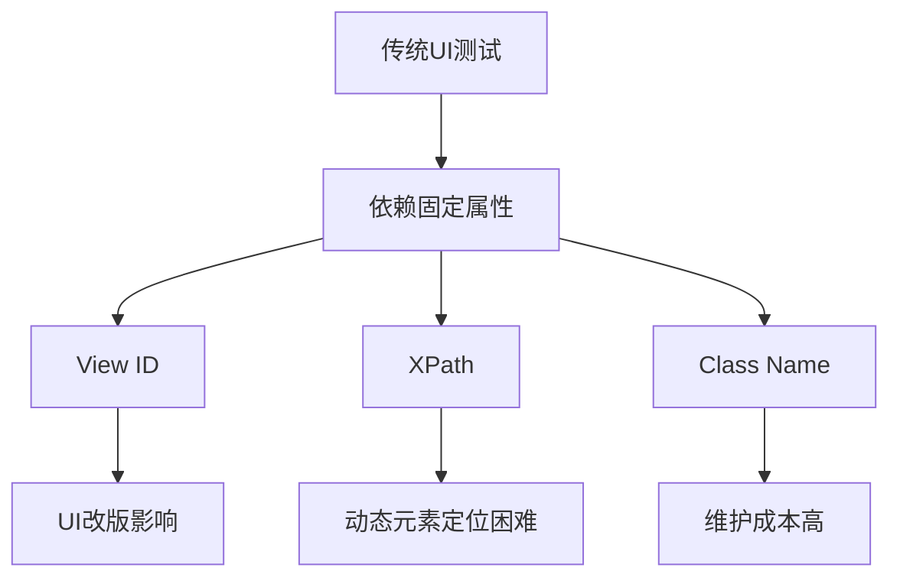
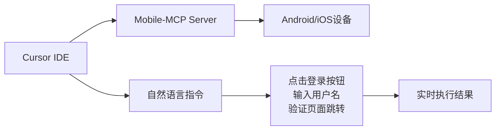
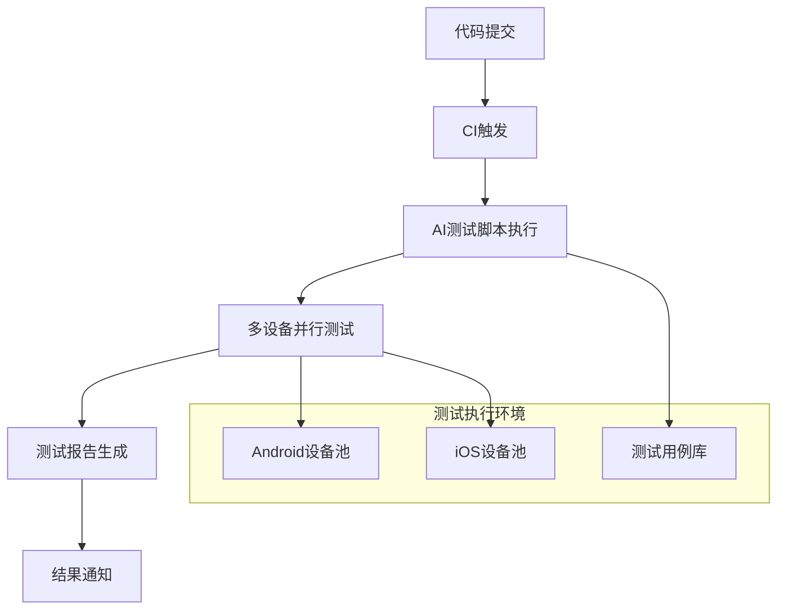
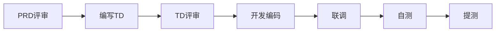
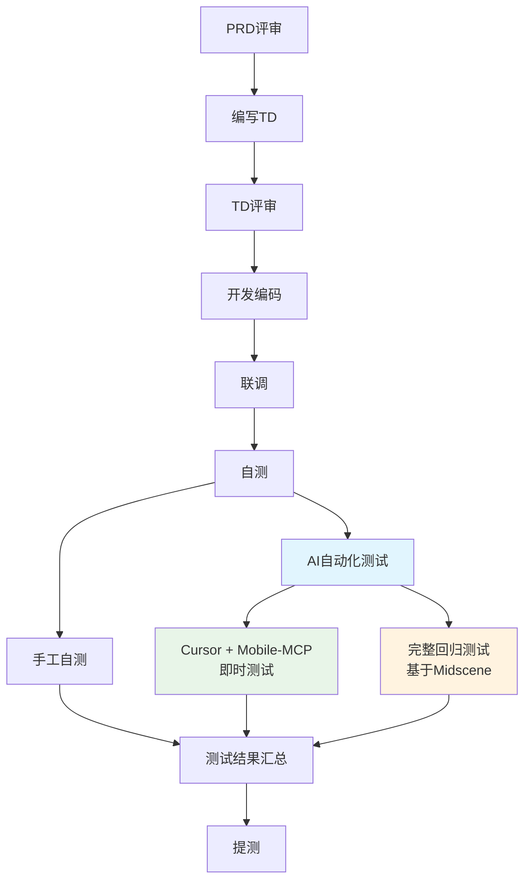
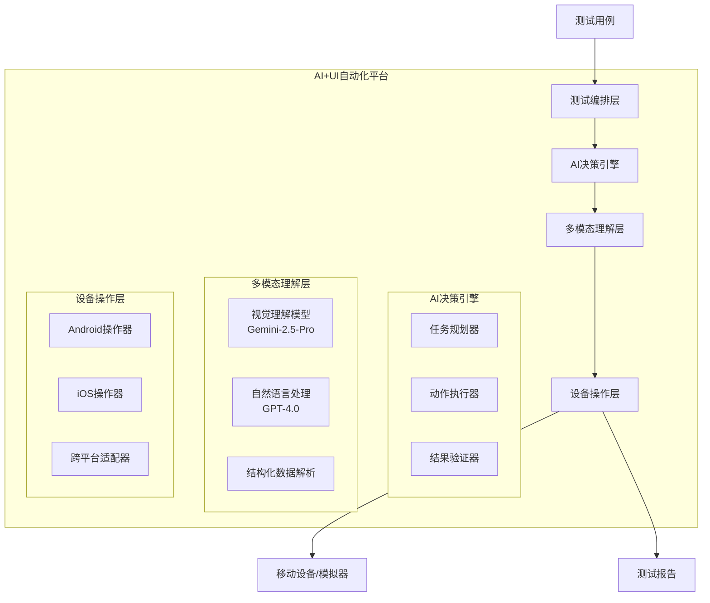
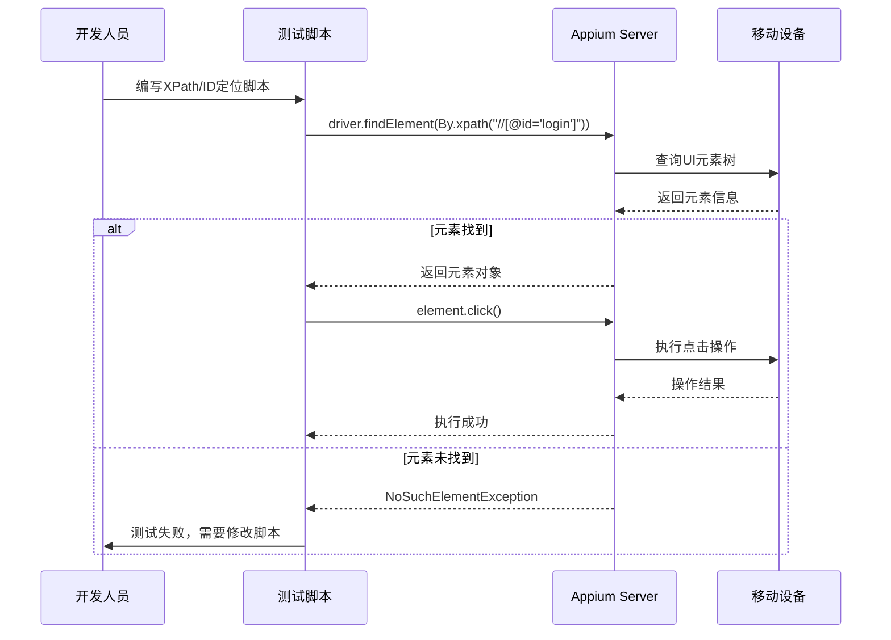
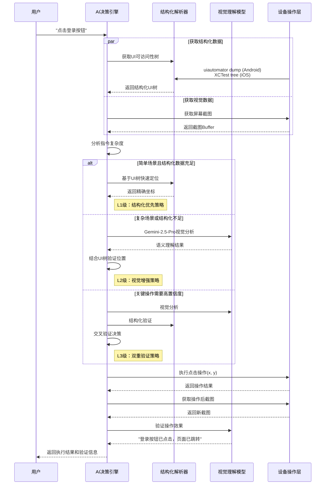
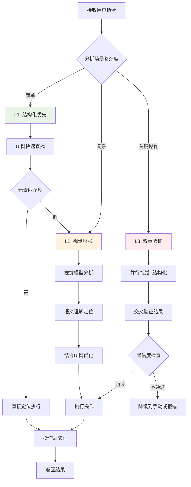
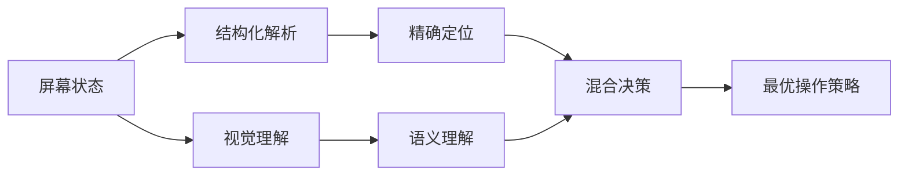

# AI+UI自动化测试概要设计文档

## 版本信息
- **文档版本**: v1.0
- **创建日期**: 2025年11月2日
- **作者**: 系统架构组
- **审核**: 待定

## 目录
1. [项目背景](#1-项目背景)
2. [传统UI自动化痛点分析](#2-传统ui自动化痛点分析)
3. [AI+UI自动化解决方案](#3-aiui自动化解决方案)
4. [团队使用场景与流程集成](#4-团队使用场景与流程集成)
5. [技术架构设计](#5-技术架构设计)
6. [核心实现原理](#6-核心实现原理)
7. [模型API策略](#7-模型api策略)
8. [结构化+截图混合方式分析](#8-结构化截图混合方式分析)
9. [实施方案](#9-实施方案)
10. [风险评估](#10-风险评估)
11. [附录](#11-附录)

---

## 1. 项目背景

### 1.1 业务背景
随着移动应用的快速迭代和复杂度提升，传统的UI自动化测试方案面临越来越多的挑战。在SDK集成、多版本适配、快速迭代的环境下，传统基于元素ID和XPath的自动化测试维护成本居高不下，测试脚本的稳定性和可维护性成为瓶颈。

### 1.2 目标
- **提升测试效率**: 减少测试脚本编写和维护时间
- **增强测试稳定性**: 降低UI变更对测试脚本的影响
- **简化测试门槛**: 通过自然语言描述实现测试场景
- **支持快速迭代**: 适应敏捷开发和持续集成需求
- **融入现有流程**: 无缝集成团队现有的AI辅助开发流程

---

## 2. 传统UI自动化痛点分析

### 2.1 核心痛点

#### 2.1.1 元素定位依赖性强
- **问题描述**: 传统Appium依赖固定的View ID、XPath、Class Name等属性定位元素
- **影响**: 
  - UI改版时大量测试脚本需要修改
  - 开发过程中ID变更导致测试失效
  - 动态生成的UI元素难以稳定定位



#### 2.1.2 新功能适配成本高
- **问题描述**: 每次新增功能都需要编写对应的测试脚本
- **具体场景**:
  - 新页面添加需要重新学习页面结构
  - 新组件需要分析元素层级关系
  - 交互逻辑变更需要修改测试流程

#### 2.1.3 SDK集成场景测试困难
- **宿主应用集成SDK**:
  - SDK内部页面结构对宿主方不透明
  - 无法获取SDK内部元素的准确定位信息
  - 跨应用交互测试复杂度高

#### 2.1.4 多平台兼容性问题
- **Android/iOS差异**:
  - 不同平台元素属性差异大
  - 相同功能不同实现方式
  - 需要维护双套测试脚本

### 2.2 传统方案局限性统计

| 问题类型 | 影响程度 | 维护成本 | 发生频率 |
|---------|---------|---------|---------|
| 元素定位失效 | 高 | 高 | 经常 |
| 脚本维护困难 | 高 | 高 | 经常 |
| 新功能适配 | 中 | 高 | 经常 |
| 跨平台兼容 | 中 | 中 | 偶尔 |
| SDK集成测试 | 高 | 高 | 偶尔 |

---

## 3. AI+UI自动化解决方案

### 3.1 核心理念
采用**"视觉理解 + 自然语言驱动"**的方式，让AI理解屏幕内容并执行人类直观的操作指令，从根本上解决传统UI自动化的痛点。

### 3.2 方案优势

#### 3.2.1 语义理解替代元素定位
- 通过自然语言描述目标："点击登录按钮"
- AI理解屏幕内容，智能识别对应元素
- 无需依赖固定的技术属性

#### 3.2.2 视觉智能适应变化
- AI通过视觉理解适应UI变更
- 按钮位置、样式变化不影响识别
- 自动适应不同分辨率和主题

#### 3.2.3 零编码测试场景
- 测试人员用自然语言描述测试步骤
- 支持复杂的业务流程描述
- 大幅降低测试脚本编写门槛

---

## 4. 团队使用场景与流程集成

### 4.1 双模式使用场景

#### 4.1.1 模式一：Cursor集成开发模式
**使用场景**: 开发过程中的即时测试和调试
- **工具**: Cursor + Mobile-MCP
- **用户**: 开发工程师、测试工程师
- **使用时机**: 开发编码阶段、联调阶段、自测阶段



**典型使用流程**:
1. 开发完成功能模块
2. 在Cursor中通过自然语言描述测试场景
3. Mobile-MCP实时执行测试操作
4. 即时获得测试反馈，快速调试修复

#### 4.1.2 模式二：持续集成自动化模式  
**使用场景**: 完整的回归测试和持续集成
- **工具**: 基于Midscene的完整测试框架
- **用户**: CI/CD系统、测试团队
- **使用时机**: 代码提交后、发版前、定时回归



### 4.2 现有AI流程集成

#### 4.2.1 当前团队开发流程


#### 4.2.2 集成AI自动化测试后的流程


#### 4.2.3 AI自动化测试集成点

**集成点1: TD编写阶段增强**
- **当前**: TD编写不包括自动测试用例生成
- **优化**: TD评审时自动生成AI测试用例模板
- **输出**: 结构化的测试场景描述，可直接用于AI执行

**集成点2: 自测阶段并行执行**
```typescript
// 自测阶段的AI测试集成
interface SelfTestProcess {
  manual: {
    engineer: "手工功能验证",
    focus: "核心业务逻辑",
    coverage: "关键路径"
  };
  
  ai_immediate: {
    tool: "Cursor + Mobile-MCP",
    engineer: "开发工程师实时操作",
    focus: "快速验证和调试",
    coverage: "当前开发功能"
  };
  
  ai_comprehensive: {
    tool: "完整AI测试框架",
    trigger: "自动触发",
    focus: "回归测试",
    coverage: "全功能验证"
  };
}
```

**集成点3: 持续优化反馈**
- **测试结果收集**: AI测试执行数据自动收集
- **用例优化**: 基于执行结果优化测试用例
- **模型训练**: 测试数据反馈模型精度提升

---

## 5. 技术架构设计

### 5.1 整体架构



### 5.2 核心组件设计

#### 5.2.1 AI决策引擎
- **任务规划器**: 将自然语言测试描述分解为具体步骤
- **动作执行器**: 根据屏幕理解结果执行具体操作
- **结果验证器**: 验证操作结果是否符合预期

#### 5.2.2 多模态理解层
- **视觉理解**: 使用Gemini-2.5-Pro分析屏幕截图
- **语言处理**: 使用GPT-4.0理解自然语言指令
- **结构化解析**: 结合可访问性树提供精确定位

#### 5.2.3 设备操作层
- **统一接口**: 抽象Android/iOS操作差异
- **自适应执行**: 根据设备特性调整操作策略
- **错误恢复**: 智能处理操作失败情况

---

## 6. 核心实现原理

### 5.1 基于Midscene的视觉理解

#### 5.1.1 多模态感知
```javascript
// 核心视觉理解流程
class VisualUnderstanding {
  async analyzeScreen(screenshot, instruction) {
    // 1. 截图预处理
    const processedImage = await this.preprocessImage(screenshot);
    
    // 2. 视觉模型分析
    const visualAnalysis = await this.geminiModel.analyze({
      image: processedImage,
      prompt: `分析屏幕内容，理解用户指令: "${instruction}"`
    });
    
    // 3. 元素定位
    const elements = await this.locateElements(visualAnalysis);
    
    return elements;
  }
}
```

#### 5.1.2 智能元素识别
- **语义匹配**: 理解"登录按钮"、"用户名输入框"等语义
- **上下文理解**: 结合页面整体布局理解元素关系
- **容错机制**: 处理文字错误、样式变化等情况

### 5.2 基于Mobile-MCP的结构化增强

#### 5.2.1 结构化数据获取
```typescript
// 可访问性树解析
interface AccessibilityNode {
  bounds: Rectangle;
  text?: string;
  contentDescription?: string;
  resourceId?: string;
  className: string;
  clickable: boolean;
  children: AccessibilityNode[];
}

class StructuredAnalysis {
  async getAccessibilityTree(deviceId: string): Promise<AccessibilityNode> {
    // Android: 使用UI Automator
    const xmlDump = await this.adb.shell('uiautomator dump');
    return this.parseXmlToTree(xmlDump);
  }
  
  async combineWithVisual(tree: AccessibilityNode, screenshot: Buffer) {
    // 结合结构化数据和视觉信息
    return await this.enhancedAnalysis(tree, screenshot);
  }
}
```

#### 5.2.2 混合定位策略
1. **优先结构化**: 先尝试使用可访问性信息定位
2. **视觉补充**: 结构化信息不足时使用视觉识别
3. **交叉验证**: 两种方式结果交叉验证提高准确性

### 6.3 操作执行流程对比分析

#### 6.3.1 传统Appium执行流程



**传统Appium痛点**:
- ❌ 依赖固定的元素属性(ID、XPath)
- ❌ UI变更后脚本大量失效
- ❌ 需要预先了解页面结构
- ❌ 动态元素定位困难
- ❌ 跨平台兼容性差

#### 6.3.2 AI+UI自动化执行流程 (UI树结构+AI视觉)



**AI+UI自动化优势**:
- ✅ 语义理解，适应UI变更
- ✅ 多层级决策，精确+快速
- ✅ 自然语言驱动，零编码
- ✅ 智能容错和恢复机制
- ✅ 跨平台统一接口

#### 6.3.3 混合定位策略详解



#### 6.3.4 核心技术优势对比

| 执行环节 | 传统Appium | AI+UI自动化 | 优势说明 |
|---------|------------|-------------|----------|
| **元素定位** | 固定属性查找 | 语义+结构混合 | 适应性强，容错率高 |
| **指令输入** | 代码编写 | 自然语言 | 零编程门槛 |
| **错误处理** | 脚本中断 | 智能重试 | 自动恢复机制 |
| **UI适应** | 手动更新脚本 | 自动适应 | 维护成本低 |
| **跨平台** | 双套代码 | 统一接口 | 开发效率高 |
| **调试效率** | 逐行排查 | 可视化反馈 | 问题定位快 |

---

## 7. 模型API策略

### 7.1 模型选择和分工

#### 7.1.1 Gemini-2.5-Pro (视觉理解)
**使用场景**:
- 屏幕截图分析
- UI元素识别和定位
- 视觉内容理解

**优势**:
- 强大的多模态理解能力
- 高精度的图像分析
- 支持复杂的视觉推理

```python
# Gemini视觉分析配置
gemini_config = {
    "model": "gemini-2.5-pro",
    "temperature": 0.1,  # 低温度保证稳定性
    "max_tokens": 4096,
    "vision_settings": {
        "detail_level": "high",
        "focus_regions": "ui_elements"
    }
}
```

#### 7.1.2 GPT-4.0 (自然语言处理)
**使用场景**:
- 测试指令解析
- 任务规划和分解
- 执行结果分析

**优势**:
- 优秀的自然语言理解
- 强大的逻辑推理能力
- 丰富的上下文处理

```python
# GPT-4.0配置
gpt4_config = {
    "model": "gpt-4.0",
    "temperature": 0.2,
    "max_tokens": 2048,
    "system_prompt": "你是一个专业的UI自动化测试助手..."
}
```

### 7.2 API调用策略

#### 7.2.1 成本优化
- **智能缓存**: 相似屏幕内容复用分析结果
- **批量处理**: 合并多个简单操作减少API调用
- **降级策略**: 简单操作优先使用结构化数据

#### 7.2.2 性能优化
- **异步并发**: 视觉分析和语言处理并行执行
- **预处理优化**: 图片压缩和格式优化
- **结果缓存**: 建立元素识别结果缓存机制

---

## 8. 结构化+截图混合方式分析

### 8.1 技术方案对比

| 方案类型 | 准确性 | 稳定性 | 性能 | 成本 |
|---------|--------|--------|------|------|
| 纯视觉识别 | 中 | 中 | 低 | 高 |
| 纯结构化 | 高 | 低 | 高 | 低 |
| **混合方案** | **高** | **高** | **中** | **中** |

### 8.2 混合方案优势

#### 8.2.1 互补性增强


**结构化数据优势**:
- 精确的坐标信息
- 快速的元素遍历
- 低成本的批量处理

**视觉理解优势**:
- 语义级别的理解
- 适应UI变化
- 处理复杂布局

#### 8.2.2 分层决策机制
1. **L1-结构化优先**: 可访问性树能准确定位时直接使用
2. **L2-视觉增强**: 结构化信息不足时启用视觉分析
3. **L3-交叉验证**: 关键操作双重验证确保准确性

### 8.3 AI视觉识别的局限性

#### 8.3.1 技术局限
- **OCR准确性**: 小字体、特殊字体识别困难
- **相似元素**: 多个相似按钮可能误识别
- **动态内容**: 加载状态、动画效果影响识别

#### 8.3.2 成本考虑
- **API调用成本**: 频繁的图像分析成本较高
- **响应时间**: 视觉模型推理时间较长
- **网络依赖**: 需要稳定的网络连接

#### 8.3.3 缓解策略
```typescript
class HybridStrategy {
  async smartDecision(context: TestContext): Promise<ActionStrategy> {
    // 1. 评估场景复杂度
    const complexity = await this.assessComplexity(context);
    
    // 2. 选择合适的策略
    if (complexity.isSimple && context.hasAccessibilityInfo) {
      return 'structured_only';
    } else if (complexity.isComplex || context.needsSemanticUnderstanding) {
      return 'vision_enhanced';
    } else {
      return 'hybrid_verification';
    }
  }
}
```

---

## 9. 实施方案

### 9.1 实施阶段

#### 阶段一：基础平台搭建 (4周)
- [ ] 设备连接和操作基础框架
- [ ] 模型API集成和调用封装
- [ ] 基础的截图和结构化数据获取

#### 阶段二：核心能力开发 (6周)
- [ ] 视觉理解模块开发
- [ ] 自然语言指令解析
- [ ] 混合定位策略实现

#### 阶段三：智能优化 (4周)
- [ ] 缓存机制和性能优化
- [ ] 错误恢复和异常处理
- [ ] 测试用例适配和验证

#### 阶段四：平台完善 (3周)
- [ ] 可视化测试编排界面
- [ ] 详细的测试报告系统
- [ ] 持续集成接口开发

### 9.2 技术选型

#### 9.2.1 开发语言和框架
- **后端**: Node.js + TypeScript
- **AI集成**: Python + FastAPI (模型服务)
- **移动操作**: 基于Mobile-MCP架构
- **前端**: React + TypeScript (可选的Web界面)

#### 9.2.2 基础设施
- **设备管理**: Docker容器 + 设备农场
- **模型服务**: 云端API + 本地缓存
- **数据存储**: Redis (缓存) + PostgreSQL (数据)

---

## 10. 风险评估

### 10.1 技术风险

| 风险项 | 影响程度 | 概率 | 应对策略 |
|--------|----------|------|----------|
| AI模型准确性不足 | 高 | 中 | 多模型验证 + 人工校正机制 |
| API调用成本过高 | 中 | 高 | 智能缓存 + 成本控制策略 |
| 设备兼容性问题 | 中 | 中 | 广泛设备测试 + 降级方案 |
| 网络依赖性风险 | 中 | 低 | 本地模型备选 + 离线模式 |

### 10.2 业务风险

#### 10.2.1 学习成本
- **风险**: 团队需要适应新的测试编写方式
- **应对**: 提供详细培训和文档，支持传统方式平滑迁移

#### 10.2.2 稳定性期望
- **风险**: 初期可能存在识别准确性问题
- **应对**: 分阶段上线，保留传统方案作为备选

---

## 11. 附录

### 11.1 相关技术调研

#### 11.1.1 竞品分析
- **Midscene.js**: 开源AI自动化框架，视觉驱动
- **Mobile-MCP**: MCP服务器，结构化+视觉混合
- **Applitools**: 商业化视觉测试平台
- **TestCraft**: AI驱动的测试自动化平台

#### 11.1.2 技术依赖
```json
{
  "core_dependencies": {
    "@midscene/core": "^0.30.6",
    "@mobilenext/mobile-mcp": "^0.0.1",
    "appium-adb": "^12.12.1",
    "appium-webdriveragent": "latest"
  },
  "ai_models": {
    "gemini-2.5-pro": "视觉理解",
    "gpt-4.0": "自然语言处理"
  }
}
```

### 11.2 预期效果评估

#### 11.2.1 效率提升预期
- **测试脚本编写时间**: 减少60-80%
- **维护成本**: 降低70%以上
- **新功能适配时间**: 从天级别降到小时级别

#### 11.2.2 质量改善预期
- **测试覆盖率**: 提升40%以上
- **测试稳定性**: UI变更后测试通过率>90%
- **跨平台一致性**: 统一测试描述适配Android/iOS

---

**文档结束**

> 本文档为AI+UI自动化测试项目的概要设计，后续将根据实施进展进行迭代更新。
