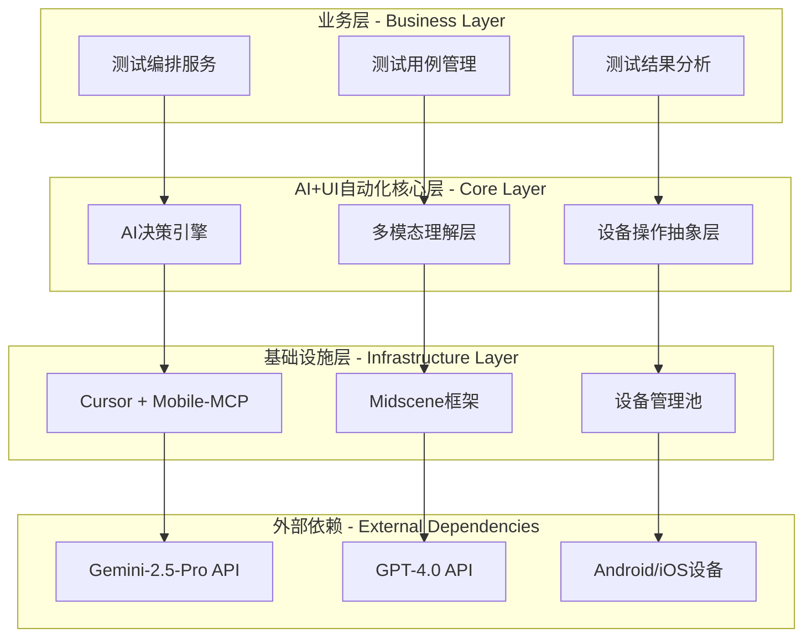
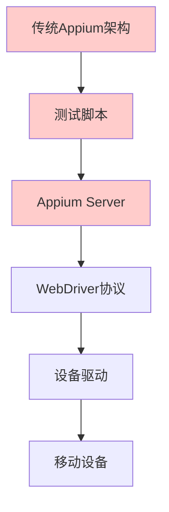
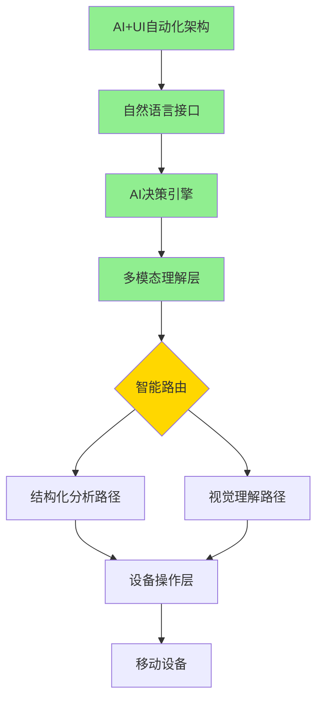
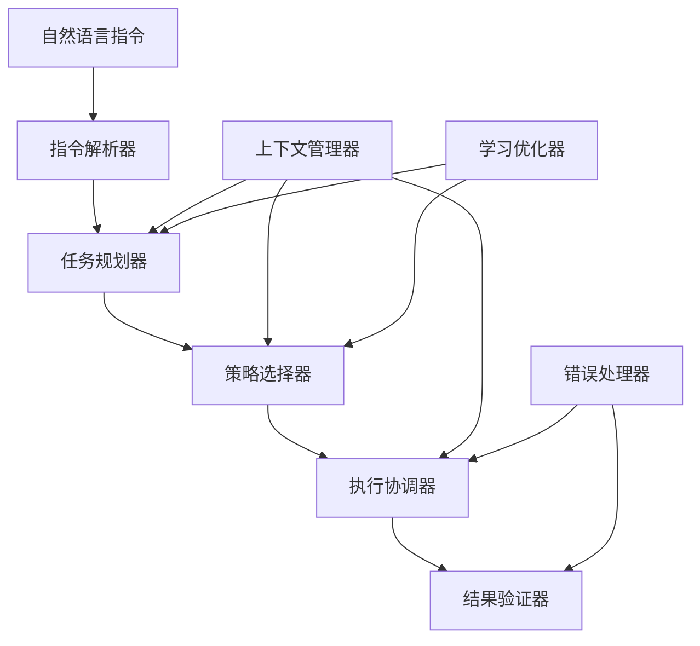
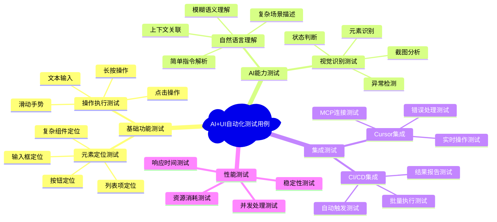
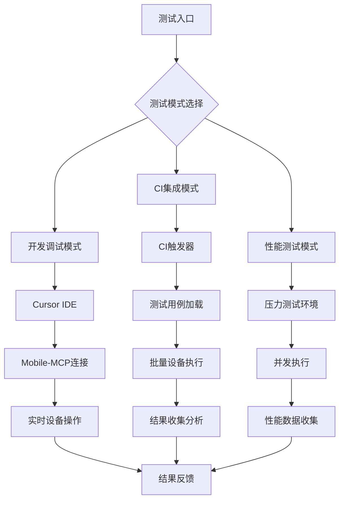

# AI+UI自动化测试技术设计文档

## 版本信息
- **文档版本**: v1.0
- **创建日期**: 2025年11月2日
- **作者**: 系统架构组
- **审核**: 待定

---

## 1. Overview

### 1.1 Background

#### 1.1.1 Status Quo of Current Technique

##### 1.1.1.1 The current state of the art of the program

当前移动应用UI自动化测试主要采用基于Appium框架的传统方案：

**技术栈现状**:
- **Android**: 基于UIAutomator2驱动，通过XPath/ID定位元素
- **iOS**: 基于XCUITest驱动，依赖Accessibility标识符
- **跨平台**: 维护Android和iOS双套测试脚本
- **元素定位**: 完全依赖View ID、Class Name、XPath等固定属性

**当前测试流程**:
```
需求分析 → 页面结构分析 → 编写定位脚本 → 调试执行 → 维护更新
```

##### 1.1.1.2 Current technology industry realization scheme

**业界主流方案对比**:

| 方案类型 | 代表产品 | 技术特点 | 市场占有率 |
|---------|----------|----------|------------|
| 传统脚本化 | Appium, Selenium | 基于元素属性定位 | 70% |
| 视觉识别 | Airtest, SikuliX | 基于图像模板匹配 | 15% |
| AI增强 | Testim, Mabl | 机器学习辅助定位 | 10% |
| 云端服务 | BrowserStack, Sauce Labs | 设备云+传统脚本 | 5% |

#### 1.1.2 Shortcoming of Current Technique

**核心痛点分析**:

1. **元素定位脆弱性**
   - 依赖固定View ID，UI改版后大量脚本失效
   - 动态生成元素难以稳定定位
   - XPath路径冗长且易变化

2. **维护成本居高不下**
   - 每次UI更新需要修改测试脚本
   - 新功能开发需要同步编写测试代码
   - 跨平台兼容性差，需要维护双套脚本

3. **SDK集成测试困难**
   - SDK内部页面结构对宿主应用不透明
   - 无法获取第三方组件的精确定位信息
   - 跨应用交互测试复杂度高

4. **测试覆盖率受限**
   - 复杂交互场景编写困难
   - 异常处理分支测试不充分
   - 回归测试执行效率低

#### 1.1.3 Optimization

**AI+UI自动化创新方案**:
- **语义理解**: 使用自然语言描述替代技术属性定位
- **视觉智能**: 多模态AI模型理解屏幕内容
- **混合策略**: 结构化数据+视觉识别相结合
- **自适应执行**: 智能适应UI变更和异常情况

### 1.2 References

- [Midscene.js Official Documentation](https://midscenejs.com/)
- [Mobile-MCP GitHub Repository](https://github.com/mobile-next/mobile-mcp)
- [Gemini-2.5-Pro API Documentation](https://ai.google.dev/docs)
- [GPT-4.0 API Reference](https://platform.openai.com/docs)
- [Appium Documentation](https://appium.io/docs)

---

## 2. Outline Design

### 2.1 Overall Design

**系统位置和依赖关系**:



**上下级依赖关系**:
- **上级系统**: CI/CD流水线、测试管理平台、开发IDE
- **同级系统**: 代码仓库、构建系统、监控告警
- **下级系统**: 移动设备、模拟器、云端AI服务

### 2.2 Optimization Design

#### 当前功能模块图



**传统方案局限**:
- ❌ 脚本编写复杂，技术门槛高
- ❌ 元素定位依赖固定属性
- ❌ UI变更影响大，维护成本高
- ❌ 错误处理能力弱

#### 优化后功能模块图



**优化亮点**:
- ✅ 自然语言驱动，零编程门槛
- ✅ 智能元素定位，适应UI变更
- ✅ 多层决策机制，提高成功率
- ✅ 自动错误恢复，增强鲁棒性

---

## 3. Detailed Design

### 3.1 Project Structure Design

#### 目录结构设计

```
ai-ui-automation/
├── packages/
│   ├── core/                 # 核心引擎
│   │   ├── ai-engine/        # AI决策引擎
│   │   ├── multimodal/       # 多模态理解
│   │   └── device-abstract/  # 设备抽象层
│   ├── integrations/         # 集成模块
│   │   ├── cursor-mcp/       # Cursor + Mobile-MCP
│   │   ├── midscene/         # Midscene框架集成
│   │   └── ci-cd/           # CI/CD集成
│   ├── models/              # 模型服务
│   │   ├── gemini-vision/   # Gemini视觉服务
│   │   ├── gpt-nlp/         # GPT自然语言处理
│   │   └── model-proxy/     # 模型代理服务
│   └── devices/             # 设备操作
│       ├── android/         # Android设备操作
│       ├── ios/            # iOS设备操作
│       └── common/         # 公共设备接口
├── apps/
│   ├── test-orchestrator/   # 测试编排应用
│   ├── result-analyzer/     # 结果分析应用
│   └── device-manager/      # 设备管理应用
├── configs/
│   ├── models.yml          # 模型配置
│   ├── devices.yml         # 设备配置
│   └── environments.yml    # 环境配置
└── docs/
    ├── api/               # API文档
    ├── tutorials/         # 教程文档
    └── examples/         # 示例代码
```

### 3.2 Core Component(s) Design

#### 3.2.1 Description of Core Component(s)

**AI决策引擎 (AI Decision Engine)**:
- **功能**: 接收自然语言指令，制定执行计划
- **职责**: 任务规划、策略选择、结果验证
- **特点**: 支持上下文理解、错误恢复、学习优化

**多模态理解层 (Multimodal Understanding Layer)**:
- **功能**: 融合视觉和结构化信息进行元素定位
- **职责**: 屏幕内容分析、元素识别、置信度评估
- **特点**: 支持多种AI模型、智能降级、缓存优化

**设备操作抽象层 (Device Operation Abstract Layer)**:
- **功能**: 提供统一的设备操作接口
- **职责**: 跨平台适配、操作执行、状态监控
- **特点**: 支持Android/iOS、插件化架构、异步执行

#### 3.2.2 Interface Design

##### AI决策引擎接口

```typescript
interface IAIDecisionEngine {
  /**
   * 执行自然语言指令
   * @param instruction 自然语言测试指令
   * @param context 执行上下文
   * @returns 执行结果和详细信息
   */
  executeInstruction(
    instruction: string, 
    context: ExecutionContext
  ): Promise<ExecutionResult>;
  
  /**
   * 规划执行步骤
   * @param scenario 测试场景描述
   * @returns 详细执行计划
   */
  planExecution(scenario: TestScenario): Promise<ExecutionPlan>;
  
  /**
   * 验证执行结果
   * @param expected 期望结果
   * @param actual 实际结果
   * @returns 验证结果
   */
  verifyResult(expected: string, actual: ScreenState): Promise<VerificationResult>;
}

// 使用示例
const aiEngine = new AIDecisionEngine({
  geminiApiKey: process.env.GEMINI_API_KEY,
  gptApiKey: process.env.GPT_API_KEY
});

const result = await aiEngine.executeInstruction(
  "点击登录按钮并输入用户名password123", 
  { deviceId: "emulator-5554", timeout: 30000 }
);
```

##### 多模态理解层接口

```typescript
interface IMultimodalUnderstanding {
  /**
   * 分析屏幕内容
   * @param screenshot 屏幕截图
   * @param structuredData 结构化UI数据
   * @param instruction 用户指令
   * @returns 分析结果
   */
  analyzeScreen(
    screenshot: Buffer,
    structuredData: UITree,
    instruction: string
  ): Promise<AnalysisResult>;
  
  /**
   * 定位目标元素
   * @param description 元素描述
   * @param screenData 屏幕数据
   * @returns 元素位置信息
   */
  locateElement(
    description: string,
    screenData: ScreenData
  ): Promise<ElementLocation>;
}

// 使用示例
const understanding = new MultimodalUnderstanding();
const location = await understanding.locateElement(
  "登录按钮",
  { screenshot: buffer, uiTree: tree }
);
```

##### 设备操作抽象层接口

```typescript
interface IDeviceOperations {
  /**
   * 连接设备
   * @param deviceId 设备ID
   * @returns 连接结果
   */
  connect(deviceId: string): Promise<ConnectionResult>;
  
  /**
   * 执行点击操作
   * @param x 横坐标
   * @param y 纵坐标
   * @returns 操作结果
   */
  tap(x: number, y: number): Promise<OperationResult>;
  
  /**
   * 输入文本
   * @param text 输入内容
   * @returns 操作结果
   */
  typeText(text: string): Promise<OperationResult>;
  
  /**
   * 获取屏幕截图
   * @returns 截图数据
   */
  screenshot(): Promise<Buffer>;
  
  /**
   * 获取UI结构树
   * @returns UI结构数据
   */
  getUITree(): Promise<UITree>;
}
```

#### 3.2.3 Component (Internal) Design

##### AI决策引擎内部设计



**核心组件说明**:
- **指令解析器**: 将自然语言转换为结构化指令
- **任务规划器**: 制定详细的执行步骤
- **策略选择器**: 根据场景选择最优执行策略
- **执行协调器**: 协调各个组件完成任务
- **结果验证器**: 验证执行结果是否符合预期

### 3.3 Storage

#### 3.3.1 Data Structure

```typescript
// 测试用例数据结构
interface TestCase {
  id: string;
  name: string;
  description: string;
  steps: TestStep[];
  expectedResult: string;
  tags: string[];
  createdAt: Date;
  updatedAt: Date;
}

interface TestStep {
  id: string;
  instruction: string;
  expectedState: string;
  timeout: number;
  retryCount: number;
}

// 执行结果数据结构
interface ExecutionResult {
  testCaseId: string;
  executionId: string;
  status: 'success' | 'failed' | 'error';
  steps: StepResult[];
  duration: number;
  screenshots: string[];
  errorMessage?: string;
  createdAt: Date;
}

interface StepResult {
  stepId: string;
  status: 'success' | 'failed' | 'skipped';
  actualState: string;
  screenshot: string;
  duration: number;
  errorMessage?: string;
}

// 设备信息数据结构
interface DeviceInfo {
  deviceId: string;
  platform: 'android' | 'ios';
  version: string;
  model: string;
  status: 'available' | 'busy' | 'offline';
  capabilities: DeviceCapability[];
  lastHeartbeat: Date;
}
```

#### 3.3.2 Data Storage

**数据接口设计**:

```typescript
interface IDataStorage {
  // 测试用例存储
  saveTestCase(testCase: TestCase): Promise<void>;
  getTestCase(id: string): Promise<TestCase>;
  listTestCases(filter: TestCaseFilter): Promise<TestCase[]>;
  
  // 执行结果存储
  saveExecutionResult(result: ExecutionResult): Promise<void>;
  getExecutionResult(id: string): Promise<ExecutionResult>;
  listExecutionResults(filter: ExecutionFilter): Promise<ExecutionResult[]>;
  
  // 设备信息存储
  saveDeviceInfo(device: DeviceInfo): Promise<void>;
  getDeviceInfo(deviceId: string): Promise<DeviceInfo>;
  listAvailableDevices(): Promise<DeviceInfo[]>;
}
```

**存储方案**:
- **主数据库**: PostgreSQL (测试用例、执行结果、设备信息)
- **缓存层**: Redis (会话状态、临时数据、性能缓存)
- **文件存储**: MinIO/S3 (截图、视频、日志文件)

#### 3.3.3 Data Cache

**缓存策略**:

```typescript
interface ICacheManager {
  // 屏幕分析结果缓存
  cacheScreenAnalysis(key: string, result: AnalysisResult, ttl: number): Promise<void>;
  getScreenAnalysis(key: string): Promise<AnalysisResult | null>;
  
  // 元素定位缓存
  cacheElementLocation(key: string, location: ElementLocation, ttl: number): Promise<void>;
  getElementLocation(key: string): Promise<ElementLocation | null>;
  
  // 设备状态缓存
  cacheDeviceState(deviceId: string, state: DeviceState, ttl: number): Promise<void>;
  getDeviceState(deviceId: string): Promise<DeviceState | null>;
}
```

**缓存层级**:
1. **L1缓存** (内存): 当前会话的临时数据
2. **L2缓存** (Redis): 跨会话的共享数据
3. **L3缓存** (持久化): 长期复用的分析结果

#### 3.3.4 Data Backward and Forward Compatibility

**数据迁移策略**:

```typescript
interface IDataMigration {
  /**
   * 版本升级迁移
   * @param fromVersion 源版本
   * @param toVersion 目标版本
   * @returns 迁移结果
   */
  migrate(fromVersion: string, toVersion: string): Promise<MigrationResult>;
  
  /**
   * 数据格式兼容性检查
   * @param data 数据对象
   * @param schema 目标结构
   * @returns 兼容性结果
   */
  checkCompatibility(data: any, schema: Schema): Promise<CompatibilityResult>;
}
```

**版本兼容策略**:
- **向前兼容**: 新版本能够处理旧格式数据
- **向后兼容**: 提供数据格式转换接口
- **渐进式迁移**: 支持分批次数据迁移

### 3.4 Error Handling

#### 3.4.1 Edge Case(s)

**网络异常 (Network Exceptions)**:
```typescript
class NetworkErrorHandler {
  async handleNetworkError(error: NetworkError): Promise<RecoveryAction> {
    if (error.type === 'timeout') {
      return { action: 'retry', delay: 5000, maxRetries: 3 };
    }
    if (error.type === 'connection_refused') {
      return { action: 'fallback', target: 'local_model' };
    }
    return { action: 'fail', reason: 'unrecoverable_network_error' };
  }
}
```

**并发请求 (Concurrent Requests)**:
```typescript
class ConcurrencyController {
  private requestQueue = new Map<string, Promise<any>>();
  
  async handleConcurrentRequest<T>(key: string, request: () => Promise<T>): Promise<T> {
    if (this.requestQueue.has(key)) {
      return await this.requestQueue.get(key);
    }
    
    const promise = request();
    this.requestQueue.set(key, promise);
    
    try {
      return await promise;
    } finally {
      this.requestQueue.delete(key);
    }
  }
}
```

**存储不足 (Insufficient Storage)**:
```typescript
class StorageManager {
  async checkStorageSpace(): Promise<StorageStatus> {
    const available = await this.getAvailableSpace();
    if (available < this.minRequiredSpace) {
      await this.cleanup();
      return { status: 'warning', available };
    }
    return { status: 'ok', available };
  }
}
```

**权限不足 (Lack of Permissions)**:
```typescript
class PermissionManager {
  async requestPermissions(permissions: Permission[]): Promise<PermissionResult[]> {
    const results: PermissionResult[] = [];
    for (const permission of permissions) {
      try {
        const granted = await this.checkPermission(permission);
        results.push({ permission, granted });
      } catch (error) {
        results.push({ permission, granted: false, error: error.message });
      }
    }
    return results;
  }
}
```

**覆盖安装 (Overwrite Installation)**:
```typescript
class InstallationManager {
  async handleOverwriteInstall(appPath: string): Promise<InstallResult> {
    const existing = await this.checkExistingApp(appPath);
    if (existing.installed) {
      await this.uninstallApp(existing.packageName);
      await this.waitForUninstall(existing.packageName);
    }
    return await this.installApp(appPath);
  }
}
```

#### 3.4.2 Exception Catching

**统一异常处理框架**:

```typescript
class GlobalExceptionHandler {
  private handlers = new Map<string, ExceptionHandler>();
  
  registerHandler(type: string, handler: ExceptionHandler): void {
    this.handlers.set(type, handler);
  }
  
  async handleException(error: Error): Promise<HandleResult> {
    const errorType = this.classifyError(error);
    const handler = this.handlers.get(errorType);
    
    if (handler) {
      return await handler.handle(error);
    }
    
    // 默认处理
    return {
      action: 'log_and_fail',
      message: error.message,
      stack: error.stack
    };
  }
  
  private classifyError(error: Error): string {
    if (error instanceof NetworkError) return 'network';
    if (error instanceof DeviceError) return 'device';
    if (error instanceof AIModelError) return 'ai_model';
    return 'unknown';
  }
}
```

### 3.5 Security

**安全措施设计**:

```typescript
interface ISecurityManager {
  // API密钥管理
  encryptApiKeys(keys: ApiKeys): Promise<EncryptedKeys>;
  decryptApiKeys(encrypted: EncryptedKeys): Promise<ApiKeys>;
  
  // 访问控制
  validateAccess(token: string, resource: string): Promise<boolean>;
  generateToken(userId: string, permissions: Permission[]): Promise<string>;
  
  // 数据脱敏
  sanitizeTestData(data: TestData): Promise<SanitizedData>;
  maskSensitiveInfo(content: string): string;
}
```

**安全策略**:
- **API密钥加密**: 使用AES-256加密存储
- **访问令牌**: JWT令牌控制API访问
- **数据脱敏**: 自动识别和屏蔽敏感信息
- **传输加密**: HTTPS/TLS加密通信

### 3.6 Monitoring

**监控指标设计**:

```typescript
interface IMonitoringService {
  // 性能监控
  recordExecutionTime(operation: string, duration: number): void;
  recordAPILatency(api: string, latency: number): void;
  recordSuccessRate(component: string, rate: number): void;
  
  // 资源监控
  recordMemoryUsage(component: string, usage: number): void;
  recordCPUUsage(component: string, usage: number): void;
  recordNetworkUsage(bytes: number): void;
  
  // 业务监控
  recordTestExecution(result: TestExecutionMetrics): void;
  recordDeviceStatus(deviceId: string, status: DeviceStatus): void;
  recordErrorRate(component: string, rate: number): void;
}
```

**监控维度**:
- **系统性能**: CPU、内存、网络、磁盘
- **业务指标**: 测试成功率、执行时间、覆盖率
- **错误监控**: 异常统计、失败原因分析
- **用户行为**: 操作频率、使用模式

### 3.7 Compatibility

| Compatibility | Answer |
|---------------|--------|
| Multi-version compatibility is involved | YES |
| Added/Changed public components (UI components or function functions) | YES |
| Change of build script | YES |
| Added/Changed AppRL, JsBridge, Deeplink, etc. | NO |
| Change of CI pipeline | YES |
| Introduced/Changed third-party libraries | YES |

**兼容性确认项**:
- ✅ **多版本兼容**: 支持Android 7.0+, iOS 12.0+
- ✅ **公共组件变更**: 新增AI决策引擎、多模态理解层
- ✅ **构建脚本变更**: 增加AI模型下载和配置
- ❌ **AppRL/JsBridge变更**: 不涉及
- ✅ **CI流水线变更**: 集成AI模型API密钥管理
- ✅ **第三方库引入**: Gemini SDK, OpenAI SDK, 图像处理库

### 3.8 Tracking

#### 3.8.1 Performance Tracking

**性能埋点统计**:

```typescript
interface PerformanceMetrics {
  // 执行性能
  instructionParseTime: number;        // 指令解析耗时
  aiModelInferenceTime: number;        // AI模型推理耗时
  elementLocationTime: number;         // 元素定位耗时
  operationExecutionTime: number;      // 操作执行耗时
  totalExecutionTime: number;          // 总执行耗时
  
  // 成功率指标
  elementLocationSuccessRate: number;   // 元素定位成功率
  operationSuccessRate: number;        // 操作执行成功率
  testCasePassRate: number;            // 测试用例通过率
  
  // 资源使用
  memoryUsage: number;                 // 内存使用量
  cpuUsage: number;                    // CPU使用率
  networkBandwidth: number;            // 网络带宽使用
  apiCallCount: number;                // API调用次数
}
```

#### 3.8.2 Proactive Reporting

**主动上报场景**:

```typescript
interface ProactiveReporting {
  // 关键错误上报
  reportCriticalError(error: CriticalError): void;
  
  // 性能异常上报
  reportPerformanceAnomaly(metrics: AnomalyMetrics): void;
  
  // 业务指标上报
  reportBusinessMetrics(metrics: BusinessMetrics): void;
}

// 上报配置
const reportingConfig = {
  criticalErrors: {
    key: 'ai_ui_automation.critical_error',
    conditions: ['ai_model_failure', 'device_disconnect', 'data_corruption']
  },
  performanceAnomalies: {
    key: 'ai_ui_automation.performance_anomaly',
    thresholds: {
      executionTimeout: 60000,
      successRateBelow: 0.8,
      memoryUsageAbove: 0.9
    }
  },
  businessMetrics: {
    key: 'ai_ui_automation.business_metrics',
    frequency: 'hourly',
    metrics: ['test_execution_count', 'success_rate', 'avg_execution_time']
  }
};
```

---

## 4. Test

### 4.1 Test Case(s)

**核心功能测试用例**:



**详细测试用例示例**:

| 用例ID | 用例名称 | 测试步骤 | 期望结果 |
|--------|----------|----------|----------|
| TC001 | 基础登录流程测试 | 1. 启动应用<br>2. "点击登录按钮"<br>3. "输入用户名test@example.com"<br>4. "输入密码password123"<br>5. "点击登录"<br>6. "验证登录成功" | 成功定位所有元素，完成登录流程，验证进入主页 |
| TC002 | UI变更适应性测试 | 1. 使用旧版本训练的模型<br>2. 在新UI版本上执行测试<br>3. "点击设置按钮"（位置已变更） | 能够智能适应UI变更，成功定位新位置的设置按钮 |
| TC003 | 复杂交互场景测试 | 1. "滚动到页面底部"<br>2. "点击加载更多"<br>3. "在列表中找到包含'测试'的项目"<br>4. "点击该项目" | 成功处理复杂的多步骤交互，准确定位动态内容 |
| TC004 | 错误恢复测试 | 1. 模拟网络异常<br>2. "点击登录按钮"<br>3. 网络恢复<br>4. 验证自动重试机制 | 网络恢复后自动重试，最终完成登录操作 |

### 4.2 Test Path(s)

**测试路径设计**:



**调试模块入口路径**:
1. **Cursor集成路径**: `Cursor IDE → MCP连接 → 实时调试`
2. **Web控制台路径**: `浏览器 → 管理界面 → 测试执行`
3. **API接口路径**: `HTTP API → 直接调用 → 程序化执行`
4. **命令行路径**: `CLI工具 → 脚本执行 → 批量测试`

### 4.3 Self Testing Feedback

**自测反馈机制**:

```typescript
interface SelfTestFeedback {
  // 执行结果反馈
  executionResults: {
    successRate: number;           // 成功率
    averageExecutionTime: number;  // 平均执行时间
    errorDistribution: ErrorStats; // 错误分布
  };
  
  // AI模型反馈
  aiPerformance: {
    elementLocationAccuracy: number;  // 元素定位准确率
    instructionUnderstanding: number; // 指令理解准确率
    adaptabilityScore: number;        // 适应性评分
  };
  
  // 系统性能反馈
  systemPerformance: {
    memoryUsage: ResourceUsage;    // 内存使用情况
    cpuUtilization: ResourceUsage; // CPU使用情况
    networkLatency: number;        // 网络延迟
  };
  
  // 改进建议
  improvements: {
    priorityIssues: Issue[];       // 优先修复问题
    optimizationSuggestions: Suggestion[]; // 优化建议
    trainingDataNeeds: DataNeed[]; // 训练数据需求
  };
}
```

**反馈收集和处理流程**:

1. **实时反馈收集**: 每次执行后自动收集性能和结果数据
2. **周期性分析**: 每日/周生成趋势分析报告
3. **异常检测**: 自动识别性能异常和成功率下降
4. **持续优化**: 基于反馈数据优化AI模型和执行策略

**关键指标监控**:
- **功能指标**: 测试通过率 >95%，元素定位成功率 >90%
- **性能指标**: 平均响应时间 <5秒，API调用成功率 >99%
- **稳定性指标**: 连续运行时间 >24小时，内存泄漏 <1%

---

**文档结束**

> 本技术设计文档按照标准模板编写，涵盖了AI+UI自动化测试的完整技术方案，可直接用于项目开发和技术评审。
