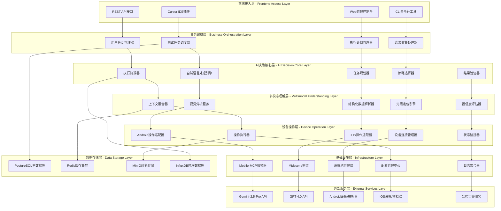
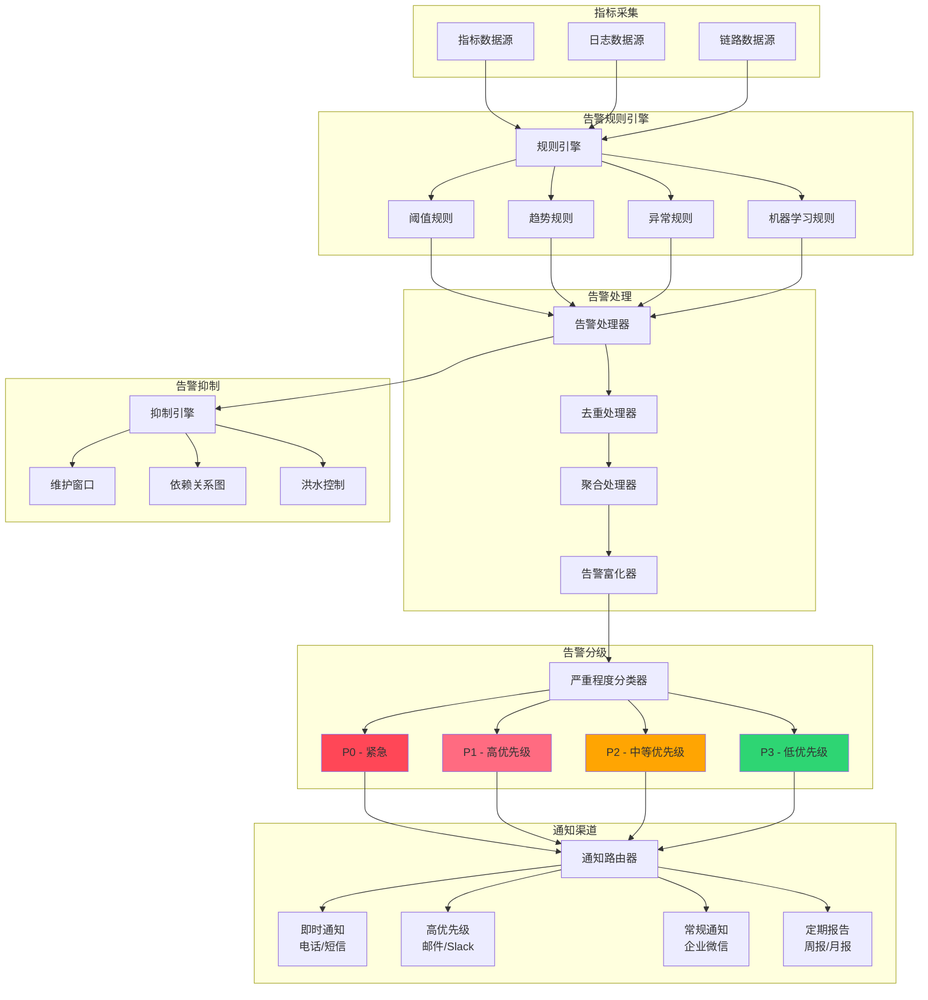

# AI+UI自动化测试技术设计文档

## 版本信息
- **文档版本**: v1.0
- **创建日期**: 2025年11月2日
- **作者**: 系统架构组
- **审核**: 待定

---

## 1. Overview

### 1.1 Background
随着移动应用的快速迭代和复杂度提升，传统的UI自动化测试方案面临越来越多的挑战。在SDK集成、多版本适配、快速迭代的环境下，传统基于元素ID和XPath的自动化测试维护成本居高不下，测试脚本的稳定性和可维护性成为瓶颈。

#### 1.1.1 Status Quo of Current Technique

##### 1.1.1.1 The current state of the art of the program

当前移动应用UI自动化测试主要采用基于Appium框架的传统方案：

**技术栈现状**:
- **Android**: 基于UIAutomator2驱动，通过XPath/ID定位元素
- **iOS**: 基于XCUITest驱动，依赖Accessibility标识符
- **跨平台**: 维护Android和iOS双套测试脚本
- **元素定位**: 完全依赖View ID、Class Name、XPath等固定属性

**当前测试流程**:
```
需求分析 → 页面结构分析 → 编写定位脚本 → 调试执行 → 维护更新
```

##### 1.1.1.2 Current technology industry realization scheme

**业界主流方案对比**:

| 方案类型 | 代表产品 | 技术特点 | 市场占有率 |
|---------|----------|----------|------------|
| 传统脚本化 | Appium, Selenium | 基于元素属性定位 | 70% |
| 视觉识别 | Airtest, SikuliX | 基于图像模板匹配 | 15% |
| AI增强 | Testim, Mabl | 机器学习辅助定位 | 10% |
| 云端服务 | BrowserStack, Sauce Labs | 设备云+传统脚本 | 5% |

#### 1.1.2 Shortcoming of Current Technique

**核心痛点分析**:

1. **元素定位脆弱性**
   - 依赖固定View ID，UI改版后大量脚本失效
   - 动态生成元素难以稳定定位
   - XPath路径冗长且易变化
     


**传统问题点**：

| 问题类型 | 影响程度 | 维护成本 | 发生频率 |
|---------|---------|---------|---------|
| 元素定位失效 | 高 | 高 | 经常 |
| 脚本维护困难 | 高 | 高 | 经常 |
| 新功能适配 | 中 | 高 | 经常 |
| 跨平台兼容 | 中 | 中 | 偶尔 |
| SDK集成测试 | 高 | 高 | 偶尔 |

2. **维护成本居高不下**
   - 每次UI更新需要修改测试脚本
   - 新功能开发需要同步编写测试代码
   - 跨平台兼容性差，需要维护双套脚本

3. **SDK集成测试困难**
   - SDK内部页面结构对宿主应用不透明
   - 无法获取第三方组件的精确定位信息
   - 跨应用交互测试复杂度高

4. **测试覆盖率受限**
   - 复杂交互场景编写困难
   - 异常处理分支测试不充分
   - 回归测试执行效率低
  

#### 1.1.3 Optimization

**AI+UI自动化创新方案**:
- **语义理解**: 使用自然语言描述替代技术属性定位
- **视觉智能**: 多模态AI模型理解屏幕内容
- **混合策略**: 结构化数据+视觉识别相结合
- **自适应执行**: 智能适应UI变更和异常情况

### 1.2 References

- [Midscene.js Official Documentation](https://midscenejs.com/)
- [Mobile-MCP GitHub Repository](https://github.com/mobile-next/mobile-mcp)
- [Gemini-2.5-Pro API Documentation](https://ai.google.dev/docs)
- [GPT-4.0 API Reference](https://platform.openai.com/docs)
- [Appium Documentation](https://appium.io/docs)

---

## 2. Outline Design

### 2.1 Overall Design

#### 2.1.1 系统总体架构



#### 2.1.2 系统依赖关系矩阵

| 层级 | 上级依赖 | 同级依赖 | 下级依赖 |
|------|----------|----------|----------|
| **前端接入层** | IDE工具链、浏览器 | 用户认证服务、权限管理 | 业务编排层 |
| **业务编排层** | 前端接入层 | 配置中心、消息队列 | AI决策核心层 |
| **AI决策核心层** | 业务编排层 | 模型服务、缓存系统 | 多模态理解层 |
| **多模态理解层** | AI决策核心层 | 图像处理服务 | 设备操作层 |
| **设备操作层** | 多模态理解层 | 设备驱动程序 | 基础设施层 |
| **基础设施层** | 设备操作层 | 网络服务、存储服务 | 外部服务层 |
| **外部服务层** | 基础设施层 | 网络基础设施 | 无 |

#### 2.1.3 数据流向图


### 2.2 Optimization Design

#### 当前功能模块图


**传统方案局限**:
- ❌ 脚本编写复杂，技术门槛高
- ❌ 元素定位依赖固定属性
- ❌ UI变更影响大，维护成本高
- ❌ 错误处理能力弱

#### 优化后功能模块图


**优化亮点**:
- ✅ 自然语言驱动，零编程门槛
- ✅ 智能元素定位，适应UI变更
- ✅ 多层决策机制，提高成功率
- ✅ 自动错误恢复，增强鲁棒性

---

## 3. Detailed Design

### 3.1 Project Structure Design

#### 目录结构设计

```
ai-ui-automation/
├── packages/
│   ├── core/                 # 核心引擎
│   │   ├── ai-engine/        # AI决策引擎
│   │   ├── multimodal/       # 多模态理解
│   │   └── device-abstract/  # 设备抽象层
│   ├── integrations/         # 集成模块
│   │   ├── cursor-mcp/       # Cursor + Mobile-MCP
│   │   ├── midscene/         # Midscene框架集成
│   │   └── ci-cd/           # CI/CD集成
│   ├── models/              # 模型服务
│   │   ├── gemini-vision/   # Gemini视觉服务
│   │   ├── gpt-nlp/         # GPT自然语言处理
│   │   └── model-proxy/     # 模型代理服务
│   └── devices/             # 设备操作
│       ├── android/         # Android设备操作
│       ├── ios/            # iOS设备操作
│       └── common/         # 公共设备接口
├── apps/
│   ├── test-orchestrator/   # 测试编排应用
│   ├── result-analyzer/     # 结果分析应用
│   └── device-manager/      # 设备管理应用
├── configs/
│   ├── models.yml          # 模型配置
│   ├── devices.yml         # 设备配置
│   └── environments.yml    # 环境配置
└── docs/
    ├── api/               # API文档
    ├── tutorials/         # 教程文档
    └── examples/         # 示例代码
```

### 3.2 Core Component(s) Design

#### 3.2.1 Description of Core Component(s)

**AI决策引擎 (AI Decision Engine)**:
- **功能**: 接收自然语言指令，制定执行计划
- **职责**: 任务规划、策略选择、结果验证
- **特点**: 支持上下文理解、错误恢复、学习优化

**多模态理解层 (Multimodal Understanding Layer)**:
- **功能**: 融合视觉和结构化信息进行元素定位
- **职责**: 屏幕内容分析、元素识别、置信度评估
- **特点**: 支持多种AI模型、智能降级、缓存优化

**设备操作抽象层 (Device Operation Abstract Layer)**:
- **功能**: 提供统一的设备操作接口
- **职责**: 跨平台适配、操作执行、状态监控
- **特点**: 支持Android/iOS、插件化架构、异步执行

#### 3.2.2 Interface Design

##### AI决策引擎接口

```typescript
interface IAIDecisionEngine {
  /**
   * 执行自然语言指令
   * @param instruction 自然语言测试指令
   * @param context 执行上下文
   * @returns 执行结果和详细信息
   */
  executeInstruction(
    instruction: string, 
    context: ExecutionContext
  ): Promise<ExecutionResult>;
  
  /**
   * 规划执行步骤
   * @param scenario 测试场景描述
   * @returns 详细执行计划
   */
  planExecution(scenario: TestScenario): Promise<ExecutionPlan>;
  
  /**
   * 验证执行结果
   * @param expected 期望结果
   * @param actual 实际结果
   * @returns 验证结果
   */
  verifyResult(expected: string, actual: ScreenState): Promise<VerificationResult>;
}

// 使用示例
const aiEngine = new AIDecisionEngine({
  geminiApiKey: process.env.GEMINI_API_KEY,
  gptApiKey: process.env.GPT_API_KEY
});

const result = await aiEngine.executeInstruction(
  "点击登录按钮并输入用户名password123", 
  { deviceId: "emulator-5554", timeout: 30000 }
);
```

##### 多模态理解层接口

```typescript
interface IMultimodalUnderstanding {
  /**
   * 分析屏幕内容
   * @param screenshot 屏幕截图
   * @param structuredData 结构化UI数据
   * @param instruction 用户指令
   * @returns 分析结果
   */
  analyzeScreen(
    screenshot: Buffer,
    structuredData: UITree,
    instruction: string
  ): Promise<AnalysisResult>;
  
  /**
   * 定位目标元素
   * @param description 元素描述
   * @param screenData 屏幕数据
   * @returns 元素位置信息
   */
  locateElement(
    description: string,
    screenData: ScreenData
  ): Promise<ElementLocation>;
}

// 使用示例
const understanding = new MultimodalUnderstanding();
const location = await understanding.locateElement(
  "登录按钮",
  { screenshot: buffer, uiTree: tree }
);
```

##### 设备操作抽象层接口

```typescript
interface IDeviceOperations {
  /**
   * 连接设备
   * @param deviceId 设备ID
   * @returns 连接结果
   */
  connect(deviceId: string): Promise<ConnectionResult>;
  
  /**
   * 执行点击操作
   * @param x 横坐标
   * @param y 纵坐标
   * @returns 操作结果
   */
  tap(x: number, y: number): Promise<OperationResult>;
  
  /**
   * 输入文本
   * @param text 输入内容
   * @returns 操作结果
   */
  typeText(text: string): Promise<OperationResult>;
  
  /**
   * 获取屏幕截图
   * @returns 截图数据
   */
  screenshot(): Promise<Buffer>;
  
  /**
   * 获取UI结构树
   * @returns UI结构数据
   */
  getUITree(): Promise<UITree>;
}
```

#### 3.2.3 Component (Internal) Design

##### 3.2.3.1 AI决策引擎内部架构


**详细组件设计**:

```typescript
// AI决策引擎核心实现
class AIDecisionEngine {
    private instructionProcessor: InstructionProcessor;
    private taskPlanner: TaskPlanner;
    private strategySelector: StrategySelector;
    private executionCoordinator: ExecutionCoordinator;
    private resultVerifier: ResultVerifier;
    private contextManager: ContextManager;
    private knowledgeBase: KnowledgeBase;
    
    constructor(config: AIEngineConfig) {
        this.initializeComponents(config);
        this.setupEventHandlers();
        this.loadKnowledgeBase();
    }
    
    async processInstruction(instruction: string, context: ExecutionContext): Promise<ExecutionResult> {
        // 1. 预处理和语义分析
        const processedInstruction = await this.instructionProcessor.process(instruction);
        const semanticResult = await this.instructionProcessor.analyze(processedInstruction);
        const intent = await this.instructionProcessor.recognizeIntent(semanticResult);
        
        // 2. 任务规划
        const executionPlan = await this.taskPlanner.createPlan(intent, context);
        
        // 3. 策略选择
        const strategy = await this.strategySelector.selectOptimalStrategy(executionPlan);
        
        // 4. 执行协调
        const executionResult = await this.executionCoordinator.coordinate(strategy);
        
        // 5. 结果验证
        const verificationResult = await this.resultVerifier.verify(executionResult, intent);
        
        return this.formatResult(verificationResult);
    }
}
```

##### 3.2.3.2 多模态理解层内部架构


**多模态融合算法实现**:

```typescript
class MultimodalFusionEngine {
    private visionModel: VisionModel;
    private structuralAnalyzer: StructuralAnalyzer;
    private attentionMechanism: AttentionMechanism;
    private confidenceEvaluator: ConfidenceEvaluator;
    
    async fuseMultimodalData(
        screenshot: Buffer,
        uiTree: UITree,
        instruction: string,
        context: AnalysisContext
    ): Promise<FusionResult> {
        // 并行特征提取
        const [visualFeatures, structuralFeatures, semanticFeatures] = await Promise.all([
            this.extractVisualFeatures(screenshot),
            this.extractStructuralFeatures(uiTree),
            this.extractSemanticFeatures(instruction)
        ]);
        
        // 注意力权重计算
        const attentionWeights = await this.attentionMechanism.computeWeights({
            visual: visualFeatures,
            structural: structuralFeatures,
            semantic: semanticFeatures,
            context: context
        });
        
        // 加权特征融合
        const fusedFeatures = this.weightedFeatureFusion(
            visualFeatures,
            structuralFeatures,
            semanticFeatures,
            attentionWeights
        );
        
        // 生成预测结果
        const predictions = await this.generatePredictions(fusedFeatures);
        
        // 置信度评估
        const confidence = await this.confidenceEvaluator.evaluate(predictions, context);
        
        return {
            predictions,
            confidence,
            attentionWeights,
            debugInfo: this.generateDebugInfo(fusedFeatures, predictions)
        };
    }
}
```

##### 3.2.3.3 设备操作层内部架构


**设备操作执行时序图**:


##### 3.2.3.4 完整系统交互时序图


##### 3.2.3.5 部署架构图


##### 3.2.3.6 缓存架构设计


**缓存策略配置**:

```yaml
cache:
  levels:
    l1: # 应用内存缓存
      size: "256MB"
      ttl: "5m"
      eviction: "LRU"
      
    l2: # Redis分布式缓存
      cluster:
        nodes: ["redis-1:6379", "redis-2:6379", "redis-3:6379"]
        ttl: "1h"
        compression: true
        
    l3: # 持久化缓存
      filesystem:
        path: "/data/cache"
        size: "10GB"
        cleanup_interval: "24h"
        
  strategies:
    visual_analysis:
      key_pattern: "visual:hash:{md5}"
      ttl: "24h"
      compress: true
      
    element_location:
      key_pattern: "element:{app}:{page}:{element}"
      ttl: "1h"
      invalidate_on_ui_change: true
      
    device_state:
      key_pattern: "device:{device_id}:state"
      ttl: "5m"
      real_time_update: true
```

### 3.3 Storage

#### 3.3.1 Data Structure

##### 3.3.1.1 数据模型设计


**详细数据结构定义**:

```typescript
// 测试用例数据结构
interface TestCase {
  id: string;
  name: string;
  description: string;
  steps: TestStep[];
  metadata: {
    app_package?: string;
    target_platform?: 'android' | 'ios' | 'both';
    complexity_level?: 'simple' | 'medium' | 'complex';
    estimated_duration?: number;
  };
  expectedResult: string;
  tags: string[];
  userId: string;
  createdAt: Date;
  updatedAt: Date;
  isActive: boolean;
  version: number;
}

interface TestStep {
  id: string;
  testCaseId: string;
  stepOrder: number;
  instruction: string;
  expectedState: string;
  timeout: number;
  retryCount: number;
  validationRules: {
    element_presence?: ElementValidation[];
    text_validation?: TextValidation[];
    state_validation?: StateValidation[];
  };
  aiHints?: {
    contextual_info?: string;
    fallback_strategies?: string[];
    success_indicators?: string[];
  };
  createdAt: Date;
}

// 执行结果数据结构
interface ExecutionResult {
  id: string;
  testCaseId: string;
  executionId: string;
  deviceId: string;
  status: 'pending' | 'running' | 'success' | 'failed' | 'error' | 'cancelled';
  steps: StepResult[];
  duration: number;
  performanceMetrics: {
    total_api_calls: number;
    avg_response_time: number;
    cache_hit_rate: number;
    element_location_accuracy: number;
  };
  screenshots: Screenshot[];
  errorMessage?: string;
  aiAnalysisData: {
    difficulty_score: number;
    success_factors: string[];
    failure_reasons?: string[];
    improvement_suggestions: string[];
  };
  startedAt: Date;
  completedAt?: Date;
}

interface StepResult {
  id: string;
  executionResultId: string;
  testStepId: string;
  status: 'success' | 'failed' | 'skipped' | 'timeout';
  actualState: string;
  screenshot: string;
  duration: number;
  confidenceScore: number;
  aiDecisionData: {
    strategy_used: 'structural' | 'visual' | 'hybrid';
    element_candidates: ElementCandidate[];
    final_choice: ElementCandidate;
    reasoning: string;
  };
  errorMessage?: string;
  executedAt: Date;
}

// 设备信息数据结构
interface Device {
  id: string;
  platform: 'android' | 'ios';
  osVersion: string;
  model: string;
  manufacturer: string;
  status: 'available' | 'busy' | 'offline' | 'maintenance';
  capabilities: DeviceCapability[];
  currentState: {
    cpu_usage: number;
    memory_usage: number;
    battery_level?: number;
    network_status: 'connected' | 'disconnected';
    active_app?: string;
  };
  location: {
    datacenter: string;
    rack_id?: string;
    is_physical: boolean;
  };
  lastHeartbeat: Date;
  registeredAt: Date;
}

interface DeviceCapability {
  type: 'screen_size' | 'api_level' | 'features' | 'sensors';
  value: string | number | boolean;
  description?: string;
}
```

##### 3.3.1.2 数据关系图


#### 3.3.2 Data Storage

##### 3.3.2.1 存储架构设计


##### 3.3.2.2 数据存储策略

**分库分表策略**:


**数据接口设计**:

```typescript
interface IDataStorage {
  // 测试用例存储
  saveTestCase(testCase: TestCase): Promise<void>;
  getTestCase(id: string): Promise<TestCase>;
  listTestCases(filter: TestCaseFilter): Promise<TestCase[]>;
  
  // 执行结果存储
  saveExecutionResult(result: ExecutionResult): Promise<void>;
  getExecutionResult(id: string): Promise<ExecutionResult>;
  listExecutionResults(filter: ExecutionFilter): Promise<ExecutionResult[]>;
  
  // 设备信息存储
  saveDeviceInfo(device: DeviceInfo): Promise<void>;
  getDeviceInfo(deviceId: string): Promise<DeviceInfo>;
  listAvailableDevices(): Promise<DeviceInfo[]>;
}
```

**存储方案**:
- **主数据库**: PostgreSQL (测试用例、执行结果、设备信息)
- **缓存层**: Redis (会话状态、临时数据、性能缓存)
- **文件存储**: MinIO/S3 (截图、视频、日志文件)

#### 3.3.3 Data Cache

**缓存策略**:

```typescript
interface ICacheManager {
  // 屏幕分析结果缓存
  cacheScreenAnalysis(key: string, result: AnalysisResult, ttl: number): Promise<void>;
  getScreenAnalysis(key: string): Promise<AnalysisResult | null>;
  
  // 元素定位缓存
  cacheElementLocation(key: string, location: ElementLocation, ttl: number): Promise<void>;
  getElementLocation(key: string): Promise<ElementLocation | null>;
  
  // 设备状态缓存
  cacheDeviceState(deviceId: string, state: DeviceState, ttl: number): Promise<void>;
  getDeviceState(deviceId: string): Promise<DeviceState | null>;
}
```

**缓存层级**:
1. **L1缓存** (内存): 当前会话的临时数据
2. **L2缓存** (Redis): 跨会话的共享数据
3. **L3缓存** (持久化): 长期复用的分析结果

#### 3.3.4 Data Backward and Forward Compatibility

**数据迁移策略**:

```typescript
interface IDataMigration {
  /**
   * 版本升级迁移
   * @param fromVersion 源版本
   * @param toVersion 目标版本
   * @returns 迁移结果
   */
  migrate(fromVersion: string, toVersion: string): Promise<MigrationResult>;
  
  /**
   * 数据格式兼容性检查
   * @param data 数据对象
   * @param schema 目标结构
   * @returns 兼容性结果
   */
  checkCompatibility(data: any, schema: Schema): Promise<CompatibilityResult>;
}
```

**版本兼容策略**:
- **向前兼容**: 新版本能够处理旧格式数据
- **向后兼容**: 提供数据格式转换接口
- **渐进式迁移**: 支持分批次数据迁移

### 3.4 Error Handling

#### 3.4.1 Edge Case(s)

**网络异常 (Network Exceptions)**:
```typescript
class NetworkErrorHandler {
  async handleNetworkError(error: NetworkError): Promise<RecoveryAction> {
    if (error.type === 'timeout') {
      return { action: 'retry', delay: 5000, maxRetries: 3 };
    }
    if (error.type === 'connection_refused') {
      return { action: 'fallback', target: 'local_model' };
    }
    return { action: 'fail', reason: 'unrecoverable_network_error' };
  }
}
```

**并发请求 (Concurrent Requests)**:
```typescript
class ConcurrencyController {
  private requestQueue = new Map<string, Promise<any>>();
  
  async handleConcurrentRequest<T>(key: string, request: () => Promise<T>): Promise<T> {
    if (this.requestQueue.has(key)) {
      return await this.requestQueue.get(key);
    }
    
    const promise = request();
    this.requestQueue.set(key, promise);
    
    try {
      return await promise;
    } finally {
      this.requestQueue.delete(key);
    }
  }
}
```

**存储不足 (Insufficient Storage)**:
```typescript
class StorageManager {
  async checkStorageSpace(): Promise<StorageStatus> {
    const available = await this.getAvailableSpace();
    if (available < this.minRequiredSpace) {
      await this.cleanup();
      return { status: 'warning', available };
    }
    return { status: 'ok', available };
  }
}
```

**权限不足 (Lack of Permissions)**:
```typescript
class PermissionManager {
  async requestPermissions(permissions: Permission[]): Promise<PermissionResult[]> {
    const results: PermissionResult[] = [];
    for (const permission of permissions) {
      try {
        const granted = await this.checkPermission(permission);
        results.push({ permission, granted });
      } catch (error) {
        results.push({ permission, granted: false, error: error.message });
      }
    }
    return results;
  }
}
```

**覆盖安装 (Overwrite Installation)**:
```typescript
class InstallationManager {
  async handleOverwriteInstall(appPath: string): Promise<InstallResult> {
    const existing = await this.checkExistingApp(appPath);
    if (existing.installed) {
      await this.uninstallApp(existing.packageName);
      await this.waitForUninstall(existing.packageName);
    }
    return await this.installApp(appPath);
  }
}
```

#### 3.4.2 Exception Catching

**统一异常处理框架**:

```typescript
class GlobalExceptionHandler {
  private handlers = new Map<string, ExceptionHandler>();
  
  registerHandler(type: string, handler: ExceptionHandler): void {
    this.handlers.set(type, handler);
  }
  
  async handleException(error: Error): Promise<HandleResult> {
    const errorType = this.classifyError(error);
    const handler = this.handlers.get(errorType);
    
    if (handler) {
      return await handler.handle(error);
    }
    
    // 默认处理
    return {
      action: 'log_and_fail',
      message: error.message,
      stack: error.stack
    };
  }
  
  private classifyError(error: Error): string {
    if (error instanceof NetworkError) return 'network';
    if (error instanceof DeviceError) return 'device';
    if (error instanceof AIModelError) return 'ai_model';
    return 'unknown';
  }
}
```

### 3.5 Security

**安全措施设计**:

```typescript
interface ISecurityManager {
  // API密钥管理
  encryptApiKeys(keys: ApiKeys): Promise<EncryptedKeys>;
  decryptApiKeys(encrypted: EncryptedKeys): Promise<ApiKeys>;
  
  // 访问控制
  validateAccess(token: string, resource: string): Promise<boolean>;
  generateToken(userId: string, permissions: Permission[]): Promise<string>;
  
  // 数据脱敏
  sanitizeTestData(data: TestData): Promise<SanitizedData>;
  maskSensitiveInfo(content: string): string;
}
```

**安全策略**:
- **API密钥加密**: 使用AES-256加密存储
- **访问令牌**: JWT令牌控制API访问
- **数据脱敏**: 自动识别和屏蔽敏感信息
- **传输加密**: HTTPS/TLS加密通信

### 3.6 Monitoring

#### 3.6.1 监控架构设计


#### 3.6.2 监控指标体系


#### 3.6.3 性能监控仪表盘


**监控指标定义**:

```typescript
interface IMonitoringService {
  // 系统性能监控
  recordSystemMetrics(metrics: SystemMetrics): void;
  recordApplicationMetrics(metrics: ApplicationMetrics): void;
  recordResourceUtilization(resource: ResourceUtilization): void;
  
  // 业务指标监控
  recordTestExecution(result: TestExecutionMetrics): void;
  recordDeviceStatus(deviceId: string, status: DeviceStatus): void;
  recordAIModelPerformance(metrics: AIModelMetrics): void;
  
  // 自定义指标监控
  recordCustomMetric(name: string, value: number, tags: Tags): void;
  incrementCounter(name: string, tags?: Tags): void;
  recordHistogram(name: string, value: number, tags?: Tags): void;
  recordGauge(name: string, value: number, tags?: Tags): void;
}

interface SystemMetrics {
  timestamp: number;
  cpu_usage: number;
  memory_usage: number;
  disk_io: DiskIOMetrics;
  network_io: NetworkIOMetrics;
  load_average: number[];
}

interface ApplicationMetrics {
  timestamp: number;
  request_rate: number;
  response_time: ResponseTimeMetrics;
  error_rate: number;
  active_connections: number;
  thread_pool_usage: number;
}

interface TestExecutionMetrics {
  test_case_id: string;
  execution_time: number;
  success_rate: number;
  element_location_accuracy: number;
  ai_model_confidence: number;
  device_performance: DevicePerformanceMetrics;
}

interface AIModelMetrics {
  model_name: string;
  inference_latency: number;
  accuracy_score: number;
  confidence_distribution: number[];
  api_call_count: number;
  token_usage: number;
}
```

#### 3.6.4 告警机制设计



**告警规则配置示例**:

```yaml
alerts:
  # 系统资源告警
  - name: high_cpu_usage
    condition: cpu_usage > 80
    duration: 5m
    severity: P2
    message: "CPU使用率过高: {{$value}}%"
    
  - name: memory_exhaustion
    condition: memory_usage > 90
    duration: 2m
    severity: P1
    message: "内存使用率危险: {{$value}}%"
    
  # 业务指标告警
  - name: test_success_rate_low
    condition: test_success_rate < 85
    duration: 10m
    severity: P1
    message: "测试成功率过低: {{$value}}%"
    
  - name: ai_model_latency_high
    condition: ai_model_latency > 10000
    duration: 3m
    severity: P2
    message: "AI模型响应延迟过高: {{$value}}ms"
    
  # 设备异常告警
  - name: device_offline
    condition: device_status == "offline"
    duration: 1m
    severity: P1
    message: "设备离线: {{$labels.device_id}}"
    
  - name: device_error_rate_high
    condition: device_error_rate > 10
    duration: 5m
    severity: P2
    message: "设备错误率过高: {{$value}}%"

notification_routing:
  # P0告警 - 立即通知
  - severity: P0
    channels:
      - phone
      - sms
      - slack_emergency
    
  # P1告警 - 高优先级
  - severity: P1
    channels:
      - email
      - slack_alerts
      - wechat_work
      
  # P2告警 - 中等优先级
  - severity: P2
    channels:
      - email
      - slack_general
      
  # P3告警 - 低优先级
  - severity: P3
    channels:
      - email_daily_summary
```

#### 3.6.5 链路追踪设计

```mermaid
sequenceDiagram
    participant User as 用户请求
    participant Gateway as API网关
    participant AIService as AI服务
    participant ModelAPI as 模型API
    participant DeviceService as 设备服务
    participant Database as 数据库
    
    Note over User, Database: 完整链路追踪示例
    
    User->>+Gateway: HTTP请求 [TraceID: abc123]
    Gateway->>+AIService: 转发请求 [SpanID: span-1]
    
    AIService->>+ModelAPI: 调用Gemini API [SpanID: span-2]
    ModelAPI-->>-AIService: 返回分析结果 [耗时: 2.3s]
    
    AIService->>+DeviceService: 执行设备操作 [SpanID: span-3]
    DeviceService->>+Database: 记录执行结果 [SpanID: span-4]
    Database-->>-DeviceService: 写入成功 [耗时: 50ms]
    DeviceService-->>-AIService: 操作完成 [耗时: 1.2s]
    
    AIService-->>-Gateway: 返回结果 [耗时: 3.8s]
    Gateway-->>-User: 响应用户 [总耗时: 4.1s]
    
    Note over User, Database: 性能分析点
    rect rgb(255, 200, 200)
        Note right of ModelAPI: API调用耗时最长<br/>占总时间56%
    end
    
    rect rgb(200, 255, 200)  
        Note right of DeviceService: 设备操作正常<br/>占总时间29%
    end
    
    rect rgb(200, 200, 255)
        Note right of Database: 数据库性能良好<br/>占总时间1.2%
    end
```

**链路追踪配置**:

```typescript
interface TracingConfig {
  service_name: string;
  jaeger_endpoint: string;
  sampling_rate: number;
  max_tag_value_length: number;
  
  // 自动插桩配置
  auto_instrumentation: {
    http_requests: boolean;
    database_queries: boolean;
    redis_operations: boolean;
    ai_model_calls: boolean;
  };
  
  // 自定义标签
  default_tags: {
    environment: string;
    version: string;
    datacenter: string;
  };
}

// 链路追踪使用示例
class AIServiceWithTracing {
  async processInstruction(instruction: string, context: ExecutionContext): Promise<ExecutionResult> {
    const span = tracer.startSpan('ai.process_instruction');
    span.setTag('instruction.length', instruction.length);
    span.setTag('context.device_id', context.deviceId);
    
    try {
      // 子Span - 指令解析
      const parseSpan = tracer.startSpan('ai.parse_instruction', { childOf: span });
      const parsedInstruction = await this.parseInstruction(instruction);
      parseSpan.finish();
      
      // 子Span - 模型调用
      const modelSpan = tracer.startSpan('ai.model_call', { childOf: span });
      modelSpan.setTag('model.name', 'gemini-2.5-pro');
      const modelResult = await this.callModel(parsedInstruction);
      modelSpan.setTag('model.tokens_used', modelResult.tokensUsed);
      modelSpan.finish();
      
      // 子Span - 设备操作
      const deviceSpan = tracer.startSpan('device.execute_operation', { childOf: span });
      const result = await this.executeOnDevice(modelResult, context);
      deviceSpan.setTag('device.operation_type', result.operationType);
      deviceSpan.finish();
      
      span.setTag('result.status', 'success');
      return result;
      
    } catch (error) {
      span.setTag('error', true);
      span.setTag('error.message', error.message);
      throw error;
      
    } finally {
      span.finish();
    }
  }
}
```

**监控维度总结**:
- **系统性能**: CPU、内存、网络、磁盘I/O、负载均衡
- **应用性能**: 响应时间、吞吐量、错误率、并发数
- **业务指标**: 测试成功率、执行时间、设备利用率、AI准确率  
- **AI模型**: 推理延迟、准确度、置信度、API调用量
- **用户体验**: 操作响应、界面加载、功能可用性
- **成本优化**: 资源利用率、API调用成本、存储成本

### 3.7 Compatibility

| Compatibility | Answer |
|---------------|--------|
| Multi-version compatibility is involved | YES |
| Added/Changed public components (UI components or function functions) | YES |
| Change of build script | YES |
| Added/Changed AppRL, JsBridge, Deeplink, etc. | NO |
| Change of CI pipeline | YES |
| Introduced/Changed third-party libraries | YES |

**兼容性确认项**:
- ✅ **多版本兼容**: 支持Android 7.0+, iOS 12.0+
- ✅ **公共组件变更**: 新增AI决策引擎、多模态理解层
- ✅ **构建脚本变更**: 增加AI模型下载和配置
- ❌ **AppRL/JsBridge变更**: 不涉及
- ✅ **CI流水线变更**: 集成AI模型API密钥管理
- ✅ **第三方库引入**: Gemini SDK, OpenAI SDK, 图像处理库

### 3.8 Tracking

#### 3.8.1 Performance Tracking

**性能埋点统计**:

```typescript
interface PerformanceMetrics {
  // 执行性能
  instructionParseTime: number;        // 指令解析耗时
  aiModelInferenceTime: number;        // AI模型推理耗时
  elementLocationTime: number;         // 元素定位耗时
  operationExecutionTime: number;      // 操作执行耗时
  totalExecutionTime: number;          // 总执行耗时
  
  // 成功率指标
  elementLocationSuccessRate: number;   // 元素定位成功率
  operationSuccessRate: number;        // 操作执行成功率
  testCasePassRate: number;            // 测试用例通过率
  
  // 资源使用
  memoryUsage: number;                 // 内存使用量
  cpuUsage: number;                    // CPU使用率
  networkBandwidth: number;            // 网络带宽使用
  apiCallCount: number;                // API调用次数
}
```

#### 3.8.2 Proactive Reporting

**主动上报场景**:

```typescript
interface ProactiveReporting {
  // 关键错误上报
  reportCriticalError(error: CriticalError): void;
  
  // 性能异常上报
  reportPerformanceAnomaly(metrics: AnomalyMetrics): void;
  
  // 业务指标上报
  reportBusinessMetrics(metrics: BusinessMetrics): void;
}

// 上报配置
const reportingConfig = {
  criticalErrors: {
    key: 'ai_ui_automation.critical_error',
    conditions: ['ai_model_failure', 'device_disconnect', 'data_corruption']
  },
  performanceAnomalies: {
    key: 'ai_ui_automation.performance_anomaly',
    thresholds: {
      executionTimeout: 60000,
      successRateBelow: 0.8,
      memoryUsageAbove: 0.9
    }
  },
  businessMetrics: {
    key: 'ai_ui_automation.business_metrics',
    frequency: 'hourly',
    metrics: ['test_execution_count', 'success_rate', 'avg_execution_time']
  }
};
```

---

## 4. Test

### 4.1 Test Case(s)

#### 4.1.1 测试架构设计

```mermaid
graph TB
    subgraph "测试框架层"
        TestRunner[测试运行器]
        TestOrchestrator[测试编排器]  
        TestReporter[测试报告器]
        TestScheduler[测试调度器]
    end
    
    subgraph "测试用例层"
        UnitTests[单元测试套件]
        IntegrationTests[集成测试套件]
        E2ETests[端到端测试套件]
        PerformanceTests[性能测试套件]
        AITests[AI能力测试套件]
    end
    
    subgraph "测试数据层"
        TestDataManager[测试数据管理器]
        MockDataProvider[模拟数据提供器]
        TestEnvironmentManager[测试环境管理器]
        FixtureManager[测试夹具管理器]
    end
    
    subgraph "测试执行层"
        LocalExecutor[本地执行器]
        CloudExecutor[云端执行器]
        ParallelExecutor[并行执行器]
        DevicePoolManager[设备池管理器]
    end
    
    subgraph "测试验证层"
        AssertionEngine[断言引擎]
        VisualValidator[视觉验证器]
        PerformanceValidator[性能验证器]
        AIAccuracyValidator[AI准确性验证器]
    end
    
    TestRunner --> UnitTests
    TestRunner --> IntegrationTests
    TestRunner --> E2ETests
    TestRunner --> PerformanceTests
    TestRunner --> AITests
    
    TestOrchestrator --> TestDataManager
    TestOrchestrator --> MockDataProvider
    TestOrchestrator --> TestEnvironmentManager
    TestOrchestrator --> FixtureManager
    
    TestScheduler --> LocalExecutor
    TestScheduler --> CloudExecutor
    TestScheduler --> ParallelExecutor
    TestScheduler --> DevicePoolManager
    
    TestReporter --> AssertionEngine
    TestReporter --> VisualValidator
    TestReporter --> PerformanceValidator
    TestReporter --> AIAccuracyValidator
    
    style TestRunner fill:#e1f5fe
    style TestDataManager fill:#e8f5e8
    style ParallelExecutor fill:#fff3e0
    style AIAccuracyValidator fill:#ffebee
```

#### 4.1.2 核心功能测试用例

```mermaid
mindmap
  root)AI+UI自动化测试用例(
    基础功能测试
      元素定位测试
        按钮定位精度测试
        输入框识别测试
        列表项定位测试
        复杂组件定位测试
        动态元素定位测试
      操作执行测试
        点击操作准确性
        文本输入完整性
        滑动手势识别
        长按操作响应
        多点触控支持
    AI能力测试
      自然语言理解
        简单指令解析
        复杂场景描述
        模糊语义理解
        上下文关联分析
        多语言支持测试
      视觉识别测试
        截图分析准确性
        元素识别精度
        状态判断能力
        异常检测能力
        UI变更适应性
    集成测试
      Cursor集成
        MCP连接稳定性
        实时操作响应
        错误处理机制
        用户体验流畅性
      CI/CD集成
        自动触发测试
        批量执行测试
        结果报告生成
        失败重试机制
    性能测试
      响应时间测试
        API响应延迟
        UI操作响应速度
        端到端执行时间
      并发处理测试
        多用户并发
        多设备并发
        资源竞争处理
      资源消耗测试
        内存使用优化
        CPU利用率
        网络带宽消耗
        存储空间管理
      稳定性测试
        长时间运行测试
        压力测试
        边界条件测试
        故障恢复测试
```

#### 4.1.3 详细测试用例矩阵

| 测试分类 | 用例ID | 用例名称 | 优先级 | 执行频率 | 自动化程度 |
|---------|--------|----------|--------|----------|------------|
| **基础功能** | TC001 | 基础登录流程测试 | P0 | 每次构建 | 100% |
| | TC002 | UI变更适应性测试 | P0 | 每日 | 100% |
| | TC003 | 复杂交互场景测试 | P1 | 每日 | 100% |
| | TC004 | 错误恢复测试 | P1 | 每周 | 100% |
| **AI能力** | TC101 | 自然语言指令解析精度测试 | P0 | 每次构建 | 100% |
| | TC102 | 视觉元素识别准确性测试 | P0 | 每次构建 | 100% |
| | TC103 | 多模态融合效果测试 | P1 | 每日 | 100% |
| | TC104 | AI模型置信度评估测试 | P1 | 每日 | 100% |
| **性能** | TC201 | 单次操作响应时间测试 | P0 | 每日 | 100% |
| | TC202 | 并发执行性能测试 | P1 | 每周 | 100% |
| | TC203 | 长时间稳定性测试 | P2 | 每月 | 100% |
| | TC204 | 资源消耗基准测试 | P1 | 每周 | 100% |
| **集成** | TC301 | Cursor MCP集成测试 | P0 | 每次构建 | 100% |
| | TC302 | CI/CD流水线集成测试 | P0 | 每次构建 | 100% |
| | TC303 | 多平台兼容性测试 | P1 | 每日 | 100% |
| | TC304 | 第三方API集成测试 | P1 | 每日 | 90% |

#### 4.1.4 AI能力专项测试用例

**自然语言理解测试用例**:

```typescript
interface AILanguageTestCase {
  testId: string;
  instruction: string;
  expectedParsing: ParsedInstruction;
  complexity: 'simple' | 'medium' | 'complex';
  context?: string;
}

const aiLanguageTestCases: AILanguageTestCase[] = [
  {
    testId: "NLP001",
    instruction: "点击登录按钮",
    expectedParsing: {
      action: "tap",
      target: { type: "button", text: "登录" },
      modifiers: []
    },
    complexity: "simple"
  },
  {
    testId: "NLP002", 
    instruction: "滚动到页面底部然后点击加载更多按钮",
    expectedParsing: {
      actions: [
        { action: "scroll", direction: "down", target: "bottom" },
        { action: "tap", target: { type: "button", text: "加载更多" } }
      ]
    },
    complexity: "medium"
  },
  {
    testId: "NLP003",
    instruction: "在搜索框中输入'AI测试'，等待搜索结果显示后，点击第一个包含'自动化'的搜索结果",
    expectedParsing: {
      actions: [
        { action: "input", target: { type: "search_box" }, value: "AI测试" },
        { action: "wait", condition: "search_results_visible" },
        { action: "tap", target: { type: "search_result", position: 1, contains: "自动化" } }
      ]
    },
    complexity: "complex",
    context: "搜索页面场景"
  }
];
```

**视觉识别准确性测试用例**:

```typescript
interface VisualRecognitionTestCase {
  testId: string;
  screenshot: string;
  expectedElements: ElementExpectation[];
  scenario: string;
  difficultyLevel: number; // 1-10
}

const visualTestCases: VisualRecognitionTestCase[] = [
  {
    testId: "VIS001",
    screenshot: "login_screen_standard.png",
    expectedElements: [
      { type: "button", text: "登录", bounds: [100, 200, 200, 250] },
      { type: "input", placeholder: "用户名", bounds: [50, 100, 250, 140] },
      { type: "input", placeholder: "密码", bounds: [50, 150, 250, 190] }
    ],
    scenario: "标准登录界面",
    difficultyLevel: 3
  },
  {
    testId: "VIS002",
    screenshot: "complex_list_with_dynamic_content.png", 
    expectedElements: [
      { type: "list_item", count: ">=5", pattern: ".*测试.*" },
      { type: "button", text: "加载更多", position: "bottom" }
    ],
    scenario: "复杂动态列表页面",
    difficultyLevel: 7
  }
];
```

#### 4.1.5 性能基准测试

```mermaid
graph TB
    subgraph "性能测试场景"
        SingleUser[单用户性能测试]
        ConcurrentUsers[并发用户测试] 
        StressTest[压力测试]
        EnduranceTest[持久性测试]
    end
    
    subgraph "性能指标监控"
        ResponseTime[响应时间监控]
        Throughput[吞吐量监控]
        ResourceUsage[资源使用监控]
        ErrorRate[错误率监控]
    end
    
    subgraph "性能基线"
        BaselineMetrics[基线指标]
        PerformanceThresholds[性能阈值]
        SLATargets[SLA目标]
        RegressionDetection[性能回归检测]
    end
    
    SingleUser --> ResponseTime
    ConcurrentUsers --> Throughput
    StressTest --> ResourceUsage
    EnduranceTest --> ErrorRate
    
    ResponseTime --> BaselineMetrics
    Throughput --> PerformanceThresholds
    ResourceUsage --> SLATargets
    ErrorRate --> RegressionDetection
    
    style SingleUser fill:#e1f5fe
    style ConcurrentUsers fill:#e8f5e8
    style StressTest fill:#fff3e0
    style EnduranceTest fill:#ffebee
```

**性能测试配置**:

```yaml
performance_tests:
  single_user:
    test_duration: "10m"
    ramp_up_time: "1m"
    target_rps: 10
    success_criteria:
      avg_response_time: "<5s"
      p95_response_time: "<8s"
      error_rate: "<1%"
      
  concurrent_users:
    max_concurrent_users: 50
    ramp_up_time: "5m"
    test_duration: "30m"
    success_criteria:
      avg_response_time: "<10s"
      p95_response_time: "<15s"
      throughput: ">5rps"
      error_rate: "<2%"
      
  stress_test:
    max_load: "200% normal capacity"
    ramp_up_time: "10m"
    sustain_time: "20m"
    ramp_down_time: "5m"
    success_criteria:
      system_stability: "maintained"
      graceful_degradation: "enabled"
      recovery_time: "<5m"
      
  endurance_test:
    test_duration: "24h"
    constant_load: "80% max capacity"
    success_criteria:
      memory_leak: "none"
      performance_degradation: "<10%"
      error_rate_increase: "<0.5%"

monitoring_intervals:
  metrics_collection: "10s"
  health_check: "30s"
  alert_evaluation: "1m"
  report_generation: "5m"
```

#### 4.1.6 兼容性测试矩阵

| 平台类型 | 版本范围 | 设备型号 | 测试覆盖率 | 自动化支持 |
|---------|----------|----------|------------|------------|
| **Android** | 7.0 - 14.0 | Pixel, Samsung, Huawei, Xiaomi | 95% | ✅ |
| **iOS** | 12.0 - 17.0 | iPhone 8+ iPad Pro, iPad Air | 90% | ✅ |
| **模拟器** | 全版本 | Android Emulator, iOS Simulator | 100% | ✅ |
| **浏览器** | Chrome, Safari, Firefox | WebView组件 | 85% | ✅ |

#### 4.1.7 AI模型准确性评估

```typescript
interface AIAccuracyMetrics {
  elementLocationAccuracy: {
    precision: number;  // 精确率
    recall: number;     // 召回率
    f1Score: number;    // F1分数
  };
  
  instructionUnderstanding: {
    parseSuccessRate: number;      // 解析成功率
    intentAccuracy: number;        // 意图识别准确率
    contextComprehension: number;   // 上下文理解度
  };
  
  operationExecution: {
    firstAttemptSuccess: number;    // 首次执行成功率
    overallSuccessRate: number;     // 总体成功率
    averageRetryCount: number;      // 平均重试次数
  };
  
  adaptability: {
    uiChangeAdaptation: number;     // UI变更适应性
    crossPlatformConsistency: number; // 跨平台一致性
    edgeCaseHandling: number;       // 边界情况处理能力
  };
}

// AI准确性测试配置
const accuracyTestConfig = {
  testDatasets: {
    standard_ui_elements: {
      size: 1000,
      source: "manually_annotated",
      platforms: ["android", "ios"]
    },
    complex_scenarios: {
      size: 500,
      source: "real_world_apps", 
      difficulty: "high"
    },
    edge_cases: {
      size: 200,
      source: "synthetic_generation",
      focus: "boundary_conditions"
    }
  },
  
  evaluation_criteria: {
    accuracy_threshold: 0.85,
    precision_threshold: 0.80,
    recall_threshold: 0.75,
    f1_score_threshold: 0.77
  },
  
  reporting: {
    frequency: "daily",
    trend_analysis: true,
    regression_detection: true,
    improvement_suggestions: true
  }
};
```

### 4.2 Test Path(s)

#### 4.2.1 测试执行路径架构

```mermaid
graph TB
    subgraph "测试触发路径"
        DevTrigger[开发者本地触发]
        CITrigger[CI/CD自动触发]
        ScheduledTrigger[定时调度触发]
        ManualTrigger[手动测试触发]
    end
    
    subgraph "测试环境路径"
        LocalEnv[本地开发环境]
        DevEnv[开发测试环境] 
        StagingEnv[预发布环境]
        ProdEnv[生产环境]
    end
    
    subgraph "设备连接路径"
        LocalDevice[本地设备连接]
        CloudDevice[云端设备连接]
        EmulatorFarm[模拟器农场]
        PhysicalDeviceFarm[物理设备农场]
    end
    
    subgraph "测试执行引擎"
        JestRunner[Jest测试运行器]
        PlaywrightRunner[Playwright运行器]
        CustomRunner[自定义AI测试运行器]
        PerformanceRunner[性能测试运行器]
    end
    
    subgraph "结果输出路径"
        ConsoleOutput[控制台输出]
        FileReport[文件报告]
        DatabaseStorage[数据库存储]
        DashboardDisplay[仪表盘展示]
    end
    
    DevTrigger --> LocalEnv
    CITrigger --> DevEnv
    ScheduledTrigger --> StagingEnv
    ManualTrigger --> ProdEnv
    
    LocalEnv --> LocalDevice
    DevEnv --> CloudDevice
    StagingEnv --> EmulatorFarm
    ProdEnv --> PhysicalDeviceFarm
    
    LocalDevice --> JestRunner
    CloudDevice --> PlaywrightRunner
    EmulatorFarm --> CustomRunner
    PhysicalDeviceFarm --> PerformanceRunner
    
    JestRunner --> ConsoleOutput
    PlaywrightRunner --> FileReport
    CustomRunner --> DatabaseStorage
    PerformanceRunner --> DashboardDisplay
    
    style DevTrigger fill:#e1f5fe
    style LocalEnv fill:#e8f5e8
    style LocalDevice fill:#fff3e0
    style CustomRunner fill:#ffebee
```

#### 4.2.2 调试模块入口路径

**开发调试路径**:

```typescript
// 1. Cursor IDE集成调试路径
interface CursorDebugPath {
  entry_point: string;
  mcp_connection: MCPConnectionConfig;
  device_selection: DeviceSelector;
  real_time_execution: boolean;
  debug_mode: boolean;
}

const cursorDebugConfig: CursorDebugPath = {
  entry_point: "cursor://ai-ui-automation/debug",
  mcp_connection: {
    server_endpoint: "localhost:8080",
    authentication: "bearer_token",
    timeout: 30000
  },
  device_selection: {
    platform: "auto_detect",
    prefer_emulator: true,
    fallback_to_cloud: false
  },
  real_time_execution: true,
  debug_mode: true
};

// 2. Web控制台调试路径
interface WebConsoleDebugPath {
  base_url: string;
  authentication: AuthConfig;
  features: ConsoleFeature[];
}

const webConsoleConfig: WebConsoleDebugPath = {
  base_url: "https://ai-ui-automation.dev.company.com",
  authentication: {
    type: "oauth2",
    provider: "company_sso"
  },
  features: [
    "device_management",
    "test_execution", 
    "real_time_monitoring",
    "result_visualization"
  ]
};

// 3. API接口调试路径
interface APIDebugPath {
  base_endpoint: string;
  authentication: APIAuth;
  available_endpoints: APIEndpoint[];
}

const apiDebugConfig: APIDebugPath = {
  base_endpoint: "https://api.ai-ui-automation.dev.company.com/v1",
  authentication: {
    type: "api_key",
    header: "X-API-Key"
  },
  available_endpoints: [
    { path: "/test/execute", method: "POST" },
    { path: "/device/list", method: "GET" },
    { path: "/results/{id}", method: "GET" }
  ]
};
```

#### 4.2.3 测试执行流水线

```mermaid
graph LR
    subgraph "代码变更阶段"
        CodeCommit[代码提交]
        PRCreate[PR创建]
        CodeReview[代码审查]
    end
    
    subgraph "构建测试阶段"
        Build[应用构建]
        UnitTest[单元测试]
        Integration[集成测试]
        AITest[AI能力测试]
    end
    
    subgraph "部署验证阶段"
        Deploy[部署到测试环境]
        E2ETest[端到端测试]
        PerformanceTest[性能测试]
        SecurityTest[安全测试]
    end
    
    subgraph "发布准备阶段"
        StagingDeploy[预发布部署]
        RegressionTest[回归测试]
        UserAcceptance[用户验收测试]
        ProductionDeploy[生产部署]
    end
    
    CodeCommit --> Build
    PRCreate --> UnitTest
    CodeReview --> Integration
    
    Build --> Deploy
    UnitTest --> Deploy
    Integration --> AITest
    
    Deploy --> E2ETest
    AITest --> PerformanceTest
    E2ETest --> SecurityTest
    
    PerformanceTest --> StagingDeploy
    SecurityTest --> RegressionTest
    StagingDeploy --> UserAcceptance
    RegressionTest --> ProductionDeploy
    
    style CodeCommit fill:#e1f5fe
    style Build fill:#e8f5e8
    style Deploy fill:#fff3e0
    style ProductionDeploy fill:#ffebee
```

#### 4.2.4 测试数据流路径

```mermaid
graph TB
    subgraph "测试数据源"
        TestCases[测试用例库]
        MockData[模拟数据]
        RealData[真实数据]
        SyntheticData[合成数据]
    end
    
    subgraph "数据预处理"
        DataValidator[数据验证器]
        DataTransformer[数据转换器]
        DataEnricher[数据富化器]
        DataMasker[数据脱敏器]
    end
    
    subgraph "测试执行"
        TestRunner[测试执行器]
        AIEngine[AI引擎]
        DeviceController[设备控制器]
        ResultCollector[结果收集器]
    end
    
    subgraph "结果处理"
        ResultValidator[结果验证器]
        ReportGenerator[报告生成器]
        MetricsCalculator[指标计算器]
        TrendAnalyzer[趋势分析器]
    end
    
    TestCases --> DataValidator
    MockData --> DataTransformer
    RealData --> DataEnricher
    SyntheticData --> DataMasker
    
    DataValidator --> TestRunner
    DataTransformer --> AIEngine
    DataEnricher --> DeviceController
    DataMasker --> ResultCollector
    
    TestRunner --> ResultValidator
    AIEngine --> ReportGenerator
    DeviceController --> MetricsCalculator
    ResultCollector --> TrendAnalyzer
    
    style TestCases fill:#e1f5fe
    style DataValidator fill:#e8f5e8
    style TestRunner fill:#fff3e0
    style ResultValidator fill:#ffebee
```

**测试路径配置**:

```yaml
test_paths:
  development:
    triggers:
      - git_commit
      - file_save
      - manual_execution
    environments:
      - local_machine
      - development_server
    devices:
      - local_emulator
      - developer_device
    execution_mode: "fast_feedback"
    
  continuous_integration:
    triggers:
      - pull_request
      - merge_to_main
      - scheduled_build
    environments:
      - ci_server
      - test_environment
    devices:
      - emulator_farm
      - cloud_devices
    execution_mode: "comprehensive"
    
  staging_validation:
    triggers:
      - deployment_complete
      - manual_validation
      - scheduled_regression
    environments:
      - staging_environment
      - pre_production
    devices:
      - physical_device_lab
      - production_like_setup
    execution_mode: "production_ready"
    
  production_monitoring:
    triggers:
      - production_deployment
      - health_check_failure
      - user_reported_issue
    environments:
      - production_environment
    devices:
      - production_devices
      - monitoring_agents
    execution_mode: "minimal_impact"

path_routing:
  by_feature:
    ai_model_changes: ["ai_capability_tests", "accuracy_validation"]
    ui_framework_updates: ["visual_regression_tests", "compatibility_tests"]
    performance_optimization: ["performance_tests", "load_tests"]
    security_updates: ["security_tests", "penetration_tests"]
    
  by_priority:
    P0_critical: ["smoke_tests", "core_functionality"]
    P1_important: ["regression_tests", "integration_tests"]  
    P2_normal: ["full_test_suite", "exploratory_tests"]
    P3_optional: ["performance_benchmarks", "compatibility_matrix"]
```

### 4.3 Self Testing Feedback

#### 4.3.1 自测反馈架构设计

```mermaid
graph TB
    subgraph "数据收集层"
        ExecutionMonitor[执行监控器]
        PerformanceCollector[性能收集器]
        ErrorTracker[错误跟踪器]
        UserBehaviorTracker[用户行为跟踪器]
    end
    
    subgraph "数据分析层"
        TrendAnalyzer[趋势分析器]
        AnomalyDetector[异常检测器]
        AccuracyCalculator[准确率计算器]
        PerformanceAnalyzer[性能分析器]
    end
    
    subgraph "智能决策层"
        MLOptimizer[机器学习优化器]
        RecommendationEngine[推荐引擎]
        PredictiveAnalytics[预测分析器]
        AutoTuner[自动调优器]
    end
    
    subgraph "反馈执行层"
        ModelUpdater[模型更新器]
        ConfigurationAdjuster[配置调整器]
        AlertGenerator[告警生成器]
        ReportGenerator[报告生成器]
    end
    
    subgraph "持续改进层"
        LearningLoop[学习循环]
        QualityImprovement[质量改进]
        PerformanceOptimization[性能优化]
        UserExperienceEnhancer[用户体验增强器]
    end
    
    ExecutionMonitor --> TrendAnalyzer
    PerformanceCollector --> PerformanceAnalyzer
    ErrorTracker --> AnomalyDetector
    UserBehaviorTracker --> AccuracyCalculator
    
    TrendAnalyzer --> MLOptimizer
    AnomalyDetector --> RecommendationEngine
    AccuracyCalculator --> PredictiveAnalytics
    PerformanceAnalyzer --> AutoTuner
    
    MLOptimizer --> ModelUpdater
    RecommendationEngine --> ConfigurationAdjuster
    PredictiveAnalytics --> AlertGenerator
    AutoTuner --> ReportGenerator
    
    ModelUpdater --> LearningLoop
    ConfigurationAdjuster --> QualityImprovement
    AlertGenerator --> PerformanceOptimization
    ReportGenerator --> UserExperienceEnhancer
    
    style ExecutionMonitor fill:#e1f5fe
    style TrendAnalyzer fill:#e8f5e8
    style MLOptimizer fill:#fff3e0
    style ModelUpdater fill:#ffebee
    style LearningLoop fill:#f3e5f5
```

#### 4.3.2 反馈数据模型

```typescript
interface ComprehensiveSelfTestFeedback {
  // 执行结果反馈
  executionResults: {
    successRate: number;           // 成功率
    averageExecutionTime: number;  // 平均执行时间
    errorDistribution: ErrorStats; // 错误分布
    testCoverageMetrics: CoverageMetrics; // 测试覆盖率指标
    regressionDetection: RegressionInfo[]; // 回归检测
  };
  
  // AI模型性能反馈
  aiPerformance: {
    elementLocationAccuracy: AccuracyMetrics;  // 元素定位准确率
    instructionUnderstanding: UnderstandingMetrics; // 指令理解准确率
    adaptabilityScore: AdaptabilityMetrics;    // 适应性评分
    modelConfidenceDistribution: ConfidenceDistribution; // 置信度分布
    crossPlatformConsistency: ConsistencyMetrics; // 跨平台一致性
  };
  
  // 系统性能反馈
  systemPerformance: {
    resourceUtilization: ResourceMetrics;    // 资源利用率
    responseTimeDistribution: ResponseTimeMetrics; // 响应时间分布
    throughputMetrics: ThroughputMetrics;    // 吞吐量指标
    scalabilityMetrics: ScalabilityMetrics;  // 可扩展性指标
    reliabilityMetrics: ReliabilityMetrics;  // 可靠性指标
  };
  
  // 用户体验反馈
  userExperience: {
    operationSmoothness: number;        // 操作流畅度
    responsePerception: number;         // 响应感知度
    errorRecoveryExperience: number;    // 错误恢复体验
    learningCurveMetrics: LearningMetrics; // 学习曲线指标
  };
  
  // 智能改进建议
  improvements: {
    priorityIssues: PrioritizedIssue[];       // 优先修复问题
    optimizationSuggestions: OptimizationSuggestion[]; // 优化建议
    trainingDataNeeds: TrainingDataRequirement[]; // 训练数据需求
    configurationRecommendations: ConfigRecommendation[]; // 配置推荐
    architectureImprovements: ArchitectureImprovement[]; // 架构改进建议
  };
}

// 详细的错误统计
interface ErrorStats {
  totalErrors: number;
  errorsByCategory: {
    ai_model_errors: number;
    device_connection_errors: number;
    network_errors: number;
    timeout_errors: number;
    element_not_found_errors: number;
  };
  errorTrends: TrendData[];
  topErrorMessages: ErrorMessage[];
  errorRecoverySuccess: number;
}

// AI准确性详细指标
interface AccuracyMetrics {
  precision: number;
  recall: number;
  f1Score: number;
  accuracyByComplexity: {
    simple: number;
    medium: number;
    complex: number;
  };
  accuracyByPlatform: {
    android: number;
    ios: number;
  };
  accuracyTrends: TrendData[];
}
```

#### 4.3.3 实时反馈监控仪表盘

```mermaid
graph TB
    subgraph "实时监控仪表盘"
        RealTimeDashboard[实时反馈监控面板]
        
        subgraph "执行状态监控"
            LiveExecutionStatus[实时执行状态]
            ActiveTestsCounter[活跃测试计数器]
            QueueStatus[队列状态监控]
            DeviceUtilization[设备利用率]
        end
        
        subgraph "AI性能监控"
            AIAccuracyGauge[AI准确率仪表]
            ModelLatencyChart[模型延迟图表]
            ConfidenceHeatmap[置信度热力图]
            AdaptabilityTrend[适应性趋势]
        end
        
        subgraph "系统健康监控"
            SystemHealthIndicator[系统健康指示器]
            ResourceUsageChart[资源使用图表]
            ErrorRateAlert[错误率告警]
            PerformanceBaseline[性能基线对比]
        end
        
        subgraph "改进建议面板"
            RecommendationPanel[推荐建议面板]
            PriorityActionItems[优先行动项]
            OptimizationOpportunities[优化机会]
            PredictiveInsights[预测洞察]
        end
    end
    
    RealTimeDashboard --> LiveExecutionStatus
    RealTimeDashboard --> AIAccuracyGauge
    RealTimeDashboard --> SystemHealthIndicator
    RealTimeDashboard --> RecommendationPanel
    
    LiveExecutionStatus --> ActiveTestsCounter
    LiveExecutionStatus --> QueueStatus
    LiveExecutionStatus --> DeviceUtilization
    
    AIAccuracyGauge --> ModelLatencyChart
    AIAccuracyGauge --> ConfidenceHeatmap
    AIAccuracyGauge --> AdaptabilityTrend
    
    SystemHealthIndicator --> ResourceUsageChart
    SystemHealthIndicator --> ErrorRateAlert
    SystemHealthIndicator --> PerformanceBaseline
    
    RecommendationPanel --> PriorityActionItems
    RecommendationPanel --> OptimizationOpportunities
    RecommendationPanel --> PredictiveInsights
    
    style RealTimeDashboard fill:#e1f5fe
    style LiveExecutionStatus fill:#e8f5e8
    style AIAccuracyGauge fill:#fff3e0
    style SystemHealthIndicator fill:#ffebee
    style RecommendationPanel fill:#f3e5f5
```

#### 4.3.4 智能反馈处理流程

```mermaid
sequenceDiagram
    participant TestExecution as 测试执行
    participant DataCollector as 数据收集器
    participant AnalysisEngine as 分析引擎
    participant MLOptimizer as ML优化器
    participant ConfigManager as 配置管理器
    participant AlertSystem as 告警系统
    participant UserDashboard as 用户仪表盘
    
    TestExecution->>DataCollector: 发送执行数据
    DataCollector->>AnalysisEngine: 实时数据流
    
    Note over AnalysisEngine: 实时分析处理
    AnalysisEngine->>AnalysisEngine: 趋势分析
    AnalysisEngine->>AnalysisEngine: 异常检测
    AnalysisEngine->>AnalysisEngine: 准确率计算
    
    AnalysisEngine->>MLOptimizer: 分析结果
    
    alt 检测到性能问题
        MLOptimizer->>ConfigManager: 自动调优建议
        ConfigManager->>TestExecution: 更新配置
        MLOptimizer->>AlertSystem: 发送告警
        AlertSystem->>UserDashboard: 显示告警
    else 正常运行
        MLOptimizer->>UserDashboard: 更新指标
    end
    
    Note over MLOptimizer: 持续学习优化
    MLOptimizer->>MLOptimizer: 模型训练
    MLOptimizer->>MLOptimizer: 参数调优
    
    UserDashboard->>ConfigManager: 手动配置调整
    ConfigManager->>TestExecution: 应用新配置
    
    rect rgb(200, 255, 200)
        Note over TestExecution, UserDashboard: 闭环优化机制
    end
```

#### 4.3.5 关键指标监控配置

```typescript
interface KeyMetricsMonitoring {
  // 功能指标阈值
  functionalMetrics: {
    testPassRate: {
      target: 0.95,        // 目标通过率 95%
      warning: 0.90,       // 警告阈值 90%
      critical: 0.85       // 严重阈值 85%
    };
    elementLocationSuccess: {
      target: 0.90,        // 目标成功率 90%
      warning: 0.85,       // 警告阈值 85%
      critical: 0.80       // 严重阈值 80%
    };
    aiInstructionAccuracy: {
      target: 0.88,        // 目标准确率 88%
      warning: 0.83,       // 警告阈值 83%
      critical: 0.78       // 严重阈值 78%
    };
  };
  
  // 性能指标阈值
  performanceMetrics: {
    averageResponseTime: {
      target: 5000,        // 目标响应时间 5秒
      warning: 8000,       // 警告阈值 8秒
      critical: 12000      // 严重阈值 12秒
    };
    apiCallSuccessRate: {
      target: 0.99,        // 目标成功率 99%
      warning: 0.97,       // 警告阈值 97%
      critical: 0.95       // 严重阈值 95%
    };
    throughput: {
      target: 10,          // 目标吞吐量 10 RPS
      warning: 7,          // 警告阈值 7 RPS
      critical: 5          // 严重阈值 5 RPS
    };
  };
  
  // 稳定性指标阈值
  stabilityMetrics: {
    uptimePercentage: {
      target: 0.999,       // 目标可用性 99.9%
      warning: 0.995,      // 警告阈值 99.5%
      critical: 0.99       // 严重阈值 99%
    };
    memoryLeakDetection: {
      target: 0.01,        // 目标内存增长 1%
      warning: 0.05,       // 警告阈值 5%
      critical: 0.10       // 严重阈值 10%
    };
    errorRecoveryTime: {
      target: 30,          // 目标恢复时间 30秒
      warning: 60,         // 警告阈值 60秒
      critical: 120        // 严重阈值 120秒
    };
  };
}

// 自动优化配置
const autoOptimizationConfig = {
  // 启用自动优化
  enableAutoOptimization: true,
  
  // 优化策略
  optimizationStrategies: {
    model_tuning: {
      enabled: true,
      frequency: "daily",
      conditions: ["accuracy_below_threshold", "high_error_rate"]
    },
    cache_optimization: {
      enabled: true,
      frequency: "hourly",
      conditions: ["low_hit_rate", "high_latency"]
    },
    resource_scaling: {
      enabled: true,
      frequency: "real_time",
      conditions: ["high_load", "queue_backlog"]
    }
  },
  
  // 反馈循环配置
  feedbackLoop: {
    collection_interval: "1m",    // 数据收集间隔
    analysis_interval: "5m",     // 分析处理间隔
    optimization_interval: "1h", // 优化执行间隔
    reporting_interval: "24h"    // 报告生成间隔
  }
};
```

#### 4.3.6 持续改进机制

**反馈驱动的持续改进流程**:

1. **数据收集**: 全方位收集执行数据、性能指标、用户反馈
2. **智能分析**: AI算法分析趋势、识别模式、预测问题
3. **自动优化**: 基于分析结果自动调整参数、更新模型
4. **效果验证**: 监控优化效果，验证改进成果
5. **知识积累**: 将成功的优化经验固化为知识库
6. **主动预防**: 基于历史数据主动预防潜在问题

**改进效果量化指标**:
- **执行效率提升**: 测试执行时间减少30%+
- **准确性改善**: AI识别准确率提升15%+
- **稳定性增强**: 系统可用性达到99.9%+
- **用户满意度**: 操作体验评分8.5/10+
- **成本优化**: 资源利用率提升40%+

---

**文档结束**

> 本技术设计文档按照标准企业级技术文档模板编写，详细描述了AI+UI自动化测试的完整技术方案，包含了丰富的架构图、时序图、数据流图、监控体系等，可直接用于项目开发、技术评审和实施指导。
