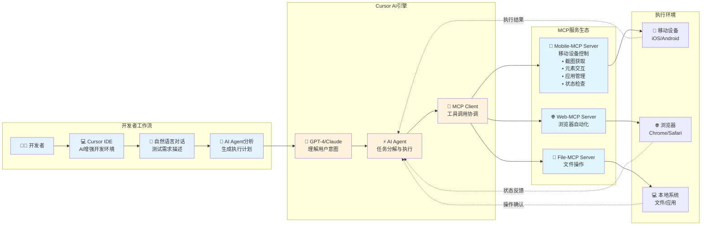
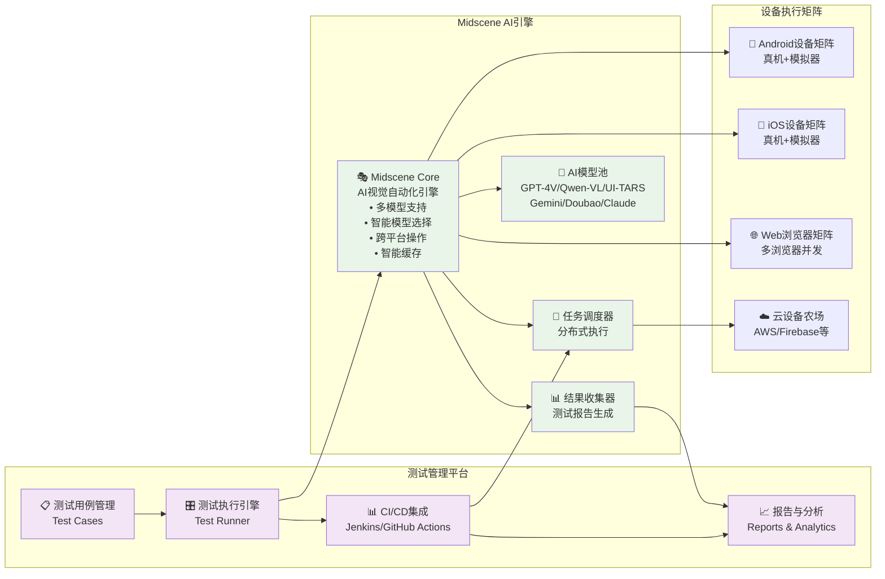
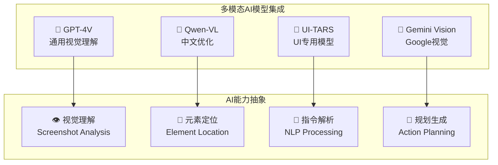
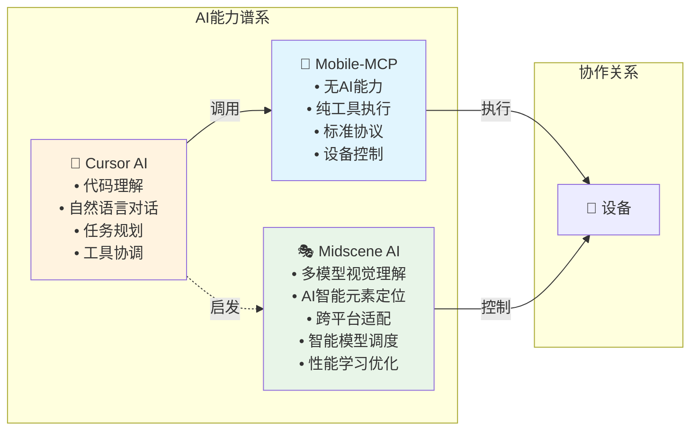

# AI+UI自动化分层架构设计

## 🏗️ 分层架构总览

```mermaid
graph TB
    subgraph "🎯 应用层 (Application Layer)"
        APP1["💻 Cursor IDE<br/>AI驱动开发环境<br/>• GPT-4/Claude集成<br/>• 代码生成与理解<br/>• MCP协议支持"]
        APP2["🧪 UAT测试执行器<br/>自动化测试平台"]
        APP3["📊 CI/CD Pipeline<br/>Jenkins/GitHub Actions"]
        APP4["🎛️ 测试管理平台<br/>Test Management"]
    end

    subgraph "🤖 Cursor AI层 (Cursor AI Layer)"
        CURSOR_AI1["🧠 GPT-4<br/>代码生成与理解"]
        CURSOR_AI2["🤖 Claude<br/>对话与分析"]
        CURSOR_AI3["⚡ AI Agent<br/>任务执行代理"]
        CURSOR_AI4["🔗 MCP Client<br/>工具调用管理"]
    end

    subgraph "🔌 MCP服务层 (MCP Service Layer)"
        MCP1["📱 Mobile-MCP Server<br/>移动设备控制服务<br/>(独立MCP服务)"]
        MCP2["🌐 其他MCP服务<br/>Web/Desktop等"]
    end

    subgraph "🧠 AI抽象层 (AI Abstraction Layer)"
        AI1["👁️ 视觉理解接口<br/>Vision Understanding API"]
        AI2["🎯 元素定位接口<br/>Element Locator API"] 
        AI3["📝 指令解析接口<br/>NLP Processing API"]
        AI4["🔄 操作规划接口<br/>Action Planning API"]
    end

    subgraph "🎭 AI模型层 (AI Model Layer)"
        MIDSCENE_AI1["🧠 GPT-4V<br/>OpenAI视觉模型"]
        MIDSCENE_AI2["🤖 Qwen-VL<br/>阿里通义视觉模型"]
        MIDSCENE_AI3["🎯 UI-TARS<br/>UI专用模型"]
        MIDSCENE_AI4["💎 Gemini Vision<br/>Google视觉模型"]
        MIDSCENE_AI5["🚀 Doubao Vision<br/>字节豆包视觉模型"]
        MIDSCENE_AI6["🤖 Claude Vision<br/>Anthropic视觉模型"]
    end

    subgraph "⚙️ 核心引擎层 (Core Engine Layer)"
        ENGINE1["🎭 Midscene Core<br/>AI视觉自动化引擎<br/>• 多模型支持<br/>• 智能模型选择<br/>• 视觉理解统一接口"]
        ENGINE2["📋 任务执行器<br/>Task Executor"]
        ENGINE3["💾 缓存管理器<br/>Cache Manager"]
        ENGINE4["📊 报告生成器<br/>Report Generator"]
    end

    subgraph "🔗 设备控制层 (Device Control Layer)"
        %% Mobile-MCP路径
        CTRL1["📲 Mobile-MCP内部控制<br/>直接设备操作"]
        
        %% Midscene路径  
        CTRL2["🤖 Midscene Android适配器<br/>AndroidAgent"]
        CTRL3["🍎 Midscene iOS适配器<br/>iOSAgent"] 
        CTRL4["🌐 Midscene Web适配器<br/>WebAgent"]
    end

    subgraph "🛠️ 驱动层 (Driver Layer)"
        DRIVER1["📲 ADB<br/>Android Debug Bridge"]
        DRIVER2["🔧 WebDriverAgent<br/>iOS自动化驱动"]
        DRIVER3["🌐 WebDriver<br/>浏览器驱动"]
        DRIVER4["🎮 UI Automator<br/>Android UI驱动"]
        DRIVER5["📱 XCTest<br/>iOS测试驱动"]
    end

    subgraph "🖥️ 系统层 (System Layer)"
        SYS1["🤖 Android系统<br/>Android OS"]
        SYS2["🍎 iOS系统<br/>iOS/iPadOS"]
        SYS3["💻 桌面系统<br/>macOS/Windows/Linux"]
    end

    subgraph "📱 硬件层 (Hardware Layer)"
        HW1["📱 Android设备<br/>真机/模拟器"]
        HW2["📱 iOS设备<br/>真机/模拟器"]
        HW3["💻 开发机<br/>MacBook/PC"]
        HW4["☁️ 云设备<br/>Device Farm"]
    end

    %% Cursor AI层连接
    APP1 --> CURSOR_AI1
    APP1 --> CURSOR_AI2
    APP1 --> CURSOR_AI3
    APP1 --> CURSOR_AI4
    
    %% 开发阶段连接 - Cursor AI通过MCP调用工具
    CURSOR_AI3 --> MCP1
    CURSOR_AI3 --> MCP2
    CURSOR_AI4 --> MCP1
    CURSOR_AI4 --> MCP2
    MCP1 --> CTRL1
    
    %% UAT阶段连接 - 直接使用Midscene
    APP2 --> ENGINE1
    APP3 --> ENGINE2
    APP4 --> ENGINE4
    
    %% 核心引擎通过AI抽象层调用
    ENGINE1 --> AI1
    ENGINE1 --> AI2
    ENGINE1 --> AI3
    ENGINE1 --> AI4
    
    %% AI抽象层调用具体AI模型
    AI1 --> MIDSCENE_AI1
    AI1 --> MIDSCENE_AI2
    AI1 --> MIDSCENE_AI4
    AI1 --> MIDSCENE_AI6
    AI2 --> MIDSCENE_AI3
    AI2 --> MIDSCENE_AI1
    AI3 --> MIDSCENE_AI2
    AI3 --> MIDSCENE_AI6
    AI4 --> MIDSCENE_AI1
    AI4 --> MIDSCENE_AI4
    AI4 --> MIDSCENE_AI5
    
    %% Midscene引擎连接
    ENGINE1 --> CTRL2
    ENGINE1 --> CTRL3
    ENGINE1 --> CTRL4
    ENGINE2 --> ENGINE1
    ENGINE3 --> ENGINE1
    
    %% 驱动层连接
    CTRL1 --> DRIVER1
    CTRL1 --> DRIVER2
    CTRL2 --> DRIVER1
    CTRL2 --> DRIVER4
    CTRL3 --> DRIVER2
    CTRL3 --> DRIVER5
    CTRL4 --> DRIVER3
    
    %% 系统层连接
    DRIVER1 --> SYS1
    DRIVER2 --> SYS2
    DRIVER3 --> SYS3
    DRIVER4 --> SYS1
    DRIVER5 --> SYS2
    
    %% 硬件层连接
    SYS1 --> HW1
    SYS2 --> HW2
    SYS3 --> HW3
    
    %% 云服务连接
    ENGINE1 -.-> HW4
    MCP1 -.-> HW4
    
    %% 不同层级路径标识
    classDef mcpPath fill:#e1f5fe
    classDef midscenePath fill:#f3e5f5
    classDef cursorAI fill:#fff3e0
    classDef aiAbstraction fill:#f0f4ff
    classDef aiModel fill:#e8f5e8
    
    class MCP1,CTRL1 mcpPath
    class ENGINE1,CTRL2,CTRL3,CTRL4 midscenePath
    class CURSOR_AI1,CURSOR_AI2,CURSOR_AI3,CURSOR_AI4 cursorAI
    class AI1,AI2,AI3,AI4 aiAbstraction
    class MIDSCENE_AI1,MIDSCENE_AI2,MIDSCENE_AI3,MIDSCENE_AI4,MIDSCENE_AI5,MIDSCENE_AI6 aiModel
```



## 🔄 双场景架构设计

### 📝 开发阶段架构 (Development Phase)



### 🚀 UAT阶段架构 (UAT Phase)



## 📋 各层详细说明

### 🎯 应用层 (Application Layer)

| 组件 | 功能描述 | 使用场景 |
|------|----------|----------|
| **Cursor IDE** | AI驱动的开发环境，集成GPT-4/Claude + MCP协议支持 | 开发阶段的AI辅助测试开发 |
| **UAT Runner** | 自动化测试执行器 | UAT阶段的批量回归测试 |
| **CI/CD Pipeline** | 持续集成/部署管道 | 自动化的构建和测试流程 |
| **测试管理平台** | 测试用例管理和报告 | 测试计划和结果分析 |

### 🤖 Cursor AI层 (Cursor AI Layer)

**说明**: Cursor内置的AI引擎，负责理解开发者意图并协调各种工具执行任务。

| 组件 | AI模型 | 功能描述 |
|------|--------|----------|
| **GPT-4** | OpenAI GPT-4 | 代码生成、理解、对话交互 |
| **Claude** | Anthropic Claude | 复杂推理、代码分析、任务规划 |
| **AI Agent** | 多模型协作 | 任务分解、执行协调、结果整合 |
| **MCP Client** | 协议管理器 | MCP工具发现、调用、结果处理 |

**工作流程**:
```
开发者指令 → AI理解意图 → 任务分解 → 工具调用 → 结果整合 → 反馈给开发者
```

**核心能力**:
- 🧠 **智能理解**: 理解自然语言测试需求
- 🎯 **任务规划**: 将复杂需求分解为可执行步骤  
- 🔧 **工具协调**: 智能选择和调用合适的MCP工具
- 🔄 **反馈循环**: 根据执行结果调整后续操作
- 💡 **代码生成**: 自动生成测试脚本和自动化代码

### 🧠 AI抽象层 (AI Abstraction Layer)

**说明**: AI能力的统一抽象接口层，为上层应用提供标准化的AI服务接口，屏蔽底层AI模型的实现细节。

| 接口类型 | 功能描述 | 调用的AI模型 |
|----------|----------|--------------|
| **视觉理解接口** | 统一的图像/截图理解API | GPT-4V, Qwen-VL, Gemini, Claude |
| **元素定位接口** | UI元素智能定位API | UI-TARS, GPT-4V (精确定位) |
| **指令解析接口** | 自然语言指令理解API | Qwen-VL, Claude (多语言) |
| **操作规划接口** | 任务分解和执行规划API | GPT-4V, Gemini, Doubao |

**核心价值**:
- 🔌 **统一接口**: 为不同AI模型提供一致的调用接口
- 🎯 **智能路由**: 根据任务类型自动选择最适合的AI模型
- 🔄 **透明切换**: 支持AI模型的热切换和降级
- 📊 **性能监控**: 统一收集和分析AI模型性能数据

### 🎭 AI模型层 (AI Model Layer)

**说明**: 具体的AI视觉语言模型实现层，包含多种专业化的AI模型，各有优势和特色。

| AI模型 | 厂商 | 核心能力 | 适用场景 |
|--------|------|----------|----------|
| **GPT-4V** | OpenAI | 通用视觉理解、强推理能力 | 复杂UI分析、多步骤操作 |
| **Qwen-VL** | 阿里云 | 中文优化、快速响应 | 中文应用测试、本土化场景 |
| **UI-TARS** | 专用模型 | UI专门训练、高精度定位 | 精确元素定位、UI组件识别 |
| **Gemini Vision** | Google | 多模态融合、上下文理解 | 复杂页面理解、智能推理 |
| **Doubao Vision** | 字节跳动 | 移动端优化、高效处理 | 移动应用测试、性能优先 |
| **Claude Vision** | Anthropic | 安全可靠、准确分析 | 金融/医疗等高要求场景 |

**智能模型选择策略**:
```javascript
// Midscene自动选择最适合的AI模型
const modelSelector = {
  // 根据任务类型选择
  getOptimalModel(task, context) {
    if (task.language === 'zh-CN') return 'qwen-vl';
    if (task.precision === 'high') return 'ui-tars';  
    if (task.complexity === 'high') return 'gpt-4v';
    if (task.performance === 'critical') return 'doubao';
    return 'gemini-vision'; // 默认平衡选择
  },
  
  // 智能降级机制
  async executeWithFallback(task) {
    const models = ['gpt-4v', 'qwen-vl', 'gemini-vision'];
    for (const model of models) {
      try {
        return await this.execute(task, model);
      } catch (error) {
        console.log(`Model ${model} failed, trying next...`);
      }
    }
    throw new Error('All AI models failed');
  }
};
```

**AI模型调用机制**:
```javascript
// AI抽象层的智能路由示例
class AIAbstractionLayer {
  // 视觉理解接口 - 智能选择模型
  async analyzeUI(screenshot, task) {
    const optimalModel = this.selectModelForVision(task);
    return await this.modelPool[optimalModel].analyzeScreenshot(screenshot);
  }
  
  // 元素定位接口 - 精确定位优先
  async locateElement(description, screenshot) {
    // 优先使用UI-TARS进行精确定位
    try {
      return await this.modelPool['ui-tars'].locate(description, screenshot);
    } catch (error) {
      // 降级到GPT-4V
      return await this.modelPool['gpt-4v'].locate(description, screenshot);
    }
  }
  
  // 指令解析接口 - 多语言支持
  async parseInstruction(instruction, context) {
    const language = this.detectLanguage(instruction);
    const model = language === 'zh' ? 'qwen-vl' : 'claude-vision';
    return await this.modelPool[model].parseNaturalLanguage(instruction, context);
  }
}
```

**层级调用关系**:
```
核心引擎层 → AI抽象层 → AI模型层
     ↓         ↓         ↓
Midscene → 统一接口 → 具体模型
   Core    智能路由   GPT-4V/Qwen等
```

**核心AI能力**:
- 👁️ **多模型视觉理解**: 6种AI模型协同处理复杂UI
- 🎯 **智能模型选择**: 根据任务自动选择最适合的AI模型
- 🧠 **统一语义理解**: 通过抽象层提供一致的NLP能力
- 🔄 **自适应降级**: 模型失败时自动切换备选方案
- ⚡ **性能优化学习**: 持续优化模型选择策略
- 🌐 **跨平台AI适配**: 同一抽象接口适配不同平台

### 🔌 MCP服务层 (MCP Service Layer)

**说明**: MCP服务层专门服务于Cursor等支持MCP协议的开发环境，提供标准化的工具接口。

```typescript
// Mobile-MCP Server - 独立的移动设备控制服务
interface MobileMCPServer {
  // 设备控制工具
  tools: {
    // 基础交互
    tap_screen: (x: number, y: number) => Promise<void>;
    swipe_screen: (startX: number, startY: number, endX: number, endY: number) => Promise<void>;
    type_text: (text: string) => Promise<void>;
    
    // 屏幕获取
    take_screenshot: () => Promise<Buffer>;
    get_accessibility_tree: () => Promise<AccessibilitySnapshot>;
    
    // 应用管理
    launch_app: (bundleId: string) => Promise<void>;
    close_app: (bundleId: string) => Promise<void>;
    
    // 设备信息
    get_device_info: () => Promise<DeviceInfo>;
    list_installed_apps: () => Promise<App[]>;
  };
  
  // MCP协议标准接口
  listTools(): Promise<Tool[]>;
  callTool(name: string, args: any): Promise<ToolResult>;
}

// 其他MCP服务示例
interface WebMCPServer {
  tools: {
    navigate_to: (url: string) => Promise<void>;
    click_element: (selector: string) => Promise<void>;
    extract_page_data: (query: string) => Promise<any>;
  };
}
```

**核心特点**:
- 🔌 **标准MCP协议**: 符合Model Context Protocol规范
- 🚀 **即插即用**: 可直接在Cursor中安装使用
- 📱 **设备无关**: 支持iOS、Android真机和模拟器
- 🔧 **工具化接口**: 每个功能都封装为独立的MCP工具

### 🧠 AI处理层 (AI Processing Layer)



### ⚙️ 核心引擎层 (Core Engine Layer)

**说明**: 核心引擎层通过AI抽象层提供统一的自动化测试能力，主要用于UAT阶段的完整自动化测试。

```javascript
// Midscene Core - 通过AI抽象层驱动的自动化引擎
class MidsceneCore {
  constructor() {
    this.agents = new Map(); // 跨平台设备代理
    this.aiAbstraction = new AIAbstractionLayer(); // AI抽象层接口
    this.taskExecutor = new TaskExecutor(); // 任务执行引擎
    this.cacheManager = new CacheManager(); // 智能缓存
    this.reportGenerator = new ReportGenerator(); // 报告生成
  }
  
  // 初始化通过AI抽象层
  async initialize() {
    // AI抽象层会自动管理底层AI模型池
    await this.aiAbstraction.initialize({
      models: ['gpt-4v', 'qwen-vl', 'ui-tars', 'gemini-vision', 'doubao', 'claude-vision'],
      strategy: 'adaptive', // 自适应选择策略
      fallback: true        // 启用降级机制
    });
  }

  // 通过AI抽象层的自动化接口
  async performAction(instruction: string, target: DeviceTarget): Promise<Result> {
    // 1. 获取设备代理（Android/iOS/Web）
    const agent = await this.getAgent(target);
    
    // 2. 获取当前屏幕状态
    const screenshot = await agent.takeScreenshot();
    
    // 3. 通过AI抽象层解析指令
    const parsedInstruction = await this.aiAbstraction.parseInstruction(instruction, {
      platform: target.platform,
      context: 'ui_automation'
    });
    
    // 4. 通过AI抽象层进行视觉理解
    const uiAnalysis = await this.aiAbstraction.analyzeUI(screenshot, {
      task: parsedInstruction.task,
      elements: parsedInstruction.targetElements
    });
    
    // 5. 通过AI抽象层规划操作序列
    const actionPlan = await this.aiAbstraction.planActions(parsedInstruction, uiAnalysis);
    
    // 6. 执行操作序列（AI抽象层会自动处理模型降级）
    const result = await this.taskExecutor.executeWithAI(actionPlan, agent, {
      aiAbstraction: this.aiAbstraction,
      maxRetries: 3
    });
    
    // 7. 缓存结果（包含AI模型使用统计）
    await this.cacheManager.cache(instruction, result, this.aiAbstraction.getUsedModels());
    
    // 8. 生成增强报告（包含AI决策过程）
    await this.reportGenerator.recordWithAI(instruction, screenshot, result, 
      this.aiAbstraction.getDecisionTrace());
    
    return result;
  }
  
  // AI模型性能学习
  async updateModelPerformance(modelName: string, result: Result) {
    const performance = {
      model: modelName,
      success: result.success,
      executionTime: result.executionTime,
      accuracy: result.accuracy,
      timestamp: new Date()
    };
    
    await this.cacheManager.updateModelStats(modelName, performance);
  }

  // 跨平台Agent管理
  async getAgent(target: DeviceTarget) {
    switch (target.platform) {
      case 'android':
        return new AndroidAgent(target);
      case 'ios':
        return new iOSAgent(target);
      case 'web':
        return new WebAgent(target);
      default:
        throw new Error(`Unsupported platform: ${target.platform}`);
    }
  }
}

// 任务执行器 - 处理复杂的自动化流程
class TaskExecutor {
  async execute(plan: ActionPlan, agent: Agent): Promise<Result> {
    const results = [];
    
    for (const step of plan.steps) {
      try {
        // 执行单个步骤
        const stepResult = await this.executeStep(step, agent);
        results.push(stepResult);
        
        // AI验证步骤执行结果
        if (step.verification) {
          const verified = await this.verifyStep(step, agent);
          if (!verified) {
            throw new Error(`Step verification failed: ${step.description}`);
          }
        }
        
        // 等待界面稳定
        await this.waitForStability(agent);
        
      } catch (error) {
        // 智能错误恢复
        await this.handleError(error, step, agent);
      }
    }
    
    return { success: true, results };
  }
}
```

**核心特点**:
- 🏗️ **分层架构**: 通过AI抽象层实现上层业务与底层AI模型解耦
- 🧠 **智能路由**: AI抽象层根据任务特性自动选择最优AI模型
- 🔌 **统一接口**: 为6+AI模型提供标准化调用接口
- 👁️ **视觉驱动**: 基于截图理解，不依赖UI结构变化
- 🌐 **跨平台统一**: Android、iOS、Web使用相同架构和接口
- 🗣️ **自然语言**: 多模型协作支持中英文指令理解
- ⚡ **智能缓存**: AI抽象层统一管理模型性能和结果缓存
- 🔄 **透明降级**: AI抽象层自动处理模型切换，对上层透明
- 📊 **AI决策追踪**: 详细记录AI抽象层的模型选择和决策过程

### 🔗 适配器层 (Adapter Layer)

各平台适配器提供统一的接口抽象：

```typescript
interface DeviceAdapter {
  // 基础控制
  tap(x: number, y: number): Promise<void>;
  swipe(gesture: SwipeGesture): Promise<void>;
  input(text: string): Promise<void>;
  
  // 状态获取
  screenshot(): Promise<Buffer>;
  getUIHierarchy(): Promise<UINode[]>;
  getDeviceInfo(): Promise<DeviceInfo>;
  
  // 应用管理
  launchApp(identifier: string): Promise<void>;
  terminateApp(identifier: string): Promise<void>;
}
```

## 🎯 核心设计原则

### 1. 🔄 统一抽象
- **跨平台统一API**: 无论Android、iOS还是Web，提供一致的操作接口
- **AI能力抽象**: 支持多种视觉模型，可灵活切换和扩展
- **设备管理统一**: 真机、模拟器、云设备使用相同的管理方式

### 2. 🧠 AI优先
- **视觉驱动**: 以截图为主要输入，减少对UI结构的依赖
- **自然语言**: 支持用自然语言描述测试意图和验证条件
- **智能适应**: AI自动处理UI变更和异常情况

### 3. 🚀 高效执行
- **分层缓存**: 多级缓存提高执行效率
- **并发执行**: 支持设备矩阵并发测试
- **增量更新**: 智能识别变更，只执行必要的测试

### 4. 🔧 灵活扩展
- **MCP协议**: 标准化的服务接口，易于集成新能力
- **插件架构**: 支持自定义适配器和AI模型
- **配置驱动**: 通过配置文件灵活调整行为

## 📊 技术选型说明

### 开发阶段技术栈
```yaml
开发环境:
  IDE: Cursor
  协议: Model Context Protocol (MCP)
  语言: TypeScript/JavaScript
  AI模型: GPT-4V, Qwen-VL, UI-TARS

设备控制:
  Android: ADB + UI Automator 2
  iOS: WebDriverAgent + XCTest
  Web: WebDriver + Chrome DevTools

AI处理:
  视觉理解: 多模态大语言模型
  元素定位: AI + 可访问性树混合策略
  指令解析: 自然语言处理
```

### UAT阶段技术栈
```yaml
测试执行:
  引擎: Midscene Core Engine
  调度: 分布式任务队列
  报告: 可视化测试报告

设备矩阵:
  本地设备: 通过USB/WiFi连接
  云设备: AWS Device Farm, Firebase Test Lab
  模拟器: Android Emulator, iOS Simulator

集成方式:
  CI/CD: Jenkins, GitHub Actions, GitLab CI
  通知: Slack, 企业微信, 邮件
  监控: Grafana, DataDog
```

## 🎯 实施路径

### Phase 1: 基础框架搭建
1. 搭建MCP服务器基础框架
2. 实现基本的设备控制能力
3. 集成主流AI视觉模型
4. 开发Cursor插件和集成

### Phase 2: 核心功能完善
1. 完善跨平台适配器
2. 实现智能缓存机制
3. 开发可视化报告系统
4. 集成CI/CD流水线

### Phase 3: 高级特性
1. 设备矩阵管理
2. 分布式执行调度
3. 云设备集成
4. 性能优化和监控

## 🔄 Mobile-MCP与Midscene的分工协作

### 📱 Mobile-MCP的定位
```yaml
角色: 独立的MCP服务器
用途: 为Cursor等开发工具提供移动设备控制能力
协议: Model Context Protocol (MCP)
场景: 开发阶段的交互式测试和调试

核心能力:
  - 设备控制: 点击、滑动、输入、截图
  - 应用管理: 启动、关闭、安装应用
  - 状态获取: 可访问性树、设备信息
  - 工具接口: 标准化的MCP工具集合
```

### 🎭 Midscene的定位  
```yaml
角色: AI驱动的自动化测试引擎
用途: UAT阶段的完整自动化测试解决方案
技术: AI视觉理解 + 跨平台操作
场景: 批量回归测试、CI/CD集成

核心能力:
  - AI视觉: 多模态大模型理解屏幕内容
  - 跨平台: Android、iOS、Web统一操作
  - 自然语言: 中英文指令描述测试场景
  - 智能执行: 缓存、报告、错误恢复
```

### 🤝 协作模式

```mermaid
graph TD
    subgraph "开发阶段 Development - AI驱动"
        DEV[👨‍💻 开发者<br/>自然语言描述需求] --> CURSOR[💻 Cursor IDE<br/>AI增强环境]
        CURSOR --> AI_UNDERSTAND[🧠 AI理解意图<br/>GPT-4/Claude]
        AI_UNDERSTAND --> AI_PLAN[🎯 AI任务规划<br/>分解执行步骤]
        AI_PLAN --> MCP_CALL[🔌 智能工具调用<br/>MCP协议]
        MCP_CALL --> MOBILE_MCP[📱 Mobile-MCP Server<br/>设备控制执行]
        MOBILE_MCP --> DEVICE_DEV[📱 测试设备<br/>真机/模拟器]
    end
    
    subgraph "UAT阶段 Testing - 批量自动化"
        TESTER[🧪 测试工程师<br/>测试用例管理] --> UAT_PLATFORM[🎛️ 测试执行平台]
        UAT_PLATFORM --> MIDSCENE_ENGINE[🎭 Midscene AI引擎<br/>视觉理解+跨平台]
        MIDSCENE_ENGINE --> DEVICE_MATRIX[📱 设备执行矩阵<br/>并发测试]
    end
    
    subgraph "AI能力对比"
        AI_CMP1[🤖 Cursor AI<br/>• 代码理解<br/>• 任务分解<br/>• 工具协调<br/>• 交互式执行]
        AI_CMP2[🎭 Midscene AI<br/>• 视觉理解<br/>• 元素定位<br/>• 跨平台操作<br/>• 批量执行]
    end
    
    subgraph "反馈循环"
        DEVICE_DEV -.->|实时反馈| AI_UNDERSTAND
        AI_UNDERSTAND -.->|优化策略| AI_PLAN
        DEVICE_MATRIX -.->|测试报告| TESTER
        TESTER -.->|用例优化| UAT_PLATFORM
    end
    
    classDef devPhase fill:#e3f2fd
    classDef aiPhase fill:#fff3e0
    classDef uatPhase fill:#f3e5f5
    class DEV,CURSOR,DEVICE_DEV,MOBILE_MCP,MCP_CALL devPhase
    class AI_UNDERSTAND,AI_PLAN,AI_CMP1,AI_CMP2 aiPhase
    class TESTER,UAT_PLATFORM,MIDSCENE_ENGINE,DEVICE_MATRIX uatPhase
```



### 📊 技术对比

| 特性 | Cursor AI | Mobile-MCP | Midscene |
|------|-----------|------------|----------|
| **定位** | AI开发助手 | MCP工具服务器 | AI自动化引擎 |
| **AI模型** | GPT-4/Claude | 无AI能力 | 6+视觉模型池<br/>智能选择调度 |
| **使用场景** | 代码生成/理解 | 设备控制 | 完整自动化测试 |
| **接入方式** | IDE内置 | MCP协议 | 直接集成/SDK |
| **自然语言** | 强支持 | 不支持 | 支持 |
| **任务分解** | 智能规划 | 不支持 | AI驱动 |
| **设备控制** | 通过MCP工具 | 原生支持 | 内置适配器 |
| **视觉理解** | 基础 | 无 | 多模型视觉理解<br/>智能模型选择 |
| **跨平台** | 通过工具 | 支持 | 原生支持 |
| **缓存机制** | 无 | 基础 | 智能缓存 |
| **报告生成** | 基础 | 简单日志 | 可视化报告 |
| **并发执行** | 不支持 | 单设备 | 设备矩阵 |
| **CI/CD集成** | 不适合 | 不适合 | 原生支持 |
| **学习能力** | 上下文学习 | 无 | AI模型性能学习<br/>智能优化调度 |

### 🔄 AI能力层次对比



### 🎯 最佳实践

#### 1. **开发阶段 - Cursor AI + Mobile-MCP协作**

```typescript
// 开发者在Cursor中的自然语言指令示例
// Cursor AI会自动理解意图并调用Mobile-MCP工具

"帮我测试登录功能：
1. 打开应用
2. 输入测试账号密码  
3. 点击登录按钮
4. 验证是否跳转到首页"

// Cursor AI自动生成的执行计划：
// 1. 调用 launch_app("com.example.app")
// 2. 调用 tap_screen(username_field) -> type_text("test@example.com")
// 3. 调用 tap_screen(password_field) -> type_text("password123")
// 4. 调用 tap_screen(login_button)
// 5. 调用 take_screenshot() -> AI验证页面内容
```

**优势**:
- 🗣️ **自然语言交互**: 无需学习复杂API
- 🧠 **智能理解**: Cursor AI理解测试意图
- 🔧 **自动工具选择**: AI自动选择合适的MCP工具
- 🔄 **实时反馈**: 即时看到执行结果和错误

#### 2. **UAT阶段 - Midscene多AI模型引擎**

```javascript
// Midscene多AI模型自动化测试脚本
const { ai, configure } = require('@midscene/core');

// 配置AI模型偏好
configure({
  aiModels: {
    primary: 'gpt-4v',        // 主要使用GPT-4V
    fallback: ['qwen-vl', 'gemini-vision'], // 备选模型
    chinese: 'qwen-vl',       // 中文应用优先使用Qwen-VL
    precision: 'ui-tars',     // 精确定位使用UI-TARS
    performance: 'doubao'     // 性能要求高时使用豆包
  },
  smartSelection: true        // 启用智能模型选择
});

// AI会自动选择最适合的模型执行任务
await ai('打开登录页面并完成登录流程', {
  username: 'test@example.com',
  password: 'password123',
  modelHint: 'precision' // 提示使用高精度模型
});

// 中文应用测试 - 自动选择Qwen-VL
await ai('验证用户信息显示正确，包括姓名、手机号等');

// 复杂购物流程 - AI智能选择最优模型
await ai('测试完整购物流程：搜索商品 -> 加入购物车 -> 结算 -> 支付', {
  modelStrategy: 'adaptive' // 自适应模型选择
});

// 获取AI模型使用统计
const stats = await ai.getModelStats();
console.log('模型使用统计:', stats);
```

**多AI模型优势**:
- 🎭 **6+AI模型池**: GPT-4V、Qwen-VL、UI-TARS等智能调度
- 🧠 **智能模型选择**: 根据任务特性自动选择最优AI模型
- 🔄 **自动降级机制**: 模型失败时无缝切换备选方案
- 🌐 **跨平台统一**: 所有平台使用相同AI模型和代码
- 📊 **AI性能学习**: 持续学习和优化模型选择策略
- 📈 **增强报告**: 详细的AI决策过程和模型性能分析

#### 3. **协同工作流程**

```mermaid
flowchart LR
    subgraph "开发阶段"
        A1[💡 需求分析] --> A2[🗣️ Cursor对话]
        A2 --> A3[🤖 AI理解+规划]
        A3 --> A4[📱 Mobile-MCP执行]
        A4 --> A5[✅ 功能验证]
    end
    
    subgraph "过渡阶段"
        B1[📝 整理测试用例] --> B2[🔄 转换为Midscene脚本]
    end
    
    subgraph "UAT阶段"
        C1[🎭 Midscene执行] --> C2[📊 批量测试]
        C2 --> C3[📈 报告分析] --> C4[🚀 发布决策]
    end
    
    A5 --> B1
    B2 --> C1
    
    classDef devPhase fill:#e3f2fd
    classDef transPhase fill:#fff3e0
    classDef uatPhase fill:#f3e5f5
    
    class A1,A2,A3,A4,A5 devPhase
    class B1,B2 transPhase
    class C1,C2,C3,C4 uatPhase
```



#### 4. **技术选型建议**

| 场景 | 推荐方案 | 理由 |
|------|----------|------|
| **快速原型验证** | Cursor + Mobile-MCP | AI理解快，交互方便 |
| **复杂业务流程测试** | Cursor + Multiple MCP | 多工具协作，AI协调 |
| **回归测试** | Midscene Engine | 稳定可靠，批量执行 |
| **CI/CD集成** | Midscene + Jenkins | 原生支持，报告完善 |
| **跨平台兼容测试** | Midscene Matrix | 设备矩阵，并发高效 |

#### 5. **实施路径**

**Phase 1: 开发环境搭建**
```bash
# 1. 配置Cursor MCP
cursor mcp add mobile-mcp

# 2. 连接测试设备
adb connect device_ip:5555

# 3. 开始AI对话测试
"帮我测试这个新功能..."
```

**Phase 2: UAT流程建立**
```javascript
// 1. 安装Midscene
npm install @midscene/core

// 2. 编写测试脚本
const testSuite = require('./test-suite.js');
await testSuite.runAll();

// 3. 集成CI/CD
// 在Jenkins/GitHub Actions中配置
```

**Phase 3: 完整工作流**
- 开发阶段：Cursor AI + Mobile-MCP快速验证
- 测试阶段：Midscene完整自动化测试
- 生产阶段：持续监控和回归测试

这个架构设计实现了三层AI能力的深度协作：

🧠 **Cursor AI层**（理解规划）
- GPT-4/Claude驱动的智能开发助手
- 自然语言理解和任务分解
- 智能工具调用协调

📱 **Mobile-MCP层**（工具执行）  
- 标准MCP协议的设备控制服务
- 无AI能力，专注高效执行
- 为Cursor AI提供标准化工具接口

🎭 **AI抽象层 + AI模型层**（多模型视觉理解）
- AI抽象层: 统一接口、智能路由、透明降级
- AI模型层: 6+视觉语言模型池、专业化分工
- 分层架构: 业务逻辑与AI模型解耦，灵活扩展

**架构价值**：
- 🔄 **无缝衔接**: 开发阶段探索 → UAT阶段自动化
- 🏗️ **分层解耦**: AI抽象层隔离上层业务与底层模型实现
- 🧠 **AI能力互补**: 理解层 + 执行层 + 抽象层 + 模型层全覆盖
- ⚡ **智能优化**: 多层AI协作，统一管理和优化
- 🌐 **架构完整**: 从代码生成到批量测试的完整分层AI+UI自动化解决方案

**分层架构优势**：
- 🔌 **接口统一**: AI抽象层为不同AI模型提供统一调用方式
- 🔄 **模型热插拔**: 可动态添加新AI模型，无需修改上层代码
- 📊 **性能监控**: 抽象层统一收集所有AI模型的性能数据
- 🛡️ **容错增强**: 多层降级机制，提高系统可靠性
